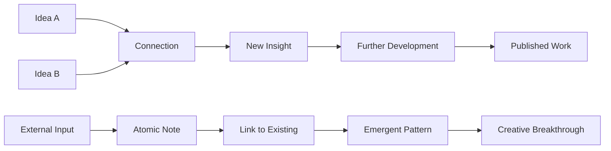

# 🗂️ Zettelkasten Method

> **Transform scattered thoughts into a web of knowledge that thinks with you**

## 🎯 **What It Is**

The Zettelkasten Method is a powerful knowledge management system that creates a "second brain" through interconnected atomic notes. Developed by sociologist Niklas Luhmann, who used it to write over 70 books and 400+ articles, this method transforms how you capture, connect, and create knowledge. Unlike traditional note-taking, Zettelkasten creates an external thinking partner that helps you discover unexpected connections and generate new ideas.

**Core Insight**: Knowledge becomes exponentially more valuable when it's interconnected. By creating a web of linked atomic notes, you build a system that doesn't just store information—it actively helps you think and discover.

## ⚡ **The Zettelkasten Architecture**

### **Knowledge Web Structure**


**The Four Pillars:**
- **Atomicity**: Each note contains one complete thought or concept
- **Autonomy**: Every note is self-contained and understandable alone
- **Connection**: Notes link to related concepts, creating knowledge webs
- **Evolution**: The system grows organically, revealing unexpected patterns

## 🎯 **When to Use**

### **🔬 Research and Learning**
- Literature reviews and academic research
- Learning complex domains or new technologies
- Building expertise in AI, machine learning, or data science
- Capturing insights from conferences, papers, and experiments

### **💼 Professional Development**
- Managing project knowledge and lessons learned
- Building team knowledge bases and documentation
- Tracking industry trends and technical developments
- Creating training materials and best practices

### **🚀 Creative and Strategic Work**
- Product development and innovation
- Strategic planning and analysis
- Content creation and thought leadership
- Problem-solving and ideation

## 🧠 **The Atomic Note System**

### **1️⃣ Atomic Note Structure**
```
Title: Concept or Question [Unique ID]

Content:
• One main idea, fully explained
• Written in your own words
• Self-contained and understandable
• Links to related concepts

Connections:
• Links IN: Notes that reference this one
• Links OUT: Notes this one references
• Emerging themes and patterns

Metadata:
• Creation date
• Source attribution
• Tags (sparingly used)
• Review/update history
```

### **2️⃣ Note Types and Functions**
```
Permanent Notes:
• Core concepts and insights
• Your own thinking and analysis
• Fully developed ideas
• Long-term value

Literature Notes:
• Summaries of sources
• Key quotes and references
• Critical commentary
• Connection to your thinking

Index Notes:
• Entry points into topics
• Maps of concept territories
• Navigation aids
• Topic overviews

Project Notes:
• Temporary working notes
• Project-specific information
• Meeting notes and updates
• Eventually processed into permanent notes

Hub Notes:
• Central nodes in knowledge networks
• Connect multiple related concepts
• Topic jumping-off points
• Synthesis and overview notes
```

### **3️⃣ Linking and Connection Strategies**
```python
class ZettelkastenConnections:
    def __init__(self):
        self.connection_types = {
            "direct_reference": "Note A directly discusses concept in Note B",
            "contradictory": "Note A presents opposing view to Note B",
            "supporting": "Note A provides evidence for Note B",
            "example": "Note A is specific instance of general principle in Note B",
            "analogical": "Note A and B share structural similarities",
            "temporal": "Note A represents evolution/development of Note B",
            "causal": "Note A explains causes/effects discussed in Note B",
            "hierarchical": "Note A is sub-concept or super-concept of Note B"
        }
    
    def create_meaningful_links(self, new_note, existing_notes):
        connections = []
        
        for note in existing_notes:
            connection_strength = self.assess_relationship(new_note, note)
            
            if connection_strength > threshold:
                connection_type = self.identify_connection_type(new_note, note)
                connections.append({
                    "target_note": note.id,
                    "connection_type": connection_type,
                    "strength": connection_strength,
                    "explanation": self.generate_link_explanation(new_note, note)
                })
        
        return connections
    
    def discover_emergent_patterns(self, note_network):
        patterns = {
            "concept_clusters": self.identify_concept_clusters(note_network),
            "knowledge_gaps": self.find_missing_connections(note_network),
            "research_opportunities": self.suggest_exploration_areas(note_network),
            "synthesis_potential": self.identify_synthesis_opportunities(note_network)
        }
        
        return patterns
```

## 🚀 **AI-Enhanced Zettelkasten Implementation**

### **🤖 Digital Tools and Systems**

**Modern Zettelkasten Platforms:**
```python
def implement_digital_zettelkasten():
    platform_options = {
        "obsidian": {
            "strengths": "Powerful linking, graph view, plugin ecosystem",
            "ai_integration": "GPT plugins, automated tagging, connection suggestions",
            "use_case": "Technical knowledge workers, researchers",
            "customization": "Highly customizable with templates and workflows"
        },
        
        "roam_research": {
            "strengths": "Block-level linking, daily notes, bi-directional links",
            "ai_integration": "Smart blocks, automated connections",
            "use_case": "Networked thought, research, creative work",
            "collaboration": "Real-time collaboration features"
        },
        
        "notion": {
            "strengths": "Database integration, templates, multimedia support",
            "ai_integration": "AI writing assistant, automated properties",
            "use_case": "Teams, project management, structured knowledge",
            "flexibility": "Combines notes with databases and workflows"
        },
        
        "logseq": {
            "strengths": "Local-first, block-based, version control integration",
            "ai_integration": "Plugin ecosystem for AI enhancements",
            "use_case": "Privacy-focused, developer-friendly",
            "openness": "Open source with markdown export"
        }
    }
    
    return platform_options

def ai_enhanced_workflows():
    ai_integrations = {
        "automated_tagging": {
            "function": "AI analyzes note content and suggests relevant tags",
            "implementation": "NLP analysis of note text with tag recommendation",
            "benefit": "Consistent tagging without manual effort"
        },
        
        "connection_discovery": {
            "function": "AI identifies potential links between notes",
            "implementation": "Semantic similarity analysis and concept matching",
            "benefit": "Discovers non-obvious connections and patterns"
        },
        
        "content_summarization": {
            "function": "AI generates summaries and abstracts of long notes",
            "implementation": "Extractive and abstractive summarization models",
            "benefit": "Quick review and navigation of knowledge base"
        },
        
        "question_generation": {
            "function": "AI suggests questions to explore based on note content",
            "implementation": "Question generation models and knowledge gap analysis",
            "benefit": "Drives continued learning and exploration"
        },
        
        "synthesis_assistance": {
            "function": "AI helps combine multiple notes into coherent insights",
            "implementation": "Multi-document synthesis and argument generation",
            "benefit": "Accelerates knowledge creation and insight development"
        }
    }
    
    return ai_integrations
```

### **📊 Knowledge Network Analytics**

**Measuring Zettelkasten Health:**
```python
class ZettelkastenAnalytics:
    def __init__(self, note_collection):
        self.notes = note_collection
        self.graph = self.build_knowledge_graph()
    
    def assess_network_health(self):
        metrics = {
            "network_density": self.calculate_connection_density(),
            "cluster_coefficient": self.measure_clustering(),
            "average_path_length": self.calculate_avg_path_length(),
            "hub_identification": self.identify_knowledge_hubs(),
            "isolated_notes": self.find_isolated_concepts(),
            "growth_patterns": self.analyze_growth_trends()
        }
        
        health_score = self.calculate_overall_health(metrics)
        recommendations = self.generate_improvement_suggestions(metrics)
        
        return {
            "health_score": health_score,
            "detailed_metrics": metrics,
            "recommendations": recommendations
        }
    
    def identify_knowledge_gaps(self):
        gaps = {
            "missing_connections": self.find_potential_links(),
            "underdeveloped_areas": self.identify_sparse_regions(),
            "research_opportunities": self.suggest_exploration_topics(),
            "synthesis_potential": self.find_synthesis_candidates()
        }
        
        return gaps
    
    def track_knowledge_evolution(self):
        evolution_metrics = {
            "note_creation_rate": self.calculate_creation_velocity(),
            "connection_growth": self.track_link_development(),
            "concept_maturation": self.measure_note_development(),
            "knowledge_utilization": self.track_note_access_patterns(),
            "insight_generation": self.measure_synthesis_activity()
        }
        
        return evolution_metrics
```

## 🛠️ **Practical Implementation Framework**

### **🚀 Getting Started Protocol**

**Week 1: Foundation Setup**
```python
def establish_zettelkasten_foundation():
    setup_steps = {
        "day_1_2": {
            "tasks": [
                "Choose digital platform or physical setup",
                "Create basic note templates",
                "Establish unique ID system",
                "Set up basic organizational structure"
            ],
            "outcome": "Functional basic system ready for first notes"
        },
        
        "day_3_4": {
            "tasks": [
                "Create 10-15 atomic notes from existing knowledge",
                "Practice writing self-contained notes",
                "Experiment with linking between notes",
                "Develop personal writing style"
            ],
            "outcome": "Comfort with basic note creation and linking"
        },
        
        "day_5_7": {
            "tasks": [
                "Create first hub notes and index structures",
                "Establish daily capture routine",
                "Set up review and maintenance schedule",
                "Begin identifying emerging patterns"
            ],
            "outcome": "Sustainable daily practice established"
        }
    }
    
    return setup_steps

def daily_zettelkasten_workflow():
    workflow = {
        "capture_phase": {
            "duration": "Throughout day",
            "activities": [
                "Collect interesting ideas and insights",
                "Save links and references for later processing",
                "Make quick voice memos or scratch notes",
                "Tag items for evening processing"
            ]
        },
        
        "processing_phase": {
            "duration": "15-30 minutes daily",
            "activities": [
                "Convert captures into atomic permanent notes",
                "Link new notes to existing knowledge",
                "Update relevant hub and index notes",
                "Identify patterns and synthesis opportunities"
            ]
        },
        
        "exploration_phase": {
            "duration": "10-15 minutes daily",
            "activities": [
                "Follow interesting link trails",
                "Review and update older notes",
                "Look for unexpected connections",
                "Generate questions for future exploration"
            ]
        },
        
        "synthesis_phase": {
            "duration": "Weekly",
            "activities": [
                "Create synthesis notes from clusters",
                "Write longer-form insights and analyses",
                "Identify publication or sharing opportunities",
                "Plan research or learning based on gaps"
            ]
        }
    }
    
    return workflow
```

### **🎯 Advanced Zettelkasten Techniques**

**Sophisticated Knowledge Manipulation:**
```python
def advanced_zettelkasten_methods():
    techniques = {
        "argument_mapping": {
            "purpose": "Track arguments, evidence, and counterarguments",
            "implementation": "Create notes for claims, evidence, rebuttals",
            "example": "AI ethics debate with pro/con evidence networks",
            "benefit": "Builds sophisticated understanding of complex issues"
        },
        
        "temporal_threading": {
            "purpose": "Track evolution of ideas over time",
            "implementation": "Link notes showing conceptual development",
            "example": "Evolution of transformer architecture from attention mechanism",
            "benefit": "Understanding of knowledge development patterns"
        },
        
        "perspective_networks": {
            "purpose": "Capture multiple viewpoints on same concept",
            "implementation": "Create linked notes for different perspectives",
            "example": "Different schools of thought on consciousness in AI",
            "benefit": "Nuanced understanding and reduced bias"
        },
        
        "project_integration": {
            "purpose": "Connect permanent knowledge to active projects",
            "implementation": "Link project notes to relevant permanent notes",
            "example": "Current ML project connected to relevant theory notes",
            "benefit": "Applied knowledge and project learning integration"
        },
        
        "collaborative_linking": {
            "purpose": "Share and connect knowledge across team members",
            "implementation": "Shared note spaces with attribution and discussion",
            "example": "Research team sharing insights on emerging AI techniques",
            "benefit": "Collective intelligence and knowledge amplification"
        }
    }
    
    return techniques
```

## 📈 **Advanced Applications in AI Development**

### **🤖 Research and Development Enhancement**

**AI Research Knowledge Management:**
```python
class AIResearchZettelkasten:
    def __init__(self):
        self.research_note_types = self.define_research_structures()
        self.ai_specific_connections = self.establish_ai_link_patterns()
    
    def define_research_structures(self):
        structures = {
            "paper_analysis_notes": {
                "structure": "Problem → Method → Results → Implications → Connections",
                "linking": "Connect to methodology, application, and critique notes",
                "evolution": "Track paper influence and follow-up research"
            },
            
            "experiment_documentation": {
                "structure": "Hypothesis → Method → Results → Analysis → Next Steps",
                "linking": "Link to theoretical foundations and related experiments",
                "synthesis": "Aggregate learnings across experiment series"
            },
            
            "concept_development": {
                "structure": "Definition → Examples → Relationships → Applications → Questions",
                "linking": "Connect to foundational concepts and applications",
                "growth": "Track concept refinement and expansion"
            },
            
            "problem_decomposition": {
                "structure": "Problem → Sub-problems → Approaches → Trade-offs → Solutions",
                "linking": "Connect to solution techniques and domain knowledge",
                "reuse": "Apply successful decompositions to new problems"
            }
        }
        
        return structures
    
    def create_ai_knowledge_maps(self):
        knowledge_domains = {
            "machine_learning": {
                "core_concepts": ["supervised_learning", "unsupervised_learning", "reinforcement_learning"],
                "techniques": ["neural_networks", "decision_trees", "ensemble_methods"],
                "applications": ["computer_vision", "nlp", "robotics"],
                "evaluation": ["metrics", "validation", "interpretability"]
            },
            
            "deep_learning": {
                "architectures": ["cnn", "rnn", "transformer", "gan"],
                "training": ["optimization", "regularization", "transfer_learning"],
                "applications": ["image_recognition", "language_models", "generative_ai"],
                "challenges": ["explainability", "bias", "computational_efficiency"]
            },
            
            "ai_ethics": {
                "principles": ["fairness", "transparency", "accountability", "privacy"],
                "challenges": ["bias_detection", "algorithmic_fairness", "ai_safety"],
                "frameworks": ["ethical_guidelines", "governance", "regulation"],
                "applications": ["hiring_systems", "healthcare_ai", "autonomous_vehicles"]
            }
        }
        
        return knowledge_domains
```

### **🔧 Team Knowledge Sharing**

**Collaborative Zettelkasten Implementation:**
```python
def implement_team_zettelkasten():
    team_structure = {
        "shared_knowledge_base": {
            "core_concepts": "Fundamental domain knowledge accessible to all",
            "best_practices": "Proven techniques and methodologies",
            "lessons_learned": "Project insights and failure analyses",
            "external_research": "Curated insights from papers and conferences"
        },
        
        "individual_contributions": {
            "personal_insights": "Individual analysis and synthesis",
            "specialized_knowledge": "Deep expertise in specific areas",
            "experimental_results": "Personal research and experimentation",
            "learning_notes": "Individual skill development and education"
        },
        
        "collaborative_synthesis": {
            "team_discussions": "Recorded insights from meetings and discussions",
            "joint_projects": "Shared project knowledge and documentation",
            "cross_pollination": "Connections between different team members' expertise",
            "collective_intelligence": "Emergent insights from team knowledge integration"
        }
    }
    
    governance_model = {
        "contribution_standards": {
            "note_quality": "Clear, atomic, well-linked contributions",
            "attribution": "Proper credit for ideas and sources",
            "review_process": "Peer review for significant additions",
            "maintenance": "Shared responsibility for system health"
        },
        
        "access_control": {
            "public_knowledge": "Open access to core team knowledge",
            "work_in_progress": "Limited access to developing ideas",
            "sensitive_information": "Restricted access to confidential content",
            "external_sharing": "Guidelines for sharing beyond team"
        }
    }
    
    return team_structure, governance_model
```

## 🚨 **Common Pitfalls and Solutions**

### **❌ Zettelkasten Anti-Patterns**

**1. The Hoarding Trap**
```
❌ Problem: Collecting information without processing or connecting
Example: Hundreds of unlinked literature notes with no synthesis

Impact:
• Information overload without insight generation
• Time investment without knowledge growth
• Difficulty finding and using captured information
• Reduced motivation to maintain system

✅ Solution: Active processing workflow
Implementation:
• Set aside dedicated time for note processing
• Create permanent notes within 48 hours of capture
• Establish minimum linking requirements for new notes
• Regular review and synthesis sessions

Processing Protocol:
1. Capture → 2. Process → 3. Connect → 4. Synthesize
• Each stage must be completed before moving to next
• Maximum 72 hours between capture and permanent note creation
• Every permanent note must link to at least 2 existing notes
```

**2. The Perfect Note Syndrome**
```
❌ Problem: Spending too much time perfecting individual notes
Example: Hours spent crafting single notes instead of building network

Impact:
• Reduced note creation velocity
• Analysis paralysis and procrastination
• Missing the forest for the trees
• Inhibited creative exploration

✅ Solution: Good enough principle with iteration
Implementation:
• Set time limits for note creation (15-20 minutes max)
• Focus on capturing core insight rather than perfect expression
• Use "draft" status for notes that need improvement
• Regular maintenance cycles for note refinement

Quality Standards:
• Atomic: One main idea per note
• Autonomous: Understandable without context
• Connected: Links to relevant existing notes
• Improvable: Can be enhanced over time
```

**3. The Link Explosion**
```
❌ Problem: Creating too many weak or irrelevant connections
Example: Notes linked to dozens of marginally related concepts

Impact:
• Reduced signal-to-noise ratio in connections
• Cognitive overload when exploring network
• Difficulty identifying important relationships
• Weakened discovery of meaningful patterns

✅ Solution: Meaningful connection standards
Implementation:
• Link only when there's genuine conceptual relationship
• Explain the nature of connections in link text
• Regular connection auditing and pruning
• Quality over quantity in linking strategy

Connection Criteria:
• Direct relevance: Clear conceptual relationship
• Mutual enrichment: Both notes benefit from connection
• Explanation: Reason for link is explicit
• Non-obvious: Connection provides genuine insight
```

**4. The Complexity Creep**
```
❌ Problem: Over-engineering system with excessive features and rules
Example: Complex tagging schemes, elaborate folder hierarchies, rigid templates

Impact:
• Increased cognitive overhead
• Reduced note creation speed
• System maintenance burden
• Loss of organic knowledge growth

✅ Solution: Simplicity-first approach
Implementation:
• Minimal structure and maximum flexibility
• Emergence over planning in knowledge organization
• Simple, consistent naming and linking conventions
• Regular simplification and streamlining

Simplicity Principles:
• Start simple, add complexity only when necessary
• Let structure emerge from content, not impose it
• Prefer linking over categorization
• Focus on content creation over system management
```

### **🛡️ System Maintenance and Evolution**

**Sustainable Zettelkasten Practice:**
```python
def maintain_zettelkasten_health():
    maintenance_schedule = {
        "daily": {
            "duration": "5-10 minutes",
            "activities": [
                "Process captured notes into permanent notes",
                "Link new notes to existing knowledge",
                "Quick review of recent additions"
            ]
        },
        
        "weekly": {
            "duration": "30-45 minutes", 
            "activities": [
                "Review and refine recent notes",
                "Identify emerging patterns and themes",
                "Create synthesis notes from clusters",
                "Plan learning based on knowledge gaps"
            ]
        },
        
        "monthly": {
            "duration": "1-2 hours",
            "activities": [
                "Comprehensive network analysis",
                "Prune weak or irrelevant connections",
                "Major synthesis and insight generation",
                "System optimization and improvement"
            ]
        },
        
        "quarterly": {
            "duration": "Half day",
            "activities": [
                "Complete knowledge audit and assessment",
                "Major reorganization if needed",
                "Tool evaluation and potential migration",
                "Long-term learning goal alignment"
            ]
        }
    }
    
    evolution_strategies = {
        "organic_growth": "Allow structure to emerge from content patterns",
        "regular_pruning": "Remove outdated or irrelevant content",
        "synthesis_cycles": "Regular creation of higher-order insights",
        "tool_evolution": "Adapt tools to support growing knowledge base"
    }
    
    return maintenance_schedule, evolution_strategies
```

## 📊 **Measurement and Success Metrics**

### **🎯 Zettelkasten Effectiveness Indicators**

**Multi-Dimensional Assessment Framework:**
```python
def measure_zettelkasten_success():
    effectiveness_metrics = {
        "knowledge_growth": {
            "note_creation_rate": "Sustainable pace of permanent note addition",
            "connection_density": "Average connections per note (optimal: 3-7)",
            "synthesis_frequency": "Rate of insight generation and synthesis notes",
            "knowledge_depth": "Development of expertise areas over time"
        },
        
        "creative_output": {
            "idea_generation": "Novel insights and creative connections",
            "publication_success": "Articles, papers, or content created from knowledge base",
            "problem_solving": "Application of knowledge to real challenges",
            "innovation_rate": "Breakthrough insights and new perspectives"
        },
        
        "learning_acceleration": {
            "comprehension_speed": "Faster understanding of new concepts",
            "retention_quality": "Long-term knowledge persistence",
            "transfer_ability": "Application of knowledge across domains",
            "expertise_development": "Growth in specialized knowledge areas"
        },
        
        "system_sustainability": {
            "maintenance_burden": "Time required to maintain system health",
            "usage_consistency": "Regular engagement with knowledge base",
            "findability_success": "Ability to locate relevant information quickly",
            "growth_manageability": "System scales without overwhelming user"
        }
    }
    
    return effectiveness_metrics

def calculate_zettelkasten_roi():
    roi_framework = {
        "time_investment": {
            "note_creation": "Time spent creating and linking notes",
            "maintenance": "Time spent organizing and refining",
            "exploration": "Time spent browsing and discovering",
            "synthesis": "Time spent creating insights and outputs"
        },
        
        "knowledge_returns": {
            "faster_learning": "Reduced time to understand new concepts",
            "better_retention": "Decreased forgetting and knowledge loss",
            "enhanced_creativity": "Increased rate of insight generation",
            "improved_output": "Higher quality work and publications"
        },
        
        "productivity_gains": {
            "research_efficiency": "Faster literature reviews and research",
            "writing_acceleration": "Quicker content creation from existing notes",
            "decision_support": "Better decisions through accessible knowledge",
            "collaboration_enhancement": "Improved knowledge sharing and team learning"
        }
    }
    
    return roi_framework
```

## 🔗 **Integration with Other Mental Models**

### **🧠 Complementary Frameworks**

**Synergistic Knowledge Systems:**
- **[[Systems Thinking]]**: Use systems approaches to understand knowledge interconnections
- **[[First Principles Thinking]]**: Break complex concepts into atomic components for Zettelkasten
- **[[Learning How to Learn]]**: Apply metacognitive strategies to optimize note-taking
- **[[Design Thinking]]**: Use design methods to improve knowledge system usability
- **[[Workflow Automation]]**: Automate repetitive aspects of knowledge management

**Integration Examples:**
```python
def integrate_zettelkasten_with_frameworks():
    integrated_approaches = {
        "systems_thinking_integration": {
            "feedback_loops": "Track how knowledge influences thinking and vice versa",
            "emergence": "Identify emergent patterns in knowledge networks",
            "complexity": "Manage complex knowledge systems without overwhelming structure",
            "interconnection": "Map relationships between seemingly unrelated concepts"
        },
        
        "first_principles_combination": {
            "atomic_decomposition": "Break complex ideas into fundamental components",
            "foundational_linking": "Connect new concepts to basic principles",
            "assumption_questioning": "Challenge accepted knowledge through note analysis",
            "rebuilding": "Reconstruct understanding from basic elements"
        },
        
        "design_thinking_application": {
            "user_experience": "Design knowledge system for optimal user interaction",
            "prototyping": "Iterate on note structures and organizational schemes",
            "empathy": "Consider different perspectives when creating knowledge networks",
            "testing": "Validate knowledge organization through practical use"
        }
    }
    
    return integrated_approaches
```

## 🎯 **Advanced Mastery Guide**

### **📈 Skill Development Progression**

**Level 1: Basic Note-Taking Transformation**
- Convert linear notes to atomic, interconnected format
- Establish consistent daily practice of note creation and linking
- Build comfort with digital tools and basic organizational structures

**Level 2: Network Effect Emergence**
- Recognize and cultivate meaningful connections between concepts
- Begin seeing unexpected patterns and relationships in knowledge
- Develop personal synthesis capabilities and insight generation

**Level 3: Knowledge System Optimization**
- Master advanced linking strategies and note type differentiation
- Implement effective maintenance and evolution practices
- Create valuable outputs (writing, presentations, solutions) from knowledge base

**Level 4: Collaborative Knowledge Leadership**
- Design and implement team knowledge sharing systems
- Train others in effective Zettelkasten methodology
- Integrate knowledge management with organizational learning

**Level 5: Innovation and Research Excellence**
- Contribute original insights and breakthrough thinking from knowledge synthesis
- Develop novel applications of Zettelkasten methodology
- Lead field advancement in knowledge management and learning acceleration

### **🛠️ Practical Mastery Framework**

**Daily Excellence Practices:**
```python
def daily_zettelkasten_mastery():
    mastery_practices = {
        "mindful_capturing": {
            "selective_attention": "Choose only insights worth developing",
            "immediate_processing": "Convert captures to permanent notes quickly",
            "quality_standards": "Maintain high standards for note atomicity and clarity"
        },
        
        "creative_exploration": {
            "random_walks": "Follow unexpected link trails for serendipitous discovery",
            "pattern_recognition": "Actively look for emerging themes and connections",
            "synthesis_opportunity": "Regularly combine multiple notes into higher-order insights"
        },
        
        "systematic_improvement": {
            "connection_auditing": "Regularly review and improve link quality",
            "note_refinement": "Continuously improve existing note clarity and usefulness",
            "structure_evolution": "Allow organizational structure to evolve with knowledge growth"
        }
    }
    
    return mastery_practices
```

## 🏆 **Success Stories and Case Studies**

### **Case Study 1: Academic Research Transformation**

**Challenge**: PhD researcher struggling with literature review and thesis development across vast AI safety literature
**Zettelkasten Implementation**:
- Created atomic notes for each paper with key insights and methodologies
- Linked papers by methodology, findings, and theoretical frameworks
- Built synthesis notes connecting insights across multiple papers
- Generated research questions from knowledge gaps identified in network

**Results**: 6-month reduction in thesis completion time, 3 additional publications from synthesis insights

### **Case Study 2: Technical Team Knowledge Sharing**

**Challenge**: AI development team losing institutional knowledge as team members transitioned
**Collaborative Zettelkasten**:
- Implemented shared knowledge base with individual and collective notes
- Created documentation standards linking project decisions to theoretical foundations
- Established mentorship program using knowledge network for skill transfer
- Built decision support system incorporating team's accumulated wisdom

**Outcome**: 40% faster onboarding for new team members, 25% reduction in repeated mistakes

## 🚀 **Takeaways and Next Steps**

### **Key Insights**
1. **Knowledge compounds** - Interconnected notes create exponential value through network effects
2. **Atomic principle works** - Breaking ideas into smallest meaningful units enables flexible recombination
3. **Links create intelligence** - The connections between ideas often contain more value than individual notes
4. **Emergence beats planning** - Allow knowledge structure to evolve organically rather than imposing rigid hierarchies

### **Implementation Roadmap**
1. **Start Simple** - Begin with basic note-taking transformation using atomic principles
2. **Build Linking Habits** - Develop consistent practices for connecting new knowledge to existing notes
3. **Cultivate Synthesis** - Regular creation of higher-order insights from note combinations
4. **Scale Thoughtfully** - Grow system complexity only as needed to support knowledge goals
5. **Measure and Iterate** - Track system effectiveness and continuously improve methodology

**Start Today:**
- Write your first atomic note about something you learned recently
- Connect it to at least two existing pieces of knowledge
- Set up a simple daily practice for note creation and linking
- Choose digital tools that support your specific knowledge goals
- Begin building your external thinking partner that will grow with you

Remember: **The Zettelkasten Method transforms scattered information into interconnected wisdom. Start small, link extensively, and let your knowledge network become your most powerful thinking tool.**
