# Dual-Layer Agent Memory: Context Engineering for Interpretable Business AI with Git-Versioned Markdown Graph

## A Complete Architecture for Transparent, Scalable Agent Memory Systems

```mermaid
graph TB
    subgraph "Dual-Layer Agent Memory Architecture"
        Git[🕐 Git Temporal Layer<br/>Version Control & History]
        Markdown[📝 Markdown Structure Layer<br/>Human-Readable Documents]
        Embedding[🔍 Embedding Retrieval Layer<br/>Semantic Search]
        WorkingMemory[🧠 Working Memory Assembly<br/>Context Integration]
    end
    
    subgraph "Business Documents"
        DealCore[📊 deal_core_memory.md]
        Interactions[💬 deal_789_interactions.md]
        Competitive[⚔️ deal_789_competitive.md]
    end
    
    Git -->|Versioning| Markdown
    Markdown -->|Content| Embedding
    Markdown -->|Documents| DealCore
    Markdown -->|Documents| Interactions
    Markdown -->|Documents| Competitive
    
    Embedding -->|Semantic Search| WorkingMemory
    DealCore -->|Context| WorkingMemory
    Interactions -->|Context| WorkingMemory
    Competitive -->|Context| WorkingMemory
    
    Git -.->|Temporal Reasoning| WorkingMemory
    
    classDef layerBox fill:#e1f5fe,stroke:#0277bd,stroke-width:2px
    classDef docBox fill:#f3e5f5,stroke:#7b1fa2,stroke-width:2px
    
    class Git,Markdown,Embedding,WorkingMemory layerBox
    class DealCore,Interactions,Competitive docBox
```




As AI agents move from research demos to business-critical applications, we face a fundamental challenge: current memory systems optimize for performance but sacrifice interpretability. Vector databases enable fast retrieval but provide no insight into agent reasoning. Sophisticated memory architectures scale efficiently but become black boxes that business stakeholders cannot inspect, audit, or collaborate with.

This exploration presents a dual-layer memory architecture that combines the performance of embedding-based retrieval with the transparency of structured markdown documents, versioned through Git for temporal reasoning and collaborative editing. The system isn't just about making agent memory readable—it's about creating a memory substrate that supports human-AI collaboration, regulatory compliance, and business decision-making where transparency is essential.

The core insight is that business applications need memory systems designed for partnership, not just performance. When agents handle complex sales deals, customer support escalations, or financial compliance decisions, the ability to understand, modify, and audit their memory becomes as critical as retrieval speed.

## The Business Case for Transparent Memory

Consider three scenarios that highlight why agent memory transparency matters in business contexts:

**Enterprise Sales**: A sales agent manages a complex $2.3M deal over six months, tracking stakeholder relationships, competitive threats, and negotiation strategies. When the deal reaches the closing phase, human sales managers need to understand exactly what the agent "remembers" about customer concerns, pricing discussions, and competitive positioning to coordinate the final push effectively.

**Customer Support**: A support agent handles a complex technical issue that escalates through multiple teams over several weeks. When human engineers take over, they need complete context about previous troubleshooting attempts, customer sentiment changes, and technical discoveries—not just a summary, but the full reasoning trail.

**Financial Compliance**: A loan processing agent makes hundreds of decisions daily, each requiring complete auditability for regulatory compliance. When auditors review decisions, they need to trace exactly how the agent weighted different factors, what information influenced each choice, and why certain alternatives were rejected.

In each case, black-box memory systems fail to meet core business requirements. The dual-layer approach addresses these needs through human-readable memory structures that maintain both performance and transparency.

## Architecture Overview: Two Layers, Four Components

### Core Four-Component Structure

```mermaid
graph TB
    subgraph "Layer 1: Data Foundation"
        Git[🕐 Git Temporal Layer<br/>Version Control & History]
        Markdown[📝 Markdown Structure Layer<br/>Human-Readable Documents]
    end
    
    subgraph "Layer 2: Intelligence Layer"  
        Embedding[🔍 Embedding Retrieval<br/>Semantic Search]
        WorkingMemory[🧠 Working Memory Assembly<br/>Context Integration]
    end
    
    Git -->|Versioning| Markdown
    Markdown -->|Content| Embedding
    Embedding -->|Search Results| WorkingMemory
    Git -.->|Temporal Patterns| WorkingMemory
    
    classDef foundationLayer fill:#e3f2fd,stroke:#1976d2,stroke-width:2px
    classDef intelligenceLayer fill:#f3e5f5,stroke:#7b1fa2,stroke-width:2px
    
    class Git,Markdown foundationLayer
    class Embedding,WorkingMemory intelligenceLayer
```



### Document Flow & Management

```mermaid
graph LR
    A[📝 Markdown Layer] --> B[📊 Core Business Memory]
    A --> C[📑 Specialized Documents]
    
    B --> D[💬 Interactions]
    B --> E[⚔️ Competitive Analysis]
    B --> F[🔧 Technical Requirements]
    B --> G[👥 Stakeholder Maps]
    
    D --> H[🔗 Cross-References]
    E --> H
    F --> H
    G --> H
    
    style A fill:#e3f2fd,stroke:#1976d2,stroke-width:2px
    style B fill:#e8f5e8,stroke:#2e7d32,stroke-width:2px
    style H fill:#fff3e0,stroke:#ef6c00,stroke-width:2px
```



### Business Decision Pipeline

```mermaid
graph TD
    A[❓ Business Query] --> B[🔍 Semantic Search]
    B --> C[📋 Context Assembly]
    C --> D[⚖️ Decision Framework]
    D --> E[🎯 Strategic Action]
    
    F[📈 Historical Patterns] --> C
    G[📊 Current State] --> C
    H[⚠️ Risk Factors] --> C
    
    style A fill:#fff3e0,stroke:#ef6c00,stroke-width:2px
    style D fill:#ffebee,stroke:#c62828,stroke-width:2px
    style E fill:#e8f5e8,stroke:#2e7d32,stroke-width:2px
```



The dual-layer system operates through four integrated components that work together to provide both fast retrieval and complete interpretability:

**Git Temporal Layer**: Manages memory evolution over time, enabling agents to reason about their own decision patterns and explore alternative approaches through branching and versioning.

**Markdown Structure Layer**: Maintains business-readable documents with intelligent organization, automatic splitting when content grows too large, and rich cross-referencing between related information.

**Embedding Retrieval Layer**: Provides fast semantic search across markdown content while preserving business context and document relationships for efficient information discovery.

**Working Memory Assembly**: Combines information from multiple sources into coherent, token-efficient context tailored to specific business decisions and stakeholder needs.

The key innovation is that these layers complement rather than compete with each other. The markdown layer serves as the authoritative, human-readable source of truth, while the embedding layer enables efficient access to that information.

## Layer 1: Git as Temporal Reasoning Infrastructure


Git transforms agent memory from simple storage into a temporal reasoning substrate. Instead of just tracking file changes, the system creates semantic commits that represent complete reasoning states, enabling agents to learn from their own decision patterns.

### Semantic Commits: Reasoning Checkpoints

Each commit represents a meaningful reasoning milestone with rich metadata:

```git
commit a1b2c3d4
Author: SalesAgent <agent@company.com>
Date: 2025-07-18 14:30:00
Message: TechCorp: Security review scheduled - CTO approval obtained

Reasoning Context:
- Confidence: 0.85
- Key Factors: competitive_pressure, customer_timeline, technical_requirements
- Risk Impact: Security risk reduced from 0.6 to 0.3
- Stakeholders Affected: cto, security_team, procurement

Files changed:
- deal_core_memory.md: Updated deal stage and risk assessment
- stakeholder_interactions.md: Added CTO conversation analysis
- technical_requirements.md: Security architecture requirements clarified
```

This isn't just version control—it's a decision audit trail that agents can analyze to improve future reasoning.

### Branching for Alternative Exploration

The most powerful feature is using Git branches to explore alternative reasoning paths without affecting the main memory state. Consider a sales agent facing a pricing decision:

**Main Branch**: Current deal state with established pricing strategy
**Branch: aggressive_discount**: Explores 20% discount approach
**Branch: value_emphasis**: Focuses on ROI and strategic value
**Branch: timeline_pressure**: Leverages customer urgency

Each branch develops the full implications of its approach, including updated stakeholder strategies, risk assessments, and competitive positioning. The agent can then compare outcomes and merge the most promising approach back to the main timeline.

### Historical Pattern Recognition

The Git history becomes a rich dataset for self-improvement. An agent can analyze its own commit history to identify patterns:

> "In similar enterprise deals, when I emphasized security compliance early in conversations, I achieved 78% success rate compared to 45% when leading with cost savings."

> "Deals where I created competitive response strategies within 48 hours of threat identification closed 23% faster than those where I delayed response."

This temporal reasoning capability enables agents to continuously improve based on their own experience.

## Layer 2: Intelligent Markdown Organization

The markdown layer maintains human-readable business documents that evolve intelligently as information accumulates. The system automatically manages document structure, handles content splitting when files grow too large, and maintains navigational links between related information.

### Core Business Memory Structure

Let's examine how memory organizes around a complex enterprise sales deal:

#### Primary Document: Deal Core Memory

```markdown
---
deal_id: "ENTERPRISE_2025_789"
type: "sales_core"
customer: "GlobalTech Industries"
deal_value: "$3,200,000"
close_probability: 0.72
stage: "technical_evaluation"
last_updated: "2025-07-18T14:30:00Z"
---

# GlobalTech Industries Enterprise Deal

## Deal Status Dashboard
| Metric | Current Value | Target | Trend |
|--------|---------------|---------|-------|
| Deal Value | $3.2M | $3.2M | ✅ Stable |
| Close Probability | 72% | 75%+ | 📈 Improving |
| Days to Close | 45 | 30 | ⚠️ Behind schedule |
| Stakeholder Alignment | 7/9 | 9/9 | 📈 Improving |

## Current Focus Areas
🎯 **Primary Objective**: Complete security architecture review by July 25
🔥 **Urgent**: CFO budget approval meeting scheduled July 22
⚠️ **Risk**: Competitive pressure from AlphaSoft increasing

## Stakeholder Engagement Matrix
| Stakeholder | Role | Influence | Last Contact | Sentiment | Next Action |
|-------------|------|-----------|--------------|-----------|-------------|
| John Doe | CTO (Decision Maker) | ⭐⭐⭐ | July 16 | 😊 Positive (0.8) | Security review |
| Sarah Chen | Procurement | ⭐⭐ | July 14 | 😐 Neutral (0.6) | Pricing justification |
| Mike Jones | CFO (Budget) | ⭐⭐⭐ | July 12 | 😬 Cautious (0.4) | ROI presentation |
| Lisa Wang | End User Rep | ⭐ | July 10 | 😊 Enthusiastic (0.9) | User training plan |

## Active Risks & Mitigation
### 🔴 High Priority
- **Budget Freeze Risk**: CFO expressing Q3 cost concerns
  - *Mitigation*: Prepare ROI analysis showing Q4 revenue impact
  - *Timeline*: Present by July 22 budget meeting
  - *Owner*: Sales Agent + Finance Team

### 🟡 Medium Priority  
- **Security Review Delay**: IT security team bandwidth limited
  - *Mitigation*: Escalate to CISO, provide pre-reviewed documentation
  - *Timeline*: Complete by July 25
  - *Owner*: Solutions Engineering

## Recent Momentum Indicators
✅ **Positive Signals**:
- CTO publicly advocated for solution in team meeting (July 16)
- End users completed successful pilot testing (July 15)
- Technical requirements gathering 90% complete

⚠️ **Concerning Signals**:
- CFO postponed initial budget discussion (July 12)
- Procurement asking for additional vendor comparisons (July 14)
- Implementation timeline questions increasing

## Memory Navigation
- **Detailed Interactions**: [Customer Conversations](deal_789_interactions.md) (47 interactions logged)
- **Technical Deep Dive**: [Requirements & Architecture](deal_789_technical.md)
- **Competitive Intelligence**: [Market Position Analysis](deal_789_competitive.md)
- **Stakeholder Profiles**: [Individual Relationship Maps](deal_789_stakeholders.md)
- **Proposal History**: [All Versions & Modifications](deal_789_proposals.md)

---
*Last updated: July 18, 2025 by Sales Agent | Auto-sync enabled | 🔄 Live document*
```

### Dynamic Content Splitting

```mermaid
graph TD
    A[📄 Core Document<br/>deal_789_core.md<br/>~8000 tokens] --> B{Token Limit<br/>Approaching?}
    
    B -->|No| C[✅ Continue Adding Content]
    B -->|Yes| D[🔄 Intelligent Split Process]
    
    D --> E[📊 Analyze Content Sections]
    E --> F[🎯 Identify Split Boundaries]
    F --> G[📝 Create Focused Documents]
    
    G --> H[💬 deal_789_interactions.md<br/>Customer Conversations]
    G --> I[⚔️ deal_789_competitive.md<br/>Market Analysis]
    G --> J[🔧 deal_789_technical.md<br/>Requirements & Architecture]
    G --> K[👥 deal_789_stakeholders.md<br/>Relationship Maps]
    
    H --> L[🔗 Cross-Reference Links]
    I --> L
    J --> L
    K --> L
    
    L --> M[🧭 Navigation Maintained<br/>Seamless User Experience]
    
    style A fill:#e1f5fe,stroke:#0277bd,stroke-width:2px
    style D fill:#fff3e0,stroke:#ef6c00,stroke-width:2px
    style H fill:#f3e5f5,stroke:#7b1fa2,stroke-width:2px
    style I fill:#ffebee,stroke:#c62828,stroke-width:2px
    style J fill:#e8f5e8,stroke:#2e7d32,stroke-width:2px
    style K fill:#f9fbe7,stroke:#689f38,stroke-width:2px
    style M fill:#e8f5e8,stroke:#2e7d32,stroke-width:2px
```



When the core document approaches token limits, the system intelligently splits content into focused documents while maintaining navigation:

#### Split Document: Detailed Interaction History

```markdown
---
deal_id: "ENTERPRISE_2025_789"
type: "customer_interactions"
parent_document: "deal_789_core.md"
interaction_count: 47
total_duration: "18.5 hours"
sentiment_trend: "improving"
last_updated: "2025-07-18T14:30:00Z"
---

# GlobalTech Customer Interaction History

## Interaction Summary
📊 **Total Interactions**: 47 conversations across 89 days
⏱️ **Time Invested**: 18.5 hours of direct customer engagement
📈 **Sentiment Trend**: Improving (from 0.5 to 0.7 average)
🎯 **Conversion Funnel**: Discovery → Requirements → Proposal → Negotiation

## Recent High-Impact Conversations

### 🎯 Critical: CTO Technical Deep Dive (July 16, 2025)
**Participants**: John Doe (CTO), Sarah Chen (Procurement), Sales Agent
**Duration**: 45 minutes | **Outcome**: Technical approval with conditions
**Sentiment Journey**: Neutral (0.6) → Concerned (0.4) → Positive (0.8)

**Key Exchange Analysis**:
> **Agent**: "How does our API security model address your zero-trust requirements?"
> 
> **John (CTO)**: "We need end-to-end encryption and audit trails for all data access. Can you demonstrate compliance with SOC 2 Type II?"
> 
> **Agent**: "Absolutely. Our platform maintains SOC 2 Type II certification and provides real-time audit logs. I'll arrange a security architecture review with our CISO this week."

**Critical Insights Captured**:
- Security architecture is the primary technical approval gate
- CTO has final technical decision authority (confirmed)
- Zero-trust compliance is non-negotiable requirement
- Real-time audit logging addresses specific governance need

**Immediate Actions Generated**:
1. ✅ CISO security review scheduled for July 22
2. ✅ SOC 2 documentation package prepared
3. 🔄 Custom security architecture diagram in progress

### 💰 Budget Concern: CFO Financial Review (July 12, 2025)
**Participants**: Mike Jones (CFO), Sales Agent
**Duration**: 30 minutes | **Outcome**: Budget approval delayed
**Sentiment Journey**: Professional (0.6) → Cautious (0.4) → Concerned (0.3)

**Critical Exchange**:
> **Mike (CFO)**: "This represents 40% above our typical software investments. What's the ROI justification for this premium?"
> 
> **Agent**: "The ROI comes from three areas: 60% faster processing, 25% cost reduction in operations, and strategic positioning for market expansion."
> 
> **Mike**: "I need to see specific numbers. Our Q3 earnings are under pressure, so any major investments need ironclad business cases."

**Budget Dynamics Identified**:
- CFO is budget-conscious due to Q3 earnings pressure
- Requires detailed ROI analysis with specific metrics
- Premium pricing needs stronger justification
- Q3 timing creates urgency for decision

**Strategic Response Developed**:
- Shift from feature-focused to ROI-focused presentations
- Prepare detailed cost-benefit analysis with customer references
- Position as strategic investment rather than operational expense
- Offer phased implementation to reduce initial budget impact

## Conversation Pattern Analysis
| Pattern | Frequency | Business Impact | Agent Adaptation |
|---------|-----------|-----------------|------------------|
| Security questions intensifying | 6 recent calls | 🔴 High - blocks deal | Proactive security documentation |
| Budget concerns from finance | 3 mentions | 🔴 Critical - threatens deal size | ROI focus, phased options |
| Timeline pressure mentions | 8 conversations | 🟡 Medium - creates urgency | Expedited security review |
| User enthusiasm | 12 positive mentions | 🟢 Low - builds support | Leverage for exec buy-in |

## Stakeholder Communication Preferences
### John Doe (CTO)
- **Preferred Style**: Technical depth, specific examples
- **Response Pattern**: Asks detailed follow-ups, wants proof
- **Best Timing**: Tuesday/Wednesday mornings
- **Engagement Triggers**: Security, scalability, integration complexity

### Mike Jones (CFO) 
- **Preferred Style**: ROI focus, business metrics, comparisons
- **Response Pattern**: Skeptical, wants validation, seeks options
- **Best Timing**: Monday/Friday afternoons
- **Engagement Triggers**: Cost optimization, risk mitigation, competitive advantage

## Navigation & Cross-References
- **Back to Deal Overview**: [deal_789_core.md](deal_789_core.md)
- **Technical Requirements**: [deal_789_technical.md](deal_789_technical.md) 
- **Financial Analysis**: [deal_789_financial.md](deal_789_financial.md)
- **Individual Stakeholder Profiles**: [deal_789_stakeholders.md](deal_789_stakeholders.md)

---
*💡 Memory Insight: Conversations showing security focus correlate with 85% higher close rates*
```

### Cross-Reference Navigation

The system maintains intelligent links between related information:

#### Competitive Intelligence Document

```markdown
---
deal_id: "ENTERPRISE_2025_789"
type: "competitive_analysis"
primary_competitor: "AlphaSoft Solutions"
threat_level: "high"
last_updated: "2025-07-18T14:30:00Z"
---

# GlobalTech Competitive Analysis

## Competitive Landscape Overview
🥇 **Current Position**: Preferred vendor (based on July 14 procurement conversation)
🥈 **Primary Threat**: AlphaSoft Solutions (existing relationship, lower price)
🥉 **Secondary Options**: TechVendor Pro, Cloud Systems Inc.

## AlphaSoft Solutions - Primary Competitive Threat

### Their Competitive Advantages
💰 **Price**: 20% lower total cost ($2.6M vs our $3.2M)
🤝 **Relationship**: 3-year existing contract for different product line
⚡ **Implementation**: 90-day standard timeline vs our 120-day estimate
📞 **Support**: Dedicated account team already in place

### Their Weaknesses vs Our Solution
🔧 **Technical Limitations**:
- Limited API customization (critical for GlobalTech's integration needs)
- No real-time analytics (John Doe specifically mentioned this gap on July 10)
- Weaker security model (doesn't meet zero-trust requirements)

🎯 **Strategic Vulnerabilities**:
- Recent acquisition creating product uncertainty
- Customer references show 6-month deployment delays
- Support team restructuring causing service concerns

## Competitive Strategy: Value Differentiation

### Primary Defensive Messages
🛡️ **Security Architecture**: Lead every technical conversation with zero-trust capabilities
📊 **Real-time Analytics**: Demonstrate live dashboard with GlobalTech's pilot data  
🔌 **Integration Flexibility**: Show specific examples of complex integrations
📈 **Scalability**: Emphasize 10x growth support without re-architecture

### Tactical Response Plan
| Competitive Attack | Our Counter-Response | Supporting Evidence |
|-------------------|---------------------|-------------------|
| "20% cost savings" | "25% operational cost reduction through automation" | Customer case study with metrics |
| "Faster implementation" | "Right-first-time deployment prevents costly delays" | Reference customer testimonial |
| "Existing relationship" | "Strategic partnership for growth, not just vendor relationship" | Joint roadmap presentation |
| "Proven track record" | "Innovation leadership with next-generation capabilities" | Technology demonstration |

## Win/Loss Pattern Analysis
Based on similar enterprise deals over past 18 months:

### When We Win Against AlphaSoft (73% success rate)
✅ **Decision Factors**: Technical requirements prioritized over price
✅ **Timeline**: Security evaluation completed early in process  
✅ **Stakeholder Alignment**: CTO strongly advocates for technical capabilities
✅ **Customer Profile**: Growth-focused, strategic technology investment

### When We Lose (27% failure rate)
❌ **Decision Factors**: Price becomes primary consideration
❌ **Timeline**: Budget pressure forces quick decision
❌ **Stakeholder Alignment**: CFO overrules technical recommendations
❌ **Customer Profile**: Cost-focused, operational efficiency priority

## Current Deal Application
**Win Probability vs AlphaSoft**: 74% (based on pattern matching)

**Positive Indicators**:
- CTO (John Doe) strongly advocates for technical capabilities ✅
- Security requirements eliminate AlphaSoft as viable option ✅
- Real-time analytics identified as strategic need ✅
- Growth-focused strategic initiative (not cost-cutting) ✅

**Risk Factors**:
- CFO budget pressure increases price sensitivity ⚠️
- Procurement requesting additional vendor comparisons ⚠️
- Q3 timeline pressure could favor faster implementation ⚠️

## Recommended Actions
🎯 **Immediate (Next 48 hours)**:
1. Schedule joint security architecture review with CISO
2. Prepare real-time analytics demonstration using GlobalTech pilot data
3. Document integration complexity advantages over AlphaSoft

🎯 **This Week**:
1. Develop ROI calculator showing operational cost savings
2. Arrange reference call with similar customer who chose us over AlphaSoft
3. Create phased implementation plan to address timeline concerns

## Cross-References
- **Related Stakeholder Intel**: [John Doe advocates for technical superiority](deal_789_stakeholders.md#john-doe-technical-champion)
- **Budget Pressure Context**: [CFO concerns about Q3 spending](deal_789_interactions.md#cfo-budget-review-july-12)
- **Technical Differentiation**: [Security architecture requirements](deal_789_technical.md#zero-trust-compliance)

---
*🚨 Competitive Alert: Monitor AlphaSoft announcements for new capabilities or pricing changes*
```

## Layer 3: Semantic Retrieval with Business Context

```mermaid
graph TD
    A[❓ Agent Query<br/>'What concerns does the CFO<br/>have about our timeline?'] --> B[🔍 Semantic Search Engine]
    
    B --> C[📚 Document Collection]
    C --> D[💬 deal_789_interactions.md]
    C --> E[👥 deal_789_stakeholders.md] 
    C --> F[📊 deal_789_core.md]
    C --> G[⚔️ deal_789_competitive.md]
    
    D --> H[🎯 Direct Matches]
    E --> H
    F --> H
    G --> H
    
    H --> I[💰 CFO Budget Concerns<br/>Q3 pressure, ROI needs]
    H --> J[⏰ Timeline Conflicts<br/>Security review delays]
    H --> K[⚠️ Risk Factors<br/>Budget approval gates]
    
    B --> L[🧠 Context Expansion]
    L --> M[📈 Stakeholder Sentiment]
    L --> N[📋 Budget Processes]
    L --> O[📊 Historical Patterns]
    L --> P[⚡ Risk Dependencies]
    
    I --> Q[🏆 Business Priority Filter]
    J --> Q
    K --> Q
    M --> Q
    N --> Q
    O --> Q
    P --> Q
    
    Q --> R[📋 Prioritized Results<br/>Critical → Supporting → Historical]
    R --> S[🔗 Navigation Links<br/>Deep dive suggestions]
    
    style A fill:#fff3e0,stroke:#ef6c00,stroke-width:2px
    style B fill:#e1f5fe,stroke:#0277bd,stroke-width:2px
    style H fill:#f3e5f5,stroke:#7b1fa2,stroke-width:2px
    style L fill:#e8f5e8,stroke:#2e7d32,stroke-width:2px
    style Q fill:#ffebee,stroke:#c62828,stroke-width:2px
    style R fill:#e1f5fe,stroke:#0277bd,stroke-width:3px
```



The embedding layer provides fast semantic search while maintaining awareness of business relationships and document structure. When an agent needs information, the system combines similarity search with intelligent context expansion.

### Business-Aware Information Discovery

Consider an agent facing a question: *"What concerns does the CFO have about our timeline?"*

The system doesn't just find mentions of "CFO" and "timeline"—it understands the business context and retrieves relevant information:

**Direct Matches**:

- CFO budget conversation mentioning Q3 pressure
- Timeline concerns from procurement discussion
- Implementation schedule challenges from technical review

**Contextual Expansion**:

- Related stakeholder sentiment analysis
- Budget approval process requirements
- Historical patterns of CFO decision-making
- Risk factors that could impact timeline

**Business Priority Filtering**:

- Critical information (budget approval gates) prioritized
- Supporting context (general timeline discussions) included if space allows
- Historical data (previous deals) added for pattern recognition

### Navigation-Aware Context Assembly

When retrieving information, the system maintains awareness of document relationships:

```markdown
# Information Discovery Results

## Direct Query Matches
**CFO Timeline Concerns** (3 relevant sections found)

### From Financial Review (July 12) - High Priority
*Source: deal_789_interactions.md → CFO Financial Review*
"Q3 earnings are under pressure, so any major investments need ironclad business cases"

Related context: CFO delayed budget approval, requires detailed ROI analysis

### From Budget Process (July 10) - Medium Priority  
*Source: deal_789_stakeholders.md → Mike Jones Profile*
Standard budget approval process requires 45-day lead time for investments >$2M

Related context: Current timeline puts approval at risk

## Contextual Information
**Related Stakeholder Dynamics** (2 supporting sections)

### CTO Timeline Pressure
*Source: deal_789_technical.md → Security Review*
Technical security review estimated 2-3 weeks, creating potential timeline conflict

**Cross-reference**: Security requirements directly impact CFO budget approval timing

## Navigation Suggestions
💡 **Dig Deeper**: [Complete CFO interaction history](deal_789_interactions.md#mike-jones-cfo)
💡 **Related Concerns**: [Budget approval process](deal_789_stakeholders.md#budget-approval-workflow)  
💡 **Risk Context**: [Timeline risk analysis](deal_789_risks.md#schedule-risks)
```

## Layer 4: Working Memory for Business Decisions

```mermaid
graph TD
    A[🎯 Business Decision Required<br/>'Should we proceed with<br/>aggressive closing push?'] --> B[🧠 Working Memory Assembly]
    
    B --> C[📊 Information Sources]
    C --> D[💬 Customer Interactions<br/>CFO concerns, CTO approval]
    C --> E[⚔️ Competitive Analysis<br/>AlphaSoft threat assessment]
    C --> F[📈 Historical Patterns<br/>Previous similar deals]
    C --> G[⚠️ Risk Assessment<br/>Active deal-breaking risks]
    C --> H[👥 Stakeholder Status<br/>Alignment & sentiment]
    
    D --> I[🏆 Priority Ranking]
    E --> I
    F --> I
    G --> I
    H --> I
    
    I --> J[🔴 Critical Factors<br/>CFO approval blocker]
    I --> K[🟡 Supporting Context<br/>Historical success patterns]
    I --> L[🟢 Background Info<br/>General stakeholder data]
    
    J --> M[📝 Token Budget Allocation]
    K --> M
    L --> M
    
    M --> N[⚖️ Decision Framework]
    N --> O[🎯 Option A: Aggressive Close<br/>45% success probability]
    N --> P[📊 Option B: ROI-First Approach<br/>78% success probability]
    N --> Q[🔄 Option C: Hybrid Approach<br/>65% success probability]
    
    O --> R[✅ Recommended Strategy<br/>Option B with rationale]
    P --> R
    Q --> R
    
    R --> S[📋 Action Plan<br/>Next steps & timeline]
    
    style A fill:#fff3e0,stroke:#ef6c00,stroke-width:2px
    style B fill:#e1f5fe,stroke:#0277bd,stroke-width:2px
    style I fill:#f3e5f5,stroke:#7b1fa2,stroke-width:2px
    style M fill:#e8f5e8,stroke:#2e7d32,stroke-width:2px
    style N fill:#ffebee,stroke:#c62828,stroke-width:2px
    style R fill:#e1f5fe,stroke:#0277bd,stroke-width:3px
    style S fill:#e8f5e8,stroke:#2e7d32,stroke-width:3px
```



The working memory layer assembles context tailored to specific business decisions, combining information from multiple sources while respecting token limits and business priorities.

### Decision-Optimized Context Assembly

When an agent faces a complex business decision, the system builds working memory optimized for that specific choice:

#### Example: Deal Closing Decision

```markdown
# Deal Closing Decision Context - GlobalTech Industries

## Decision Summary
**Question**: Should we proceed with aggressive closing push for July 30 target?
**Stakes**: $3.2M deal, strategic account, competitive pressure
**Decision Maker**: Sales Agent with management approval required

## Critical Success Factors (Priority 1)
### Stakeholder Readiness Assessment
**Decision Makers Aligned**: 2 of 3 ready
- ✅ **John Doe (CTO)**: Strong advocate, technical approval complete
- ⚠️ **Mike Jones (CFO)**: Budget concerns, needs ROI justification
- ✅ **Sarah Chen (Procurement)**: Process requirements met

**Key Insight**: CFO approval is the critical path blocker

### Risk Assessment
**Deal-Breaking Risks**: 2 active, 1 mitigated
- 🔴 **Budget freeze risk**: CFO Q3 cost concerns (Probability: 40%, Impact: Critical)
- 🔴 **Competitive displacement**: AlphaSoft aggressive pricing (Probability: 30%, Impact: High)  
- ✅ **Technical approval**: Security concerns resolved (Risk mitigated)

## Historical Pattern Analysis (Priority 2)
### Similar Deal Outcomes
**Enterprise deals $2M+ with CFO budget pressure**: 8 previous cases
- **Success rate when ROI presented early**: 75% (6 of 8 deals)
- **Success rate when pricing negotiated first**: 25% (2 of 8 deals)
- **Average CFO convincing time**: 12 days with strong ROI case

**Strategic Insight**: Lead with ROI, not price negotiation

### Competitive Win Patterns
**Previous AlphaSoft competitions**: 11 deals, 73% win rate
- **Won when**: Technical requirements prioritized (8 wins)
- **Lost when**: Price became primary factor (3 losses)
- **Current deal profile**: Matches "technical priority" pattern (74% win probability)

## Immediate Decision Options (Priority 3)
### Option A: Aggressive Close (July 30)
**Pros**: Meets customer timeline, prevents competitive interference
**Cons**: High pressure on CFO, may force price concessions
**Success Probability**: 45%

### Option B: ROI-First Approach (August 15)
**Pros**: Time for proper CFO engagement, stronger value positioning  
**Cons**: Extends timeline, competitive risk
**Success Probability**: 78%

### Option C: Hybrid Approach (August 5)
**Pros**: Balanced timeline, focused CFO outreach
**Cons**: Requires perfect execution
**Success Probability**: 65%

## Recommended Strategy
**Selected**: Option B (ROI-First Approach)
**Rationale**: Historical patterns show 78% vs 45% success rate justifies timeline extension
**Key Actions**: 
1. Schedule dedicated CFO ROI presentation by July 22
2. Prepare detailed cost-benefit analysis with customer references
3. Position timeline adjustment as ensuring investment success

## Information Sources Used
- **Core deal data**: deal_789_core.md (current status, stakeholder matrix)
- **CFO interaction history**: deal_789_interactions.md (budget concerns, decision patterns)
- **Competitive analysis**: deal_789_competitive.md (AlphaSoft threat assessment)
- **Historical deal patterns**: Previous 18 months of similar deals
- **Risk assessment**: deal_789_risks.md (active threat analysis)

---
*Decision confidence: 85% | Information completeness: 92% | Recommendation strength: High*
```

## Business Value in Practice: Complete Deal Lifecycle

Let me demonstrate how the dual-layer system supports a complete business process by following an enterprise deal from initialization to closure:

### Month 1: Deal Initialization and Discovery

The system starts with minimal information and grows organically:

```markdown
---
deal_id: "ENTERPRISE_2025_789" 
stage: "qualification"
confidence: 0.3
---

# GlobalTech Industries - Initial Qualification

## Known Information
**Company**: GlobalTech Industries (Manufacturing Technology)
**Contact**: John Doe, CTO (initial inbound inquiry)
**Stated Need**: "Enterprise data platform for operational analytics"
**Timeline**: "Urgent - need solution by Q4"
**Budget**: Unknown

## Discovery Questions Outstanding
- What specific operational challenges are driving this initiative?
- Who else is involved in the decision process?
- What solutions have they evaluated previously?
- What does "urgent" mean in specific dates?
- What budget range are they considering?

## Next Actions
1. Schedule discovery call with John Doe
2. Research GlobalTech's recent announcements and challenges
3. Identify other stakeholders through LinkedIn research
```

After the first discovery call, the memory evolves significantly:

```markdown
# Discovery Call Results (July 8, 2025)

## Key Intelligence Gathered
**Business Driver**: Operational efficiency initiative to reduce manufacturing costs by 15%
**Timeline Pressure**: New CEO directive for Q4 implementation
**Budget Allocated**: $2-4M range approved by board
**Decision Committee**: CTO (John), CFO (Mike Jones), VP Operations (Lisa Wang)
**Current State**: Using multiple disconnected systems, manual reporting
**Pain Points**: 
- 6-hour daily reporting process needs to be real-time
- No visibility into supply chain bottlenecks
- Manufacturing optimization requires predictive analytics

## Stakeholder Dynamics Revealed
**John Doe (CTO)**: Technical champion, focuses on architecture and security
**Mike Jones (CFO)**: Budget owner, cost-conscious, wants ROI justification  
**Lisa Wang (VP Operations)**: End user advocate, operational efficiency focus

## Competitive Landscape
**Incumbents**: Currently using Oracle + Tableau + custom dashboards
**Other Evaluations**: "Looking at several enterprise vendors" (specifics TBD)
**Selection Timeline**: Decision by August 30, implementation by October 1

## Updated Deal Assessment
**Estimated Value**: $3.2M (based on requirements scope)
**Close Probability**: 0.6 (strong business driver, budget allocated)
**Key Success Factors**: Technical differentiation, ROI demonstration, timeline confidence
```

### Month 2: Technical Evaluation and Competitive Pressure

As the deal progresses, memory structure becomes more sophisticated:

#### Core Memory Evolution

```markdown
# GlobalTech Enterprise Deal - Technical Evaluation Phase

## Deal Progress Dashboard
| Stage | Status | Completion | Key Milestone | Target Date |
|-------|--------|------------|---------------|-------------|
| Qualification | ✅ Complete | 100% | Business case confirmed | July 15 |
| Technical Discovery | ✅ Complete | 100% | Architecture requirements defined | July 25 |
| Solution Design | 🔄 In Progress | 75% | Security review pending | August 5 |
| Proposal Submitted | ⏳ Pending | 0% | Awaiting technical approval | August 10 |

## Competitive Situation Update
**Status**: AlphaSoft emerged as primary competitor (July 20)
**Their Advantages**: 20% lower price, existing relationship
**Our Advantages**: Superior technical capabilities, better security model
**Competitive Strategy**: [Detailed analysis](deal_789_competitive.md)

## Risk Assessment Evolution
### New Risks Identified
- **Competitive Price Pressure**: AlphaSoft pricing 20% below ours
- **Timeline Pressure**: Customer wants faster implementation than standard
- **Security Complexity**: Zero-trust requirements more complex than initially understood

### Mitigation Strategies Developed
- **Price Response**: Emphasize TCO and operational savings vs initial cost
- **Timeline Management**: Offer phased implementation to meet critical deadlines
- **Security Positioning**: Lead with compliance capabilities as differentiator
```

#### Detailed Competitive Analysis

```markdown
# Competitive Battle: AlphaSoft Solutions

## Intelligence Update (July 20, 2025)
**Source**: Procurement conversation with Sarah Chen
**Key Revelation**: AlphaSoft submitted unsolicited proposal at $2.6M
**Customer Response**: "Impressed with the cost savings, want to understand capabilities"

## Competitive Dynamics Shift
### Before AlphaSoft (Weeks 1-3)
- Technical evaluation proceeding smoothly
- Price not a primary concern
- Focus on capabilities and integration

### After AlphaSoft (Week 4+)
- Price becomes evaluation factor
- Customer requesting feature comparisons
- Timeline pressure increases (want fast decision)

## Strategic Response Evolution
### Initial Strategy: Technical Superiority
Focus on advanced capabilities and integration flexibility

### Revised Strategy: Value Differentiation  
Demonstrate ROI through operational efficiency gains that justify premium

### Current Approach: Risk Mitigation
Position AlphaSoft as risky choice due to:
- Recent acquisition uncertainty
- Implementation delay history
- Limited customization capabilities

## Battle Card Development
| Customer Concern | AlphaSoft Position | Our Counter-Response |
|------------------|-------------------|---------------------|
| "20% cost savings" | "Immediate budget relief" | "25% operational cost reduction pays for premium in 8 months" |
| "Faster deployment" | "90-day implementation" | "Right-first-time deployment prevents 6-month delays we've seen with competitors" |
| "Existing relationship" | "Proven partnership" | "Strategic growth partner, not just another vendor" |
```

### Month 3: Decision Phase and Closing Strategy

As the deal approaches decision point, the memory system supports complex strategic thinking:

#### Closing Strategy Development

```markdown
# Deal Closing Strategy - Final Phase

## Situation Assessment (August 15, 2025)
**Current Status**: Technical evaluation complete, commercial discussions active
**Timeline**: Decision expected by August 30, implementation October 1
**Competitive Position**: Leading but AlphaSoft applying price pressure
**Key Decision Meeting**: August 25 (all stakeholders present)

## Stakeholder Alignment Analysis
### Strongly Supportive (2 stakeholders)
**John Doe (CTO)**: Technical champion, publicly advocating for our solution
- *Quote*: "This is the only platform that meets our zero-trust requirements"
- *Influence*: High technical credibility, CEO trusts his recommendations
- *Status*: Committed advocate

**Lisa Wang (VP Operations)**: End user champion, loves the operational benefits
- *Quote*: "The real-time visibility will transform how we manage production"
- *Influence*: Operations team enthusiasm, board member
- *Status*: Strong supporter

### Conditional Support (1 stakeholder)
**Mike Jones (CFO)**: Budget owner, needs ROI justification
- *Concern*: "Price premium needs clear business case"
- *Requirement*: Detailed cost-benefit analysis with measurable outcomes
- *Influence*: Final budget approval authority
- *Status*: Persuadable but skeptical

## Closing Strategy: Three-Pillar Approach

### Pillar 1: Technical Inevitability
**Message**: "We're the only solution that meets your technical requirements"
**Tactics**:
- Security architecture deep dive with CISO
- Integration complexity demonstration  
- Scalability roadmap presentation
**Target**: John Doe reinforcement, technical team confidence

### Pillar 2: Operational Transformation
**Message**: "This investment transforms your operational capabilities"
**Tactics**:
- ROI calculator with GlobalTech-specific metrics
- Customer reference calls with similar manufacturers
- Pilot project results demonstration
**Target**: Lisa Wang expansion, operations team enthusiasm

### Pillar 3: Risk-Adjusted Value
**Message**: "Premium pricing is insurance against implementation failure"
**Tactics**:
- AlphaSoft risk analysis (acquisition uncertainty, delay history)
- TCO comparison including implementation risk costs
- Success guarantee and milestone-based payments
**Target**: Mike Jones concerns, executive committee confidence

## Decision Meeting Strategy (August 25)
### Pre-Meeting Preparation
**John Doe Prep**: Technical validation summary, security compliance documentation
**Lisa Wang Prep**: Operational benefits calculation, user adoption plan
**Mike Jones Prep**: ROI presentation, risk-adjusted financial analysis

### Meeting Flow Strategy
1. **Technical Confirmation** (15 min): John presents technical requirements validation
2. **Operational Benefits** (20 min): Lisa presents operational transformation vision  
3. **Financial Justification** (25 min): Agent presents ROI and risk-adjusted value case
4. **Competitive Comparison** (15 min): Side-by-side analysis addressing AlphaSoft
5. **Decision Framework** (15 min): Clear next steps and commitment timeline

### Contingency Planning
**If price becomes primary objection**: Pivot to TCO and risk analysis
**If timeline concerns arise**: Present phased implementation option
**If technical questions emerge**: Escalate to CTO and solutions engineering
**If competitive pressure intensifies**: Reference customer success stories

## Success Metrics
**Primary Goal**: Signed contract by August 30
**Secondary Goals**: Maintain $3.2M value, avoid major concessions
**Success Probability**: 78% (based on stakeholder alignment and competitive position)
```

#### Historical Learning Integration

```markdown
# Historical Decision Patterns Applied

## Similar Deal Analysis
**Pattern Match**: Enterprise manufacturing, $3M+, technical complexity, competitive pressure
**Historical Sample**: 8 deals over 18 months
**Success Rate**: 75% (6 wins, 2 losses)

## Success Factor Analysis
### Wins (6 deals) - Common Patterns
✅ **CTO Technical Championship**: All wins had strong technical advocate (like John Doe)
✅ **ROI-First CFO Approach**: 5 of 6 wins led with financial justification to CFO
✅ **Early Competitive Response**: 6 of 6 wins addressed competition proactively
✅ **Operational User Buy-in**: Strong end-user support correlated with success

### Losses (2 deals) - Failure Patterns  
❌ **Price-Only Competition**: Both losses became pure price competitions
❌ **CFO Skepticism Unresolved**: CFO concerns not adequately addressed
❌ **Late Competitive Response**: Reacted to competition instead of setting agenda

## Current Deal Application
**Positive Indicators Aligned**: 
- Strong CTO advocacy ✅
- Operational user enthusiasm ✅  
- Proactive competitive strategy ✅
- ROI-focused CFO approach ✅

**Risk Factors Managed**:
- Price sensitivity: Addressed through TCO analysis
- CFO skepticism: Dedicated ROI workstream in progress
- Competitive pressure: Value differentiation strategy active

**Historical Success Probability**: 78% (pattern match confidence)
**Strategic Insight**: Current approach aligns with all historical success factors
```

## System Benefits: Why Dual-Layer Architecture Matters

This extensive example demonstrates the unique value proposition of the dual-layer approach:

### 1. Complete Auditability

Every decision, insight, and strategy evolution is documented and traceable. Regulatory audits can follow the complete reasoning chain from initial qualification to final closing strategy.

### 2. Human-AI Collaboration

Sales managers can read, understand, and modify any aspect of the agent's memory. When they need to take over critical customer interactions, they have complete context.

### 3. Institutional Learning

The Git history enables analysis of decision patterns across deals, identifying what strategies work and why. This learning compounds over time.

### 4. Adaptive Intelligence

As deals evolve, the memory structure adapts—splitting when content grows too large, maintaining cross-references, and organizing information for easy navigation.

### 5. Competitive Advantage

The rich memory structure enables sophisticated competitive strategies that would be impossible with simpler memory systems.

## Implementation Considerations and Future Directions

### Performance Optimization

The dual-layer approach requires careful optimization to maintain performance:

- **Embedding Cache**: Frequently accessed content pre-embedded for fast retrieval
- **Selective Indexing**: Not all content needs immediate embedding—prioritize by business impact
- **Git Optimization**: Branch archiving and repository compression for long-term scalability
- **Context Assembly**: Intelligent token budgeting ensures relevant information reaches decision points

### Business Integration Challenges

Real-world deployment requires integration with existing business systems:

- **CRM Synchronization**: Memory updates need to sync with Salesforce, HubSpot, etc.
- **Compliance Requirements**: Financial services need specific audit trail formats
- **Team Collaboration**: Multiple humans need to modify agent memory safely
- **Security Controls**: Sensitive business information requires access controls

### Future Research Directions

Several areas warrant further exploration:

**Multi-Modal Memory**: Extending to presentations, recordings, and document analysis
**Collaborative Agents**: Multiple agents sharing and updating common memory structures  
**Automated Consistency**: AI-powered detection and resolution of memory inconsistencies
**Business Process Integration**: Memory structures that map directly to business workflows

## Conclusion: Beyond Performance Optimization

The dual-layer memory architecture represents a fundamental shift in thinking about agent memory systems. Instead of optimizing purely for retrieval speed and storage efficiency, it optimizes for the complete business value chain: transparency, collaboration, compliance, and institutional learning.

The extensive examples demonstrate that sophisticated business applications require memory systems designed for partnership between humans and AI. When agents handle critical business decisions—complex sales, customer support, financial compliance—the ability to inspect, understand, and collaborate with their memory becomes as important as performance.

This approach won't replace high-performance memory systems for applications where pure speed matters most. But it may define a new category: interpretable agent memory for business-critical applications where transparency isn't optional.

The future of agent memory likely lies not in choosing between performance and interpretability, but in sophisticated architectures that deliver both. The dual-layer approach presented here represents one exploration of that synthesis, designed specifically for the collaboration and transparency requirements of real business environments.

As AI agents become partners rather than tools, their memory systems must be designed for partnership. The dual-layer architecture provides a foundation for that collaboration, enabling humans and AI to work together with shared understanding and mutual transparency.
