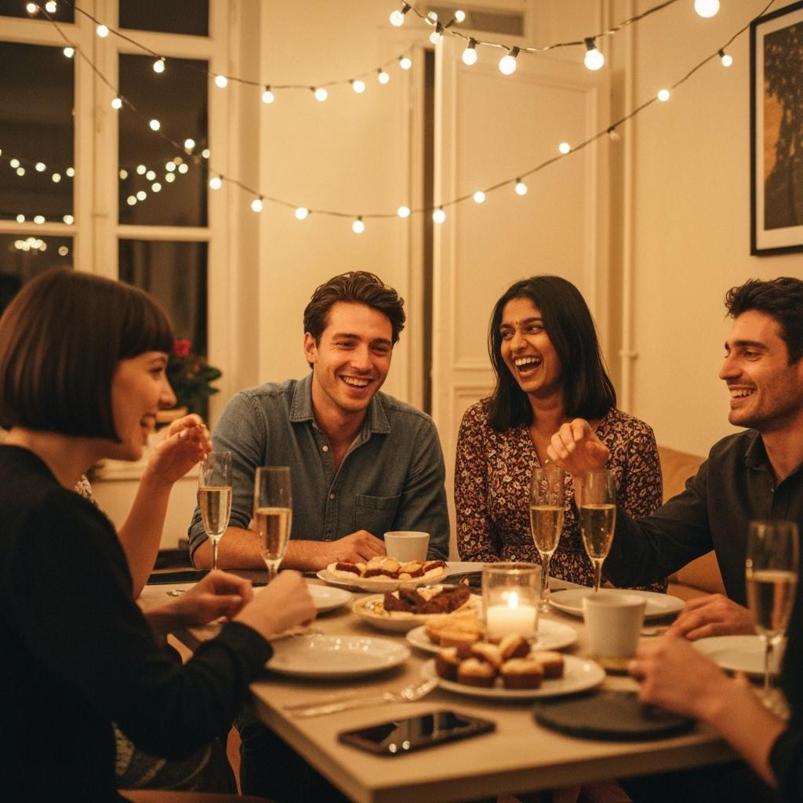

# TIL: Image Generation Prompt for Realistic Photos

**Date:** 2025-07-03

## Prompt Example: Realistic Image Generation

> "Generate an image that looks like a genuine, everyday photo taken by a person. Use the file `IMG_375.jpg` as a reference for style and authenticity. The result should not appear artificial or staged—aim for natural lighting, realistic composition, and subtle imperfections that make it believable as a real photograph."

Example:

```text
Friends at a party in Paris, IMG_375.jpg
```

Output:
  <!-- Replace with actual image URL

### Why This Works

- **Reference File:** Using a real photo (`IMG_375.jpg`) as a style guide helps the model understand what "genuine" looks like.
- **Explicit Instructions:** Asking for natural lighting, composition, and imperfections steers the model away from "AI art" tropes.
- **Use Case:** Great for generating images for websites, social media, or any context where authenticity matters.

---

**Tip:** Always review generated images for subtle artifacts or inconsistencies before publishing.
