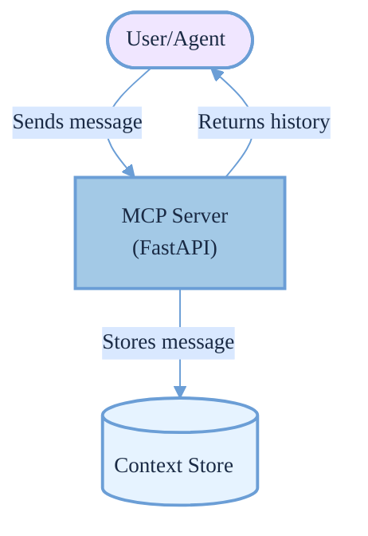

# Today I Learned: Block's Playbook for Designing MCP Servers

**Date:** 2025-07-07  
**Source:** [Block's Playbook for Designing MCP Servers](https://engineering.block.xyz/blog/blocks-playbook-for-designing-mcp-servers)

## Overview
Today, I explored Block's comprehensive guide on designing **Model Context Protocol (MCP)** servers, a standardized protocol for integrating large language models (LLMs) with external tools and data sources. Published on June 16, 2025, this playbook offers practical insights for building scalable, secure, and production-ready MCP servers, aligning with best practices from OpenAI, Google, and the MCP open-source community. Below, I summarize key takeaways, enhanced with actionable examples and clear explanations.

## Key Takeaways

### 1. Core Design Principles
- **Modularity & Statelessness**: Design components (e.g., context manager, request handler) to be independent and stateless, enabling easy scaling and deployment. This mirrors OpenAI’s API design and Google’s Vertex AI agent infrastructure.
- **Separation of Concerns**: Isolate context management, authentication, and business logic. For example, use a dedicated context store like Redis or a vector database instead of mixing with request processing.
- **Why It Matters**: Modular, stateless designs simplify updates and scaling, critical for handling dynamic LLM workloads.

### 2. Scalability Strategies
- **Async Processing**: Leverage async frameworks like FastAPI to manage high concurrent request volumes efficiently, a standard in LLM serving (e.g., vLLM).
- **Load Balancing**: Deploy multiple server instances behind a load balancer (e.g., NGINX, AWS ALB) to distribute traffic evenly.
- **Horizontal Scaling**: Use container orchestration tools like Kubernetes or Docker Compose to add instances as demand grows, ensuring resilience.
- **Why It Matters**: These patterns support thousands of simultaneous users, maintaining low latency under heavy loads.

### 3. Security & Observability
- **Authentication**: Implement OAuth2, API keys, or OpenID Connect (e.g., JWT tokens) to secure endpoints.
- **Monitoring**: Use Prometheus, Grafana, and OpenTelemetry for metrics, tracing, and alerts. Structured logging (JSON format) aids cloud-native debugging.
- **Why It Matters**: Robust security prevents unauthorized access, while observability ensures quick issue detection in production.

### 4. Practical Lessons
- **Context Size Management**: Limit context windows to avoid memory overload, using truncation, summarization, or chunking techniques.
- **Latency Optimization**: Cache frequent context lookups and apply model quantization or distillation for faster inference.
- **Multi-Client Support**: Design APIs for both synchronous (HTTP) and streaming (WebSocket, Server-Sent Events) clients, supporting agentic and RAG systems.
- **Why It Matters**: These optimizations balance performance and resource usage, critical for real-time LLM applications.

### 5. Community & Standards
- **MCP Standard**: Adhere to the [Model Context Protocol](https://modelcontextprotocol.io/) for interoperability with major agent frameworks like OpenAI’s Agents SDK.
- **Open Source**: Contribute to the MCP ecosystem via [GitHub](https://github.com/modelcontextprotocol) or [community forums](https://modelcontextprotocol.io/).
- **Why It Matters**: Following open standards ensures compatibility and fosters collaboration, accelerating adoption.

## Supported Protocols and Transports in MCP

Modern MCP servers are designed to be transport-agnostic, supporting multiple communication protocols to maximize compatibility and flexibility. The most common transport types are:

- **Streamable HTTP**: The primary and recommended transport, using HTTP POST for client-to-server JSON-RPC messages and supporting both standard JSON responses and streaming via Server-Sent Events (SSE) for real-time updates. This enables both synchronous and streaming workflows.
- **Standard Input/Output (stdio)**: Useful for local integrations, command-line tools, and process-to-process communication, allowing MCP servers to communicate over standard input/output streams.
- **Server-Sent Events (SSE) [Deprecated]**: Previously used for server-to-client streaming, now replaced by Streamable HTTP with built-in SSE support. Legacy SSE endpoints may still be supported for backward compatibility.
- **Custom Transports**: MCP’s architecture allows for custom transports (e.g., gRPC, WebSocket, or domain-specific protocols) as long as they conform to the MCP Transport interface and JSON-RPC message format.

**Best Practice:** For new deployments, use Streamable HTTP for broadest client compatibility and robust session management. For advanced or specialized use cases, custom transports can be implemented as needed.

*Reference: [MCP Transports Documentation](https://modelcontextprotocol.io/docs/concepts/transports)*

## Visual Flow: Basic MCP Server
Below is a simplified flow of an MCP server handling user messages, designed for clarity and accessibility.



*Caption*: A user or agent sends a message to the MCP server, which stores it in a context store and returns the conversation history. Pastel colors ensure visual clarity.

## Example: Basic MCP Server (FastAPI)
Here’s a minimal FastAPI-based MCP server for storing and retrieving chat history, ideal for development and testing. Comments explain key design choices.

```python
from fastapi import FastAPI, HTTPException
from pydantic import BaseModel
from typing import List, Dict, Any

# Initialize FastAPI app
app = FastAPI(title="Basic MCP Server")
# In-memory store (not for production)
chat_history: Dict[str, List[Dict[str, Any]]] = {}

# Define data models for request validation
class Message(BaseModel):
    role: str  # e.g., "user", "assistant"
    content: str

class ChatRequest(BaseModel):
    session_id: str
    message: Message

# Endpoint to store a message
@app.post("/mcp/chat")
async def add_message(request: ChatRequest):
    # Initialize session if new
    if request.session_id not in chat_history:
        chat_history[request.session_id] = []
    # Append message to session history
    chat_history[request.session_id].append(request.message.dict())
    return {
        "status": "ok",
        "session_id": request.session_id,
        "message_count": len(chat_history[request.session_id])
    }

# Endpoint to retrieve chat history
@app.get("/mcp/chat/{session_id}")
async def get_chat_history(session_id: str):
    if session_id not in chat_history:
        raise HTTPException(status_code=404, detail="Session not found")
    return {"session_id": session_id, "history": chat_history[session_id]}

# Health check endpoint for monitoring
@app.get("/health")
async def health():
    return {"status": "healthy"}
```

**Usage**:
1. Send `POST /mcp/chat` with `{"session_id": "s1", "message": {"role": "user", "content": "Hi!"}}`.
2. Send `POST /mcp/chat` with `{"session_id": "s1", "message": {"role": "assistant", "content": "Hello!"}}`.
3. Send `GET /mcp/chat/s1` to retrieve the session’s history.

**Note**: In-memory storage is simple but unsuitable for production due to lack of persistence and scalability.

## Example: Intermediate MCP Server (Redis)
This example adds Redis for persistence and validation, suitable for small-scale production. It includes error handling and logging.

```python
from fastapi import FastAPI, HTTPException
from pydantic import BaseModel, Field
import redis
import logging
import json
from typing import Dict, Any, Optional

# Configure structured logging
logging.basicConfig(level=logging.INFO, format='%(asctime)s - %(name)s - %(levelname)s - %(message)s')
logger = logging.getLogger(__name__)

# Initialize FastAPI app
app = FastAPI(title="Intermediate MCP Server")

# Connect to Redis
try:
    redis_client = redis.Redis(host='localhost', port=6379, decode_responses=True)
    redis_client.ping()
except redis.ConnectionError:
    logger.error("Redis connection failed")
    raise Exception("Cannot connect to Redis")

# Data models with validation
class ContextRequest(BaseModel):
    session_id: str = Field(..., min_length=1, max_length=100)
    context: Dict[str, Any]
    max_tokens: int = Field(default=4000, gt=0, le=32000)
    ttl: Optional[int] = Field(default=3600, gt=0, le=86400)  # 1-24 hours

# Store context in Redis
@app.post("/mcp/context")
async def store_context(request: ContextRequest):
    try:
        # Serialize and validate context size
        context_str = json.dumps(request.context)
        if len(context_str) > request.max_tokens:
            raise HTTPException(
                status_code=413,
                detail=f"Context size {len(context_str)} exceeds limit {request.max_tokens}"
            )
        # Store in Redis with TTL
        key = f"mcp:context:{request.session_id}"
        redis_client.setex(key, request.ttl, context_str)
        logger.info(f"Stored context for session {request.session_id}, size: {len(context_str)}")
        return {
            "status": "ok",
            "session_id": request.session_id,
            "stored_tokens": len(context_str),
            "expires_in": request.ttl
        }
    except Exception as e:
        logger.error(f"Error storing context: {e}")
        raise HTTPException(status_code=500, detail="Internal server error")

# Retrieve context
@app.get("/mcp/context/{session_id}")
async def get_context(session_id: str):
    key = f"mcp:context:{session_id}"
    context_str = redis_client.get(key)
    if not context_str:
        raise HTTPException(status_code=404, detail="Context not found or expired")
    return {"context": json.loads(context_str)}

# Health check
@app.get("/health")
async def health_check():
    return {"status": "healthy", "redis": "connected"}
```

**Setup**: Install Redis (`pip install redis`) and ensure a Redis server runs on `localhost:6379`.
**Security Note**: For production, enable Redis authentication, use firewalls or private networking, and never expose Redis directly to the internet.
**Usage**: Store context with `POST /mcp/context` and retrieve with `GET /mcp/context/{session_id}`.

## Testing the Server
Testing ensures reliability. Here’s a basic unit test using `pytest` for the FastAPI server.

```python
import pytest
from fastapi.testclient import TestClient
from your_basic_server import app

client = TestClient(app)

def test_store_and_retrieve():
    # Store a message
    response = client.post("/mcp/chat", json={
        "session_id": "test1",
        "message": {"role": "user", "content": "Hello!"}
    })
    assert response.status_code == 200
    assert response.json()["status"] == "ok"

    # Retrieve history
    response = client.get("/mcp/chat/test1")
    assert response.status_code == 200
    assert len(response.json()["history"]) == 1
    assert response.json()["history"][0]["content"] == "Hello!"
```

**Run**: `pytest test_mcp.py` after installing `pytest` (`pip install pytest`).

## Deployment: Docker
Deploy the intermediate server using Docker for consistency.

```dockerfile
# Dockerfile
FROM python:3.11-slim
WORKDIR /app
COPY requirements.txt .
RUN pip install -r requirements.txt
COPY . .
EXPOSE 8000
CMD ["uvicorn", "main:app", "--host", "0.0.0.0", "--port", "8000"]
```

**requirements.txt**:
```
fastapi==0.103.0
uvicorn==0.23.2
pydantic==2.4.2
redis==5.0.1
```

**Run**: Build with `docker build -t mcp-server .` and run with `docker run -p 8000:8000 mcp-server`.

---

**Production Security Best Practices:**
- Always use HTTPS (TLS) for all endpoints.
- Require authentication (API keys, OAuth2, or OpenID Connect) for all production APIs.
- Monitor and audit access logs for unusual activity.
- Regularly update dependencies to patch security vulnerabilities.

---

## Practical: Testing with VSCode MCP Client
The [MCP Client VSCode extension](https://marketplace.visualstudio.com/items?itemName=modelcontextprotocol.mcp-client) simplifies testing.

1. **Install**: Search `MCP Client` in VSCode Extensions and install.
2. **Add Server**: Use Command Palette (`Ctrl+Shift+P`), select `MCP: Add Server`, and enter `http://localhost:8000`.
3. **Test**: In the MCP sidebar, send a `POST /mcp/context` request with:
   ```json
   {
     "session_id": "test123",
     "context": {"message": "Hello from VSCode!"}
   }
   ```
4. **Debug**: Use the [MCP Inspector](https://modelcontextprotocol.io/docs/tools/inspector) for protocol-level insights.

## Why It’s Valuable
Block’s playbook provides a clear roadmap for building MCP servers, from prototypes to enterprise systems. Its emphasis on modularity, scalability, and security ensures robust LLM integrations, while the open-source MCP standard fosters interoperability. This guide is a must-read for developers crafting AI-driven applications in 2025.

## References
- [Block’s Playbook](https://engineering.block.xyz/blog/blocks-playbook-for-designing-mcp-servers)
- [MCP Documentation](https://modelcontextprotocol.io/)
- [MCP GitHub](https://github.com/modelcontextprotocol)
- [VSCode MCP Client](https://marketplace.visualstudio.com/items?itemName=modelcontextprotocol.mcp-client)