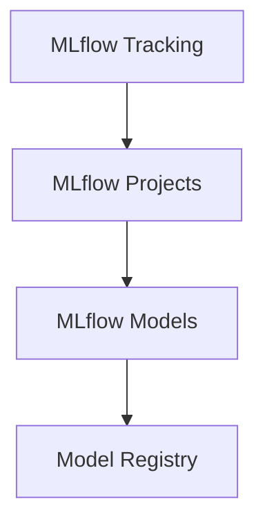
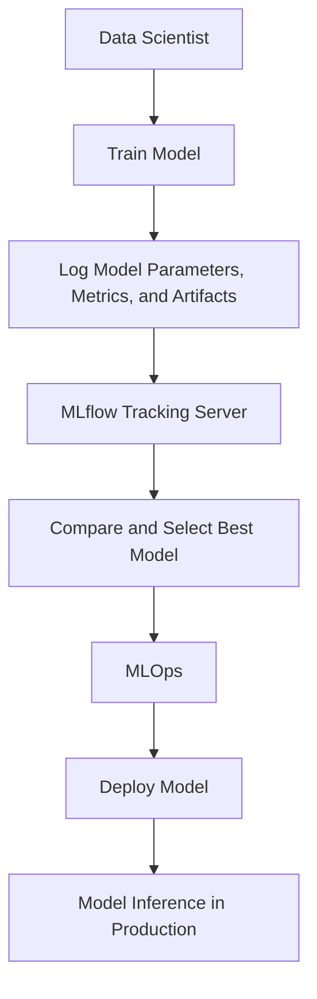
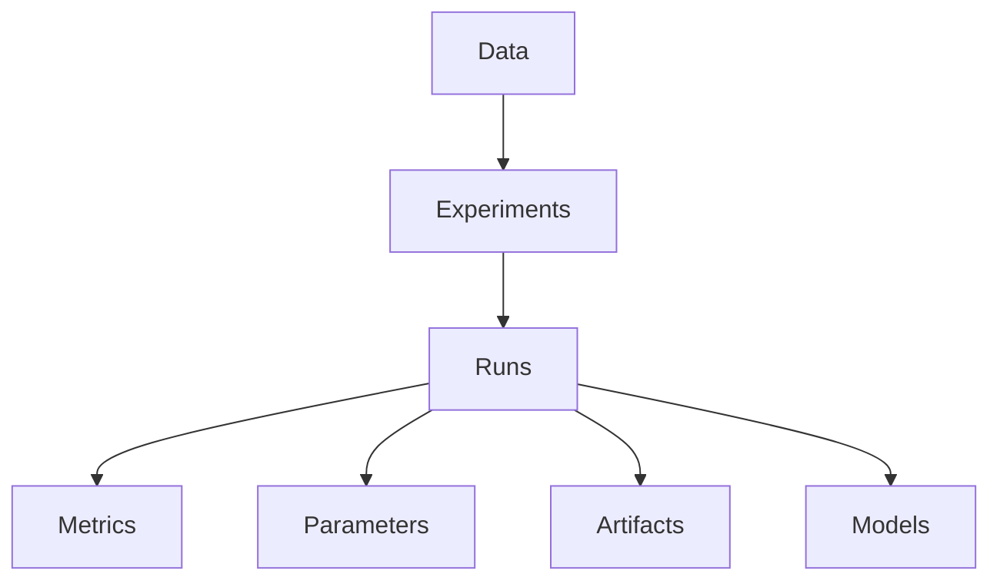
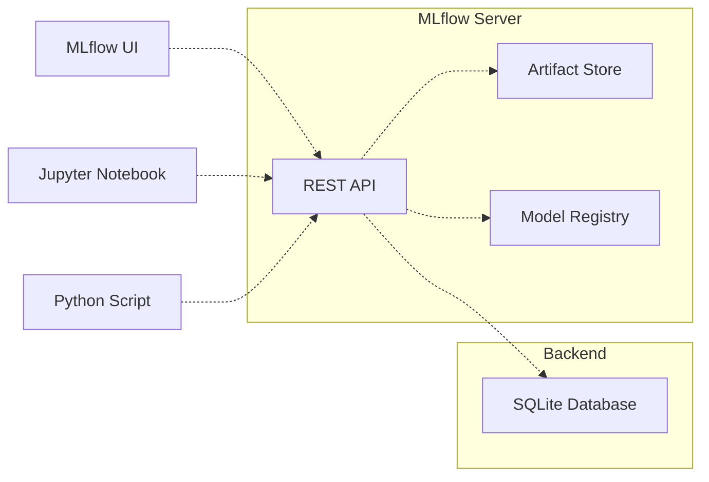

# [](../README.md)
# MLflow Tutorial

## Introduction

MLflow is an open source platform for managing the end-to-end machine learning lifecycle, including experimentation, reproducibility, deployment, and a central model registry.

In this comprehensive tutorial, we'll walk through how to use MLflow's key components to:

- *Track experiments* with code, data, config, and results
- *Package code and dependencies* as reproducible runs
- *Save and deploy models* for real-time serving  
- *Manage model lineage, versions, stages, and annotations*

**MLflow consists of four main components**:



- **MLflow Tracking**: Records and tracks experiments, including code, data, config, and results.
- **MLflow Projects**: Packages code and dependencies as reproducible runs.
- **MLflow Models**: Packages models for deployment and serving.
- **Model Registry**: Centralized model store, model lineage, model versioning, and stage transitions. Based on SQL database (e.g. MySQL, PostgreSQL, SQLite).

The tracking component is useful during development and testing, while the projects, models, and model registry components help package, validate, and deploy models to production.

MLflow works with any machine learning library or framework like TensorFlow, PyTorch, XGBoost, and scikit-learn, and integrates with tools like Docker, Kubernetes, and AWS SageMaker. It can be used for projects both small and large.

By the end of this guide, you'll understand how to:

- Log metrics, parameters, and artifacts when running ML code
- Package projects for reproducible runs on any platform
- Save, load, and deploy models for real-time serving  
- Manage models in a central registry for discovery, lineage, and governance

Let's dive in!

## The full ML lifecycle



1. **Data Scientist**: The data scientist trains a machine learning model using their preferred tools and libraries.
2. **Train Model**: The model is trained using the selected algorithms, hyperparameters, and data.
3. **Log Model Parameters, Metrics, and Artifacts**: During the training process, the data scientist logs model parameters, metrics, and artifacts using MLflow's tracking API.
4. **MLflow Tracking Server**: The MLflow tracking server stores the logged information, making it accessible for comparison and analysis.
5. **Compare and Select Best Model**: The data scientist or MLOps team can compare different models' performance using the MLflow tracking server and select the best model for deployment.
6. **MLOps**: The MLOps team takes the selected model and prepares it for deployment, ensuring it meets production requirements.
7. **Deploy Model**: The model is deployed to a production environment, such as a REST API or a batch inference system.
8. **Model Inference in Production**: The deployed model is used for inference in production, providing predictions or insights based on new data.

## MLflow Tracking

The core functionality of MLflow centers around its tracking component. This allows you to log metrics, parameters, and artifacts for each run of your machine learning code and visualize the results.

**Here is an overview of how MLflow tracking works:**



- **Experiments**: Logical groupings of runs for a specific project or goal.
- **Runs**: An execution of ML code, gets a unique run ID.  
- **Metrics**: Evaluation metrics like accuracy, loss, RMSE logged per run.
- **Parameters**: Key/value input parameters logged per run.
- **Artifacts**: Output files like images, models, and data files.
- **Models**: Trained ML models logged as artifacts.

### definition of accuracy, loss, RMSE

- **Accuracy**: The percentage of correct predictions.
- **Loss**: A measure of error between the predicted and actual values.
- **RMSE**: Root mean squared error, a measure of error between the predicted and actual values.

To use MLflow tracking, wrap your code in an `mlflow.start_run()` block:

```python
import mlflow

with mlflow.start_run() as run:
  # ML code goes here
  
mlflow.end_run()
```

This starts a new run with a unique ID that all metrics and parameters will be logged to.

Within each run, log metrics like accuracy scores, loss values, or any other numeric values from your model training and evaluation:

```python
mlflow.log_metric("accuracy", 0.91)
mlflow.log_metric("loss", 1.83)
```

Log key/value pairs of parameters using `log_param`:

```python
mlflow.log_param("learning_rate", 0.01) 
mlflow.log_param("architecture", "ResNet50")
```

Metrics and parameters are automatically logged to MLflow Tracking Server or a local SQLite database.

Artifacts allow you to log files like images, models, and data files. Use `log_artifact` and provide a local file path:

```python
mlflow.log_artifact("images/profile.jpg")
mlflow.log_artifact("models/keras_model.h5") 
```

Artifacts are logged to an artifact repository like S3 or Azure Blob Storage.

The MLflow Tracking UI provides a central place to visualize, compare, and search runs using metrics, parameters, tags, and artifacts:

MLflow Tracking UI

This makes it easy to compare runs side-by-side to determine the best model. You can run the UI via `mlflow ui` or access it at <http://localhost:5000>.

While MLflow Tracking lets you log specific runs, MLflow Projects packages code and configurations so you can reproduce runs on any platform.

## Architecture



## MLflow Projects

Projects define the full computing environment required to run your code, including:

- **Entry point**: Main executable code to run.
- **Parameters**: Key/value parameters for the entry point.
- **Dependencies**: Local Python dependencies or Conda environment file.
- **Docker container**: Optional Docker image dependencies.

Define projects with a simple YAML format:

```yaml
name: My Project

conda_env: conda.yaml

entry_point: train.py

parameters:
  alpha: 
    type: float
    default: 0.4
  epochs: 10
```

Then run projects locally via `mlflow run` to launch the entry point:

```bash
mlflow run . -P alpha=0.5
```

This launches `train.py` with the Conda environment defined in `conda.yaml` and passes `alpha=0.5`.

You can also run projects remotely on Databricks, Kubernetes, or AWS SageMaker backends. The project contains all the info needed to replicate the run.

## MLflow Models

Once you've trained a model, you'll want to package it so it can be deployed for real-time serving.

MLflow Models provides a standard unit for packaging and reusing models with different "flavors":

- **Python Function**: Deploy Python models locally.
- **Docker**: Build a Docker image to containerize the model.
- **AWS SageMaker**: Deploy on SageMaker for real-time predictions.
- **Apache Spark**: Load PySpark models for batch predictions.

To save a model:

```python
import mlflow.sklearn

mlflow.sklearn.log_model(sk_learn_model, "model")
```

This logs a model artifact that can be consumed from different platforms. You can also associate the model with metadata like name, version, description, and stage.

To load and use a model:

```python
model = mlflow.pyfunc.load_model("runs:/96771d77ec124f2587b8a013f4da8c16/model")

model.predict(input_data)
```

The `mlflow.pyfunc` package loads models in a consistent way for local Python deployment.

## MLflow Model Registry

For larger teams and applications, it's important to have a central model registry for discovering, versioning, and managing models.

Key features of the MLflow Model Registry:

- **Model lineage**: Visualize model history and compare versions.
- **Model versioning**: Register new model versions over time.  
- **Stage transitions**: Mark models as staging vs production.
- **Annotations**: Take notes on model experiments.
- **Access control**: Limit model access to certain users.

You can associate a model with the registry when logging:

```python
mlflow.sklearn.log_model(model, "model", registered_model_name="Ecommerce Model")
```

This registers the model under the "Ecommerce Model" name. You can add new versions over time, update descriptions, transition to staging or production, and annotate experiments for easier model reproducibility and governance.

The registry provides a central hub for discovering, documenting, and managing models.

## Model Deployment

Once you've trained a performant model, you'll want to deploy it to production for real-time serving. MLflow provides a few options for scalable, robust deployments:

### Local Development

For small-scale or testing purposes, you can deploy models locally via REST API or batch inference:

```python
import mlflow.pyfunc

model = mlflow.pyfunc.load_model("model") 
mlflow.pyfunc.serve_model(model)
```

This starts a local REST API endpoint you can send requests to for real-time predictions.

### Docker Containers

Containerize models as Docker images for reproducible, portable deployments using the `mlflow models build-docker` CLI:

```bash
mlflow models build-docker -m runs:/<run-id>/model --no-conda -n model
```

This packages the model as a Docker image for easy deployment to hosts running Docker.

### Kubernetes

For robust model deployment, Kubernetes is a popular open source platform. Deploy MLflow models to Kubernetes using the [MLflow KServe project](https://github.com/kubeflow/kfserving/tree/master/docs/samples/mlflow). This provides performant, resilient serving backed by Kubernetes.

### AWS SageMaker

For a fully-managed environment, AWS SageMaker is a good option. Deploy models to SageMaker endpoints via:

```python
import sagemaker

model = mlflow.sagemaker.deploy(app_name="model", model_uri="runs:/...") 
predictor = sagemaker.RealTimePredictor(endpoint=model.endpoint_name)
```

SageMaker handles provisioning servers, scaling, load balancing, A/B testing, and more.

## Advanced Features

In addition to the core components covered above, MLflow provides many advanced features for managing and monitoring models:

- **Model Registry UI**: Visualize, search, and manage models through a web UI.
- **Model Versioning**: Register new model versions over time and compare versions.
- **Model Staging**: Mark models as staging vs production to control rollout.
- **Annotations**: Take notes on experiments and


Here is an additional chapter that covers some of the weaknesses identified in the original MLflow tutorial:

## Advanced Model Training and Deployment

The basic MLflow tutorial provides a good introduction to tracking experiments, packaging projects, saving models, and basic local deployment. However, it is limited to a simple linear regression model and CSV serving. 

This chapter covers more advanced model training, deployment, and productionization techniques:

### Training Additional Algorithms

The initial tutorial only covers training a linear regression model. Here we demonstrate training other algorithms like random forests and neural networks:

```python
# Train random forest 
from sklearn.ensemble import RandomForestRegressor
rf = RandomForestRegressor()
rf.fit(X_train, y_train)

# Log RF model
mlflow.sklearn.log_model(rf, "rf_model")

# Train feedforward neural network
from tensorflow import keras
nn = keras.models.Sequential()  
nn.add(keras.layers.Dense(64, activation='relu', input_dim=X_train.shape[1]))
nn.add(keras.layers.Dense(1))
nn.compile(loss='mse', optimizer='adam')
nn.fit(X_train, y_train, epochs=100)

# Log NN model
mlflow.keras.log_model(nn, "nn_model") 
```

This demonstrates training and logging different model types with MLflow.

### Modularizing Training Code

The original tutorial puts all the training code in one script. Here we refactor it into separate modules:

```python
# model_training.py

from sklearn.linear_model import LinearRegression

def train_linear_regression(X, y):
   model = LinearRegression()
   model.fit(X, y)
   return model

# main.py 

import model_training

X, y = get_training_data()
model = model_training.train_linear_regression(X, y) 
mlflow.sklearn.log_model(model, "model")
```

This makes the code more modular and maintainable.

### Hyperparameter Tuning

The initial tutorial hard-codes the model hyperparameters. Here we demonstrate tuning them:

```python 
# Define hyperparameter search space
params = {"alpha": [0.1, 1.0, 10.0],
          "l1_ratio": [0.1, 0.5, 0.9]}

# Use scikit-learn GridSearchCV  
from sklearn.model_selection import GridSearchCV
grid = GridSearchCV(LinearRegression(), param_grid=params, cv=5)
grid.fit(X_train, y_train)

print("Best Params:", grid.best_params_)
print("Best Score:", grid.best_score_)

# Log best model
mlflow.sklearn.log_model(grid.best_estimator_, "model") 
```

This finds the optimal hyperparameters for the model.

### Advanced Deployment

The original tutorial shows simple local CSV serving. Here we demonstrate robust deployment options:

**Flask Web App**: Containerize the model in a Flask web application:

```python
from flask import Flask
import mlflow.pyfunc  

app = Flask(__name__)

@app.route('/predict', methods=['POST'])  
def predict():
    model = mlflow.pyfunc.load_model("model")  
    data = request.get_json()  
    prediction = model.predict(data)
    return {"prediction": prediction}
    
if __name__ == "__main__":
    app.run(debug=True, host='0.0.0.0', port=9696)
```

**Docker Container**: Package the model as a Docker container for portable predictions:

```
# Build Docker image 
mlflow models build-docker -m runs:/<run-id>/model --no-conda -n model

# Run container
docker run -p 9696:9696 model:latest
```

**Kubernetes Deployment**: Deploy the model on Kubernetes for robust serving:

```yaml
# Kubernetes pod spec
apiVersion: apps/v1
kind: Deployment      
metadata:
  name: model
spec:
  replicas: 3
  selector:
    matchLabels:
      app: model
  template:
    metadata:
      labels:
        app: model
    spec:
      containers:
      - name: model
        image: model:latest
        ports:
        - containerPort: 9696
```

This demonstrates more advanced deployment options for taking models to production.

By covering additional algorithms, modular code, hyperparameter tuning, and robust deployment, this chapter expands on the core MLflow concepts introduced in the initial tutorial. This provides a more comprehensive overview of the end-to-end ML lifecycle.

