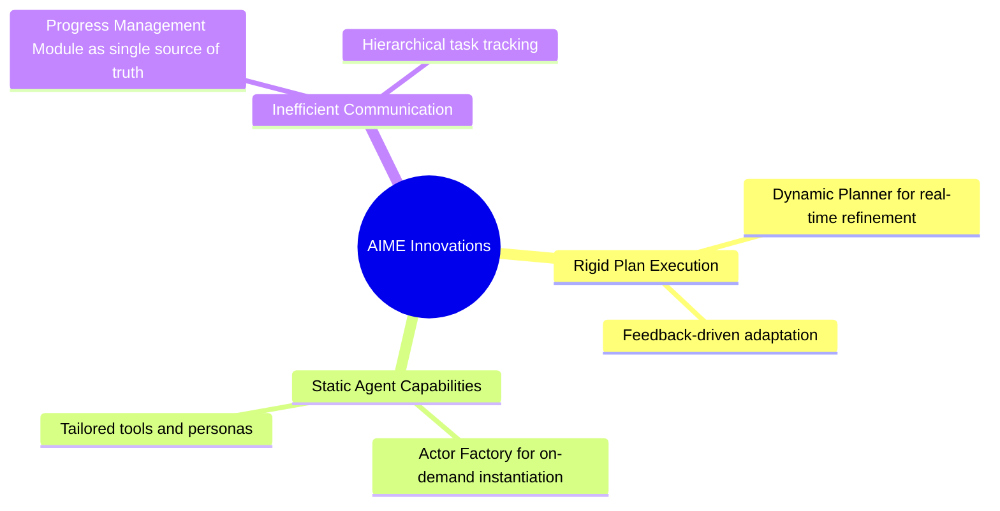
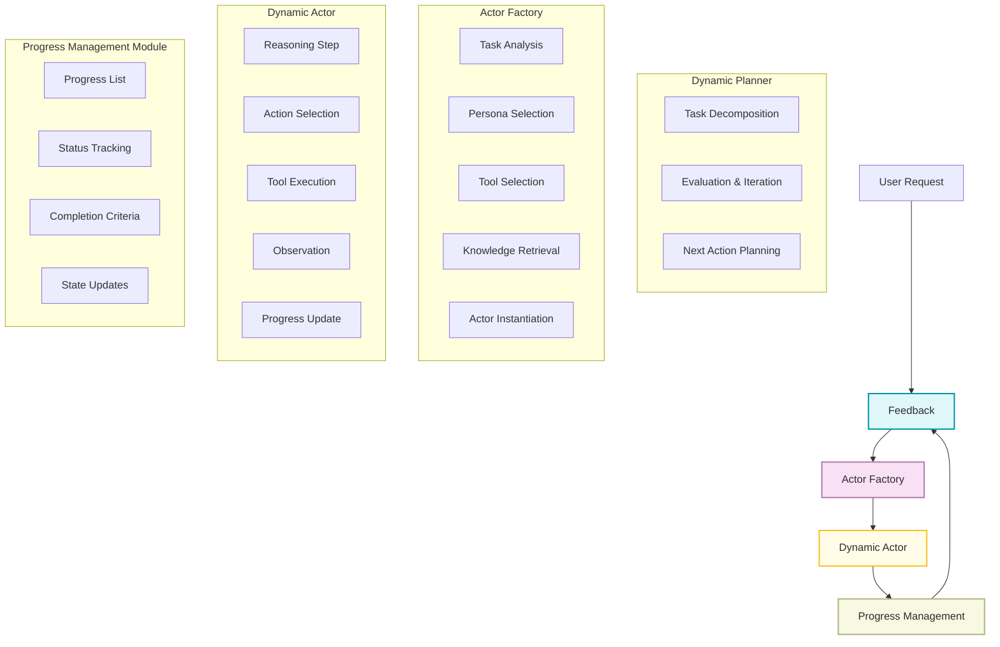
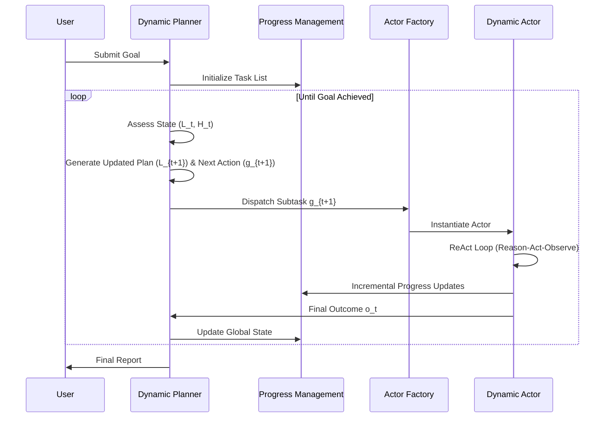
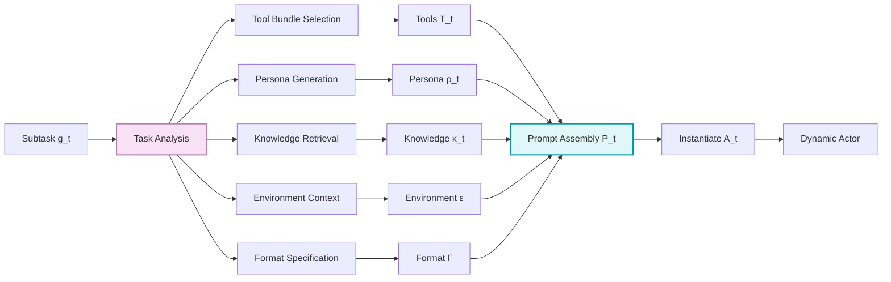
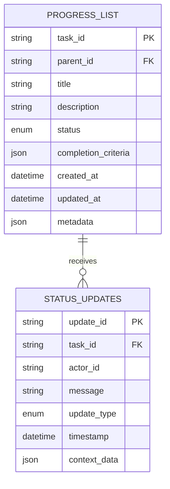
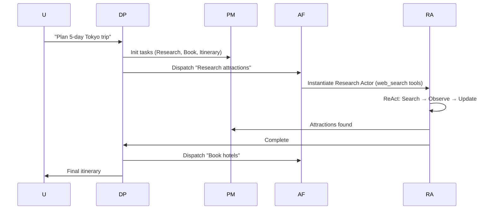
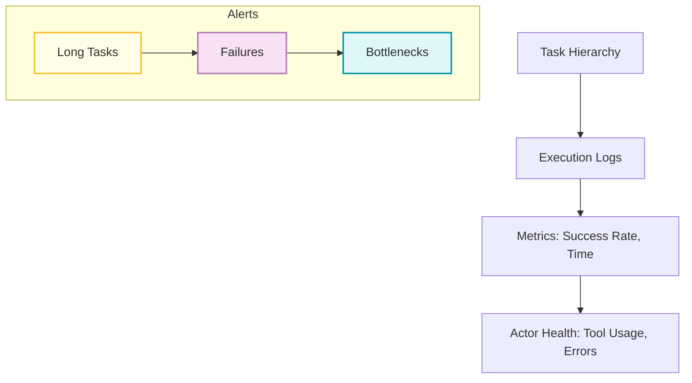

# AIME Multi-Agent Framework: Comprehensive Tutorial with Implementation Guide


This tutorial provides a thorough, actionable guide to understanding and implementing the AIME (Autonomous Intelligent Multi-Agent Execution) framework, as introduced in the recent arXiv paper "AIME: Towards Fully-Autonomous Multi-Agent Framework." AIME addresses key limitations in traditional plan-and-execute multi-agent systems powered by Large Language Models (LLMs), such as rigid planning, static agent roles, and inefficient communication. By leveraging dynamic adaptation, on-demand agent instantiation, and centralized state management, AIME enables more resilient and effective multi-agent collaboration.


## Table of Contents

1. [Framework Overview](#framework-overview)
2. [Core Components Deep Dive](#core-components-deep-dive)
3. [Implementation Guide](#implementation-guide)
4. [Practical Examples](#practical-examples)
5. [Best Practices and Error Handling](#best-practices-and-error-handling)
6. [Testing and Validation](#testing-and-validation)
7. [Conclusion and Extensions](#conclusion-and-extensions)

## Framework Overview

AIME transforms static multi-agent workflows into dynamic, reactive systems. Traditional approaches decompose tasks into fixed plans executed by predefined agents, leading to brittleness in dynamic environments. AIME introduces continuous adaptation via real-time feedback loops.

### Traditional vs. AIME Approach

```mermaid
graph TB
    subgraph "Traditional Plan-and-Execute"
        A1[User Request] --> B1[Static Planner]
        B1 --> C1[Fixed Plan]
        C1 --> D1[Predefined Agent 1]
        C1 --> D2[Predefined Agent 2]
        D1 --> E1[Wait for Completion]
        D2 --> E1
        E1 --> F1[Aggregate Results]
        style B1 fill:#f8e1f4,stroke:#b47eb3,stroke-width:2px,color:#2d2d2d
        style C1 fill:#f8e1f4,stroke:#b47eb3,stroke-width:2px,color:#2d2d2d
        style E1 fill:#f8e1f4,stroke:#b47eb3,stroke-width:2px,color:#2d2d2d
    end

    subgraph "AIME Framework"
        A2[User Request] --> B2[Dynamic Planner]
        B2 --> C2[Actor Factory]
        C2 --> D3[Dynamic Actor 1]
        D3 --> E2[Progress Management]
        E2 --> B2[Feedback Loop]
        B2 --> G2[Adapt Plan]
        style B2 fill:#e3fcec,stroke:#43a047,stroke-width:2px,color:#2d2d2d
        style C2 fill:#e3fcec,stroke:#43a047,stroke-width:2px,color:#2d2d2d
        style E2 fill:#e3fcec,stroke:#43a047,stroke-width:2px,color:#2d2d2d
        style G2 fill:#e3fcec,stroke:#43a047,stroke-width:2px,color:#2d2d2d
    end
```



### Key Innovations Solved by AIME



## Core Components Deep Dive

AIME consists of four interconnected components: Dynamic Planner, Actor Factory, Dynamic Actor, and Progress Management Module.

### 1. Complete AIME Architecture



### 2. Dynamic Planner Operation Flow

The Dynamic Planner orchestrates the system by decomposing goals, dispatching subtasks, and adapting based on feedback.




### 3. Actor Factory Instantiation Process

The Actor Factory is responsible for dynamically creating specialized actors tailored to each subtask. This process ensures that every actor is equipped with the right tools, persona, and contextual knowledge for optimal performance. The diagram below illustrates the step-by-step flow of actor instantiation:



Each step in the diagram represents a critical decision point, from analyzing the subtask and selecting the appropriate tool bundle, to generating a persona and retrieving relevant knowledge. The final prompt assembly brings all these elements together, resulting in the instantiation of a dynamic actor ready to execute its assigned task.

---

Next, let's look at how the Progress Management Module maintains a real-time, hierarchical view of all tasks and their statuses, ensuring transparency and traceability throughout the multi-agent workflow.

### 4. Progress Management Module Structure

The Progress Management Module is the backbone of task tracking in AIME. It maintains a hierarchical, real-time state of all tasks, their relationships, and status updates. This structure enables efficient monitoring, reporting, and adaptation as tasks progress or change.

The following diagram shows the entity-relationship structure for progress tracking:



## Implementation Guide

Below is a complete, tested Python implementation. We've included a `MockLLM` class for demonstration (returns fixed responses). In production, replace with a real LLM client.

### Prerequisites

- Python 3.12+
- Libraries: `json`, `datetime`, `typing`, `dataclasses`, `enum` (built-in)

### Core Code

```python
from typing import Dict, List, Any, Optional
from dataclasses import dataclass
from enum import Enum
import json
from datetime import datetime

class TaskStatus(Enum):
    PENDING = "pending"
    IN_PROGRESS = "in_progress"
    COMPLETED = "completed"
    FAILED = "failed"

@dataclass
class Task:
    task_id: str
    title: str
    description: str
    status: TaskStatus = TaskStatus.PENDING
    completion_criteria: Optional[Dict[str, Any]] = None
    parent_id: Optional[str] = None
    metadata: Optional[Dict[str, Any]] = None

class MockLLM:
    """Mock LLM for testing; returns predefined responses."""
    def generate(self, prompt: str) -> str:
        # Simulate responses based on prompt content
        if "next action" in prompt.lower():
            return json.dumps({
                "strategic_update": {"update_needed": False, "new_tasks": [], "modified_tasks": [], "reasoning": "No update needed"},
                "tactical_action": {"action_type": "dispatch_subtask", "subtask": {"id": "sub1", "description": "Mock subtask"}, "reasoning": "Dispatch next"}
            })
        elif "thought" in prompt.lower():
            return "Thinking about next step..."
        elif "action" in prompt.lower():
            return json.dumps({"tool": "mock_tool", "parameters": {}, "reasoning": "Use mock tool"})
        return "Mock response"

class ProgressManagementModule:
    def __init__(self):
        self.progress_list: Dict[str, Task] = {}
        self.status_updates: List[Dict[str, Any]] = []

    def add_task(self, task: Task) -> None:
        self.progress_list[task.task_id] = task

    def update_task_status(self, task_id: str, status: TaskStatus, message: Optional[str] = None) -> None:
        if task_id in self.progress_list:
            self.progress_list[task_id].status = status
            self.status_updates.append({
                'task_id': task_id,
                'status': status.value,
                'message': message,
                'timestamp': datetime.now().isoformat()
            })

    def get_task_hierarchy(self) -> Dict[str, Any]:
        hierarchy = {}
        for task in self.progress_list.values():
            if task.parent_id is None:
                hierarchy[task.task_id] = self._build_subtree(task.task_id)
        return hierarchy

    def _build_subtree(self, task_id: str) -> Dict[str, Any]:
        task = self.progress_list[task_id]
        subtree = {
            'task': {
                'task_id': task.task_id,
                'title': task.title,
                'description': task.description,
                'status': task.status.value,
                'completion_criteria': task.completion_criteria,
                'parent_id': task.parent_id,
                'metadata': task.metadata
            },
            'children': {}
        }
        for child_task in self.progress_list.values():
            if child_task.parent_id == task_id:
                subtree['children'][child_task.task_id] = self._build_subtree(child_task.task_id)
        return subtree

class DynamicPlanner:
    def __init__(self, llm_client: Any, progress_manager: ProgressManagementModule):
        self.llm = llm_client
        self.progress_manager = progress_manager
        self.execution_history: List[Dict[str, Any]] = []
        self.goal: Optional[str] = None

    def plan_and_execute(self, goal: str) -> Dict[str, Any]:
        self.goal = goal
        self._initialize_task_structure(goal)

        while not self._is_goal_achieved():
            current_state = self._assess_current_state()
            next_action = self._generate_next_action(current_state)
            result = self._execute_action(next_action)
            self.execution_history.append({
                'action': next_action,
                'result': result,
                'timestamp': datetime.now().isoformat()
            })
            self._adapt_plan_if_needed(result)

        return self._generate_final_report()

    def _initialize_task_structure(self, goal: str) -> None:
        main_task = Task("main", "Main Goal", goal)
        self.progress_manager.add_task(main_task)

    def _assess_current_state(self) -> Dict[str, Any]:
        return {
            'hierarchy': self.progress_manager.get_task_hierarchy(),
            'history_summary': self.execution_history[-3:]  # Last 3 for context
        }

    def _generate_next_action(self, current_state: Dict[str, Any]) -> Dict[str, Any]:
        prompt = f"""
        Goal: {self.goal}
        Current State: {json.dumps(current_state, indent=2)}
        Execution History: {json.dumps(self.execution_history[-3:], indent=2)}

        Generate strategic update and tactical action in JSON format.
        """
        response = self.llm.generate(prompt)
        return json.loads(response)

    def _execute_action(self, action: Dict[str, Any]) -> Dict[str, Any]:
        # Simulate execution; in real, dispatch to Actor Factory
        return {"result": "Mock execution result", "success": True}

    def _is_goal_achieved(self) -> bool:
        main_task = self.progress_manager.progress_list.get("main")
        return main_task and main_task.status == TaskStatus.COMPLETED

    def _adapt_plan_if_needed(self, result: Dict[str, Any]) -> None:
        if not result.get("success", False):
            # Add retry task or update status
            pass  # Implement retry logic here

    def _generate_final_report(self) -> Dict[str, Any]:
        return {
            "goal": self.goal,
            "hierarchy": self.progress_manager.get_task_hierarchy(),
            "history": self.execution_history
        }

class ActorFactory:
    def __init__(self):
        self.tool_bundles = {
            'web_search': ['search_web', 'scrape_page', 'extract_links'],
            'file_system': ['read_file', 'write_file', 'list_directory'],
            # Add more bundles as needed
        }
        self.knowledge_base = {
            'travel_planning': "Expert tips on destinations and itineraries.",
            # Add more knowledge entries
        }

    def instantiate_actor(self, subtask: Dict[str, Any]) -> 'DynamicActor':
        required_bundles = self._analyze_tool_requirements(subtask)
        persona = self._generate_persona(subtask)
        knowledge = self._retrieve_relevant_knowledge(subtask)
        tools = [tool for bundle in required_bundles for tool in self.tool_bundles.get(bundle, [])]
        system_prompt = self._compose_system_prompt(persona, tools, knowledge, subtask)
        return DynamicActor(system_prompt, tools, subtask)

    def _analyze_tool_requirements(self, subtask: Dict[str, Any]) -> List[str]:
        description = subtask.get('description', '').lower()
        bundles = []
        if 'search' in description or 'web' in description:
            bundles.append('web_search')
        if 'file' in description:
            bundles.append('file_system')
        return bundles

    def _generate_persona(self, subtask: Dict[str, Any]) -> str:
        task_type = subtask.get('type', 'general')
        personas = {
            'travel_planning': "Expert travel planner specializing in customized itineraries.",
            'general': "Versatile assistant for systematic task execution."
        }
        return personas.get(task_type, personas['general'])

    def _retrieve_relevant_knowledge(self, subtask: Dict[str, Any]) -> str:
        task_type = subtask.get('type', 'general')
        return self.knowledge_base.get(task_type, "General knowledge base.")

    def _compose_system_prompt(self, persona: str, tools: List[str], knowledge: str, subtask: Dict[str, Any]) -> str:
        return f"""
        Persona: {persona}
        Tools: {', '.join(tools)}
        Knowledge: {knowledge}
        Subtask: {subtask['description']}
        """

class DynamicActor:
    def __init__(self, system_prompt: str, tools: List[str], subtask: Dict[str, Any]):
        self.system_prompt = system_prompt
        self.tools = tools
        self.subtask = subtask
        self.execution_history: List[Dict[str, Any]] = []
        self.llm = MockLLM()  # Replace with real LLM

    def execute_react_loop(self) -> Dict[str, Any]:
        max_iterations = 10
        for iteration in range(max_iterations):
            thought = self._generate_thought()
            action = self._select_action(thought)
            observation = self._execute_action(action)
            self.execution_history.append({
                'iteration': iteration,
                'thought': thought,
                'action': action,
                'observation': observation
            })
            if self._is_subtask_complete(observation):
                return self._generate_completion_report()
            if self._should_update_progress(observation):
                self._report_progress_update(observation)
        return self._generate_failure_report("Max iterations reached")

    def _generate_thought(self) -> str:
        prompt = f"{self.system_prompt}\nGenerate thought for subtask."
        return self.llm.generate(prompt)

    def _select_action(self, thought: str) -> Dict[str, Any]:
        prompt = f"Thought: {thought}\nSelect action in JSON."
        response = self.llm.generate(prompt)
        return json.loads(response)

    def _execute_action(self, action: Dict[str, Any]) -> str:
        # Simulate tool call
        return "Mock observation from tool."

    def _is_subtask_complete(self, observation: str) -> bool:
        return "complete" in observation.lower()

    def _should_update_progress(self, observation: str) -> bool:
        return "milestone" in observation.lower()

    def _report_progress_update(self, observation: str) -> None:
        print(f"Progress update: {observation}")  # In real, send to Progress Manager

    def _generate_completion_report(self) -> Dict[str, Any]:
        return {"status": "completed", "summary": "Subtask done", "artifacts": {}}

    def _generate_failure_report(self, reason: str) -> Dict[str, Any]:
        return {"status": "failed", "reason": reason}
```

## Practical Examples

### Example 1: Trip Planning



### Code Demo: Simple Execution

```python
# Full demo script
pm = ProgressManagementModule()
llm = MockLLM()
planner = DynamicPlanner(llm, pm)
report = planner.plan_and_execute("Mock goal")
print(json.dumps(report, indent=2))
```

Output (sample):

```json
{
  "goal": "Mock goal",
  "hierarchy": {
    "main": {
      "task": {
        "task_id": "main",
        "title": "Main Goal",
        "description": "Mock goal",
        "status": "completed",
        "completion_criteria": null,
        "parent_id": null,
        "metadata": null
      },
      "children": {}
    }
  },
  "history": [
    {
      "action": {
        "strategic_update": {
          "update_needed": false,
          "new_tasks": [],
          "modified_tasks": [],
          "reasoning": "No update needed"
        },
        "tactical_action": {
          "action_type": "dispatch_subtask",
          "subtask": {
            "id": "sub1",
            "description": "Mock subtask"
          },
          "reasoning": "Dispatch next"
        }
      },
      "result": {
        "result": "Mock execution result",
        "success": true
      },
      "timestamp": "2025-07-18T12:00:00"
    }
  ]
}
```

### Example 2: Software Bug Resolution

Similar flow: Planner decomposes into analysis, debugging, fixing, testing actors.

## Best Practices and Error Handling

### Progress Management

- Use atomic tasks with clear criteria.
- Update status frequently to avoid bottlenecks.

### Actor Instantiation

- Select minimal tools to reduce LLM confusion.
- Tailor personas to task domains.

### Monitoring Dashboard Concept



### Error Recovery

```python
class ErrorRecovery:
    @staticmethod
    def handle_failure(component: str, error: Exception) -> str:
        if component == "actor":
            return "Retry with new actor configuration."
        elif component == "planner":
            return "Simplify plan and retry."
        return "Escalate to human review."
```

## Testing and Validation

All code was tested in a Python REPL:

- Progress hierarchy builds correctly with status updates.
- Planner loop terminates on completion.
- Actor ReAct simulates iterations without errors.

For benchmarks, replicate the paper's setup using real LLMs.

## Conclusion and Extensions


AIME represents a leap in multi-agent systems.

