# What is an MCP Server?

## The Smart Adapter for AI Applications

**Model Context Protocol in Practice**

---

## The Problem 🤔

**AI applications need to connect to everything:**
- Databases 🗃️
- Files 📁 
- APIs 🌐
- Services ⚙️

**But each integration requires custom code** 😰

---

## The Solution: MCP Servers 🔌

**Think of MCP Server as a USB-C port for AI**

*One standardized interface that any AI application can understand*

---

## What MCP Servers Provide

### 🛠️ **Tools**
*AI Actions*

- Execute functions
- User approval required
- Examples:
  - `searchFlights()`
  - `sendEmail()`
  - `createEvent()`

### 📊 **Resources**  
*Context Data*

- Provide information
- URI-based access
- Examples:
  - `file:///report.pdf`
  - `weather://forecast/paris`
  - `calendar://events/2024`

---

## What MCP Servers Provide (cont.)

### 📝 **Prompts**
*Interaction Templates*

User-controlled templates for common workflows

Examples:
- "Plan a vacation"
- "Summarize meetings" 
- "Debug code issue"

---

## How It Works

```mermaid
graph LR
    A["🤖 AI App<br/>(Claude, VS Code)"] <--> B["📡 MCP Client"]
    B <--> C["🔌 MCP Server"]
    C <--> D["💾 Your Systems"]
    
    classDef aiApp fill:#E8F4FD,stroke:#2563EB,stroke-width:2px,color:#1E40AF
    classDef mcpClient fill:#F0F9FF,stroke:#0284C7,stroke-width:2px,color:#0C4A6E
    classDef mcpServer fill:#FEF3C7,stroke:#D97706,stroke-width:2px,color:#92400E
    classDef external fill:#F3E8FF,stroke:#7C3AED,stroke-width:2px,color:#5B21B6
    
    class A aiApp
    class B mcpClient
    class C mcpServer
    class D external
```

---

## The Magic ✨

1. **Dynamic Discovery**
   AI applications automatically find available capabilities

2. **Automatic Adaptation**
   When servers add features, AI apps adapt instantly

3. **Secure Execution**
   All actions require explicit user approval

---

## Real-World Examples

| Server Type | Tools | Resources | Use Case |
|-------------|-------|-----------|----------|
| **GitHub MCP** | `createPR()` | `repo://files/*` | Code collaboration |
| **Database MCP** | `executeQuery()` | `schema://tables/*` | Data analysis |
| **Weather MCP** | `getAlerts()` | `weather://forecast/{city}` | Travel planning |

---

## Why MCP Servers Matter

### For Developers 👩‍💻
- **Write once, use everywhere**
- **No breaking changes**
- **Standardized debugging**

### For Organizations 🏢
- **Vendor independence**
- **Scalable architecture**
- **Compliance ready**

### For AI Applications 🤖
- **Plug-and-play integration**
- **Rich context access**
- **Secure by default**

---

## Getting Started

### 1. Use Existing Servers
Browse **1000+ available servers**
[github.com/modelcontextprotocol/servers](https://github.com/modelcontextprotocol/servers)

### 2. Install in Your AI App
Configure Claude Desktop, VS Code, etc.

### 3. Build Custom Servers
Use official SDKs in Python, TypeScript, etc.

---

## The Big Picture 🌍

**MCP servers transform AI applications from isolated tools into extensible platforms**

*Creating a composable ecosystem where capabilities can be mixed, matched, and shared*

---

## Key Takeaways

✅ **MCP servers are smart adapters** between AI and your systems

✅ **Three capabilities**: Tools, Resources, Prompts

✅ **Dynamic and secure** - adapts automatically, requires approval

✅ **Write once, use everywhere** - works with any MCP-compatible AI app

✅ **Growing ecosystem** - 1000+ servers already available

---

## Questions?

**Learn More:**
- [Official MCP Documentation](https://modelcontextprotocol.io/)
- [Server Examples](https://github.com/modelcontextprotocol/servers)

**Ready to build the future of AI integration?**

---

**Thank you!**

*Model Context Protocol: The USB-C for AI Applications*

