# Mastering the Art of Training Large Language Models from Scratch: A Comprehensive Guide

The development of large language models (LLMs) has emerged as a powerful and versatile tool, transforming the way we approach natural language processing and generation. These sophisticated models, trained on vast troves of textual data, have demonstrated remarkable capabilities in tasks ranging from question answering and text summarization to language translation and open-ended dialogue. However, the process of training an LLM from scratch is a complex and multifaceted endeavor, requiring a deep understanding of machine learning, natural language processing, and software engineering best practices.

In this  guide, we will delve into the intricate steps involved in training an LLM from the ground up, equipping you with the knowledge and techniques to navigate this captivating field of study.

1. **Data Preparation**:
   
   1.1. **Data Collection**: The foundation of any successful LLM training lies in the dataset used for pretraining. This step involves sourcing a large, diverse, and high-quality corpus of text data from a variety of reliable online sources, such as web pages, books, articles, and transcripts. Careful curation is crucial to ensure the dataset covers a wide range of topics, genres, and language styles, which will ultimately contribute to the model's ability to understand and generate diverse and contextually appropriate language.

   1.2. **Data Cleaning and Preprocessing**: Once the raw text data has been collected, it must undergo a rigorous cleaning and preprocessing stage. This includes removing unwanted elements (e.g., HTML tags, special characters, URLs), handling noise and inconsistencies in the text, and tokenizing the data into a format suitable for language modeling. Techniques such as lowercasing, stemming, and padding may also be applied, depending on the specific requirements of the model architecture.

   1.3. **Dataset Partitioning**: The preprocessed data is then split into training, validation, and test sets, ensuring no overlap between them. This partitioning is crucial for effective model evaluation and iterative refinement. The training set is used to optimize the model's parameters, the validation set is used to monitor the model's performance during training and guide hyperparameter tuning, and the test set is reserved for final evaluation of the model's generalization capabilities.

2. **Model Architecture Design**:
   2.1. **Neural Network Type**: The choice of neural network architecture is a pivotal decision that directly impacts the model's performance and capabilities. LLMs have been successfully implemented using a variety of architectures, including transformer models, recurrent neural networks (RNNs), and hybrid approaches that combine different neural network components. Each architecture has its own strengths and trade-offs, and the selection should be guided by the specific requirements of the target task and the available computational resources.

   2.2. **Model Size and Depth**: Determining the optimal number and size of layers, the dimensionality of the embeddings and hidden states, and other key architectural parameters is essential for balancing model complexity, training efficiency, and generalization. Larger and deeper models can capture more intricate language patterns, but they also require more computational resources and may be prone to overfitting. Careful experimentation and iterative refinement are necessary to find the sweet spot that maximizes the model's performance while maintaining reasonable training and inference times.

   2.3. **Attention Mechanisms**: Attention mechanisms, such as self-attention and cross-attention, have become a fundamental component of many successful LLM architectures. These mechanisms enable the model to selectively focus on relevant parts of the input, allowing it to capture long-range dependencies and improve its overall language understanding capabilities.

   2.4. **Regularization Techniques**: Incorporating appropriate regularization methods, such as dropout, layer normalization, and weight decay, is crucial for improving the model's generalization and robustness. These techniques help prevent overfitting, stabilize the training process, and enhance the model's ability to generalize to unseen data.

3. **Pretraining**:
   3.1. **Unsupervised Objective**: The pretraining stage involves training the model using an appropriate unsupervised objective, such as autoregressive language modeling or masked language modeling. These objectives enable the model to learn general language understanding by capturing the underlying patterns and structures of the input text, without being constrained by a specific task.

   3.2. **Transfer Learning**: Leveraging transfer learning can significantly accelerate the pretraining process. By initializing the model with weights from a previously trained model, the model can benefit from the knowledge and representations learned on a larger and more diverse dataset, reducing the time and resources required for the pretraining stage.

   3.3. **Pretraining Optimization**: Careful tuning of hyperparameters, including learning rate, batch size, and optimization algorithms, is essential for ensuring efficient and stable pretraining. The choice of hyperparameters can have a profound impact on the model's convergence, stability, and overall performance, and requires iterative experimentation and monitoring.

   3.4. **Validation and Monitoring**: Continuously evaluating the model's performance on a held-out validation set during pretraining is crucial for detecting signs of overfitting or performance degradation. This allows you to make informed decisions about adjusting the training process, modifying the hyperparameters, or introducing additional regularization techniques to improve the model's generalization capabilities.

4. **Fine-tuning**:
   4.1. **Task-Specific Dataset**: After pretraining the model on a large, diverse corpus of text data, the next step is to fine-tune the model on a smaller, high-quality dataset that is tailored to the target task, such as question answering, sentiment analysis, or text generation. This task-specific dataset should capture the nuances and characteristics of the desired application domain, enabling the model to specialize and perform well on the target task.

   4.2. **Task-Specific Objective**: While the pretraining stage focused on learning general language understanding, the fine-tuning process involves defining a supervised training objective that aligns with the target task. This may include classification, regression, or sequence-to-sequence modeling, depending on the specific requirements of the application.

   4.3. **Continued Pretraining**: In some cases, it can be beneficial to perform continued pretraining on the task-specific dataset before fine-tuning the model. This additional pretraining step further adapts the model to the target domain, improving its performance on the specific task at hand.

   4.4. **Task-Specific Layers**: Depending on the target task and the model's architecture, it may be necessary to introduce task-specific layers or heads to the model. These specialized components can help the model better capture the nuances and requirements of the target task, leveraging the general language understanding gained during the pretraining stage.

   4.5. **Hyperparameter Tuning**: Optimizing the hyperparameters, such as learning rate, batch size, and regularization techniques, is crucial during the fine-tuning stage. The choice of hyperparameters can have a significant impact on the model's convergence, stability, and overall performance on the target task. Extensive experimentation and validation are often required to find the optimal configuration.

   4.6. **Validation and Monitoring**: Continuously evaluating the model's performance on a held-out validation set during fine-tuning is essential to ensure the model is improving and not overfitting to the training data. This monitoring process guides further refinements to the training process and helps prevent performance degradation.

5. **Aligning LLMs with Direct Preference Optimization (DPO)**:
   5.1. **Preference Learning**: Ensuring that LLMs are aligned with human preferences and values is a crucial step in the training process. This involves collecting or generating data that captures human preferences, such as pairwise comparisons or rankings of model outputs. A preference model is then trained to accurately predict these preferences, providing the necessary feedback to align the LLM's outputs.

   5.2. **Preference Optimization**: The learned preference model is incorporated into the LLM's training objective, optimizing the model to generate outputs that are more aligned with human preferences. This preference-aligned optimization process helps ensure the LLM's outputs are consistent with ethical and desirable behaviors, reducing the risk of unintended or harmful consequences.

   5.3. **Iterative Refinement**: The alignment of the LLM with human preferences is an ongoing process that requires continuous evaluation and refinement. The model's outputs are regularly assessed for their alignment with the learned preferences, and the DPO process is iteratively updated to incorporate new feedback and data, ensuring the LLM remains well-aligned over time.

6. **Distributed and Heterogeneous Large-scale Finetuning (RHLF)**:
   6.1. **Distributed Finetuning**: Training large language models can be computationally intensive, especially during the fine-tuning stage when working with large task-specific datasets. To address this challenge, the finetuning process can be distributed across multiple nodes or machines, enabling parallel processing and reduced training time. Coordinating the model


## 1. Data Preparation

### 1.1. **Data Collection**

The foundation of any successful large language model (LLM) training is the dataset used for pretraining. This crucial first step involves sourcing a large, diverse, and high-quality corpus of text data from a variety of reliable online sources. Careful curation of the dataset is essential, as the quality and breadth of the data will directly impact the model's ability to understand and generate diverse and contextually appropriate language.

Let's start by visualizing the data collection process using a diagram:

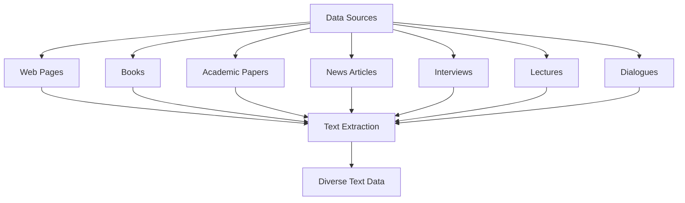

As shown in the diagram, the data collection process typically involves aggregating text data from a wide range of sources, including:

1. **Web Pages**: Crawling and extracting textual content from websites, blogs, and online articles can provide a vast and diverse corpus of natural language data.

2. **Books**: Digitized books, including fiction, non-fiction, and academic literature, offer rich and high-quality text data covering a broad range of topics and writing styles.

3. **Articles**: News articles, academic papers, and other professionally-written content can contribute to the dataset's diversity and provide well-structured, high-quality language samples.

4. **Transcripts**: Transcriptions of spoken language, such as interviews, lectures, and dialogues, can add an additional layer of linguistic complexity and natural conversational patterns to the dataset.

Once these various sources have been identified and collected, the resulting corpus should represent a diverse and comprehensive set of text data that can be used to train the LLM effectively.

It is important to note that the data collection process should be conducted with careful consideration of ethical and legal guidelines. This may involve obtaining necessary permissions, respecting intellectual property rights, and ensuring the data does not contain sensitive or personally identifiable information.

Additionally, the scale and diversity of the dataset are crucial factors in the success of the LLM training. Larger and more diverse datasets typically lead to models with greater language understanding and generation capabilities, as they expose the model to a wider range of linguistic patterns and contexts.

### 1.2. **Data Cleaning and Preprocessing**

Once the raw text data has been collected, it must undergo a rigorous cleaning and preprocessing stage to ensure the dataset is in a suitable format for training a large language model (LLM). This crucial step involves several key processes that aim to remove unwanted elements, handle noise and inconsistencies, and transform the text into a standardized representation that can be effectively utilized by the model.

Let's explore the data cleaning and preprocessing stage in more detail, accompanied by Mermaid diagrams to visualize the workflow:

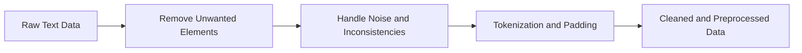

1. **Remove Unwanted Elements**:
   The first step in the data cleaning process is to remove any unwanted elements from the raw text data. This may include:
   - HTML tags: Extracting the plain text content from web pages by removing HTML tags and other markup.
   - Special characters: Removing or normalizing special characters, such as emojis, punctuation, and formatting symbols, that may not be relevant for language modeling.
   - URLs and hyperlinks: Removing or replacing web addresses and hyperlinks that do not contribute to the semantic content of the text.


2. **Handle Noise and Inconsistencies**:
   After removing the unwanted elements, the next step is to address any noise or inconsistencies in the text data. This may involve:
   - Handling misspellings and typos: Correcting or normalizing common misspellings and typographical errors to improve the overall text quality.
   - Addressing inconsistent formatting: Ensuring a consistent format for elements like capitalization, punctuation, and spacing throughout the dataset.
   - Resolving ambiguities: Identifying and resolving any ambiguities or inconsistencies in the text, such as inconsistent use of abbreviations or terminology.


3. **Tokenization and Padding**:
   The final step in the data preprocessing stage is to transform the cleaned and consistent text data into a format that can be effectively processed by the language model. This typically involves:
   - Tokenization: Splitting the text into smaller, meaningful units (tokens), such as words, subwords, or characters, based on the model's input requirements.
   - Padding: Ensuring that all input sequences have the same length by adding padding tokens to shorter sequences. This is necessary for efficient batch processing during training.

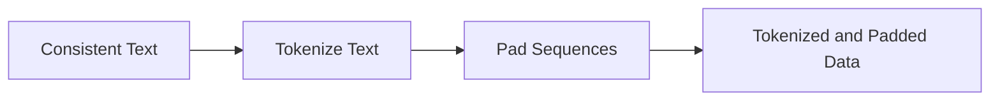

By following this structured data cleaning and preprocessing workflow, you can ensure that the raw text data is transformed into a high-quality, standardized dataset that is ready for use in the subsequent stages of LLM training. The Mermaid diagrams provide a visual representation of the key steps involved, making it easier to understand and implement this crucial preparatory process.

Remember that the specific techniques and parameters used in the data cleaning and preprocessing stage may vary depending on the characteristics of the raw data, the requirements of the language model, and the target task. Careful experimentation and evaluation are necessary to determine the optimal preprocessing pipeline for your LLM training project.

### 1.3. **Dataset Partitioning**

After the raw text data has been collected and meticulously cleaned and preprocessed, the next critical step in preparing the dataset for large language model (LLM) training is the partitioning of the data into distinct subsets. This partitioning process is essential for effectively evaluating the model's performance and guiding the iterative refinement of the training process.

Let's explore the dataset partitioning step in more detail, accompanied by Mermaid diagrams to illustrate the workflow:

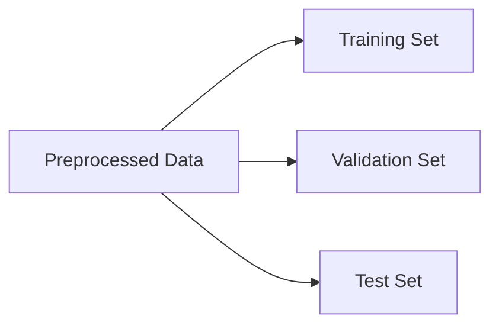

The preprocessed data is typically split into three distinct subsets:

1. **Training Set**:
   The training set is the largest portion of the dataset and is used to optimize the model's parameters during the training process. The model learns to recognize patterns and make predictions based on this training data, continuously updating its internal weights and biases to improve its performance.

2. **Validation Set**:
   The validation set is a smaller, held-out portion of the dataset that is used to monitor the model's performance during training. As the model is trained on the training set, its performance is regularly evaluated on the validation set. This validation process helps identify potential overfitting or underfitting, and guides the tuning of hyperparameters to ensure the model generalizes well.

3. **Test Set**:
   The test set is the smallest portion of the dataset and is reserved for the final evaluation of the model's generalization capabilities. Once the training and validation processes are complete, the model is evaluated on the test set to assess its overall performance on unseen data. This provides an unbiased estimate of the model's true capabilities and is crucial for determining its suitability for real-world deployment.

It is essential to ensure that there is no overlap between the training, validation, and test sets. This is to prevent the model from inadvertently learning features specific to the validation or test sets, which could lead to overly optimistic performance estimates and poor generalization to new, unseen data.

The distribution of the dataset across these three subsets is typically determined by the specific requirements of the project, the available data, and the desired level of rigor in the evaluation process. Common practices include allocating 60-80% of the data for the training set, 10-20% for the validation set, and 10-20% for the test set.

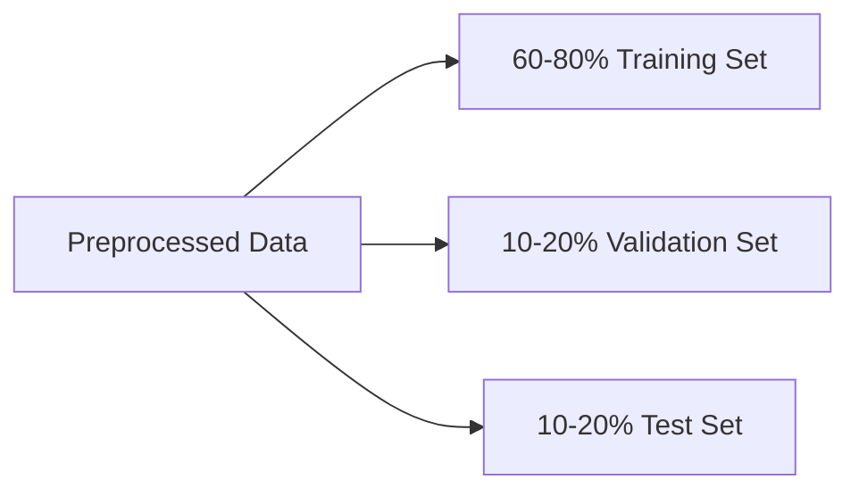

By carefully partitioning the dataset into these distinct subsets, you can ensure that the training, validation, and testing processes are carried out in a systematic and unbiased manner. This, in turn, helps to guarantee the reliability and generalizability of the trained LLM, making it a crucial step in the overall data preparation workflow.

Remember that the specific partitioning ratios and techniques may need to be adjusted based on the characteristics of the dataset, the complexity of the target task, and the available computational resources. Ongoing monitoring and refinement of the dataset partitioning strategy are often necessary to achieve the best possible model performance.


## 2. **Model Architecture Design**
### 2.1. **Neural Network Type**

The choice of neural network architecture is a pivotal decision in the development of large language models (LLMs), as it directly impacts the model's performance and capabilities. LLMs have been successfully implemented using a variety of neural network architectures, each with its own unique strengths and trade-offs. Understanding the characteristics of these different architectures and how they align with the specific requirements of the target task and available computational resources is essential for designing an effective and efficient LLM.

Let's explore the key neural network architectures used in LLM development, accompanied by Mermaid diagrams to illustrate their structures:

1. **Transformer Models**:
   Transformer models, such as the groundbreaking GPT and BERT architectures, have emerged as the dominant choice for many LLM implementations. Transformer models are characterized by their use of attention mechanisms, which allow the model to selectively focus on relevant parts of the input sequence when generating output. This enables the capture of long-range dependencies and improves the model's overall language understanding and generation capabilities.

   ```mermaid
   graph LR
       A[Input Sequence] --> B[Transformer Encoder]
       B --> C[Transformer Decoder]
       C --> D[Output Sequence]
   ```

2. **Recurrent Neural Networks (RNNs)**:
   Recurrent neural networks, such as Long Short-Term Memory (LSTMs) and Gated Recurrent Units (GRUs), are another type of neural network architecture used in LLMs. RNNs process input sequences in a sequential manner, maintaining a hidden state that allows them to capture contextual information and dependencies over time. While RNNs have been widely used in language modeling, they can struggle with long-range dependencies compared to transformer models.

   ```mermaid
   graph LR
       A[Input Sequence] --> B[RNN Cell]
       B --> C[RNN Cell]
       C --> D[RNN Cell]
       D --> E[Output Sequence]
   ```

3. **Hybrid Architectures**:
   Some LLM approaches combine different neural network components, leveraging the strengths of multiple architectures. For example, a hybrid model might use a transformer-based encoder to capture contextual information and a recurrent neural network-based decoder to generate the output sequence. This combination can result in improved performance on specific tasks or better balance between language understanding and generation capabilities.

   ```mermaid
   graph LR
       A[Input Sequence] --> B[Transformer Encoder]
       B --> C[RNN Decoder]
       C --> D[Output Sequence]
   ```

The selection of the neural network architecture for an LLM should be guided by the specific requirements of the target task and the available computational resources. Some key considerations include:

- **Task Requirements**: Certain neural network architectures may be better suited for specific language modeling tasks, such as question answering, text generation, or language translation. Understanding the strengths and weaknesses of each architecture can help you choose the most appropriate option for your use case.

- **Computational Resources**: Transformer models, while highly effective, can be computationally intensive and require significant GPU resources for training and inference. RNNs, on the other hand, may be more efficient in terms of memory usage and inference speed, making them a viable choice for resource-constrained environments.

- **Model Complexity and Scalability**: The choice of neural network architecture can also impact the overall complexity and scalability of the LLM. Simpler architectures may be easier to train and maintain, while more complex models can potentially capture more nuanced language patterns but may require careful optimization and tuning.

By thoroughly understanding the characteristics of different neural network architectures and aligning them with the specific requirements of your LLM project, you can make an informed decision that maximizes the model's performance, efficiency, and suitability for the target task.

Remember that the field of LLM development is rapidly evolving, and new and innovative neural network architectures are continuously emerging. Staying up-to-date with the latest research and advancements in the field can help you make the most informed choices for your LLM project.

### 2.2. **Model Size and Depth**

In the development of large language models (LLMs), determining the optimal model size and depth is a crucial and intricate decision that directly impacts the model's performance, training efficiency, and generalization capabilities. The number and size of layers, the dimensionality of the embeddings and hidden states, and other key architectural parameters must be carefully balanced to create a model that can effectively capture the complexities of language while maintaining reasonable computational requirements.

Let's dive into the intricacies of model size and depth, accompanied by Mermaid diagrams to illustrate the different model architectures:

**Model Depth**:
The depth of the model, i.e., the number of layers, plays a significant role in its ability to learn and represent complex language patterns. Deeper models, with more layers, have the potential to capture more intricate relationships and hierarchical structures within the input data.

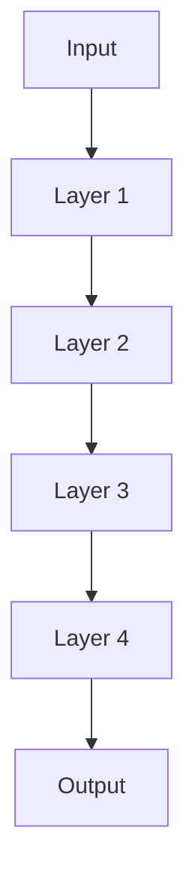

Deeper models, like the one depicted above, can learn more complex representations, but they also require more computational resources for training and inference. Excessive depth can lead to optimization challenges, such as vanishing or exploding gradients, and may increase the risk of overfitting, where the model performs well on the training data but fails to generalize to new, unseen examples.

**Model Width**:
The width of the model, i.e., the dimensionality of the embeddings and hidden states, also plays a crucial role in the model's performance. Wider models, with higher-dimensional embeddings and hidden states, can capture more information and nuance in the input data, potentially leading to improved language understanding and generation capabilities.

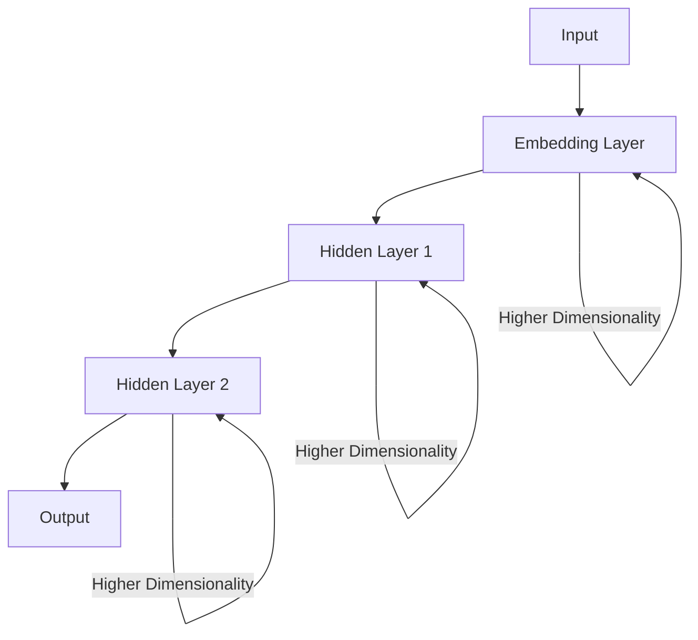

However, increasing the model width also comes with a trade-off in terms of computational resources and training efficiency. Wider models require more memory and computational power, which can make training and deployment more challenging, especially in resource-constrained environments.

**Balancing Model Complexity**:
The ultimate goal is to find the sweet spot between model depth, width, and complexity that maximizes the model's performance while maintaining reasonable training and inference times. This requires careful experimentation and iterative refinement, as shown in the diagram below:

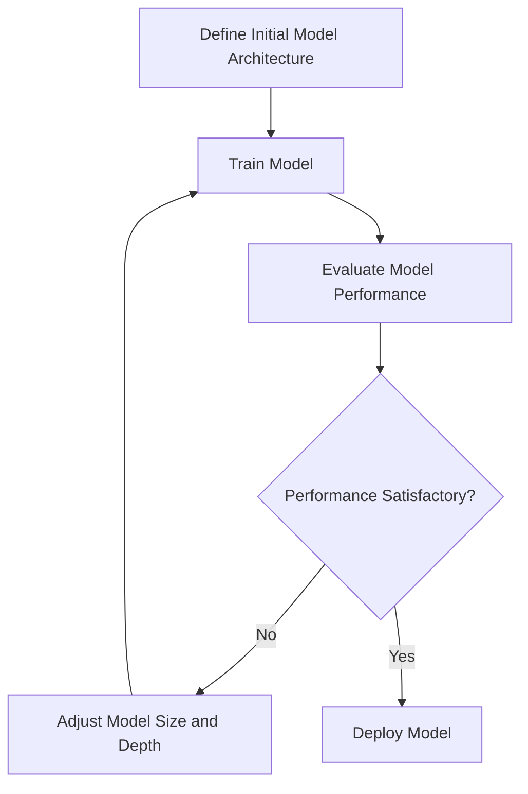

During this iterative process, you may start with a relatively simple model architecture and gradually increase the depth and width, monitoring the model's performance on both the training and validation sets. As the model complexity increases, you must be vigilant for signs of overfitting, such as a widening gap between training and validation set performance.

Techniques like regularization, layer-wise adaptive rates, and network pruning can be employed to help maintain a balance between model complexity and generalization. Additionally, leveraging techniques like transfer learning, where a pre-trained model is fine-tuned on the target task, can help reduce the overall model size and depth requirements.

Ultimately, the optimal model size and depth will depend on the specific characteristics of the dataset, the complexity of the target task, and the available computational resources. Careful experimentation, measurement, and iterative refinement are essential to striking the right balance and creating a highly-performant and efficient LLM.

Remember that the field of LLM development is rapidly evolving, and new techniques and approaches for addressing model size and depth challenges are continuously emerging. Staying up-to-date with the latest research and best practices in this area can help you make informed decisions and optimize the performance of your LLM.

### 2.3. **Attention Mechanisms**

Attention mechanisms have emerged as a pivotal component in the architecture of many successful large language models (LLMs), revolutionizing the way these models process and comprehend language. These mechanisms enable the model to selectively focus on the most relevant parts of the input, allowing it to capture long-range dependencies and significantly improve its overall language understanding capabilities.

To better understand the importance and inner workings of attention mechanisms, let's dive into a detailed exploration of this concept, using analogies and diagrams to illustrate the key principles.

Imagine you're in a crowded room, trying to have a conversation with someone. As you listen to them speak, your attention naturally shifts between different parts of their speech, focusing on the words and phrases that are most relevant to the context of your discussion. You might hone in on specific keywords, pick up on subtle cues, and even anticipate the direction of the conversation based on your understanding of the topic. This selective focus is the essence of attention mechanisms in LLMs.

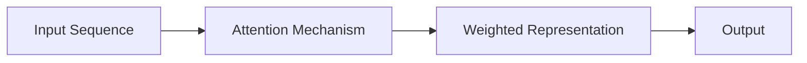

In the context of LLMs, the attention mechanism acts as a gatekeeper, determining which parts of the input sequence should be weighted more heavily when generating the output. This is achieved through a series of mathematical operations that compute the relevance of each input element to the current output being generated.

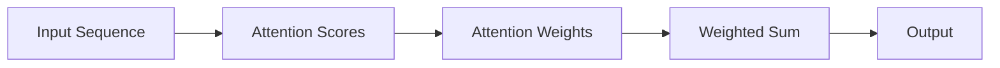

The attention scores are calculated by comparing the current output (or hidden state) with each input element, using techniques such as dot-product attention or scaled dot-product attention. These scores represent the level of relevance or importance that the model assigns to each input element for the current output generation task.

The attention weights are then derived from the attention scores, typically using a softmax function, which converts the scores into a probability distribution. These weights are then used to compute a weighted sum of the input elements, effectively focusing the model's "attention" on the most relevant parts of the input sequence.

This selective focusing ability is particularly powerful in the context of language modeling, where long-range dependencies and complex relationships between words and phrases are crucial for accurate understanding and generation. By leveraging attention mechanisms, LLMs can capture these intricate linguistic patterns more effectively, leading to substantial improvements in tasks such as question answering, text summarization, and machine translation.

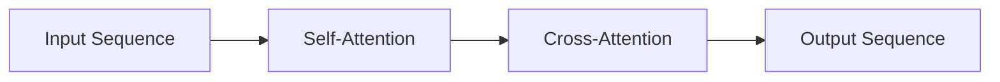

Two specific types of attention mechanisms that have been widely adopted in LLM architectures are self-attention and cross-attention. Self-attention allows the model to attend to different parts of the input sequence, while cross-attention enables the model to focus on the relevant parts of a separate input, such as when generating a translation based on a source language input.

By incorporating these attention mechanisms, LLMs can effectively capture long-range dependencies, model complex contextual relationships, and generate more coherent and relevant output, making them a driving force in the field of natural language processing.

To illustrate the power of attention mechanisms, consider a scenario where an LLM is tasked with answering the question "Who was the first president of the United States?" Rather than simply looking for the term "first president" in the input text, the attention mechanism would allow the model to focus on the relevant parts of the input that contain information about the founding of the United States and the identity of its early leaders. This selective focus enables the model to provide a more accurate and contextually appropriate answer.

Through the use of analogies, diagrams, and step-by-step explanations, we have explored the fundamental importance of attention mechanisms in the architecture of successful LLMs. By selectively focusing on the most relevant parts of the input, these mechanisms empower LLMs to understand and generate language with greater accuracy, nuance, and contextual awareness – a critical advantage in the rapidly evolving field of natural language processing.

### 2.4. **Regularization Techniques**

In the development of large language models (LLMs), ensuring the model's ability to generalize and perform well on unseen data is of paramount importance. This is where the strategic application of regularization techniques becomes crucial. These techniques help prevent overfitting, stabilize the training process, and enhance the model's robustness, ultimately leading to improved performance and real-world applicability.

To better understand the role and impact of regularization techniques, let's dive into a detailed exploration, using analogies, examples, and diagrams to illustrate their significance.

Imagine you're training a talented pianist to perform a piece of music. The pianist's natural talent and dedication might allow them to excel at playing the piece during practice sessions. However, if the pianist becomes too focused on memorizing the piece note-for-note, they may struggle to adapt and perform well when faced with minor variations in the music or a different piano. This is akin to overfitting in the context of LLMs.

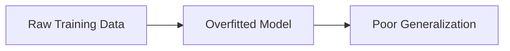

Just as the pianist needs to develop a deeper understanding of musical theory and the ability to improvise, LLMs require regularization techniques to prevent them from becoming overly specialized and unable to generalize to new, unseen data.

One of the most widely used regularization techniques in LLM training is **Dropout**. Imagine a pianist practicing with a metronome that randomly turns off certain beats. This forces the pianist to develop a more robust sense of rhythm and timing, making them less reliant on the predictable metronome. Similarly, dropout randomly "turns off" or ignores certain neural connections during the training process, preventing the model from overly relying on specific patterns in the data.

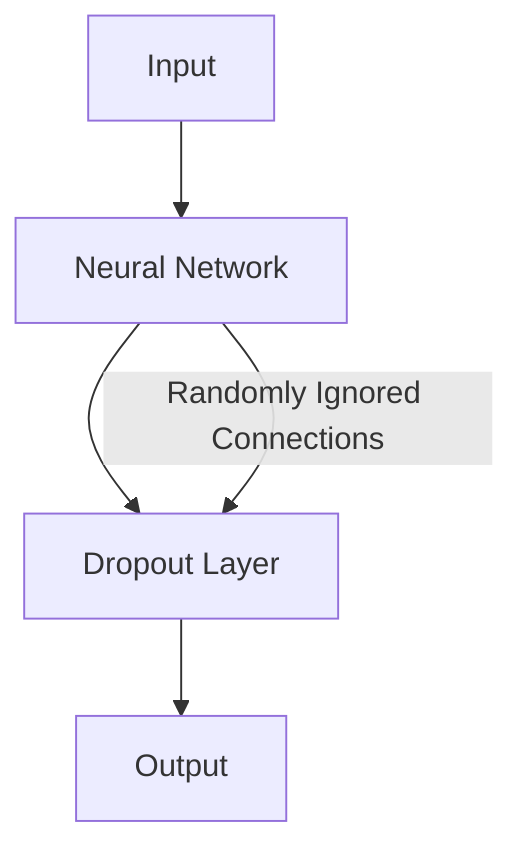

Another important regularization technique is **Layer Normalization**. This is akin to a pianist maintaining proper posture and technique, regardless of the volume or tempo of the music. Layer normalization ensures that the activations within the neural network remain centered and have a consistent scale, helping to stabilize the training process and improve generalization.

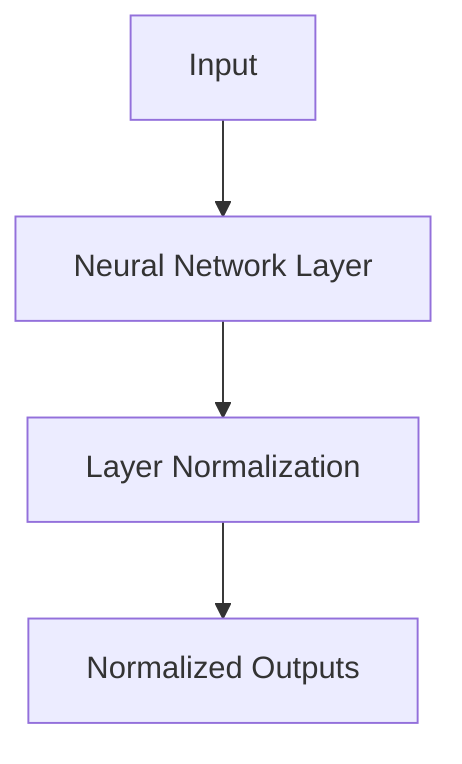

Finally, **Weight Decay**, also known as L2 regularization, can be likened to a pianist maintaining a consistent practice routine and avoiding overexertion. This technique adds a penalty term to the loss function, encouraging the model to learn smaller, more generalizable weights, rather than relying on overly complex or specialized parameters.

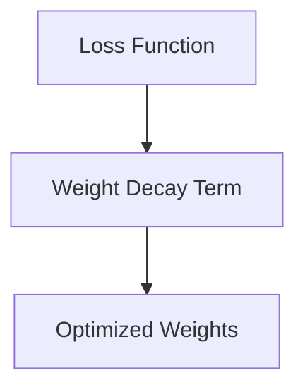

By incorporating these regularization techniques into the training process, LLMs can develop a more robust understanding of language patterns, better generalize to new contexts, and maintain stable and reliable performance, even in the face of diverse and challenging inputs.

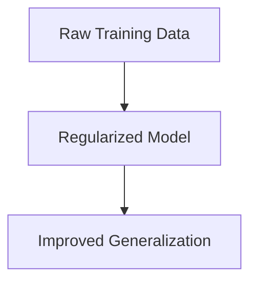

It's important to note that the specific regularization techniques and their hyperparameters may need to be tuned and adjusted based on the characteristics of the dataset, the complexity of the target task, and the architecture of the LLM. Careful experimentation and evaluation are necessary to find the optimal combination of regularization methods that will help the model achieve the desired level of generalization and robustness.

Just as a skilled pianist practices with intention, adjusting their technique and mindset to perform at their best, LLM developers must thoughtfully apply regularization techniques to create models that can truly excel in the real world, adaptable to a wide range of linguistic challenges and contexts.


[Training LLM from Scratch](Training LLM from Scratch)