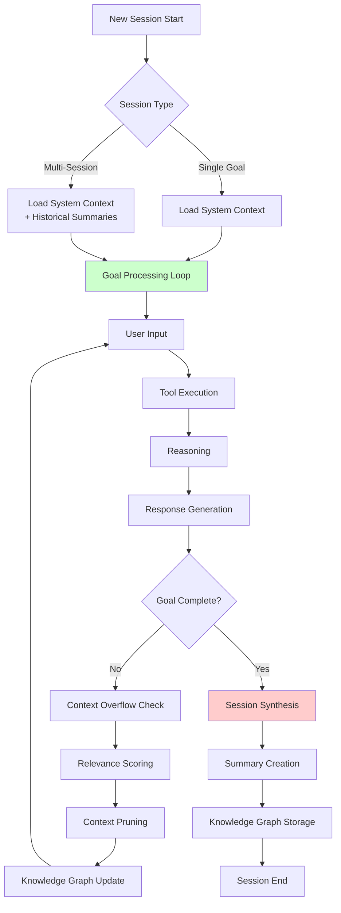
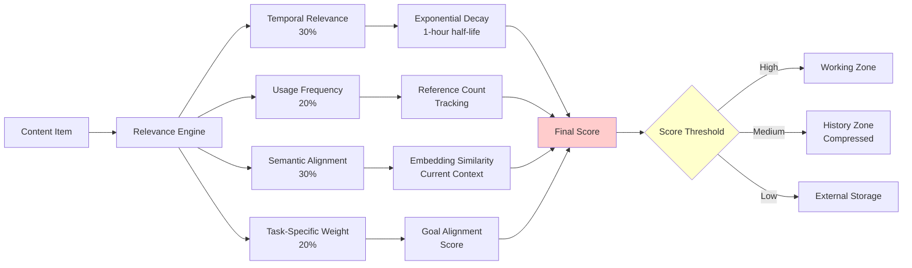
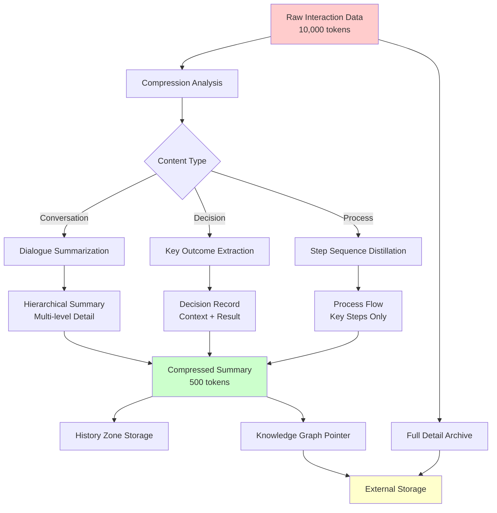
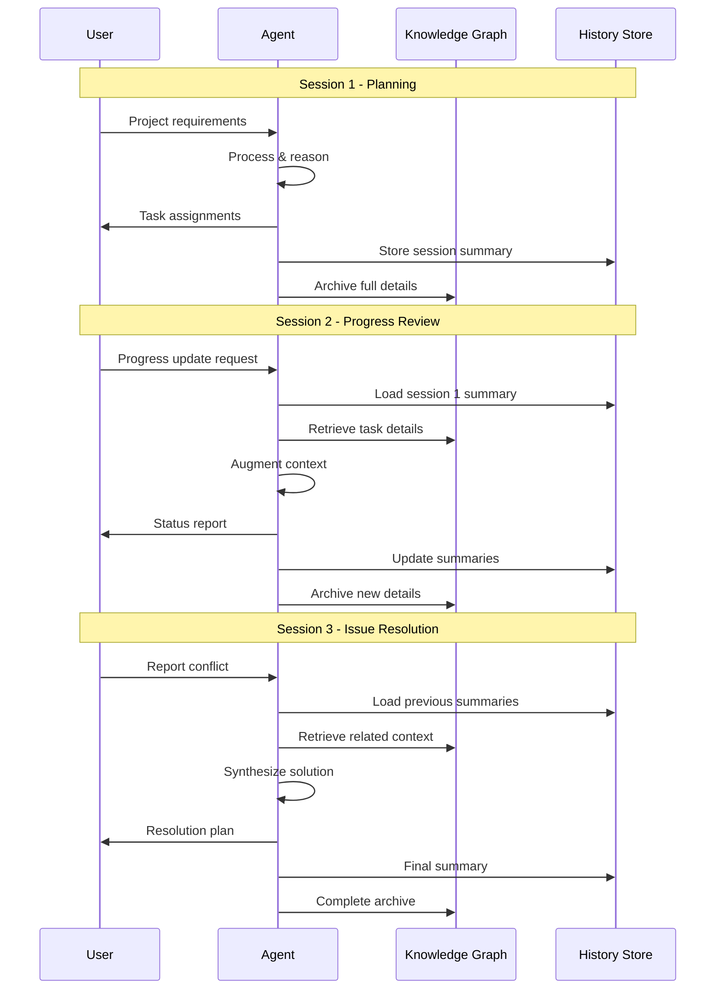
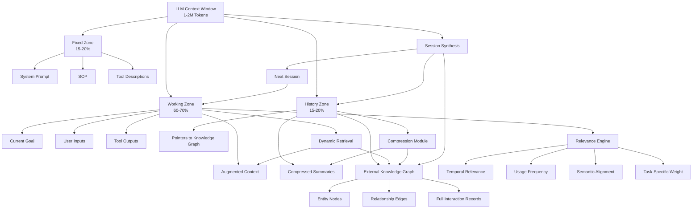
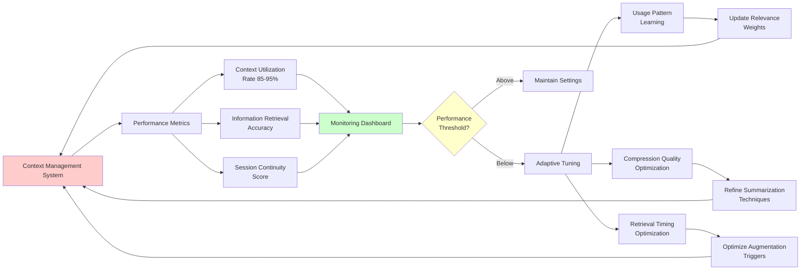

# ContextFlow: Intelligent Context Management Framework for LLM-Based AI Agents

**Author:** Raphaël MANSUY  
**Date:** June 29, 2025  
**Tags:** AI Agents, LLM, Context Management, ContextFlow, Technical Framework, Implementation  
**Difficulty:** 🔴 Advanced  
**Reading Time:** 25 minutes

---

## Abstract

Large Language Model (LLM)-based AI agents operate within strict technical constraints, notably fixed context windows of 1-2 million tokens and inference caching systems that continuously append data. These limitations create a core challenge: preserving comprehensive historical context while ensuring optimal performance for immediate tasks. This article presents a detailed, systematic framework for context management, integrating hierarchical context organization, intelligent relevance scoring, external knowledge graph storage, dynamic retrieval, progressive compression, and cross-session continuity. Enhanced with a Mermaid diagram for visual clarity and practical examples of agent sessions, this framework addresses both single-session and multi-session workflows, ensuring efficient context utilization and robust decision-making continuity. By treating context as an active curation process, we enable AI agents to balance institutional memory with operational efficiency, unlocking their potential for complex, evolving tasks.

---

## Introduction

LLM-based AI agents are at the forefront of intelligent systems, handling tasks from customer support to project management. However, their ability to maintain contextual awareness is constrained by fixed token windows and the continuous influx of new data from user interactions, tool outputs, and internal reasoning. Unlike human memory, which selectively recalls relevant details from vast experience, AI agents must operate within a finite context—typically 1-2 million tokens—while preserving critical historical information for decision-making.

The central question is: **How can AI agents effectively manage context to retain relevant historical data while maintaining optimal performance?** Traditional approaches, such as truncating old data or naively summarizing conversations, often discard valuable insights or fail to capture nuanced relationships between past and present information. This article proposes a comprehensive framework to address this challenge, combining structured context management, intelligent prioritization, external storage, and dynamic augmentation. We include a Mermaid diagram to illustrate the architecture and provide detailed examples of agent sessions to demonstrate practical application.

The framework is designed for both single-session tasks (e.g., resolving a customer query) and multi-session workflows (e.g., ongoing project management), ensuring continuity and efficiency. By treating context management as an active, adaptive process, we enable AI agents to emulate human-like contextual awareness within technical constraints.

---

## The Context Management Challenge

### Core Constraints

LLM-based AI agents face three fundamental limitations that shape context management strategies:

1. **Fixed Context Windows**: Most LLMs are limited to 1-2 million tokens, creating a hard boundary for information retention. This finite space must accommodate all necessary data for task execution, from system instructions to conversation history.

2. **Inference Caching Systems**: These systems continuously append new information—user inputs, tool responses, and reasoning outputs—causing rapid context bloat. Without intervention, valuable historical data is pushed out to make room for new content.

3. **Multi-Session Continuity**: Agents must maintain awareness of past sessions while addressing current goals. For example, a customer service agent needs to recall prior support tickets to provide consistent, informed responses.

### The Context Composition Problem

The agent's context window must balance three competing information types:

- **System Foundation**: Immutable instructions, including the agent's role, behavioral guidelines, and tool descriptions. This data is critical for consistent operation but consumes fixed space.

- **Active Working Memory**: Dynamic data for current tasks, such as recent user inputs, tool outputs, and goal-specific information. This requires the most space for operational flexibility.

- **Historical Context**: Summaries of past interactions, key decisions, and relationship mappings. This preserves institutional memory but risks being truncated under token constraints.

As agents progress through operational cycles, these components compete for limited space, creating a tension that demands strategic management.

### Agent Lifecycle

AI agents operate in two primary modes:

1. **Single Goal**: The agent receives a goal, processes it through iterative loops (retrieving information, reasoning, and generating outputs), and delivers a solution. Example: Answering a one-off technical support query.

2. **Multi-Session**: The agent handles a sequence of goals across sessions, each building on prior interactions. Example: Managing a long-term project with multiple milestones.

Both modes require efficient context management to ensure relevant information is accessible without overwhelming the token limit.



---

## Strategic Framework for Context Optimization

To address these challenges, we propose a six-pronged framework for context management, designed to maximize efficiency and preserve historical context. Below, we detail each strategy, followed by a Mermaid diagram and practical examples.

### 1. Hierarchical Context Architecture

Rather than treating the context window as a single, undifferentiated space, we propose a three-zone architecture to prioritize information access and retention:

#### Fixed Zone (15-20% of context, ~200,000-400,000 tokens)

- Contains immutable system prompts, standard operating procedures (SOP), role definitions, behavioral guidelines, and tool descriptions.
- Ensures consistent agent behavior and capability access across all interactions.
- **Example**: A customer service agent's SOP might include guidelines for tone, escalation protocols, and tool access (e.g., CRM system queries).

#### Working Zone (60-70% of context, ~900,000-1,400,000 tokens)

- Accommodates dynamic data for current tasks, including user inputs, tool outputs, intermediate reasoning, and goal-specific information.
- Provides flexibility for real-time processing and decision-making.
- **Example**: In a project management session, this zone holds the latest meeting notes, task assignments, and stakeholder feedback.

#### History Zone (15-20% of context, ~200,000-400,000 tokens)

- Stores compressed summaries of past interactions, key decisions, and pointers to external storage.
- Bridges current operations with institutional memory without overwhelming the context window.
- **Example**: Summaries of prior customer interactions, with pointers to detailed records in an external database.

**Implementation:**

- Allocate token budgets dynamically based on task complexity and session type.
- Use token counters to monitor zone usage and trigger overflow management when limits are approached.

**Benefits:**

- Ensures critical instructions are always accessible.
- Maximizes space for active tasks while preserving historical context.
- Provides a structured framework for integrating other strategies.

### 2. Intelligent Relevance Scoring

To manage context bloat, we deploy a multi-factor relevance engine that continuously evaluates information based on its value to current and future tasks. The engine assigns a relevance score to each piece of content, determining whether it remains in the working zone, moves to the history zone, or is archived externally.

#### Scoring Dimensions

- **Temporal Relevance (30%)**: Applies exponential decay to prioritize recent information. For example, a decay function with a 1-hour half-life ensures data from the past hour is weighted higher than older content.

- **Usage Frequency (20%)**: Tracks how often information is referenced across sessions. Frequently accessed data (e.g., a customer's account details) is prioritized for retention.

- **Semantic Alignment (30%)**: Measures relevance to current goals using embedding-based similarity. For instance, in a technical support session, details about a specific software issue are prioritized over unrelated queries.

- **Task-Specific Weight (20%)**: Assigns higher scores to information critical to the current objective, such as unresolved issues or key decision points.

#### Scoring Formula

```text
Score = (0.3 * Recency) + (0.2 * Frequency) + (0.3 * Similarity) + (0.2 * TaskRelevance)
```

Where each dimension is normalized to [0, 1].



#### Application

- High-scoring items remain in the working zone.
- Medium-scoring items are compressed and moved to the history zone.
- Low-scoring items are archived to an external knowledge graph.

**Implementation:**

- Use a lightweight machine learning model (e.g., transformer-based embeddings) for semantic similarity.
- Track reference counts in a metadata layer for frequency scoring.
- Calibrate decay rates based on task duration (e.g., faster decay for short customer service interactions).

**Benefits:**

- Dynamically prioritizes relevant information, reducing context bloat.
- Ensures critical historical data is retained based on utility.
- Adapts to varying task requirements and session types.

### 3. External Knowledge Graph Integration

To overcome context window limitations, we implement a persistent knowledge graph that stores detailed historical information outside the LLM's context. This graph serves as an institutional memory, accessible on-demand without consuming token space.

#### Components

- **Entity-Relationship Modeling**: Captures entities (e.g., users, tasks, decisions) and their relationships in a structured graph. Each interaction adds nodes and edges, building a comprehensive knowledge base.

- **Contextual Bridging**: Maintains lightweight pointers in the history zone that link to detailed data in the graph. Pointers include metadata (e.g., timestamp, summary) for quick relevance assessment.

- **Intelligent Retrieval**: Enables dynamic querying of the graph based on current goals, user queries, or conversation context. Retrieved data is temporarily integrated into the working zone.

**Example:**
A customer service agent stores a user's support ticket history in the graph, with nodes for each ticket and edges linking related issues. A pointer in the history zone references this data, and the agent retrieves specific tickets when the user mentions a recurring problem.

**Implementation:**
- Use a graph database (e.g., Neo4j) for storage and traversal.
- Implement semantic search with embeddings for efficient retrieval.
- Limit retrieved data to 5-10% of the working zone to avoid overloading.

**Benefits:**
- Expands memory capacity beyond context window limits.
- Maintains awareness of historical data without permanent token consumption.
- Supports complex relationship mapping for informed decision-making.

### 4. Dynamic Context Augmentation

Dynamic augmentation allows the agent to temporarily expand its context with relevant historical information, integrating it into the working zone for specific tasks or queries.

#### Process

- **Query-Driven Retrieval**: Identifies relevant data from the knowledge graph using semantic similarity and goal relevance.
- **Temporary Integration**: Adds retrieved data to the working zone for the duration of its utility (e.g., a single conversation thread).
- **Automatic Cleanup**: Removes augmented data when its relevance diminishes, based on continuous scoring.

**Example:**
In a multi-session project, the agent retrieves notes from a prior meeting when a stakeholder references a past discussion. After addressing the query, the notes are removed to free up space.

**Implementation:**
- Use a retrieval module that combines keyword matching and semantic search.
- Track augmented content with unique IDs for cleanup.
- Monitor working zone usage to prevent overflow during augmentation.

**Benefits:**
- Provides on-demand access to historical context.
- Maintains context efficiency by releasing temporary data.
- Enhances responsiveness to context-dependent queries.

### 5. Progressive Information Compression

To maximize context efficiency, we employ sophisticated summarization techniques that distill historical interactions into compact, actionable insights.



#### Techniques

- **Hierarchical Summarization**: Creates summaries at multiple levels of detail, from brief overviews (e.g., "Resolved customer issue X") to comprehensive session recaps.

- **Insight Distillation**: Extracts key outcomes, decisions, and relationships, discarding redundant details. For example, a customer interaction might be summarized as "User reported bug in version 2.3; advised update to 2.4."

- **Lossless Pointers**: Links compressed summaries to full details in the knowledge graph, enabling retrieval if needed.

**Example:**
A 10,000-token customer support transcript is compressed into a 500-token summary capturing the issue, resolution, and follow-up actions, with a pointer to the full transcript.

**Implementation:**
- Use abstractive summarization models (e.g., fine-tuned LLMs) for insight distillation.
- Store summaries in the history zone with metadata for retrieval.
- Validate compression quality by monitoring downstream task performance.

**Benefits:**
- Reduces token usage while preserving essential information.
- Supports efficient storage of historical context.
- Enables selective detail retrieval when needed.

### 6. Cross-Session Continuity

To ensure seamless information transfer across sessions, we implement mechanisms for synthesizing and loading relevant historical context.



#### Mechanisms

- **Session Synthesis**: Generates comprehensive summaries at session end, capturing key outcomes, unresolved issues, and context for future reference.

- **Continuity Mapping**: Identifies relationships between sessions (e.g., same user, related goals) to surface relevant history.

- **Adaptive Loading**: Selectively integrates historical summaries into new context windows based on user identity, goal similarity, or task continuity.

**Example:**
A project management agent summarizes a planning session, noting assigned tasks and deadlines. In the next session, it loads this summary for a stakeholder requesting updates.

**Implementation:**
- Use session metadata (e.g., user ID, task category) for continuity mapping.
- Prioritize summaries with high relevance scores for loading.
- Limit loaded summaries to 10-15% of the working zone.

**Benefits:**
- Preserves institutional memory across sessions.
- Enhances decision-making consistency.
- Reduces manual context reconstruction by users.

---

## Mermaid Diagram: Context Management Architecture

The following Mermaid diagram illustrates the hierarchical context architecture and its integration with external storage and dynamic processes.



**Explanation:**
- The LLM Context Window is divided into three zones: Fixed, Working, and History.
- The Fixed Zone holds static instructions, ensuring consistent behavior.
- The Working Zone manages dynamic task data, augmented by the Relevance Engine and Dynamic Retrieval.
- The History Zone stores summaries and pointers, linked to the External Knowledge Graph for scalable storage.
- The Compression Module distills data for efficiency, while Session Synthesis ensures continuity across sessions.

---

## Implementation Architecture

Below, we provide a Python-based implementation outline for key components of the framework, focusing on context zone management, relevance scoring, knowledge graph integration, and dynamic retrieval. These snippets are illustrative, designed to guide practical development.

### Context Zone Management

This module manages the three context zones, enforcing token limits and handling overflow.

```python
import uuid
from datetime import datetime

class ContextManager:
    def __init__(self, total_tokens=1500000):
        self.total_tokens = total_tokens
        self.zones = {
            'fixed': {'content': [], 'max_tokens': int(total_tokens * 0.2), 'tokens': 0},
            'working': {'content': [], 'max_tokens': int(total_tokens * 0.65), 'tokens': 0},
            'history': {'content': [], 'max_tokens': int(total_tokens * 0.15), 'tokens': 0}
        }
        self.relevance_engine = RelevanceEngine()
        self.knowledge_graph = KnowledgeGraph()

    def add_content(self, content, zone='working'):
        content.token_count = self._estimate_tokens(content.text)
        if self.zones[zone]['tokens'] + content.token_count > self.zones[zone]['max_tokens']:
            self._manage_overflow(zone)
        self.zones[zone]['content'].append(content)
        self.zones[zone]['tokens'] += content.token_count

    def _manage_overflow(self, zone):
        if zone == 'working':
            scored_content = [(item, self.relevance_engine.score(item)) 
                             for item in self.zones[zone]['content']]
            scored_content.sort(key=lambda x: x[1])  # Sort by score, lowest first
            while self.zones[zone]['tokens'] > self.zones[zone]['max_tokens'] * 0.9:
                item, _ = scored_content.pop(0)
                compressed = self._compress_item(item)
                self.zones['history']['content'].append(compressed)
                self.zones['history']['tokens'] += compressed.token_count
                self.zones[zone]['content'].remove(item)
                self.zones[zone]['tokens'] -= item.token_count
                self.knowledge_graph.store_interaction(item)

    def _estimate_tokens(self, text):
        return len(text.split())  # Simplified token estimation

    def _compress_item(self, item):
        summary = f"Summary of {item.id}: {item.text[:100]}..."  # Placeholder summarization
        return ContentItem(summary, token_count=self._estimate_tokens(summary))
```

### Relevance Scoring Implementation

This module calculates relevance scores for context items based on multiple factors.

```python
import math
from datetime import datetime

class RelevanceEngine:
    def __init__(self):
        self.weights = {
            'recency': 0.3,
            'frequency': 0.2,
            'similarity': 0.3,
            'task_relevance': 0.2
        }

    def score(self, content, current_context=None, current_goal=None):
        scores = {
            'recency': self._calculate_recency_score(content.timestamp),
            'frequency': self._calculate_frequency_score(content.reference_count),
            'similarity': self._calculate_similarity_score(content, current_context),
            'task_relevance': self._calculate_task_relevance(content, current_goal)
        }
        return sum(self.weights[key] * scores[key] for key in scores)

    def _calculate_recency_score(self, timestamp):
        time_elapsed = (datetime.now() - timestamp).total_seconds()
        return math.exp(-time_elapsed / 3600)  # 1-hour half-life

    def _calculate_frequency_score(self, reference_count):
        return min(reference_count / 10, 1.0)  # Normalize to [0, 1]

    def _calculate_similarity_score(self, content, current_context):
        # Placeholder: Use embedding-based cosine similarity
        return 0.8 if current_context and content.text in current_context else 0.2

    def _calculate_task_relevance(self, content, current_goal):
        # Placeholder: Keyword matching for goal relevance
        return 0.9 if current_goal and current_goal in content.text else 0.3
```

### Knowledge Graph Integration

This module manages the external knowledge graph for persistent storage and retrieval.

```python
import networkx as nx
from datetime import datetime

class KnowledgeGraph:
    def __init__(self):
        self.graph = nx.MultiDiGraph()
        self.embeddings = {}

    def store_interaction(self, interaction):
        interaction_node = f"interaction_{interaction.id}"
        self.graph.add_node(interaction_node, 
                           timestamp=interaction.timestamp,
                           summary=interaction.summary,
                           full_content_pointer=interaction.storage_path)
        entities = self._extract_entities(interaction)
        for entity in entities:
            self.graph.add_edge(interaction_node, entity, relation="involves")

    def retrieve_relevant(self, query, current_goal, max_results=5):
        relevant_nodes = self._semantic_search(query, max_results * 2)
        goal_related = self._find_goal_related_content(current_goal)
        combined_results = self._rank_and_merge(relevant_nodes, goal_related)
        return combined_results[:max_results]

    def _extract_entities(self, interaction):
        # Placeholder: Extract entities (e.g., users, tasks)
        return ["user_123", "task_456"]

    def _semantic_search(self, query, max_results):
        # Placeholder: Return nodes with high similarity
        return [node for node in self.graph.nodes][:max_results]

    def _find_goal_related_content(self, goal):
        # Placeholder: Return nodes related to goal
        return [node for node in self.graph.nodes if "task" in node]

    def _rank_and_merge(self, semantic_results, goal_results):
        # Placeholder: Combine and rank results
        return list(set(semantic_results + goal_results))
```

### Dynamic Retrieval System

This module handles temporary context augmentation and cleanup.

```python
class DynamicRetrieval:
    def __init__(self, context_manager, knowledge_graph):
        self.context_manager = context_manager
        self.knowledge_graph = knowledge_graph
        self.augmented_content = []

    def augment_context(self, query, current_goal):
        relevant_info = self.knowledge_graph.retrieve_relevant(query, current_goal)
        for info in relevant_info:
            augmented_item = ContentItem(info['summary'], token_count=len(info['summary'].split()))
            self.context_manager.add_content(augmented_item, 'working')
            self.augmented_content.append(augmented_item.id)

    def cleanup_augmented_content(self):
        working_zone = self.context_manager.zones['working']['content']
        self.context_manager.zones['working']['content'] = [
            item for item in working_zone 
            if item.id not in self.augmented_content
        ]
        self.context_manager.zones['working']['tokens'] = sum(item.token_count for item in working_zone)
        self.augmented_content.clear()
```

### Content Item Class

A helper class for managing context items.

```python
class ContentItem:
    def __init__(self, text, token_count=0):
        self.id = str(uuid.uuid4())
        self.text = text
        self.token_count = token_count
        self.timestamp = datetime.now()
        self.reference_count = 0
        self.summary = text[:100]  # Placeholder summary
        self.storage_path = f"storage/{self.id}"
```

---

## Example Agent Sessions

To illustrate the framework in action, we provide two detailed examples: a single-session customer service interaction and a multi-session project management workflow. Each demonstrates how the strategies work together to manage context effectively.

### Example 1: Single-Session Customer Service Interaction

**Scenario:** A customer contacts a tech support agent to resolve a software bug in version 2.3 of an application.

#### Context Setup

- **Fixed Zone**: Contains the agent's SOP (e.g., "Use polite tone, escalate unresolved issues after 15 minutes"), role definition ("Technical Support Agent"), and tool descriptions (e.g., CRM system access, bug tracker).
- **Working Zone**: Initially empty, ready to receive user inputs and tool outputs.
- **History Zone**: Contains pointers to prior customer interactions, if any.

#### Session Flow

1. **User Input**: "I'm getting an error in version 2.3 when saving files."
   - Added to the working zone (~50 tokens).
   - Relevance Engine scores it high for recency and task relevance.

2. **Tool Query**: The agent queries the bug tracker for known issues with version 2.3.
   - Tool output (~200 tokens) is added to the working zone.
   - Semantic alignment ensures the output is prioritized for the current goal.

3. **Dynamic Retrieval**: The agent checks the knowledge graph for prior interactions with this user.
   - Retrieves a summary of a previous ticket (~100 tokens) indicating the user reported a similar issue.
   - Temporarily augments the working zone with this data.

4. **Reasoning and Response**: The agent reasons that the bug is fixed in version 2.4 and advises the user to update.
   - Response (~100 tokens) is added to the working zone.
   - The augmented ticket summary is cleaned up post-response.

5. **Session Synthesis**: At session end, the interaction is summarized ("User reported bug in v2.3; advised update to v2.4") and stored in the history zone (~50 tokens).
   - Full details are archived to the knowledge graph with a pointer in the history zone.

#### Context Utilization

- **Fixed Zone**: ~200,000 tokens (static).
- **Working Zone**: Peaks at ~450 tokens during the session, well below the 900,000-token limit.
- **History Zone**: Adds ~50 tokens for the session summary, with pointers to the knowledge graph.

#### Outcome

- The agent resolves the query efficiently, leveraging historical context via dynamic retrieval.
- The context window remains lean, with compressed summaries and external storage preserving institutional memory.

### Example 2: Multi-Session Project Management Workflow

**Scenario:** A project management agent oversees a software development project across three sessions: planning, progress review, and issue resolution.

#### Context Setup

- **Fixed Zone**: Contains the agent's SOP (e.g., "Facilitate stakeholder alignment, track task progress"), role definition ("Project Management Agent"), and tool descriptions (e.g., project management software, email integration).
- **Working Zone**: Initially empty, ready for session-specific data.
- **History Zone**: Initially empty, will store session summaries and pointers.

#### Session 1: Planning

1. **User Input**: Stakeholders provide project requirements and timelines.
   - Inputs (~1,000 tokens) are added to the working zone.
   - Relevance Engine prioritizes requirements for task relevance.

2. **Tool Output**: The agent creates tasks in the project management software.
   - Task details (~500 tokens) are added to the working zone.
   - Semantic alignment ensures task data is retained.

3. **Session Synthesis**: The session is summarized ("Defined 10 tasks, set Q3 deadlines") and stored in the history zone (~100 tokens).
   - Full meeting notes are archived to the knowledge graph with a pointer.

#### Session 2: Progress Review

1. **Continuity Mapping**: The agent identifies the project from the user's ID and loads the Session 1 summary into the working zone (~100 tokens).
   - Relevance Engine scores the summary high for continuity.

2. **User Input**: Stakeholders report task progress and delays.
   - Inputs (~800 tokens) are added to the working zone.
   - Dynamic Retrieval pulls task details from the knowledge graph (~200 tokens) for context.

3. **Reasoning and Response**: The agent proposes deadline adjustments.
   - Response (~300 tokens) is added to the working zone.
   - Augmented task details are cleaned up post-response.

4. **Session Synthesis**: The session is summarized ("Adjusted deadlines for 3 tasks") and stored in the history zone (~80 tokens).
   - Details are archived to the knowledge graph.

#### Session 3: Issue Resolution

1. **Continuity Mapping**: Loads summaries from Sessions 1 and 2 (~180 tokens) based on project ID.
   - Relevance Engine prioritizes summaries for goal similarity.

2. **User Input**: A stakeholder reports a resource conflict.
   - Input (~400 tokens) is added to the working zone.
   - Dynamic Retrieval retrieves related task data (~150 tokens) from the knowledge graph.

3. **Tool Query**: The agent checks resource availability and proposes reallocation.
   - Tool output (~300 tokens) is added to the working zone.
   - Compression Module summarizes older working zone content to manage token limits.

4. **Session Synthesis**: The session is summarized ("Resolved resource conflict for task 7") and stored in the history zone (~70 tokens).
   - Details are archived to the knowledge graph.

#### Project Context Utilization

- **Fixed Zone**: ~200,000 tokens (static).
- **Working Zone**: Peaks at ~2,000 tokens per session, managed via compression and cleanup.
- **History Zone**: Accumulates ~250 tokens across sessions, with pointers to the knowledge graph.

#### Project Outcome

- The agent maintains continuity across sessions, leveraging summaries and dynamic retrieval.
- The context window remains efficient, with external storage scaling institutional memory.

---

## Performance Optimization and Monitoring

To ensure the framework's effectiveness, we track key performance indicators (KPIs) and implement adaptive tuning.



### Context Efficiency Metrics

- **Context Utilization Rate**: Measures the percentage of the context window actively contributing to performance. Target: 85-95% to balance efficiency and flexibility.

- **Information Retrieval Accuracy**: Evaluates the relevance engine's ability to retain valuable data and discard irrelevant content. Monitor false positives (retained irrelevant data) and false negatives (discarded valuable data).

- **Session Continuity Score**: Assesses how effectively the system maintains context across sessions, measured via user satisfaction and task completion rates.

### Adaptive Tuning

- **Usage Pattern Learning**: Analyzes which information types are most valuable for different tasks, refining relevance scoring weights over time.

- **Compression Quality Optimization**: Monitors summarization effectiveness, adjusting techniques to maximize information utility.

- **Retrieval Timing Optimization**: Learns optimal moments for context augmentation, minimizing overhead.

---

## Conclusion

Effective context management is critical for LLM-based AI agents to balance immediate task performance with long-term institutional memory. The proposed framework—Hierarchical Context Architecture, Intelligent Relevance Scoring, External Knowledge Graph Integration, Dynamic Context Augmentation, Progressive Information Compression, and Cross-Session Continuity—addresses the constraints of fixed context windows and inference caching systems comprehensively.

By structuring the context into zones, prioritizing information dynamically, leveraging external storage, augmenting context on-demand, compressing data efficiently, and ensuring session continuity, this framework enables agents to operate with human-like contextual awareness. The Mermaid diagram provides a clear visual representation, while the session examples demonstrate practical application in real-world scenarios.

Organizations adopting these strategies can expect enhanced decision-making consistency, improved multi-session continuity, and optimal context utilization. The key lies in treating context management as an active curation challenge, continuously adapting to task requirements and user needs. Future advancements in AI agent development will depend on such sophisticated memory systems, enabling agents to handle complex, evolving tasks with the intelligence and awareness users expect.

### Next Steps

1. **Implement Hierarchical Context Architecture**: Start with zone allocation and token management, as it forms the foundation for other strategies.
2. **Deploy Relevance Scoring**: Integrate a lightweight scoring engine, calibrating weights based on task types.
3. **Build Knowledge Graph Integration**: Set up a graph database for external storage, ensuring efficient retrieval.
4. **Monitor and Optimize**: Track KPIs and refine strategies based on performance data.

By iteratively layering these components, organizations can unlock the full potential of their AI agents, ensuring they remain efficient, contextually aware, and capable of delivering intelligent, consistent results.

---

**Related Articles:**
- [AI Agent Development Guide](../../guides/ai-agents.md)
- [Advanced AI Agent Frameworks](../../tools/ai-tools-master-directory.md#ai-agent-frameworks)
- [2025 AI Updates](../2025-ai-updates.md)

**Keywords:** AI Agents, LLM, Context Management, Memory Systems, Knowledge Graphs, Dynamic Retrieval, Performance Optimization
