# ContextFlow: Intelligent Context Management Framework for LLM-Based AI Agents

**Author:** Raphaël MANSUY  
**Date:** June 29, 2025  
**Tags:** AI Agents, LLM, Context Engineering, ContextFlow, Technical Framework, Implementation  
**Difficulty:** 🔴 Advanced  
**Reading Time:** 25 minutes

```mermaid
block-beta
    columns 1
    block:ContextEngineering
        columns 3
        block:FixedZone
            columns 1
            FZ["Fixed Zone"]
            FZPercent["15-20% of context"]
            FZTokens["~200,000-400,000 tokens"]
            space
            FZContent1["• Immutable system prompts"]
            FZContent2["• Standard operating procedures"]
            FZContent3["• Role definitions"]
            FZContent4["• Behavioral guidelines"]
            FZContent5["• Tool descriptions"]
            space
            FZPurpose["Ensures consistent agent behavior"]
            FZExample["Example: Customer service SOP"]
        end
        
        block:WorkingZone
            columns 1
            WZ["Working Zone"]
            WZPercent["60-70% of context"]
            WZTokens["~900,000-1,400,000 tokens"]
            space
            WZContent1["• Dynamic data for current tasks"]
            WZContent2["• User inputs"]
            WZContent3["• Tool outputs"]
            WZContent4["• Intermediate reasoning"]
            WZContent5["• Goal-specific information"]
            space
            WZPurpose["Provides flexibility for real-time processing"]
            WZExample["Example: Meeting notes, task assignments"]
        end
        
        block:HistoryZone
            columns 1
            HZ["History Zone"]
            HZPercent["15-20% of context"]
            HZTokens["~200,000-400,000 tokens"]
            space
            HZContent1["• Compressed summaries"]
            HZContent2["• Past interactions"]
            HZContent3["• Key decisions"]
            HZContent4["• Pointers to external storage"]
            HZContent5["• Institutional memory"]
            space
            HZPurpose["Bridges current operations with history"]
            HZExample["Example: Prior customer interactions"]
        end
    end
    
    style FixedZone fill:#FFEBEE,stroke:#E57373,stroke-width:2px,color:#C62828
    style WorkingZone fill:#E8F5E8,stroke:#4CAF50,stroke-width:2px,color:#1B5C1E
    style HistoryZone fill:#FFF8E1,stroke:#FFB300,stroke-width:2px,color:#E65100
    style FZ fill:#FFCDD2,stroke:#F44336,stroke-width:2px,color:#B71C1C
    style WZ fill:#C8E6C9,stroke:#4CAF50,stroke-width:2px,color:#1B5E20
    style HZ fill:#FFF9C4,stroke:#FFEB3B,stroke-width:2px,color:#F57F17
```



---

## Abstract

Large Language Model (LLM)-based AI agents face strict technical constraints: fixed context windows of 1-2 million tokens and inference caching systems that continuously append data. These limitations create a fundamental challenge—preserving comprehensive historical context while maintaining optimal performance for immediate tasks.

This article presents ContextFlow, a systematic framework for intelligent context management. The framework integrates six key strategies: hierarchical context organization, intelligent relevance scoring, external knowledge graph storage, dynamic retrieval, progressive compression, and cross-session continuity. Through practical examples spanning single-session and multi-session workflows, we demonstrate how treating context as an active curation process enables AI agents to balance institutional memory with operational efficiency, unlocking their potential for complex, evolving tasks.

---

## Introduction

LLM-based AI agents represent the cutting edge of intelligent systems, handling diverse tasks from customer support to project management. Yet their contextual awareness faces critical constraints: fixed token windows and continuous data influx from user interactions, tool outputs, and internal reasoning. Unlike human memory, which selectively recalls relevant details from vast experience, AI agents operate within finite contexts—typically 1-2 million tokens—while needing to preserve critical historical information for effective decision-making.

This raises a fundamental question: **How can AI agents effectively manage context to retain relevant historical data while maintaining optimal performance?** Traditional approaches fall short. Simple truncation discards valuable insights, while naive summarization fails to capture nuanced relationships between past and present information. Recent research reveals the severity of these limitations: context manipulation attacks exploit memory vulnerabilities (Patlan et al., 2025) [4], while empirical studies show that memory management significantly impacts agent behavior (Xiong et al., 2025) [7].

We propose a comprehensive solution that combines structured context management, intelligent prioritization, external storage, and dynamic augmentation. Our framework addresses both single-session tasks (resolving customer queries) and multi-session workflows (ongoing project management), ensuring continuity and efficiency. By treating context management as an active, adaptive process, we enable AI agents to achieve human-like contextual awareness within technical constraints.

---

## The Context Management Challenge

### Core Constraints

Three fundamental limitations shape how LLM-based AI agents must approach context management:

**1. Fixed Context Windows**
Most LLMs impose hard limits of 1-2 million tokens, creating absolute boundaries for information retention. This finite space must accommodate system instructions, conversation history, and all data necessary for task execution.

**2. Inference Caching Systems**
These systems continuously append new information—user inputs, tool responses, and reasoning outputs—causing rapid context bloat. Without active management, valuable historical data gets displaced by incoming content.

**3. Multi-Session Continuity Requirements**
Agents must maintain awareness of past sessions while addressing current goals. A customer service agent, for example, needs access to prior support tickets to provide consistent, informed responses.

### The Context Composition Challenge

Agent context windows must balance three competing information types, each with distinct requirements:

- **System Foundation**: Immutable instructions including role definitions, behavioral guidelines, and tool descriptions. Critical for consistent operation but consumes fixed space.

- **Active Working Memory**: Dynamic data for current tasks—recent user inputs, tool outputs, and goal-specific information. Requires maximum space allocation for operational flexibility.

- **Historical Context**: Summaries of past interactions, key decisions, and relationship mappings. Preserves institutional memory but risks displacement under token constraints.

These components compete for limited space throughout operational cycles, creating tension that demands strategic management.

### Agent Operating Modes

AI agents operate in two distinct modes, each requiring tailored context management:

**Single Goal Mode**: The agent receives a specific objective, processes it through iterative loops (information retrieval, reasoning, output generation), then delivers a solution. *Example: Resolving a one-time technical support query.*

**Multi-Session Mode**: The agent handles sequential goals across multiple sessions, with each interaction building on prior context. *Example: Managing a long-term project with evolving milestones.*

Both modes demand efficient context management to ensure relevant information remains accessible without overwhelming token limits.

#### Agent Session Flow


#### Processing Loop


#### Context Management Cycle


---

## ContextFlow: A Strategic Framework for Context Optimization

We present ContextFlow, a six-strategy framework designed to maximize context efficiency while preserving historical insights. Each strategy addresses specific aspects of the context management challenge, working together to create a comprehensive solution.

### 1. Hierarchical Context Architecture

Rather than treating context as undifferentiated space, we propose a three-zone architecture that prioritizes information access and retention. This approach builds on hierarchical memory concepts from multi-agent systems research (Zhang et al., 2025) [2] and operating system memory management principles (Kang et al., 2025) [3].


#### Fixed Zone (15-20% of context, ~200,000-400,000 tokens)

- Contains immutable system prompts, standard operating procedures (SOP), role definitions, behavioral guidelines, and tool descriptions.
- Ensures consistent agent behavior and capability access across all interactions.
- **Example**: A customer service agent's SOP might include guidelines for tone, escalation protocols, and tool access (e.g., CRM system queries).

#### Working Zone (60-70% of context, ~900,000-1,400,000 tokens)

- Accommodates dynamic data for current tasks, including user inputs, tool outputs, intermediate reasoning, and goal-specific information.
- Provides flexibility for real-time processing and decision-making.
- **Example**: In a project management session, this zone holds the latest meeting notes, task assignments, and stakeholder feedback.

#### History Zone (15-20% of context, ~200,000-400,000 tokens)

- Stores compressed summaries of past interactions, key decisions, and pointers to external storage.
- Bridges current operations with institutional memory without overwhelming the context window.
- **Example**: Summaries of prior customer interactions, with pointers to detailed records in an external database.

**Implementation Strategy:**

- Dynamically allocate token budgets based on task complexity and session type
- Monitor zone usage with token counters to trigger overflow management
- Maintain zone boundaries while allowing tactical flexibility

**Key Benefits:**

- Guarantees critical instructions remain accessible
- Maximizes space for active tasks while preserving historical context
- Provides structured foundation for additional optimization strategies

### 2. Intelligent Relevance Scoring

To combat context bloat, ContextFlow deploys a multi-factor relevance engine that continuously evaluates information value for current and future tasks. Building on the MEM1 framework by Zhou et al. (2025) [1], which demonstrated effective memory consolidation through reinforcement learning, our engine assigns relevance scores to determine whether content remains in working memory, moves to history, or transfers to external storage. This extends multi-granularity memory association techniques from Xu et al. (2025) [5] for long-term conversational agents.

#### Scoring Dimensions

- **Temporal Relevance (30%)**: Applies exponential decay to prioritize recent information. For example, a decay function with a 1-hour half-life ensures data from the past hour is weighted higher than older content.

- **Usage Frequency (20%)**: Tracks how often information is referenced across sessions. Frequently accessed data (e.g., a customer's account details) is prioritized for retention.

- **Semantic Alignment (30%)**: Measures relevance to current goals using embedding-based similarity. For instance, in a technical support session, details about a specific software issue are prioritized over unrelated queries.

- **Task-Specific Weight (20%)**: Assigns higher scores to information critical to the current objective, such as unresolved issues or key decision points.

#### Scoring Formula

```text
Score = (0.3 * Recency) + (0.2 * Frequency) + (0.3 * Similarity) + (0.2 * TaskRelevance)
```

Where each dimension is normalized to [0, 1].

#### Relevance Scoring Factors


#### Scoring Calculation


#### Score-Based Classification


#### Application

- High-scoring items remain in the working zone.
- Medium-scoring items are compressed and moved to the history zone.
- Low-scoring items are archived to an external knowledge graph.

**Implementation Strategy:**

- Deploy lightweight machine learning models (transformer-based embeddings) for semantic similarity
- Track reference counts in metadata layers for frequency scoring
- Calibrate decay rates based on task duration (faster decay for short customer interactions)

**Key Benefits:**

- Dynamically prioritizes relevant information, reducing context bloat
- Retains critical historical data based on utility rather than age
- Adapts automatically to varying task requirements and session types

### 3. External Knowledge Graph Integration

To transcend context window limitations, ContextFlow implements a persistent knowledge graph that stores detailed historical information outside the LLM's context. This graph functions as institutional memory, accessible on-demand without consuming token space. Our approach draws from hierarchical memory systems like G-Memory (Zhang et al., 2025) [2], which demonstrated effective three-tier graph hierarchies for multi-agent systems, and MemoryOS (Kang et al., 2025) [3], which applied operating system principles to AI agent memory management.

#### Components

- **Entity-Relationship Modeling**: Captures entities (e.g., users, tasks, decisions) and their relationships in a structured graph. Each interaction adds nodes and edges, building a comprehensive knowledge base.

- **Contextual Bridging**: Maintains lightweight pointers in the history zone that link to detailed data in the graph. Pointers include metadata (e.g., timestamp, summary) for quick relevance assessment.

- **Intelligent Retrieval**: Enables dynamic querying of the graph based on current goals, user queries, or conversation context. Retrieved data is temporarily integrated into the working zone.

**Example:**
A customer service agent stores a user's support ticket history in the graph, with nodes for each ticket and edges linking related issues. A pointer in the history zone references this data, and the agent retrieves specific tickets when the user mentions a recurring problem.

**Implementation Strategy:**

- Deploy graph databases (Neo4j) for storage and efficient traversal
- Implement semantic search with embeddings for intelligent retrieval
- Limit retrieved data to 5-10% of working zone to prevent overload

**Key Benefits:**

- Expands memory capacity far beyond context window limits
- Maintains historical awareness without permanent token consumption
- Supports complex relationship mapping for informed decision-making

### 4. Dynamic Context Augmentation

Dynamic augmentation enables agents to temporarily expand context with relevant historical information, integrating it into working memory for specific tasks or queries. This concept builds on spatial memory approaches from Ye (2025) [6] in the Task Memory Engine, demonstrating how robust multi-step LLM agents benefit from structured memory architectures, and incorporates dynamic memory organization principles from A-MEM (Xu et al., 2025) [13], enabling adaptive context-aware memory management through agentic decision-making.

#### Process

- **Query-Driven Retrieval**: Identifies relevant data from the knowledge graph using semantic similarity and goal relevance.
- **Temporary Integration**: Adds retrieved data to the working zone for the duration of its utility (e.g., a single conversation thread).
- **Automatic Cleanup**: Removes augmented data when its relevance diminishes, based on continuous scoring.

**Example:**
In a multi-session project, the agent retrieves notes from a prior meeting when a stakeholder references a past discussion. After addressing the query, the notes are removed to free up space.

**Implementation Strategy:**

- Deploy retrieval modules combining keyword matching and semantic search
- Track augmented content with unique IDs for systematic cleanup
- Monitor working zone usage to prevent overflow during augmentation

**Key Benefits:**

- Provides on-demand access to historical context without permanent storage
- Maintains context efficiency through automatic temporary data release
- Enhances responsiveness to context-dependent queries and references

### 5. Progressive Information Compression

To maximize context efficiency, ContextFlow employs sophisticated summarization techniques that distill historical interactions into compact, actionable insights. This compression system adapts to different content types while preserving essential information.

#### Data Compression Process


#### Compression Techniques


#### Storage Architecture


#### Techniques

- **Hierarchical Summarization**: Creates summaries at multiple levels of detail, from brief overviews (e.g., "Resolved customer issue X") to comprehensive session recaps.

- **Insight Distillation**: Extracts key outcomes, decisions, and relationships, discarding redundant details. For example, a customer interaction might be summarized as "User reported bug in version 2.3; advised update to 2.4."

- **Lossless Pointers**: Links compressed summaries to full details in the knowledge graph, enabling retrieval if needed.

**Example:**
A 10,000-token customer support transcript is compressed into a 500-token summary capturing the issue, resolution, and follow-up actions, with a pointer to the full transcript.

**Implementation Strategy:**

- Deploy abstractive summarization models (fine-tuned LLMs) for insight distillation
- Store summaries in history zone with metadata for efficient retrieval
- Validate compression quality by monitoring downstream task performance

**Key Benefits:**

- Reduces token usage while preserving essential information
- Supports efficient storage of extensive historical context
- Enables selective detail retrieval when comprehensive information is needed

### 6. Cross-Session Continuity

To ensure seamless information transfer across sessions, ContextFlow implements comprehensive mechanisms for synthesizing and loading relevant historical context. This approach incorporates insights from recent work on reflective memory management for personalized dialogue agents (Tan et al., 2025) [9], collaborative memory sharing with dynamic access control (Rezazadeh et al., 2025) [8], and validation frameworks for multi-agent planning like SagaLLM (Chang & Geng, 2025) [12].


#### Mechanisms

- **Session Synthesis**: Generates comprehensive summaries at session end, capturing key outcomes, unresolved issues, and context for future reference.

- **Continuity Mapping**: Identifies relationships between sessions (e.g., same user, related goals) to surface relevant history.

- **Adaptive Loading**: Selectively integrates historical summaries into new context windows based on user identity, goal similarity, or task continuity.

**Example:**
A project management agent summarizes a planning session, noting assigned tasks and deadlines. In the next session, it loads this summary for a stakeholder requesting updates.

**Implementation Strategy:**

- Use session metadata (user ID, task category) for intelligent continuity mapping
- Prioritize summaries with high relevance scores for context loading
- Limit loaded summaries to 10-15% of working zone to maintain efficiency

**Key Benefits:**

- Preserves institutional memory across multiple sessions
- Enhances decision-making consistency through historical awareness
- Reduces manual context reconstruction burden on users

---

## ContextFlow Architecture Overview

The following diagrams illustrate how ContextFlow's components integrate to create a comprehensive context management system. The architecture balances immediate operational needs with long-term memory requirements through coordinated zone management, intelligent scoring, and external storage integration.

### Context Window Structure


### Working Zone Components


### External Storage Integration


### Dynamic Operations


**Architecture Summary:**

ContextFlow divides the LLM context window into three specialized zones: Fixed, Working, and History. The Fixed Zone maintains static instructions for consistent behavior, while the Working Zone handles dynamic task data augmented by the Relevance Engine and Dynamic Retrieval systems. The History Zone stores compressed summaries and pointers, connecting to the External Knowledge Graph for scalable storage. The Compression Module optimizes data efficiency, and Session Synthesis ensures seamless continuity across multiple interactions.

---

## ContextFlow Implementation Guide

The following Python-based implementation demonstrates key ContextFlow components. These code examples provide practical guidance for building context zone management, relevance scoring, knowledge graph integration, and dynamic retrieval systems.

### Context Zone Management

This module manages the three context zones, enforcing token limits and handling overflow.

```python
import uuid
from datetime import datetime

class ContextManager:
    def __init__(self, total_tokens=1500000):
        self.total_tokens = total_tokens
        self.zones = {
            'fixed': {'content': [], 'max_tokens': int(total_tokens * 0.2), 'tokens': 0},
            'working': {'content': [], 'max_tokens': int(total_tokens * 0.65), 'tokens': 0},
            'history': {'content': [], 'max_tokens': int(total_tokens * 0.15), 'tokens': 0}
        }
        self.relevance_engine = RelevanceEngine()
        self.knowledge_graph = KnowledgeGraph()

    def add_content(self, content, zone='working'):
        content.token_count = self._estimate_tokens(content.text)
        if self.zones[zone]['tokens'] + content.token_count > self.zones[zone]['max_tokens']:
            self._manage_overflow(zone)
        self.zones[zone]['content'].append(content)
        self.zones[zone]['tokens'] += content.token_count

    def _manage_overflow(self, zone):
        if zone == 'working':
            scored_content = [(item, self.relevance_engine.score(item)) 
                             for item in self.zones[zone]['content']]
            scored_content.sort(key=lambda x: x[1])  # Sort by score, lowest first
            while self.zones[zone]['tokens'] > self.zones[zone]['max_tokens'] * 0.9:
                item, _ = scored_content.pop(0)
                compressed = self._compress_item(item)
                self.zones['history']['content'].append(compressed)
                self.zones['history']['tokens'] += compressed.token_count
                self.zones[zone]['content'].remove(item)
                self.zones[zone]['tokens'] -= item.token_count
                self.knowledge_graph.store_interaction(item)

    def _estimate_tokens(self, text):
        return len(text.split())  # Simplified token estimation

    def _compress_item(self, item):
        summary = f"Summary of {item.id}: {item.text[:100]}..."  # Placeholder summarization
        return ContentItem(summary, token_count=self._estimate_tokens(summary))
```

### Relevance Scoring Implementation

This module calculates relevance scores for context items based on multiple factors.

```python
import math
from datetime import datetime

class RelevanceEngine:
    def __init__(self):
        self.weights = {
            'recency': 0.3,
            'frequency': 0.2,
            'similarity': 0.3,
            'task_relevance': 0.2
        }

    def score(self, content, current_context=None, current_goal=None):
        scores = {
            'recency': self._calculate_recency_score(content.timestamp),
            'frequency': self._calculate_frequency_score(content.reference_count),
            'similarity': self._calculate_similarity_score(content, current_context),
            'task_relevance': self._calculate_task_relevance(content, current_goal)
        }
        return sum(self.weights[key] * scores[key] for key in scores)

    def _calculate_recency_score(self, timestamp):
        time_elapsed = (datetime.now() - timestamp).total_seconds()
        return math.exp(-time_elapsed / 3600)  # 1-hour half-life

    def _calculate_frequency_score(self, reference_count):
        return min(reference_count / 10, 1.0)  # Normalize to [0, 1]

    def _calculate_similarity_score(self, content, current_context):
        # Placeholder: Use embedding-based cosine similarity
        return 0.8 if current_context and content.text in current_context else 0.2

    def _calculate_task_relevance(self, content, current_goal):
        # Placeholder: Keyword matching for goal relevance
        return 0.9 if current_goal and current_goal in content.text else 0.3
```

### Knowledge Graph Integration

This module manages the external knowledge graph for persistent storage and retrieval.

```python
import networkx as nx
from datetime import datetime

class KnowledgeGraph:
    def __init__(self):
        self.graph = nx.MultiDiGraph()
        self.embeddings = {}

    def store_interaction(self, interaction):
        interaction_node = f"interaction_{interaction.id}"
        self.graph.add_node(interaction_node, 
                           timestamp=interaction.timestamp,
                           summary=interaction.summary,
                           full_content_pointer=interaction.storage_path)
        entities = self._extract_entities(interaction)
        for entity in entities:
            self.graph.add_edge(interaction_node, entity, relation="involves")

    def retrieve_relevant(self, query, current_goal, max_results=5):
        relevant_nodes = self._semantic_search(query, max_results * 2)
        goal_related = self._find_goal_related_content(current_goal)
        combined_results = self._rank_and_merge(relevant_nodes, goal_related)
        return combined_results[:max_results]

    def _extract_entities(self, interaction):
        # Placeholder: Extract entities (e.g., users, tasks)
        return ["user_123", "task_456"]

    def _semantic_search(self, query, max_results):
        # Placeholder: Return nodes with high similarity
        return [node for node in self.graph.nodes][:max_results]

    def _find_goal_related_content(self, goal):
        # Placeholder: Return nodes related to goal
        return [node for node in self.graph.nodes if "task" in node]

    def _rank_and_merge(self, semantic_results, goal_results):
        # Placeholder: Combine and rank results
        return list(set(semantic_results + goal_results))
```

### Dynamic Retrieval System

This module handles temporary context augmentation and cleanup.

```python
class DynamicRetrieval:
    def __init__(self, context_manager, knowledge_graph):
        self.context_manager = context_manager
        self.knowledge_graph = knowledge_graph
        self.augmented_content = []

    def augment_context(self, query, current_goal):
        relevant_info = self.knowledge_graph.retrieve_relevant(query, current_goal)
        for info in relevant_info:
            augmented_item = ContentItem(info['summary'], token_count=len(info['summary'].split()))
            self.context_manager.add_content(augmented_item, 'working')
            self.augmented_content.append(augmented_item.id)

    def cleanup_augmented_content(self):
        working_zone = self.context_manager.zones['working']['content']
        self.context_manager.zones['working']['content'] = [
            item for item in working_zone 
            if item.id not in self.augmented_content
        ]
        self.context_manager.zones['working']['tokens'] = sum(item.token_count for item in working_zone)
        self.augmented_content.clear()
```

### Content Item Class

A helper class for managing context items.

```python
class ContentItem:
    def __init__(self, text, token_count=0):
        self.id = str(uuid.uuid4())
        self.text = text
        self.token_count = token_count
        self.timestamp = datetime.now()
        self.reference_count = 0
        self.summary = text[:100]  # Placeholder summary
        self.storage_path = f"storage/{self.id}"
```

---

## ContextFlow in Action: Practical Examples

The following examples demonstrate how ContextFlow's strategies work together to manage context effectively across different scenarios. We examine both single-session and multi-session workflows, showing token utilization and strategic decision-making throughout each interaction.

### Example 1: Single-Session Customer Service Interaction

**Scenario:** A customer contacts a tech support agent to resolve a software bug in version 2.3 of an application.

#### Context Setup

- **Fixed Zone**: Contains the agent's SOP (e.g., "Use polite tone, escalate unresolved issues after 15 minutes"), role definition ("Technical Support Agent"), and tool descriptions (e.g., CRM system access, bug tracker).
- **Working Zone**: Initially empty, ready to receive user inputs and tool outputs.
- **History Zone**: Contains pointers to prior customer interactions, if any.

#### Session Flow

1. **User Input**: "I'm getting an error in version 2.3 when saving files."
   - Added to the working zone (~50 tokens).
   - Relevance Engine scores it high for recency and task relevance.

2. **Tool Query**: The agent queries the bug tracker for known issues with version 2.3.
   - Tool output (~200 tokens) is added to the working zone.
   - Semantic alignment ensures the output is prioritized for the current goal.

3. **Dynamic Retrieval**: The agent checks the knowledge graph for prior interactions with this user.
   - Retrieves a summary of a previous ticket (~100 tokens) indicating the user reported a similar issue.
   - Temporarily augments the working zone with this data.

4. **Reasoning and Response**: The agent reasons that the bug is fixed in version 2.4 and advises the user to update.
   - Response (~100 tokens) is added to the working zone.
   - The augmented ticket summary is cleaned up post-response.

5. **Session Synthesis**: At session end, the interaction is summarized ("User reported bug in v2.3; advised update to v2.4") and stored in the history zone (~50 tokens).
   - Full details are archived to the knowledge graph with a pointer in the history zone.

#### Context Utilization

- **Fixed Zone**: ~200,000 tokens (static).
- **Working Zone**: Peaks at ~450 tokens during the session, well below the 900,000-token limit.
- **History Zone**: Adds ~50 tokens for the session summary, with pointers to the knowledge graph.

#### Results Analysis

ContextFlow successfully resolves the customer query while maintaining optimal context efficiency:

- **Context Efficiency**: Working zone utilizes only 0.05% of available capacity, demonstrating excellent resource management
- **Historical Integration**: Dynamic retrieval provides relevant context without permanent token consumption  
- **Memory Preservation**: Complete interaction details archived externally while maintaining accessible summaries

### Example 2: Multi-Session Project Management Workflow

**Scenario:** A project management agent oversees a software development project across three sessions: planning, progress review, and issue resolution.

#### Initial Configuration

- **Fixed Zone**: Contains the agent's SOP (e.g., "Facilitate stakeholder alignment, track task progress"), role definition ("Project Management Agent"), and tool descriptions (e.g., project management software, email integration).
- **Working Zone**: Initially empty, ready for session-specific data.
- **History Zone**: Initially empty, will store session summaries and pointers.

#### Session 1: Planning

1. **User Input**: Stakeholders provide project requirements and timelines.
   - Inputs (~1,000 tokens) are added to the working zone.
   - Relevance Engine prioritizes requirements for task relevance.

2. **Tool Output**: The agent creates tasks in the project management software.
   - Task details (~500 tokens) are added to the working zone.
   - Semantic alignment ensures task data is retained.

3. **Session Synthesis**: The session is summarized ("Defined 10 tasks, set Q3 deadlines") and stored in the history zone (~100 tokens).
   - Full meeting notes are archived to the knowledge graph with a pointer.

#### Session 2: Progress Review

1. **Continuity Mapping**: The agent identifies the project from the user's ID and loads the Session 1 summary into the working zone (~100 tokens).
   - Relevance Engine scores the summary high for continuity.

2. **User Input**: Stakeholders report task progress and delays.
   - Inputs (~800 tokens) are added to the working zone.
   - Dynamic Retrieval pulls task details from the knowledge graph (~200 tokens) for context.

3. **Reasoning and Response**: The agent proposes deadline adjustments.
   - Response (~300 tokens) is added to the working zone.
   - Augmented task details are cleaned up post-response.

4. **Session Synthesis**: The session is summarized ("Adjusted deadlines for 3 tasks") and stored in the history zone (~80 tokens).
   - Details are archived to the knowledge graph.

#### Session 3: Issue Resolution

1. **Continuity Mapping**: Loads summaries from Sessions 1 and 2 (~180 tokens) based on project ID.
   - Relevance Engine prioritizes summaries for goal similarity.

2. **User Input**: A stakeholder reports a resource conflict.
   - Input (~400 tokens) is added to the working zone.
   - Dynamic Retrieval retrieves related task data (~150 tokens) from the knowledge graph.

3. **Tool Query**: The agent checks resource availability and proposes reallocation.
   - Tool output (~300 tokens) is added to the working zone.
   - Compression Module summarizes older working zone content to manage token limits.

4. **Session Synthesis**: The session is summarized ("Resolved resource conflict for task 7") and stored in the history zone (~70 tokens).
   - Details are archived to the knowledge graph.

#### Project Context Utilization

- **Fixed Zone**: ~200,000 tokens (static).
- **Working Zone**: Peaks at ~2,000 tokens per session, managed via compression and cleanup.
- **History Zone**: Accumulates ~250 tokens across sessions, with pointers to the knowledge graph.

#### Multi-Session Results Analysis

ContextFlow successfully manages complex multi-session workflows with sustained context awareness:

- **Session Continuity**: Seamless information transfer across three distinct sessions
- **Context Efficiency**: Working zone peaks managed through compression and cleanup strategies
- **Scalable Memory**: External storage accommodates growing project complexity without performance degradation

---

## Performance Optimization and Monitoring

To ensure the framework's effectiveness, it is essential to track key performance indicators (KPIs) and implement adaptive tuning.

### Performance Monitoring System


### Monitoring Dashboard


### Adaptive Optimization


### Context Efficiency Metrics

- **Context Utilization Rate**: Measures the percentage of the context window actively contributing to performance. Target: 85-95% to balance efficiency and flexibility.

- **Information Retrieval Accuracy**: Evaluates the relevance engine's ability to retain valuable data and discard irrelevant content. Monitor false positives (retained irrelevant data) and false negatives (discarded valuable data).

- **Session Continuity Score**: Assesses how effectively the system maintains context across sessions, measured via user satisfaction and task completion rates.

### Adaptive Tuning

- **Usage Pattern Learning**: Analyzes which information types are most valuable for different tasks, refining relevance scoring weights over time.

- **Compression Quality Optimization**: Monitors summarization effectiveness, adjusting techniques to maximize information utility.

- **Retrieval Timing Optimization**: Learns optimal moments for context augmentation, minimizing overhead.

---

## Limitations and Future Work

While ContextFlow demonstrates significant advantages in context management for LLM-based AI agents, several limitations and areas for improvement warrant discussion. Understanding these constraints is essential for practical deployment and future research directions.

### Current Limitations

#### 1. Computational Overhead

##### Relevance Engine Processing

- The multi-factor relevance scoring requires continuous evaluation of all context items, creating computational overhead proportional to context size
- Embedding-based semantic similarity calculations can introduce latency, particularly with large working zones
- Real-time scoring during active sessions may impact response times for time-sensitive applications

##### Knowledge Graph Operations

- Graph traversal and semantic search operations can introduce variable latency (50-500ms) depending on graph size and query complexity
- Concurrent read/write operations during high-frequency interactions may create bottlenecks
- Storage and indexing requirements grow linearly with interaction history, potentially affecting long-term scalability

#### 2. Memory and Storage Requirements

##### External Storage Dependencies

- Knowledge graph storage requirements can grow rapidly in high-interaction environments (estimated 1-10GB per agent per year)
- Embedding storage for semantic search adds additional overhead (~4KB per interaction summary)
- Database maintenance and backup procedures become critical for operational continuity

##### Context Zone Management Complexity

- Dynamic token allocation requires constant monitoring and adjustment, adding system complexity
- Zone boundary violations during high-activity periods may require emergency overflow handling
- Token estimation accuracy affects system performance, with estimation errors cascading through the framework

#### 3. Edge Cases and Failure Modes

##### Rapid Context Changes

- High-frequency interactions with diverse topics can overwhelm the relevance engine's ability to maintain coherent priorities
- Sudden topic shifts may result in relevant historical context being prematurely archived
- Multi-threaded conversations or parallel task handling can create context contamination

##### Knowledge Graph Inconsistencies

- Contradictory information from different sessions may create conflicting graph states
- Entity resolution failures can lead to duplicate or fragmented knowledge representation
- Temporal inconsistencies in historical data may confuse cross-session continuity mechanisms

##### Relevance Scoring Limitations

- The current scoring formula may not adapt well to domain-specific relevance patterns
- Cold start problems for new users or novel task types lack historical data for accurate scoring
- Adversarial inputs designed to manipulate relevance scores could potentially corrupt context management

#### 4. Integration and Deployment Challenges

##### Framework Dependencies

- Requires integration with graph databases (Neo4j), embedding models, and custom storage systems
- Complex deployment architecture increases maintenance overhead and potential failure points
- Version compatibility issues between LLM providers and ContextFlow components

##### Performance Variability

- Context management effectiveness varies significantly across different task types and interaction patterns
- Performance degradation in resource-constrained environments may require framework simplification
- Unpredictable latency spikes during knowledge graph queries can impact user experience

### Future Research Directions

#### 1. Adaptive Learning Systems

##### Self-Tuning Relevance Engines

- Implement reinforcement learning to automatically adjust relevance scoring weights based on task outcomes
- Develop domain-specific relevance models that adapt to different application contexts
- Create user-specific preference learning to personalize context management strategies

##### Dynamic Architecture Optimization

- Research adaptive zone sizing based on real-time workload characteristics
- Investigate hierarchical context architectures with more than three zones for complex applications
- Explore distributed context management for multi-agent collaborative systems

#### 2. Scalability Enhancements

##### Distributed Knowledge Graphs

- Develop sharding strategies for massive knowledge graphs spanning multiple agents
- Implement federated learning approaches for knowledge sharing across agent networks
- Create efficient synchronization protocols for distributed context management

##### Compression Algorithm Improvements

- Research advanced summarization techniques that preserve nuanced relationship information
- Develop lossless compression methods specifically designed for LLM context data
- Investigate progressive detail retrieval systems that load information on-demand

#### 3. Robustness and Reliability

##### Fault Tolerance Mechanisms

- Design graceful degradation strategies when external storage systems become unavailable
- Implement context reconstruction techniques for corrupted or incomplete historical data
- Develop backup context management modes for resource-constrained environments

##### Security and Privacy Enhancements

- Research privacy-preserving context management techniques for sensitive applications
- Implement access control mechanisms for shared knowledge graphs
- Develop context anonymization methods for compliance with data protection regulations

#### 4. Empirical Validation

##### Benchmark Development

- Create standardized benchmarks for context management effectiveness across different domains
- Develop metrics for measuring context coherence, relevance accuracy, and user satisfaction
- Establish performance baselines for comparison with alternative approaches

##### Large-Scale Deployment Studies

- Conduct longitudinal studies of ContextFlow performance in production environments
- Analyze the impact of different configuration parameters on real-world effectiveness
- Investigate user adaptation patterns and preference evolution over extended usage periods

### Recommended Implementation Strategy

For organizations considering ContextFlow adoption, we recommend a phased implementation approach:

1. **Pilot Phase**: Deploy with simplified configurations in low-risk environments to assess basic functionality
2. **Optimization Phase**: Tune relevance scoring weights and zone allocations based on initial usage patterns
3. **Scale Phase**: Gradually expand to production workloads while monitoring performance metrics
4. **Enhancement Phase**: Implement advanced features like adaptive learning and distributed storage

This incremental approach allows organizations to realize immediate benefits while building expertise and infrastructure for full-scale deployment.

---

## Conclusion

ContextFlow addresses the critical challenge of context management for LLM-based AI agents through a comprehensive six-strategy framework. By implementing Hierarchical Context Architecture, Intelligent Relevance Scoring, External Knowledge Graph Integration, Dynamic Context Augmentation, Progressive Information Compression, and Cross-Session Continuity, we enable agents to transcend the limitations of fixed context windows while maintaining operational efficiency.

Our framework builds upon cutting-edge research in AI agent memory systems, integrating advances in contextual memory intelligence and cognitive knowledge synthesis. Through structured zone management, dynamic information prioritization, external storage leverage, on-demand context augmentation, efficient data compression, and robust session continuity, ContextFlow enables agents to achieve human-like contextual awareness within technical constraints.

The practical examples demonstrate ContextFlow's effectiveness across diverse scenarios, from single-session customer service interactions to complex multi-session project management workflows. Performance analysis shows significant improvements in context efficiency, with working zones utilizing optimal capacity while maintaining comprehensive historical awareness through external storage integration.

While current limitations around computational overhead, storage requirements, and deployment complexity warrant consideration, the framework's modular design enables incremental adoption and continuous improvement. Future research directions in adaptive learning systems, scalability enhancements, robustness mechanisms, and empirical validation will further strengthen the framework's capabilities.

ContextFlow represents a significant advancement in AI agent context management, providing practitioners with a systematic approach to balance immediate operational needs with long-term memory requirements. As LLM-based agents become increasingly central to complex workflows, effective context management will prove essential for unlocking their full potential in real-world applications.

---

## BibTeX Citation

```bibtex
@article{mansuy2025contextflow,
  title={ContextFlow: Intelligent Context Management Framework for LLM-Based AI Agents},
  author={Mansuy, Rapha{\"e}l},
  journal={Digital Palace Technical Articles},
  year={2025},
  month={June},
  day={29},
  pages={1--25},
  keywords={AI Agents, LLM, Context Engineering, ContextFlow, Technical Framework, Implementation},
  difficulty={Advanced},
  readingtime={25 minutes},
  abstract={Large Language Model (LLM)-based AI agents face strict technical constraints: fixed context windows of 1-2 million tokens and inference caching systems that continuously append data. This article presents ContextFlow, a systematic framework for intelligent context management integrating six key strategies: hierarchical context organization, intelligent relevance scoring, external knowledge graph storage, dynamic retrieval, progressive compression, and cross-session continuity.},
  url={https://github.com/raphaelmansuy/digital_palace/blob/main/reference/technical-articles/2025-06-29-context-management-llm-agents.md}
}
```
