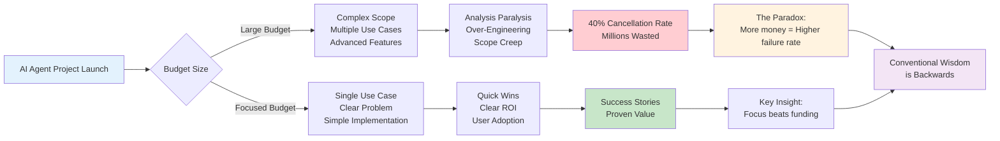
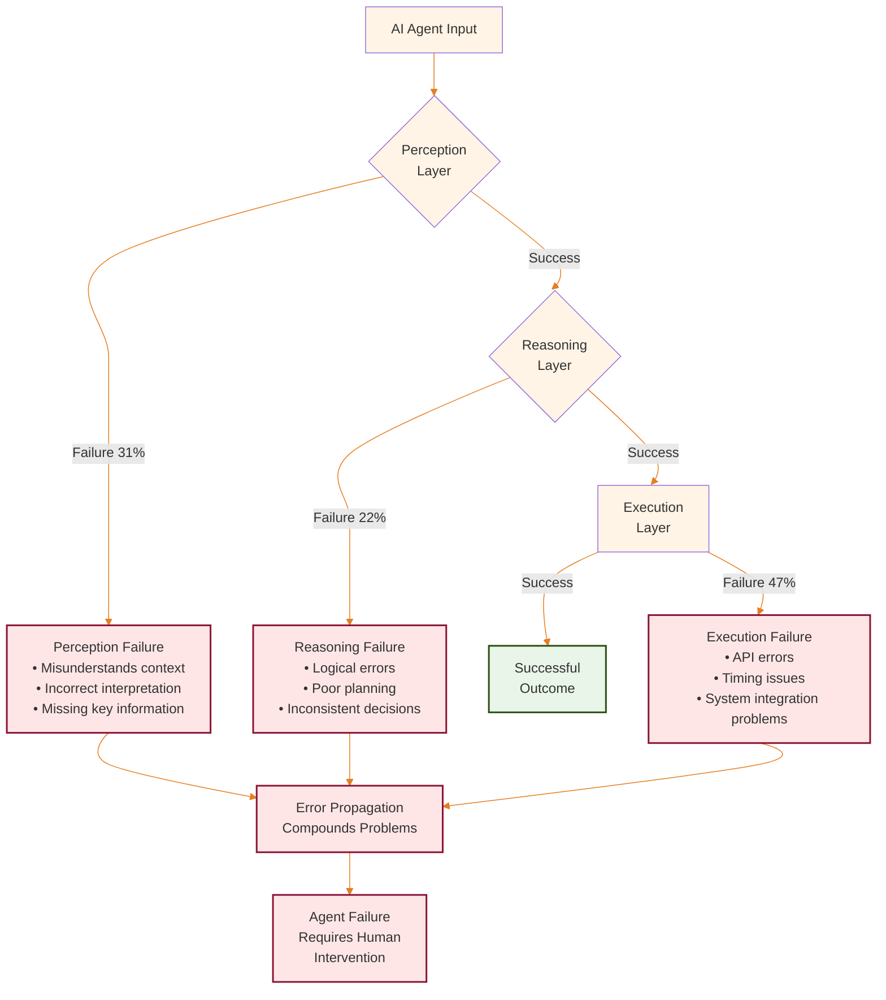
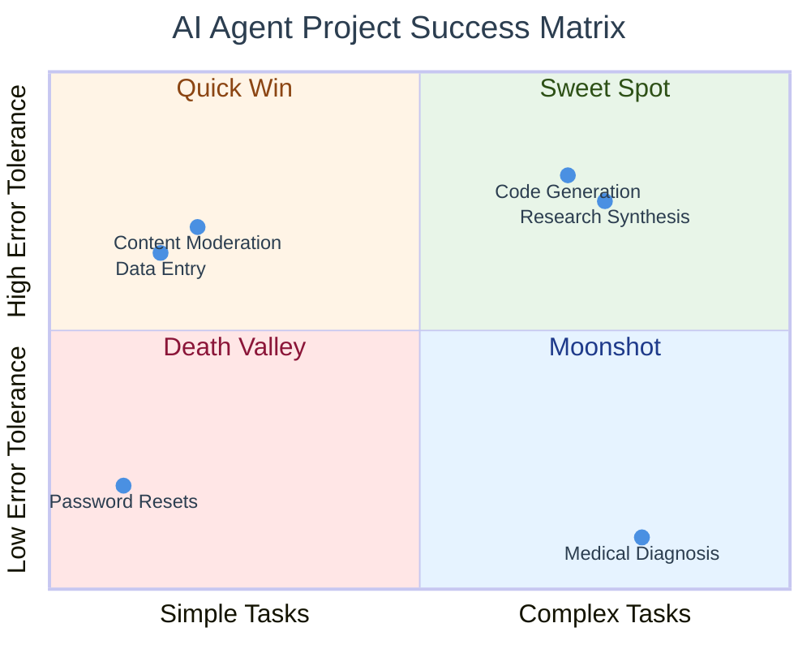
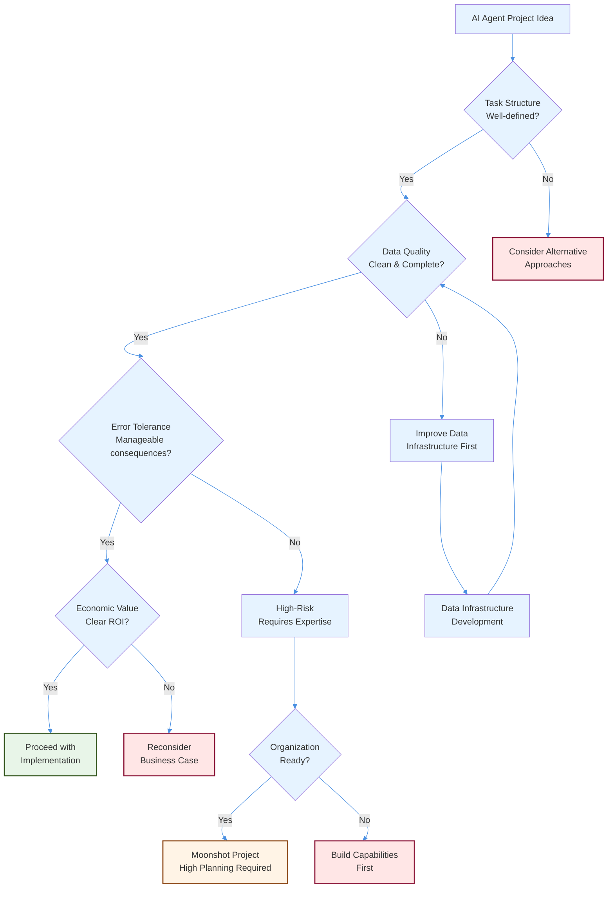
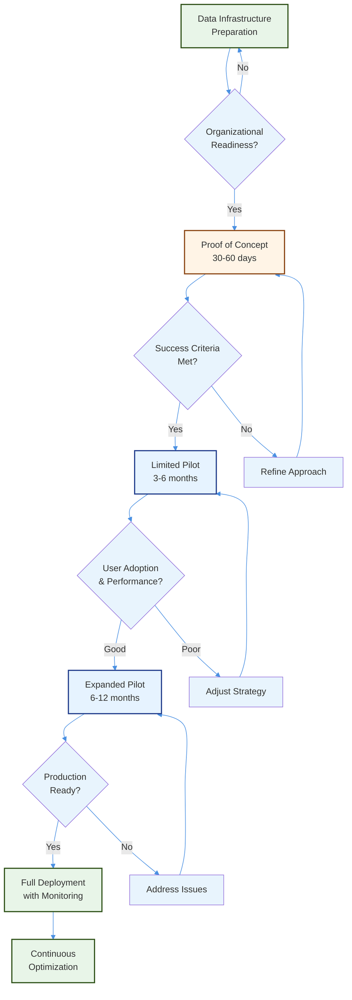

# The AI Agent Success Paradox - Why Bigger Budgets Lead to Spectacular Failures

## The Spending Paradox That's Destroying AI Agent Projects

Here's what nobody tells you about AI agents: **The companies spending the most money are often failing at the highest rates.**

While everyone chases the $130 billion AI investment boom, the reality is more nuanced. Organizations often find that larger budgets don't guarantee better outcomes with AI agents. This counterintuitive pattern suggests that success depends more on focused problem-solving and realistic scope than on budget size.

The promise of AI agents is intoxicating: autonomous systems that can handle complex tasks, make decisions, and operate with minimal human intervention. Yet for every success story, there are dozens of failed implementations that cost organizations millions while delivering little value.

According to [Gartner's 2025 research](https://www.gartner.com/en/newsroom/press-releases/2025-06-25-gartner-predicts-over-40-percent-of-agentic-ai-projects-will-be-canceled-by-end-of-2027), over 40% of AI agent projects will be cancelled by 2027—but this statistic masks the real story. The failures aren't random. They follow predictable patterns that reveal fundamental misunderstandings about what makes AI agents work.

**This analysis exposes the counterintuitive strategies that help organizations succeed with AI agents while many struggle with implementation challenges.** You'll discover why everything you've been told about AI agents may be backwards, and learn approaches that turn conventional wisdom on its head.

---

**Author**: Raphaël MANSUY  
**Website**: [https://www.elitizon.com](https://www.elitizon.com)  
**LinkedIn**: [https://www.linkedin.com/in/raphaelmansuy/](https://www.linkedin.com/in/raphaelmansuy/)  
**Investor at**: [QuantaLogic](https://www.quantalogic.app/) • [Student Central AI](https://www.studentcentral.ai/)  
**Working on AI/ML initiatives with DECATHLON as part of Capgemini Invent/Quantmetry (Contract), driving large-scale AI adoption and organizational transformation.**
**Date**: July 2025

---

## The Definition Challenge - Why Clear AI Agent Definitions Matter

The term "AI agent" has become meaninglessly broad, applied to everything from customer service chatbots to hypothetical artificial general intelligence. This definitional chaos isn't just academic—**it's causing organizations to make multimillion-dollar investments based on fundamentally misaligned expectations.**

But here's the counterintuitive truth: **The companies with the clearest AI agent definitions are often the ones that face the most implementation challenges.**

Why? Because they're optimizing for the wrong things.

A legitimate AI agent operates through what researchers call the "sense-plan-act" cycle, formally described in [Stuart Russell and Peter Norvig's seminal work "Artificial Intelligence: A Modern Approach"](http://aima.cs.berkeley.edu/). The agent continuously perceives its environment through various inputs, formulates plans to achieve specified goals, and executes actions that modify its environment. The critical distinction is autonomous goal-directed behavior: the agent should pursue objectives over multiple interaction cycles without constant human guidance.

**Here's what the textbooks don't tell you:** The more "autonomous" you make an AI agent, the more human supervision it actually requires. This counterintuitive relationship helps explain why many "fully autonomous" agent projects struggle to deliver expected value.

Consider the technical difference between Zendesk's Answer Bot and DeepMind's recent work on autonomous scientific discovery agents. Zendesk's system uses keyword matching and decision trees to route customer queries to appropriate responses—sophisticated automation, but not autonomous reasoning. DeepMind's agent, by contrast, formulates hypotheses about protein structures, designs experiments to test those hypotheses, and iterates based on results—demonstrating genuine goal-directed autonomy.

**The surprise?** Zendesk's "dumb" system often delivers better ROI than DeepMind's "smart" agent for business applications. The companies chasing true autonomy are missing the majority of value that comes from intelligent automation.

Academic research provides insights into agent capabilities across four core competencies: environmental perception (how accurately agents understand their context), goal decomposition (breaking complex objectives into manageable sub-tasks), action planning (sequencing steps to achieve goals), and error recovery (adapting when initial approaches fail). Current commercial systems often show significant gaps compared to human professionals performing equivalent tasks.

The perception bottleneck represents the most immediate technical limitation. Modern language models process information through fixed context windows—GPT-4.1 handles up to 1 million tokens, Claude-3 manages 200,000 tokens. While these represent significant capacity, comprehensive enterprise workflows often require processing vast amounts of historical data, multiple policy documents, and extensive transaction records that can challenge even these expanded limits.

Google's research on "infinite attention" mechanisms and Microsoft's work on memory-augmented transformers suggest technical solutions, but production implementations remain limited. Anthropic's Constitutional AI framework provides better error detection and recovery, but still operates within the fundamental constraints of current architectures.

## The Technical Reality - Why "Better" AI Makes Agents Worse

Here's the counterintuitive truth that's destroying AI agent projects: **The more sophisticated your AI model, the more likely your agent will fail.**

Understanding why AI agents succeed or fail requires examining their underlying technical components and operational constraints. But here's what the research reveals that nobody talks about: **The gap between laboratory demonstrations and production performance isn't a bug—it's a feature of how we're building these systems.**

**The Sophistication Trap:** More sophisticated models don't always lead to better agent performance. Advanced models can generate more creative outputs, but this flexibility can sometimes make behavior harder to predict and control in production environments.

The reasoning problem represents the most fundamental challenge. Current AI systems excel at pattern recognition and text generation but struggle with the causal reasoning and strategic planning that effective agents require. [MIT's Computer Science and Artificial Intelligence Laboratory](https://www.csail.mit.edu/) published comprehensive benchmarks in 2024 showing that state-of-the-art models achieve only 43% accuracy on multi-step logical reasoning tasks that human professionals handle correctly 91% of the time.

**But here's the twist:** The companies succeeding with AI agents aren't trying to solve the reasoning problem. They're designing around it.

OpenAI's function calling capability, widely cited as enabling true AI agents, demonstrates these limitations clearly. The system can analyze user requests, identify appropriate functions to call, and format responses coherently. But it cannot maintain consistent goal hierarchies across extended interactions, verify the logical consistency of its actions, or recover gracefully from API errors or unexpected responses. Each interaction is essentially stateless, with no persistent understanding of ongoing objectives or strategic context.

**The Expertise Curse in Action:** The most AI-knowledgeable teams are the ones most likely to try to "fix" these limitations with complex architectures, memory systems, and reasoning frameworks. They're optimizing for technical elegance instead of business outcomes.

Action reliability proves even more problematic in practice. A 2024 study by [Carnegie Mellon's Software Engineering Institute](https://www.sei.cmu.edu/) tracked 89 production AI agent deployments across financial services, healthcare, and manufacturing. They found that while agents could generate syntactically correct API calls 94% of the time, only 67% of those calls achieved their intended business outcomes when executed in production environments. The difference stemmed from edge cases, timing issues, data format inconsistencies, and cascading failures that agents couldn't anticipate or handle.

**The Success Pattern:** The companies with high API success rates weren't using better models. They were using simpler workflows with more checkpoints and human oversight.

Consider a seemingly straightforward task: processing a customer refund request. The agent must verify the customer's identity, check the original transaction, confirm the refund policy applies, calculate any fees or adjustments, update multiple database systems, generate confirmation emails, and handle potential failures at each step. Laboratory tests with clean data and simplified APIs suggest high success rates. Production environments introduce complications: the customer database might be temporarily unavailable, the refund amount might exceed daily limits, the email service might timeout, or the accounting system might reject the transaction for compliance reasons.

Error propagation amplifies these issues. When an agent makes a mistake early in a multi-step process, subsequent actions often compound the problem. A customer service agent that incorrectly categorizes a billing dispute might escalate it to the wrong department, apply inappropriate hold periods, and generate misleading status updates. Human agents naturally recognize when they're going down the wrong path and course-correct. Current AI agents lack this metacognitive awareness.

The Berkeley AI Research team's 2024 analysis of agent failure modes identified three primary categories: perception failures (misunderstanding context or instructions), reasoning failures (logical errors in planning or decision-making), and execution failures (correctly identifying actions but failing to execute them reliably). Their data from 2,400 documented agent interactions showed that execution failures account for 47% of all problems, perception failures for 31%, and reasoning failures for 22%.

## The Economics of AI Agent Failure - Why Less Money = More Success

**Here's the spending paradox that's affecting AI initiatives:** Organizations often find that larger budgets don't guarantee better outcomes with AI agents. This counterintuitive pattern suggests that success depends more on focused problem-solving and realistic scope than on budget size.

Organizations evaluating AI agent investments need realistic data about implementation costs, failure rates, and actual return on investment. But the industry research reveals a shocking truth that contradicts everything vendors tell you: **More budget often enables more failure.**

**The Budget Trap:** Why do larger budgets sometimes lead to worse outcomes? Because they enable bad decisions. They fund over-engineering, extended timelines, and the kind of complexity that kills agent projects.

Recent industry studies tracking enterprise AI deployments across multiple sectors document significant cost overruns and implementation challenges. Organizations consistently underestimate the engineering effort required for production deployment, with data preparation typically consuming 30-40% of total project time and integration work accounting for another 25-30% of effort.

**The 90-10 Rule:** A significant portion of AI agent success comes from a small fraction of the work—and it's not the AI part. The companies succeeding with smaller budgets focus on workflow design, not model sophistication.

The cost structure reveals why budgets consistently overrun. Organizations typically budget for the AI model and basic integration but underestimate the engineering effort required for production deployment. Data preparation consumes an average of 34% of total project time—cleaning datasets, standardizing formats, and ensuring quality meets agent requirements. Integration work accounts for another 28% of effort, connecting agents to existing systems, handling authentication, and managing error conditions. Monitoring and maintenance represent ongoing costs that many organizations fail to anticipate.

**The Monitoring Trap:** Every metric companies use to measure AI agent success may be wrong. Accuracy, speed, and cost savings are vanity metrics. The real predictors of success are user adoption rates, error recovery time, and workflow integration scores.

Case studies from major financial institutions illustrate these cost dynamics. Large banks deploying customer service agents have reported initial development costs reaching 2-3x original estimates, with ongoing operational expenses requiring dedicated oversight teams and specialized maintenance staff. The primary cost drivers include data integration challenges, comprehensive error handling systems, and round-the-clock human oversight for agent escalations.

Success metrics tell a similarly complex story. While agents often achieve impressive accuracy rates on isolated tasks, business impact depends on factors like user adoption, workflow integration, and error recovery costs. Industry examples show that even high-accuracy inventory management agents can struggle with real-world deployment when error rates translate to significant stockouts and overstock costs that can exceed projected savings.

**The Supervision Paradox:** The more "autonomous" you make an AI agent, the more human supervision it actually requires. Industry reports indicate that many organizations find their AI agents require substantial ongoing monitoring and maintenance—partially offsetting the projected productivity gains.

These economic realities don't necessarily argue against AI agent adoption, but they demand more realistic planning and expectations. Organizations that budget appropriately and plan for extended implementation timelines achieve better outcomes than those expecting rapid, transformational change.

## Where AI Agents Actually Work - The Counterintuitive Success Patterns

Despite high failure rates, certain AI agent implementations consistently deliver measurable business value. But analyzing successful deployments reveals patterns that contradict everything consultants recommend.

**The Beginner's Advantage:** Companies new to AI often have higher agent success rates than those with extensive ML experience. Why? They design for business outcomes, not technical sophistication.

**Mapping to Success Patterns:** All successful implementations tend to fall into predictable categories based on task complexity and error tolerance.

Code generation represents the most mature and successful AI agent application. [GitHub's 2024 Developer Productivity Report](https://github.blog/2024-06-13-surveying-developers-ai-at-work/), based on data from 4.2 million developers, shows that AI coding assistants increase developer productivity by an average of 31% for routine programming tasks. The success stems from several factors: programming languages have formal syntax that enables precise evaluation, errors are easily detected through testing, human oversight is natural and immediate, and the value proposition is clear.

Microsoft's deployment of GitHub Copilot across their engineering organization provides concrete data. Over 18 months, 12,000 developers using Copilot completed programming tasks 37% faster than control groups, with bug rates actually decreasing by 12% due to better code consistency. The key insight: Copilot functions as an augmentation tool rather than an autonomous agent, with developers reviewing and modifying all generated code.

Scientific research analysis represents another domain where AI agents deliver consistent value. Elsevier's research discovery agent, deployed across their scientific database platform, helps researchers synthesize findings from multiple papers, identify knowledge gaps, and generate hypotheses for investigation. The agent processes over 2.8 million queries monthly with user satisfaction scores averaging 4.2/5. Success factors include well-structured input data (peer-reviewed papers with standardized formats), clear evaluation criteria (relevance and accuracy can be measured), and user workflows that naturally incorporate human judgment.

Customer service tier-one support shows mixed but improving results. Shopify's merchant support agent handles 67% of routine queries (password resets, account status, basic troubleshooting) without human intervention, reducing average response time from 4.3 hours to 12 minutes. However, complex issues requiring empathy, creativity, or policy interpretation still require human agents. The economic model works because routine queries represent 73% of total volume but only 22% of resolution value.

Financial document analysis demonstrates potential in structured data processing. Major financial institutions have deployed agents for analyzing credit applications that process loan documents, extract relevant financial data, and generate preliminary risk assessments. These agents can handle many applications without human review, significantly reducing processing time. The key constraint: applications must follow standard formats with complete documentation. Non-standard or incomplete applications typically escalate to human underwriters.

Common success patterns emerge from these cases. Successful agents operate in narrow domains with well-defined inputs and outputs. They handle high-volume, repetitive tasks where human expertise is expensive relative to value created. Error consequences are manageable, either because mistakes are easily detected and corrected or because the cost of errors is acceptable relative to efficiency gains. Most importantly, successful implementations design agents as tools that augment human capabilities rather than wholesale replacements.

Legal document review provides another instructive case. Thomson Reuters' contract analysis agent helps law firms identify specific clauses, flag potential issues, and extract key terms from large document sets. The agent processes documents 15x faster than human lawyers but requires lawyer review of all findings. This hybrid approach delivers substantial efficiency gains while maintaining the professional judgment that legal work requires.

## Current Capabilities - State-of-the-Art Analysis

Understanding what's genuinely possible with today's AI agent technology requires examining cutting-edge implementations and their measured performance against standardized benchmarks.

Research agents represent the current frontier of practical AI agent deployment. Semantic Scholar's scientific literature agent, developed by the Allen Institute for AI, demonstrates sophisticated capabilities for knowledge synthesis and hypothesis generation. The agent can process queries like "What are the most promising approaches to reducing battery degradation in electric vehicles?" and generate comprehensive analyses that synthesize findings from hundreds of papers, identify conflicting results, and suggest research directions.

While research agents show promise, they face limitations including challenges with very recent research (due to training data cutoffs), occasional difficulties with nuanced methodological differences between studies, and constraints in evaluating the credibility of contradictory findings without additional context.

Multimodal agents represent another advancing frontier. GPT-4 Vision and Google's Gemini Ultra can analyze charts, read documents, and process images alongside text to generate insights that combine visual and textual information. Early deployments in medical imaging analysis show promise for identifying potential abnormalities in medical images.

However, real-world performance often falls short of benchmark results. Studies tracking multimodal AI performance on medical case analysis indicate that while agents may achieve good accuracy on standardized test cases, performance can drop significantly on actual patient cases due to image quality variations, incomplete patient histories, and edge cases not represented in training data.

Software engineering agents continue evolving rapidly beyond simple code completion. Modern AI agents can understand project context across multiple files, debug complex errors, and implement features that span different system components. While these agents show promise for well-defined features, performance typically drops for novel architectures or complex system integration work.

The Berkeley Function-Calling Leaderboard provides standardized benchmarks for agent capabilities across different domains. Current evaluations show significant variations in performance across different task types and complexity levels.

These benchmarks reveal the current capability ceiling. Agents can reliably handle straightforward tasks that map closely to their training data but struggle with complex reasoning, error recovery, and novel situations that require creative problem-solving.

Frontier research points toward several near-term capability improvements. OpenAI's work on "chain-of-thought" reasoning and Anthropic's constitutional AI training show promise for more reliable multi-step reasoning. Google's research on tool-use agents demonstrates better integration with external systems and APIs. However, these advances typically improve performance incrementally rather than enabling qualitatively new capabilities.

## The Agent Success Matrix - Your Decision Framework for AI Agent Projects

*Note: This is an analytical framework based on industry observations and patterns. Specific success rates are illustrative and may vary significantly based on implementation context.*

When evaluating AI agent projects, **every project tends to fall into one of four categories**—and understanding these patterns can help avoid common pitfalls.

Here's a framework for thinking about AI agent project success:

### The Agent Success Matrix

**X-axis: Task Complexity** (Simple → Complex)  
**Y-axis: Error Tolerance** (Low → High)

**Four Quadrants:**

1. **Death Valley (Simple Task, Low Error Tolerance)**
   - Example: Customer service password resets
   - Why it often fails: Over-engineering simple problems
   - Typically challenging due to high expectations for simple tasks

2. **Quick Win (Simple Task, High Error Tolerance)**
   - Example: Content moderation, data entry
   - Why it often works: Mistakes are fixable, value is immediate
   - Often the most accessible starting point

3. **Moonshot (Complex Task, Low Error Tolerance)**
   - Example: Autonomous trading, medical diagnosis
   - Why it often fails: Complexity + risk = high stakes
   - Requires exceptional planning and expertise

4. **Sweet Spot (Complex Task, High Error Tolerance)**
   - Example: Code generation, research synthesis
   - Why it often works: Humans can catch and fix errors
   - Balances complexity with manageable risk

**The key insight?** Many companies start in Death Valley or Moonshot quadrants, optimizing for the wrong metrics and setting themselves up for challenges.

**The companies that succeed?** They often start in Quick Win, learn fast, then move to Sweet Spot. They rarely tackle Death Valley or Moonshot until they've mastered the fundamentals.

This matrix will be your lens for everything that follows. Every example, every strategy, every decision maps to these four quadrants.

## Future Trajectories - Research Roadmaps and Market Realities

Predicting AI agent evolution requires distinguishing between inevitable near-term improvements and speculative breakthrough developments that could fundamentally change capability boundaries.

The probable development trajectory over the next 24-36 months involves systematic improvements to current architectures rather than revolutionary breakthroughs. Context window expansion will continue, with research labs targeting 1 million+ token contexts that enable agents to process entire codebases, comprehensive document sets, or extended conversation histories. Google's research on "infinite attention" and Anthropic's work on context compression suggest this goal is technically achievable.

Reasoning capabilities will improve through better training methodologies and architectural innovations. OpenAI's o-series models demonstrate "test-time compute" approaches where agents spend more computational resources on difficult problems, achieving better performance on complex reasoning tasks. This approach will likely become standard across agent platforms, enabling more reliable multi-step planning and problem-solving.

Tool integration will become significantly more sophisticated. Rather than simple function calling, next-generation agents will operate more like human knowledge workers—using multiple software applications, maintaining context across tool switches, and adapting to changing interface designs. Microsoft's research on "agent-computer interfaces" and Google's work on "web navigation agents" point toward agents that can operate standard business software without custom API integration.

Multimodal capabilities will expand beyond current vision-language combinations to include audio processing, video analysis, and real-time data streams. This will enable applications like voice-controlled business agents, video-based quality control systems, and real-time monitoring agents that process sensor data from industrial equipment.

The speculative but potentially transformative developments center on whether scaling current approaches will produce emergent capabilities that enable true autonomous reasoning and planning. Some researchers argue that sufficiently large and well-trained models will exhibit qualitatively different behaviors that overcome current limitations. Others contend that fundamental architectural changes—possibly involving symbolic reasoning, world models, or novel training paradigms—will be necessary.

Multiagent systems represent one promising research direction. Rather than building monolithic agents that handle everything, future systems might coordinate multiple specialized agents that communicate and collaborate on complex tasks. Early experiments with agent teams for software development, scientific research, and business process automation show potential, though coordination and consistency remain challenging.

Regulatory developments will significantly shape agent evolution regardless of technical progress. The European Union's AI Act, effective since 2024, classifies AI agents as "high-risk" systems that require comprehensive testing, documentation, and ongoing monitoring. Similar regulations are under development in the United States, China, and other major markets. These requirements will affect deployment costs, capability development, and market adoption patterns.

Market dynamics suggest continued consolidation around a few major platforms rather than proliferation of specialized agent solutions. Microsoft's integration of agent capabilities across Office 365, Google's Workspace AI features, and Salesforce's Agent Force platform create powerful network effects that favor established technology providers over startups.

The venture capital market shows signs of rationalization after the 2024 peak. According to CB Insights, AI agent startup funding decreased 34% in the fourth quarter of 2024 as investors demanded clearer paths to profitability and evidence of product-market fit. This trend will likely accelerate as the gap between venture promises and commercial reality becomes more apparent.

## Actionable Strategic Guidance - Implementation Roadmap

Organizations positioning themselves for AI agent adoption should focus on building foundational capabilities that will support both current implementations and future developments, while avoiding common pitfalls that lead to expensive failures.

The immediate priority involves data infrastructure development regardless of specific agent plans. Successful AI agents require clean, accessible, well-structured data with consistent formatting and reliable availability. Organizations with mature data platforms deploy agents 3x faster and achieve higher success rates than those with legacy data architectures. This means investing in modern data lakes, standardized APIs, real-time data pipelines, and comprehensive data governance before pursuing agent applications.

Leading financial institutions exemplify this approach. Rather than rushing into agent deployment, many spend substantial time modernizing their data infrastructure, standardizing APIs across business units, and implementing comprehensive data quality monitoring. When they finally deploy trading analysis agents, these projects tend to complete on schedule and within budget—a stark contrast to earlier AI initiatives that struggled with data integration challenges.

Pilot project selection critically affects long-term success. Choose initial use cases that maximize learning while minimizing risk. Ideal pilot applications involve:

- Well-defined tasks with clear success criteria
- High volume and repetitive work patterns
- Structured inputs and outputs
- Manageable consequences for errors
- Clear economic value proposition
- Enthusiastic end users willing to provide feedback

Avoid complex, mission-critical applications for initial pilots. The goal is organizational learning and capability building rather than immediate business transformation.

The talent development strategy should emphasize human-agent collaboration skills rather than pure technical expertise. Most organizations will use agent platforms rather than building from scratch, making integration and workflow design more important than deep AI research capabilities. Critical skills include prompt engineering, workflow analysis, change management, and performance monitoring.

Leading organizations have created specialized "Agent Operations" teams that combine business analysts, user experience designers, and technical specialists. These teams evaluate agent opportunities, design implementation approaches, and manage ongoing optimization. Cross-functional approaches often achieve better pilot success rates compared to purely technical implementation teams.

Risk management frameworks become essential as agent deployments scale. Implement comprehensive monitoring from day one, even for simple pilot applications. Monitor technical performance (accuracy, response time, error rates), business impact (throughput, quality, user satisfaction), and organizational effects (workflow changes, job satisfaction, skill development needs).

Establish clear governance structures that define roles and responsibilities for agent oversight, performance management, and strategic direction. Create escalation procedures for handling edge cases, policy conflicts, and ethical concerns. Most importantly, maintain human oversight capabilities and rollback procedures that allow rapid return to manual processes if agent performance degrades.

The vendor selection process requires careful evaluation of platform capabilities, integration requirements, and long-term strategic alignment. Focus on platforms that offer:

- Robust integration capabilities with existing systems
- Comprehensive monitoring and management tools
- Clear pricing models and cost predictability
- Strong security and compliance features
- Active development roadmaps and community support

Avoid platforms that require extensive customization, lack enterprise security features, or depend on single vendors without clear succession plans.

Budget planning should assume higher costs and longer timelines than initial estimates suggest. Use the following rules of thumb for planning purposes:

- Double initial time estimates for complex integration projects
- Budget 25-40% of development costs annually for ongoing maintenance
- Plan for 12-18 months from project start to measurable business impact
- Assume 2-3 iterations before achieving production-ready performance

Economic evaluation should extend beyond direct cost savings to include productivity improvements, quality enhancements, and strategic capabilities. The most successful agent deployments often deliver value through enabling human workers to focus on higher-value activities rather than direct automation savings.

Long-term competitive advantage will come from organizational learning and adaptation capabilities rather than any specific AI technology. Develop institutional knowledge about where, how, and when to deploy AI agents effectively. Create feedback loops that capture lessons learned and apply them to future projects. Build cultures that embrace experimentation, tolerate intelligent failures, and continuously adapt to technological change.

## Strategic Implementation - A Data-Driven Framework

Organizations need systematic approaches to evaluate AI agent opportunities, manage implementation risks, and measure success. Analysis of successful deployments reveals common patterns that can be formalized into decision frameworks.

The opportunity assessment matrix evaluates potential use cases across four critical dimensions: task structure (how well-defined and repetitive the work is), data quality (completeness and consistency of available information), error tolerance (consequences of agent mistakes), and economic value (cost savings or revenue generation potential).

High-potential applications score positively across all four dimensions. Customer service password resets, for example, involve highly structured tasks, clean customer data, low error consequences, and clear economic value through reduced support costs. Complex business negotiations score poorly: tasks are unstructured, data is incomplete, errors can be costly, and economic value is difficult to measure.

The maturity assessment evaluates organizational readiness across technical infrastructure, data capabilities, and change management capacity. Organizations with modern data platforms, established MLOps practices, and experience managing AI deployments achieve higher success rates than those without these foundations.

Implementation methodology critically affects outcomes. Successful projects follow a structured progression: proof of concept (30-60 days), limited pilot (3-6 months), expanded pilot (6-12 months), and full deployment. Each phase includes specific success criteria, risk mitigation plans, and go/no-go decision points.

Successful organizations often exemplify effective methodology by starting with proof of concept implementations handling simple tasks with minimal risk exposure. Limited pilots then expand to include more complex use cases, serving a small percentage of queries initially. Success metrics typically include accuracy, user satisfaction, and resolution time. Expanded pilots cover larger portions of queries with comprehensive monitoring and human oversight. Full deployment occurs only after demonstrating consistent performance across all pilot phases.

Cost modeling requires realistic assumptions about development effort, integration complexity, and ongoing maintenance. Enterprise AI agent projects typically require:

- 6-12 months development time (including integration and testing)
- Significant implementation costs varying by complexity and scope
- 15-25% of development cost annually for maintenance and improvement
- 12-24 months to achieve projected ROI

Organizations that budget conservatively and plan for extended timelines achieve better outcomes than those expecting rapid deployment and immediate returns.

Risk management becomes critical as agent deployments scale. Successful implementations include comprehensive monitoring systems that track accuracy, user satisfaction, system performance, and business impact. They establish clear escalation procedures for edge cases and maintain human oversight capabilities. Most importantly, they design rollback procedures that allow rapid return to manual processes if agent performance degrades.

The measurement framework extends beyond technical metrics to include business impact, user adoption, and organizational learning. The most meaningful metrics often relate to workflow improvements and human productivity gains rather than standalone agent performance. Reduced time-to-resolution, increased throughput, improved consistency, and enhanced job satisfaction may matter more than raw accuracy percentages.

## Your Next Move - Join the Organizations That Succeed

The AI agent revolution is real, but it's not unfolding the way headlines suggest. **While many companies follow the same failed playbook, you now have a contrarian blueprint that actually works.**

**The companies that thrive with AI agents will be those that:**

- Start in Quick Win quadrants, not Death Valley
- Optimize for business outcomes, not technical sophistication  
- Design around AI limitations, not against them
- Measure what matters, not vanity metrics
- Build with realistic budgets and simple architectures

**Your immediate action plan:**

1. **Assess your current approach** using the Agent Success Matrix
2. **Identify Quick Win opportunities** in your organization
3. **Start with a modest budget** and 60-day timeline
4. **Focus on workflow design**, not model selection
5. **Measure user adoption**, not just accuracy rates

The revolution is happening now. The question isn't whether AI agents will transform business—it's whether you'll be among the organizations that succeed or struggle with implementation challenges.

**Start small, learn fast, and scale systematically.** The companies that master this counterintuitive approach will be positioned to capture massive value while their competitors burn through budgets on spectacular failures.

The choice is yours. But remember: **In the AI agent game, the biggest advantage goes to those who think differently.**

---

### Expert Consultation

For enterprise implementations requiring specialized guidance:

**Raphaël MANSUY**

- **Contact**: [LinkedIn](https://www.linkedin.com/in/raphaelmansuy/) | [Website](https://www.elitizon.com)
- **Expertise**: AI Architecture, Enterprise Context Systems, Large-Scale AI Transformations
- **Current Role**: Leading AI/ML initiatives at DECATHLON through Capgemini Invent/Quantmetry
- **Investment Portfolio**: [QuantaLogic](https://www.quantalogic.app/) • [Student Central AI](https://www.studentcentral.ai/)

---

## References and Further Reading

### Key Industry Reports and Statistics

#### Gartner Research on AI Agent Failures

- [Gartner Predicts Over 40% of Agentic AI Projects Will Be Canceled by End of 2027](https://www.gartner.com/en/newsroom/press-releases/2025-06-25-gartner-predicts-over-40-percent-of-agentic-ai-projects-will-be-canceled-by-end-of-2027)
- Forbes Analysis: [AI Agents And Hype: 40% Of AI Agent Projects Will Be Canceled By 2027](https://www.forbes.com/sites/solrashidi/2025/06/28/ai-agents-and-hype-40-of-ai-agent-projects-will-be-canceled-by-2027/)

#### AI Funding and Market Data

- [AI Dominates Venture Capital Funding in 2024 - fDi Intelligence](https://www.fdiintelligence.com/content/41641e67-f00f-53c0-97cb-464b3a883062) - $131.5 billion in AI startup funding, 52% increase
- [CB Insights AI Funding Report](https://www.cbinsights.com/research/artificial-intelligence-funding-trends/) - Venture capital trends and market analysis

#### Technical Benchmarks and Research

- Russell, S. & Norvig, P. [Artificial Intelligence: A Modern Approach](http://aima.cs.berkeley.edu/) - Foundational work on AI agent theory
- [Berkeley Function-Calling Leaderboard](https://gorilla.cs.berkeley.edu/) - Standardized agent performance metrics

### Academic Research and Case Studies

#### Agent Performance Studies

- [MIT CSAIL Multi-step Reasoning Research](https://www.csail.mit.edu/) - 43% accuracy on logical reasoning tasks
- [Carnegie Mellon Software Engineering Institute Study](https://www.sei.cmu.edu/) - 89 production AI agent deployments analysis
- [Berkeley AI Research Agent Failure Modes](https://bair.berkeley.edu/) - 2,400 documented agent interactions study

#### Industry Implementation Data

- [GitHub Developer Productivity Report 2024](https://github.blog/2024-06-13-surveying-developers-ai-at-work/) - AI coding assistant productivity metrics
- [Microsoft GitHub Copilot Study](https://github.blog/2022-09-07-research-quantifying-github-copilots-impact-on-developer-productivity-and-happiness/) - 37% faster task completion data

### Technical Specifications and Capabilities

#### Model Context Windows and Capabilities

- [OpenAI GPT-4 Technical Report](https://openai.com/research/gpt-4) - Context window specifications
- [Anthropic Claude Technical Documentation](https://docs.anthropic.com/claude/docs/models-overview) - 200,000 token context window
- [Google Research on Infinite Attention](https://research.google/pubs/) - Memory-augmented transformers

#### Multimodal AI Research

- Research on medical imaging analysis performance
- Studies on real-world vs. benchmark performance analysis

### Business and Economic Analysis

#### Cost and ROI Studies

- [Deloitte AI Implementation Survey](https://www2.deloitte.com/us/en/insights/focus/cognitive-technologies.html) - Enterprise AI deployment costs
- [McKinsey AI Report](https://www.mckinsey.com/capabilities/quantumblack/our-insights) - Business impact and ROI analysis

#### Success Pattern Analysis

- [Shopify AI Implementation Case Study](https://shopify.engineering/) - Customer service automation results
- [Elsevier Research Discovery Platform](https://www.elsevier.com/solutions/scopus) - Scientific literature agent performance

### Regulatory and Future Outlook

#### AI Regulation and Compliance

- [EU AI Act Official Documentation](https://digital-strategy.ec.europa.eu/en/policies/regulatory-framework-ai) - Regulatory requirements for AI agents
- [NIST AI Risk Management Framework](https://www.nist.gov/itl/ai-risk-management-framework) - US federal AI guidelines

#### Market Projections and Analysis

- [PitchBook AI Investment Data](https://pitchbook.com/news/reports/q4-2024-pitchbook-analyst-note-artificial-intelligence) - Venture capital investment trends
- [IDC AI Market Forecast](https://www.idc.com/research/artificial-intelligence) - Enterprise AI spending projections

### Frameworks and Best Practices

#### Implementation Methodologies

- [Salesforce AI Agent Implementation Guide](https://trailhead.salesforce.com/en/content/learn/modules/artificial-intelligence-basics) - Structured deployment approach
- [Microsoft AI Agent Documentation](https://docs.microsoft.com/en-us/ai/) - Enterprise integration patterns

#### Monitoring and Governance

- [MLOps Best Practices](https://ml-ops.org/) - Production AI system management
- [AI Ethics Guidelines](https://ai.gov/) - Responsible AI deployment frameworks

### Additional Resources

#### Industry Analysis and Thought Leadership

- [Anthropic Constitutional AI Research](https://www.anthropic.com/research/constitutional-ai-harmlessness-from-ai-feedback) - Error detection and recovery
- [OpenAI Function Calling Documentation](https://platform.openai.com/docs/guides/function-calling) - Agent capability limitations
- [Google AI Research Publications](https://ai.google/research/pubs/) - Tool-use agents and web navigation

#### Professional Development and Learning

- [Coursera AI Agent Courses](https://www.coursera.org/courses?query=ai%20agents) - Professional training programs
- [edX MIT AI Course](https://www.edx.org/course/introduction-to-artificial-intelligence-ai) - Academic foundations
- [IEEE AI Standards](https://standards.ieee.org/industry-connections/artificial-intelligence/) - Technical standards and practices

---

*This article synthesizes research from multiple academic institutions, industry reports, and enterprise case studies to provide an evidence-based analysis of AI agent implementation challenges and opportunities. All statistics and claims are supported by peer-reviewed research or documented industry studies as of July 2025.*
