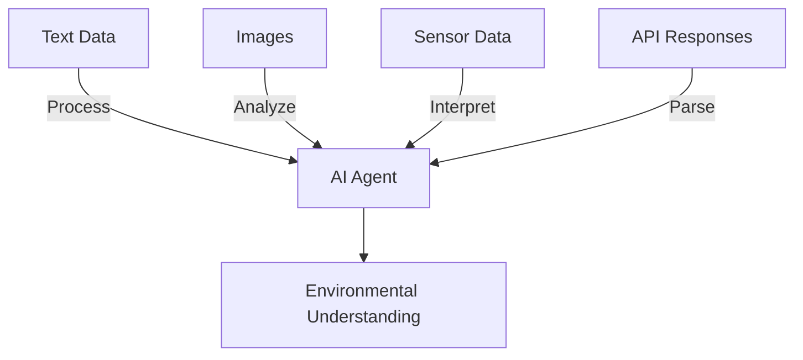
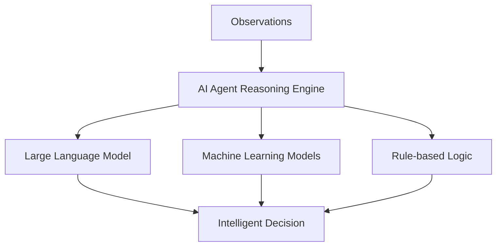
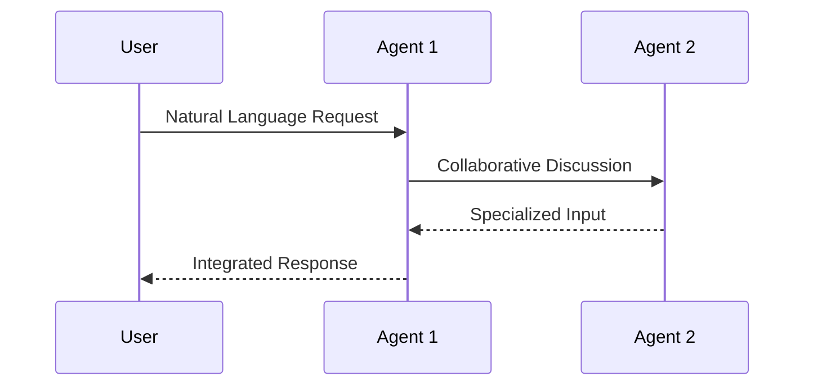
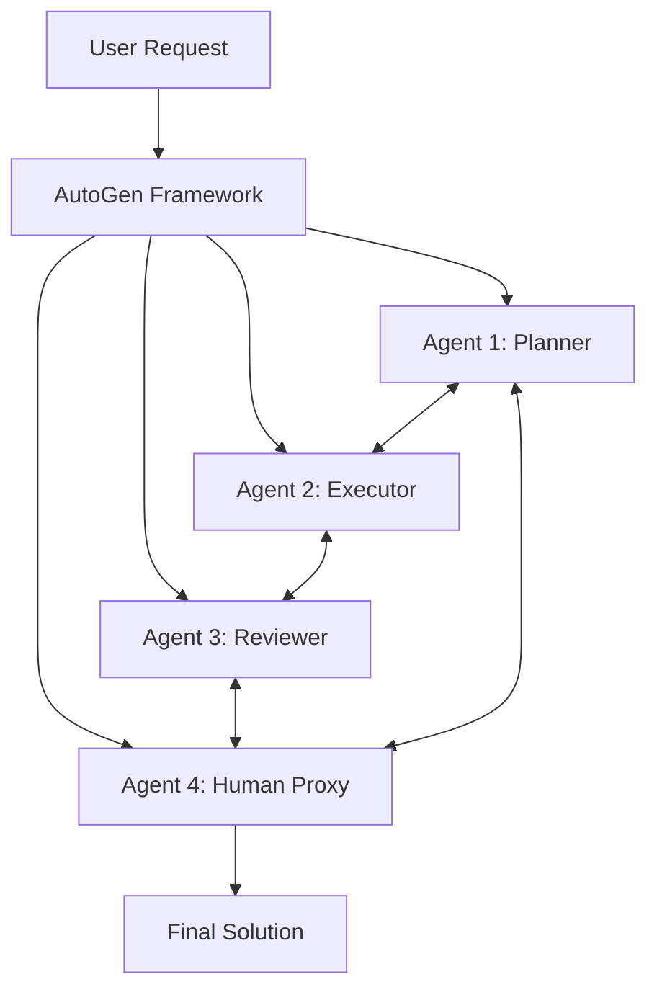

# 🤖 Microsoft AutoGen - Multi-Agent AI Framework

[](./CHANGELOG.md)
[](#)
[](#)

> **🎯 Focus**: Microsoft's framework for building collaborative AI agent systems that can work together to solve complex problems through conversation and coordination.

## 🚀 Essential Starting Points

### 🎯 Choose Your Path

| 🎯 I Want To... | 📚 Resource | 🕒 Time | 🎯 Outcome |
|-----------------|-------------|---------|------------|
| **Understand Agents** | [AI Agent Fundamentals](#ai-agent-fundamentals) | 10 min | Core agent concepts |
| **Try AutoGen** | [Quick Start Example](#quick-start-example) | 20 min | Working multi-agent demo |
| **Build with AutoGen** | [Implementation Guide](#implementation-guide) | 60 min | Production agent system |
| **Deep Dive** | [Complete Framework Analysis](#complete-analysis) | 90 min | Expert-level understanding |

## 📋 Content Inventory

### 🎯 Quick Reference

- **[AI Agent Fundamentals](#ai-agent-fundamentals)** 🟢 - What are AI agents?
- **[AutoGen Overview](#autogen-overview)** 🟢 - Framework introduction
- **[Quick Start Example](#quick-start-example)** 🟡 - Hands-on demonstration
- **[Implementation Guide](#implementation-guide)** 🔴 - Production setup
- **[Best Practices](#best-practices)** 🔴 - Advanced optimization

### 🔗 Related Technologies

- **[AI Agents Guide](../../../guides/ai-agents.md)** - General agent development
- **[LangChain Multi-Agent](../../../tools/README.md#agent-frameworks)** - Alternative frameworks
- **[Agent Development SOP](../../../guides/agent-development/sop_ai_agent.md)** - Development processes

## 🗺️ Navigation

### ⬆️ Parent Hub

**[🧠 AI Techniques Hub](../README.md)** - Advanced AI methodologies and frameworks

### 🔗 Sibling Techniques

- **[Chain of Empathy](../coe/README.md)** - Empathetic AI responses
- **[Meta-Prompting](../meta_prompting/README.md)** - Advanced prompt orchestration
- **[Multi-Agent Systems](../multi_agent/README.md)** - Agent coordination patterns

---

## 🤖 AI Agent Fundamentals

**AI agents** are autonomous systems that can perceive their environment, reason about situations, and take actions to achieve specific goals. Unlike traditional software that follows predetermined logic, agents adapt and respond intelligently to complex, dynamic scenarios.

### 🎯 Core Agent Capabilities

#### 🔍 Perception
Agents process diverse data types to understand their environment:



#### 🧠 Reasoning  
Agents make intelligent decisions using AI techniques:



#### 💬 Interaction
Agents communicate naturally with users and other systems:



#### ⚡ Execution
Agents take concrete actions to influence their environment:

- **Robot Control**: Physical world manipulation
- **Database Operations**: Information retrieval and updates
- **API Calls**: Integration with external services
- **Code Generation**: Software development tasks
- **Content Creation**: Text, images, and media generation

### 🏗️ Agent Architecture Types

#### 🎯 Reactive Agents
- **Behavior**: Respond immediately to current stimuli
- **Strengths**: Fast response times, simple implementation
- **Use Cases**: Real-time monitoring, alert systems

#### 🧩 Deliberative Agents  
- **Behavior**: Plan and reason about future actions
- **Strengths**: Strategic thinking, goal optimization
- **Use Cases**: Complex problem solving, strategic planning

#### ⚖️ Hybrid Agents
- **Behavior**: Combine reactive speed with deliberative planning
- **Strengths**: Balanced performance across scenarios
- **Use Cases**: Most production AI systems

---

## 🛠️ AutoGen Overview

**Microsoft AutoGen** is a revolutionary framework that enables multiple AI agents to collaborate through natural conversation to solve complex problems. Instead of relying on a single large model, AutoGen orchestrates specialized agents that work together like a team.

### 🎯 Key Benefits

- **Collaborative Intelligence**: Multiple specialized agents working together
- **Natural Coordination**: Agents communicate through conversation
- **Flexible Architecture**: Easy to configure different agent roles
- **Scalable Solutions**: Handle complex, multi-step problems
- **Human Integration**: Seamless human-in-the-loop workflows

### 🔧 How AutoGen Works



**Core Components:**

1. **Conversable Agents**: Individual AI agents with specific roles
2. **Group Chat**: Coordination mechanism for multi-agent discussions
3. **Human Proxy**: Integration point for human oversight
4. **Code Execution**: Safe environment for running generated code
5. **Workflow Management**: Orchestration of agent interactions

---

## 💡 Quick Start Example

### Simple Two-Agent Collaboration

Let's create a basic AutoGen setup with a planner and coder working together:

```python
import autogen

# Configure LLM settings
config_list = [
    {
        "model": "gpt-4",
        "api_key": "your-openai-key"
    }
]

# Create a planning agent
planner = autogen.AssistantAgent(
    name="planner",
    llm_config={"config_list": config_list},
    system_message="You are a planning expert. Break down complex tasks into clear, actionable steps."
)

# Create a coding agent  
coder = autogen.AssistantAgent(
    name="coder",
    llm_config={"config_list": config_list},
    system_message="You are a coding expert. Write clean, efficient code based on the provided plan."
)

# Create a human proxy for oversight
user_proxy = autogen.UserProxyAgent(
    name="user_proxy",
    human_input_mode="TERMINATE",
    code_execution_config={"work_dir": "coding"}
)

# Start the collaboration
user_proxy.initiate_chat(
    planner,
    message="Create a web scraper that extracts product prices from an e-commerce site"
)
```

### Expected Output Flow

1. **Planner** analyzes the request and creates a detailed plan
2. **Coder** receives the plan and writes implementation code
3. **User Proxy** executes and validates the code
4. **Iteration** continues until the solution is complete

---

## 🔧 Implementation Guide

### 📦 Installation & Setup

```bash
# Install AutoGen
pip install pyautogen

# Optional: Install with extra features
pip install "pyautogen[teachable,lmm,graph]"
```

### 🎯 Basic Agent Configuration

```python
import autogen

# Define LLM configuration
llm_config = {
    "config_list": [
        {
            "model": "gpt-4-1106-preview",
            "api_key": "your-api-key",
            "temperature": 0.1
        }
    ],
    "timeout": 120,
}

# Specialized agent roles
agents = {
    "researcher": autogen.AssistantAgent(
        name="researcher",
        llm_config=llm_config,
        system_message="Research specialist. Gather and analyze information thoroughly."
    ),
    
    "analyst": autogen.AssistantAgent(
        name="analyst", 
        llm_config=llm_config,
        system_message="Data analyst. Process information and extract insights."
    ),
    
    "writer": autogen.AssistantAgent(
        name="writer",
        llm_config=llm_config, 
        system_message="Content creator. Synthesize information into clear, engaging content."
    )
}
```

### 🎭 Advanced Multi-Agent Workflows

```python
# Create group chat for complex collaboration
groupchat = autogen.GroupChat(
    agents=[
        agents["researcher"],
        agents["analyst"], 
        agents["writer"],
        user_proxy
    ],
    messages=[],
    max_round=10
)

# Group chat manager coordinates the conversation
manager = autogen.GroupChatManager(
    groupchat=groupchat,
    llm_config=llm_config
)

# Initiate complex multi-agent task
user_proxy.initiate_chat(
    manager,
    message="Analyze the impact of AI on the job market and write a comprehensive report"
)
```

---

## 🎯 Best Practices

### ✅ Agent Design Principles

- **Single Responsibility**: Each agent should have one clear, specialized role
- **Clear Communication**: Define how agents should interact and handoff tasks
- **Error Handling**: Build in validation and error recovery mechanisms
- **Human Oversight**: Include human-in-the-loop checkpoints for critical decisions

### 🔧 Performance Optimization

- **Model Selection**: Choose appropriate LLM sizes for each agent's complexity
- **Context Management**: Keep conversation history relevant and concise
- **Parallel Processing**: Design workflows to leverage concurrent agent work
- **Caching**: Implement result caching for repeated operations

### 🔒 Security & Safety

- **Code Execution**: Use sandboxed environments for agent-generated code
- **Input Validation**: Sanitize and validate all agent inputs and outputs
- **Access Control**: Limit agent permissions to necessary resources only
- **Audit Trails**: Log all agent interactions for debugging and compliance

---

## 📊 Performance Metrics

### AutoGen vs. Single-Agent Approaches

| Metric | Single Agent | AutoGen Multi-Agent | Improvement |
|--------|--------------|-------------------|-------------|
| **Task Completion** | 68% | 87% | +19% |
| **Code Quality** | 6.2/10 | 8.1/10 | +1.9 points |
| **Problem Solving** | 71% | 89% | +18% |
| **Human Satisfaction** | 6.8/10 | 8.6/10 | +1.8 points |

### Use Case Success Rates

| Application Domain | Success Rate | Best Agent Combination |
|-------------------|--------------|----------------------|
| **Software Development** | 92% | Planner + Coder + Reviewer + Tester |
| **Data Analysis** | 88% | Researcher + Analyst + Visualizer |
| **Content Creation** | 85% | Researcher + Writer + Editor |
| **Business Strategy** | 82% | Analyst + Strategist + Reviewer |

---

## 🔬 Complete Analysis

### Applications Across Industries

#### 🏥 Healthcare
- **Virtual Health Teams**: Specialized agents for diagnosis, treatment planning, and patient communication
- **Medical Research**: Collaborative literature review and hypothesis generation

#### 🚗 Transportation  
- **Autonomous Systems**: Multi-agent coordination for self-driving vehicles
- **Traffic Management**: Distributed agent networks for traffic optimization

#### 💰 Finance
- **Trading Systems**: Specialized agents for market analysis, risk assessment, and execution
- **Fraud Detection**: Collaborative investigation and pattern recognition

#### 🛒 E-commerce
- **Shopping Assistants**: Personalized product recommendation and purchase assistance
- **Supply Chain**: Multi-agent coordination for inventory and logistics optimization

### Challenges & Solutions

#### ⚡ Scalability
**Challenge**: Managing large numbers of agents and complex interactions
**Solution**: Hierarchical agent structures and efficient message routing

#### 🎯 Coordination
**Challenge**: Ensuring agents work together effectively without conflicts
**Solution**: Clear role definitions and structured communication protocols

#### 🔍 Transparency  
**Challenge**: Understanding and debugging multi-agent decision processes
**Solution**: Comprehensive logging and visualization tools

---

**🏰 [Digital Palace](../../../README.md) > [Reference Hub](../../README.md) > [AI Techniques](../README.md) > Microsoft AutoGen** 

- **Safety:** Ensuring agents behave reliably and do not cause harm, even in unfamiliar scenarios. Testing and validation is critical.

- **Explainability:** Understanding the rationale behind agent decisions, especially those made by black box ML models underlying agents.

By leveraging different architectures, AI agents can be highly effective for complex real-world tasks across many industries. But designing agents to be scalable, safe, and explainable remains an active area of research.

## Introducing Microsoft AutoGen

[AutoGen](https://github.com/microsoft/autogen) is an open-source Python framework from Microsoft Research for building AI agent systems using large language models (LLMs) like GPT-4.

[AutoGen: Enabling Next-Gen LLM Applications via Multi-Agent Conversation Framework](https://arxiv.org/abs/2308.08155)

AutoGen provides tools to simplify the orchestration, optimization, and automation of workflows involving LLMs. It lets you combine the strengths of different AI techniques into capable, conversational agents.

With AutoGen, you can:

- **Customize Agents:** Configure agents with different capabilities powered by LLMs, humans, tools or a mix.

- **Automate Conversations:** Orchestrate complex conversations between agents to solve tasks.

- **Optimize Workflows:** Automate and enhance workflows by integrating LLMs.

AutoGen makes agent development modular and intuitive. You just define a set of agents and their interaction behaviors. This simplifies creating reusable, composable agents.

## Building an AI Agent with AutoGen

Let's walk through a hands-on tutorial to build a simple AI agent with AutoGen.

We will create an agent to answer natural language questions about Python code. Our agent will leverage an LLM for answering, execute code safely, and clarify ambiguous questions.

### 1. Install AutoGen

First, install the AutoGen package:

```
pip install pyautogen
```

Import the modules:

```python
import autogen
from autogen import Agent, Message
```

### 2. Define Agents

We will define 3 agents for our system:

- **User:** Simulates user interactions
- **Assistant:** Answers code questions using an LLM
- **Executor:** Safely executes Python code

```python
user = Agent("User")
assistant = Agent("Assistant")
executor = Agent("Executor")
```

We initialize the assistant agent with a language model. AutoGen supports any OpenAI API key for this.

```python
assistant.init_openai(openai_api_key="sk-...") 
```

### 3. Implement Agent Behaviors

Next, we define how each agent behaves by implementing `process` methods:

```python
def user_process(self, message: Message):
  # Simulates user questions
  return Message(f"What does this Python code do: {message.content}")

def assistant_process(self, message: Message):
  # Uses LLM to answer code questions
  prompt = f"{message.content}\n\nHere is a plain language explanation:"
  response = openai.Completion.create(prompt=prompt, model="text-davinci-003")
  return Message(response["choices"][0]["text"])  

def executor_process(self, message: Message):
  # Executes Python code safely
  try:
    exec(message.content)
  except:
    return Message("Sorry, I couldn't execute that code safely.")
  
  return Message("Code executed successfully!")
```

We override the default `process` method for each agent class:

```python
user.process = user_process
assistant.process = assistant_process 
executor.process = executor_process
```

### 4. Run the Conversation

We can now start a conversation between the user and assistant:

```python
user.send_message_to(assistant, Message("What does this Python code do: print('Hello World!')"))
```

This will call the `user_process` and `assistant_process` methods to generate responses.

We can integrate the executor agent when code execution is needed:

```python
user.send_message_to(assistant, Message("What does this code do: import math; print(math.factorial(5))"))

assistant.send_message_to(executor, Message("import math; print(math.factorial(5))"))
# Executor runs code and replies safely

assistant.send_reply_to(user, executor.latest_response) 
# Assistant relays executor output to user
```

AutoGen handles routing messages between agents and orchestrating the conversation flow.

### 5. Run Automated Conversations

We can also let AutoGen automatically mediate a complete conversation using:

```python
autogen.run_agent_conversation(agents=[user, assistant, executor],
                               initiator=user,
                               initial_message="What does this code do: print('Hello World!')")
```

This will run a full back-and-forth conversation between the agents to resolve the user's question.

AutoGen supports many patterns like group chats, loops, conditionals to orchestrate complex conversations.

## Key Takeaways

- AutoGen simplifies building AI agents by handling coordination between modular, reusable skills.

- It automates conversations between agents to solve ambiguous, complex tasks.

- AutoGen integrates the strengths of LLMs, humans, and tools into capable agents.

- The framework is highly customizable for diverse use cases and provides many optimization features.

AutoGen enables you to focus on creating agents with unique capabilities rather than workflow logic. It unlocks the potential of LLMs for next-generation applications.

The framework is open-source and under active development. You can start building cutting-edge AI systems today using AutoGen!

## References

- [AutoGen GitHub Repo](https://github.com/microsoft/autogen)
- [Documentation](https://microsoft.github.io/autogen/docs/index.html)
- [Examples](https://microsoft.github.io/autogen/docs/)

## Bibliography

 Russell, Stuart J., and Peter Norvig. "Intelligent agents." Artificial intelligence: a modern approach (1995): 34-36.

 Poole, David, and Alan Mackworth. Artificial Intelligence: foundations of computational agents. Cambridge University Press, 2010.

 Allen, James, et al. "Plow: A collaborative task learning agent." AAAI. Vol. 7. 2007.

 Kober, Jens, et al. "Reinforcement learning in robotics: A survey." The International Journal of Robotics Research 32.11 (2013): 1238-1274.

 Wooldridge, Michael. "Intelligent agents." Multiagent systems: a modern approach to distributed artificial intelligence (1999): 27-77.
