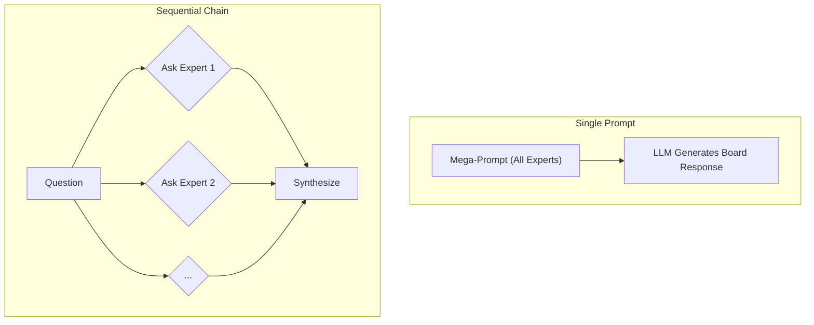

<div class="hide-in-docs">
<div class="banner">
    <div class="banner-logo">
        
    </div>
    <div class="banner-text">
        <h1>Board of Experts</h1>
        <p>A multi-persona prompting technique to simulate a board of expert advisors.</p>
    </div>
</div>

<div class="quick-start-container">
    <div class="quick-start-card">
        <h2>Quick Start</h2>
        <p>Jumpstart your project with our quick start guide.</p>
        <a href="#quick-start" class="quick-start-button">Get Started</a>
    </div>
    <div class="quick-start-card">
        <h2>Best Practices</h2>
        <p>Learn the best practices for using this technique.</p>
        <a href="#best-practices" class="quick-start-button">Learn More</a>
    </div>
</div>
</div>

**Main Hub:** [Techniques Hub](?id=techniques-hub)
**Parent Hub:** [Prompting Techniques](?id=prompting-techniques)

## 1. Introduction

The "Board of Experts" is a sophisticated multi-persona prompting technique where you define a panel of AI personas, each with a specific domain of expertise. When you pose a question, each "expert" analyzes the problem from their unique viewpoint, providing a multi-faceted and comprehensive response. This simulates a real-world advisory board, offering diverse and well-rounded insights for complex decision-making.

This technique is particularly effective for strategic planning, risk assessment, and creative brainstorming, where considering a problem from multiple angles is crucial.

## 2. Quick Start

To implement the Board of Experts technique, follow these steps:

1.  **Define the Board**: Identify the key domains of expertise relevant to your problem. Create a persona for each expert, including their title, responsibilities, and even a list of seminal works they might have "read" to ground their knowledge.
2.  **Define Your Persona & Question**: Clearly articulate who you are and the specific problem or question you need advice on.
3.  **Construct the Prompt**: Combine the board definition, your persona, and your question into a single, comprehensive prompt.
4.  **Execute and Synthesize**: Run the prompt and then synthesize the individual responses from each expert into a cohesive strategy.

### Mega Prompt Template

```
# Seeking advice from the Board

## You have at your disposition a Board of experts:

- **[Expert 1 Title]:** [Description of expertise]
- **[Expert 2 Title]:** [Description of expertise]
- ...and so on.

### Knowledge Base:

- **[Expert 1 Title]:**
    * "Book/Article 1" by Author: Description.
    * "Book/Article 2" by Author: Description.
- **[Expert 2 Title]:**
    * "Book/Article 1" by Author: Description.

## Your Persona:

{Your role, company, and background}

## Your Question:

{The specific problem or question you need help with}

## Instructions for the Board:

- Each expert will analyze the situation from their perspective, referencing their knowledge base.
- Each expert will provide a step-by-step, actionable recommendation.
- A final summary will synthesize the advice into a cohesive strategy.
```

## 3. How It Works

The technique leverages the language model's ability to adopt and reason from different personas. By providing a detailed context for each expert, including a "knowledge base" of books and articles, you anchor their responses in established concepts and frameworks.

There are two primary ways to implement this:

1.  **Single Prompt (Mega-Prompt)**: All experts are defined in one large prompt. The model generates a response that includes the "discussion" and advice from the entire board in a single output. This is simpler but can sometimes dilute the individual voices.
2.  **Sequential Chain**: You query each expert individually in a series of prompts. This allows for more focused and in-depth responses from each persona, which you can then synthesize. This method offers greater control and depth but requires more steps.



## 4. Evaluation

### Strengths

*   **Comprehensive Analysis**: Provides a 360-degree view of a problem.
*   **Reduces Bias**: Mitigates the risk of a single, narrow perspective by forcing consideration of multiple viewpoints.
*   **Creative Solutions**: The intersection of different expert opinions can lead to novel and innovative solutions.
*   **Structured Output**: The format encourages well-reasoned, actionable advice.

### Weaknesses

*   **Complexity**: Requires a well-structured and detailed prompt.
*   **Token Limits**: The "Mega-Prompt" approach can be very long and may hit context window limits on some models.
*   **Potential for Contradiction**: Experts may offer conflicting advice that requires careful synthesis and judgment to resolve.
*   **Generalist Models**: The effectiveness depends on the LLM's ability to accurately simulate specialized expertise. Fine-tuning may be required for highly technical domains.

## 5. Best Practices

*   **Be Specific**: The more detailed your expert personas and their knowledge bases, the better the quality of the advice.
*   **Tailor the Board**: Customize the board of experts for each specific problem. A marketing problem needs a different board than a financial one.
*   **Use a Synthesizer Persona**: Consider adding a "Chief of Staff" or "Lead Strategist" persona whose job is to synthesize the advice from the other experts into a final, unified recommendation.
*   **Iterate**: Don't be afraid to refine your prompt. If the initial advice is too generic, add more specific constraints or knowledge to the expert personas.
*   **Combine with Other Techniques**: Use this technique with others like "Chain of Thought" to force each expert to show their reasoning step-by-step.

## 6. Further Reading

*   [Prompt Engineering Guide: Multi-Persona Prompting](https://www.promptingguide.ai/)
*   [Textbooks Are All You Need II: phi-1.5 technical report](https://arxiv.org/abs/2309.05463) - For insights on fine-tuning models with specific knowledge.