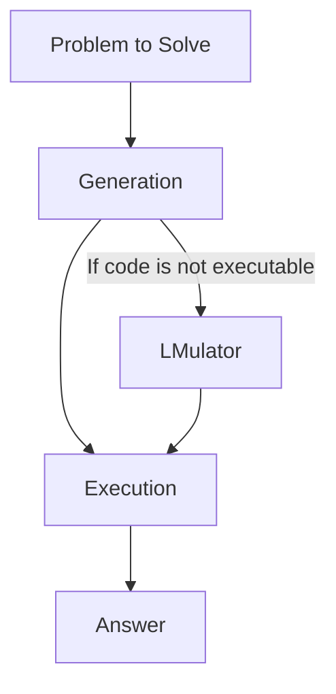

# Chain Of Code (CoC): Unlocking the Full Potential of Large Language Models through Code Generation

Large language models (LLMs) have demonstrated impressive natural language understanding capabilities. However, their ability to precisely reason about quantitative concepts is limited. Asking an LLM to count the number of times sarcasm appears in an essay remains challenging. The edge cases around implementing a `detect_sarcasm()` function are just too complex.

This is the problem the new [Chain of Code](https://arxiv.org/abs/2312.04474) technique from Google DeepMind and Stanford University aims to solve. By seamlessly integrating code generation, execution, and simulation, Chain of Code unlocks LLMs' full reasoning potential across both semantic and numeric domains.

In this extended guide, I will:

1. Explain the shortcomings of LLMs for precise reasoning
2. Break down how Chain of Code works with detailed examples
3. Discuss the significant performance improvements achieved
4. Highlight limitations and future work possibilities

Let's dive in!

## The Precise Reasoning Gap

Transformers and attention mechanisms underpin the exponential progress in language model capabilities over the past several years. Models like GPT-3 can now generate human-like text, answer questions, and even create rudimentary code.

However, fundamental gaps remain when precise reasoning is required:

- **Quantitative reasoning** - Simple arithmetic stumps LLMs. Balancing a budget? Calculating an invoice total? Not reliable.
- **Algorithmic manipulation** - Applying complex logic across data structures? LLMs may hallucinate output.
- **Interpreting edge cases** - Real-world semantic nuances trip up models. Was that sentence sarcastic? LLMs guess blindly.

In essence, linguistic prowess != precise logical reasoning.

The latest [BIG-Bench](https://arxiv.org/abs/2206.04615) benchmarks highlight these gaps clearly. Tasks requiring multi-step arithmetic, programming manipulations, or semantic nuance see significantly lower LLM success rates.

**So how can we unlock LLMs' full potential to reason precisely across numeric and semantic domains?**

That's exactly the question the Chain of Code paper sets out to answer.


## Introducing Chain of Code

Chain of Code enhances LLMs with **code generation** and **execution simulation** abilities to tackle precise reasoning tasks that involve:

- Algorithmic sub-tasks
- Semantic sub-tasks
- A mix of both

For example, consider the query:

_"In the below paragraph, count the number of times sarcasm is detected:"_

```
Thanks for waking me up at 6 AM on a Saturday with your loud music. I really enjoyed starting my weekend so early...
```

This requires:

1. Understanding natural language (to detect sarcasm)
2. Logical manipulation (to count instances)

Traditional LLMs struggle because executing `detect_sarcasm()` code is too complex.

**Chain of Code bridges this gap with a technique called an LMulator.**

## Augmenting LLMs with an LMulator

The key Chain of Code innovation is the **LMulator - integrating LLM execution simulation and code interpretation**.

Specifically, given a reasoning question, Chain of Code:

1. Uses the LLM to **generate code** that structures the problem into sub-tasks
2. **Interprets code** with Python when execution is defined (math, data logic)
3. Uses the LLM to **simulate execution** when undefined (sarcasm detection)
4. **Updates program state** and continues execution

This elegantly combines an interpreter's precision for algorithmic sub-tasks with an LLM's flexible reasoning for semantic sub-tasks.

Concretely, for our sarcasm counting example, Chain of Code would:

1. Generate code to break the task down logically:

   ```python
   paragraph = "Thanks for waking me..."
   count = 0

   detections = detect_sarcasm(paragraph)
   for detection in detections:
       count += 1

   print(count)
   ```

2. Execute defined logic like variables and loops with a Python interpreter

3. Simulate the `detect_sarcasm()` function by generating the output using the LLM:

   ```
   [True, False, True]
   ```

4. Continue executing the code now that `detections` is defined

By integrating simulation when needed, the LLM is not constrained to strictly executable code. This simple augmentation unlocks a vast array of reasoning problems by playing to LLM strengths.



### Understanding through Examples

The flexibility of mixing execution and simulation makes Chain of Code widely applicable. Let's walk through some examples:

#### Quantitative Reasoning

For math and numbers, Python interpretation handles computation precisely:

**Query**: What is -14 + 6 × 8 ÷ 4?

**CoC**:

```python
x = -14
x += 6
x *= 8
x /= 4
print(x) # 2
```

Pure Python execution computes the correct numeric output.

#### Semantic Reasoning

For language tasks, LM simulation provides common sense:

**Query**: Does this paragraph convey happiness?

```
I lost my wallet today. Just great. Now I have to cancel all my cards and get a new ID.
```

**CoC**:

```python
paragraph = "I lost my..."

emotion = detect_emotion(paragraph)

print(emotion == "happiness") # False
```

The LLM simulates `detect_emotion()` to leverage its linguistic understanding.

#### Mixed Reasoning

For combinations of semantic and numeric reasoning, Chain of Code fluidly integrates both:

**Query**: Count the fruits from this list: apple, violin, orange, plum, peaches, pepper

**CoC**:

```python
objects = ["apple", "violin", "orange", "plum", "peaches", "pepper"]

count = 0
for object in objects:
    if is_fruit(object):
        count += 1

print(count) # 4
```

Python loops total count, while LLM simulation classifies fruits.

The interweaving of coding and simulation makes Chain of Code widely applicable for mixed reasoning tasks in this way. Both numeric precision and semantic flexibility are seamlessly integrated.

## Performance Results

So does this technique actually work better?

The Chain of Code paper evaluates on a range of textual and mathematical reasoning benchmarks, including:

- BIG-Bench
- Grade-school math questions
- Cross-task generalization

The results are clear - **significant performance improvements are achieved over previous best methods**:

- **29% higher** accuracy on BIG-Bench hard questions
- **55% reduction** in errors on grade-school math
- **11% improvement** on cross-task generalization

Surprisingly, Chain of Code even exceeds **average human raters** on certain complex reasoning tasks. For algorithmic problems, it matches the **best human** solvers, an impressive feat.

Digging deeper, we see the performance gains stem from both:

1. Code providing scaffolding to reason precisely
2. Simulation handling tasks too ambiguous for coding

This combination is what unlocks the full potential of LLMs - marrying programming precision with language flexibility.

While promising, some limitations exist...

## Limitations and Future Work

The Chain of Code paper highlights a few limitations:

- **Reasoning depth** - Longer code sequences challenge simulation quality
- **Execution efficiency** - Interpretation and simulation increase compute time
- **Type flexibility** - Complex Python objects are not simulated today

However, the simplicity of the technique provides a strong foundation for future work:

- Apply to domains like robot control and data analysis needing mixed reasoning
- Streamline end-to-end training to improve simulation quality
- Build task-specific LMulators to handle domain edge cases
- Integrate structured representations like graphs to aid visualization

I'm excited by a future where LLMs dynamically construct simulated programs to reason about situations. Code gives structure, while language gives flexibility - together they are incredibly powerful.

The journey has just begun!

## Conclusion

In closing, Chain of Code puts forward an elegant method to enhance large language models:

- **Code generation** decomposes problems into logical sub-tasks
- **Selective execution** handles unambiguous algorithmic cases
- **LM simulation** provides common sense for semantics

This simple yet effective technique achieves new state-of-the-art results by combining programming precision and linguistic flexibility - truly getting the best of both worlds.

I highly recommend [reading the full paper](https://arxiv.org/abs/2312.04474) and trying out Chain of Code yourself. Huge thanks to the authors for openly sharing this impactful research!

What reasoning tasks could benefit from this approach? How else might you apply it? I Would love to hear your thoughts and experiments around augmenting LLMs with code.
