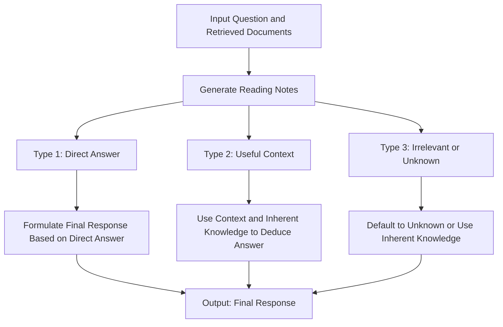

# Unlocking the Black Box: How Chain-of-Note Brings Transparency to Retrieval-Augmented Models (RAG)

## Introduction

Retrieval-augmented language models (RALMs) have emerged as a powerful new paradigm in natural language processing. By combining large pretrained language models with external knowledge retrieval, RALMs aim to reduce factual errors and hallucinations while injecting up-to-date knowledge. However, existing RALMs face several key challenges:

- **Noisy retrieval**: Irrelevant retrieved documents can mislead the model and cause incorrect responses.

- **Unknown robustness**: RALMs struggle to determine if they have enough knowledge to answer a question, and should default to "unknown" when lacking information. 

- **Lack of transparency**: It's unclear how RALMs utilize retrieved information to formulate responses.

To address these issues, researchers from Tencent AI Lab proposed a novel framework called **Chain-of-Note (CON)** in their paper "Chain-of-Note: Enhancing Robustness in Retrieval-Augmented Language Models". 

## Overview of Chain-of-Note

The key idea behind Chain-of-Note is to have the model generate **reading notes** that summarize and assess each retrieved document before formulating the final response. This note-taking process enhances the model's ability to:

- Evaluate relevance of retrieved documents
- Identify reliable vs misleading information  
- Filter out irrelevant or untrustworthy content
- Recognize knowledge gaps and respond "unknown"

Specifically, given a question and k retrieved documents, Chain-of-Note involves:

1. **Note Generation**: Create k reading notes, one for each document, analyzing its relevance.

2. **Synthesis**: Integrate insights from notes to determine a final response.

This approach mirrors human reasoning - breaking down a problem into smaller steps. The notes provide transparency into the model's thought process and improve its noise and unknown robustness. 

## Types of Reading Notes

The notes generated by Chain-of-Note can be categorized into three types:

1. **Relevant**: Document answers the question directly. The final response is extracted from this document.

2. **Irrelevant but useful context**: Document doesn't answer the question but provides useful background. Model combines its knowledge with this context to infer an answer. 

3. **Irrelevant**: Document is irrelevant and model lacks knowledge to answer. Default response is "unknown".

This system allows the model to balance retrieving information directly, making inferences, and acknowledging its limits.

### Example Notes

The Chain-of-Note (CON) framework generates three types of reading notes based on the relevance of the retrieved documents to the input question. Here are examples of what these notes might look like for each type:

1. **Type 1 - Direct Answer:**
   - **Input Question:** "What is the capital of France?"
   - **Retrieved Document:** An article discussing various cities in France.
   - **Generated Note:** "The capital of France is Paris, as mentioned in the article."
   - **Final Response:** "The capital of France is Paris."

2. **Type 2 - Useful Context:**
   - **Input Question:** "How does photosynthesis work?"
   - **Retrieved Document:** A text explaining the basics of plant biology without directly addressing photosynthesis.
   - **Generated Note:** "While the document does not directly explain photosynthesis, it provides useful information about plant biology, indicating that photosynthesis is a process used by plants to convert light into energy."
   - **Final Response:** "Photosynthesis is a process used by plants to convert light into energy, involving the absorption of light by chlorophyll and the conversion of carbon dioxide and water into glucose and oxygen."

3. **Type 3 - Irrelevant or Unknown:**
   - **Input Question:** "What are the latest advancements in quantum computing?"
   - **Retrieved Document:** An article discussing classical computing technologies.
   - **Generated Note:** "The retrieved document does not cover quantum computing and instead focuses on classical computing technologies. The model lacks sufficient information to answer based on this document."
   - **Final Response:** "Unknown, as the available document does not provide relevant information on the latest advancements in quantum computing."

These examples illustrate how the CON framework processes different types of documents: directly using information from relevant documents, deducing answers from contextually useful documents, and acknowledging the gaps in knowledge or irrelevant information.

## Training the Model

To train a model to generate reading notes in this manner, the Tencent team:

- Used ChatGPT to create 10K training examples with different note types.

- Fine-tuned an LLaMa-2 model on this data to learn note-taking abilities. 

- Implemented a weighted loss strategy to focus training on final answer accuracy.

## Evaluating Chain-of-Note 

Experiments across several QA datasets revealed:

- **Improved QA performance**: When using retrieved documents, Chain-of-Note outperformed standard RALMs by +1.97 EM score on average.

- **Enhanced noise robustness**: Given irrelevant retrieved docs, Chain-of-Note improved EM score by +7.9 compared to standard RALMs.

- **Better unknown robustness**: On out-of-domain questions, Chain-of-Note increased rejection rate by +10.5.

## Case Study

Let's walk through an example to see Chain-of-Note in action:

**Question**: When was the Deadpool 2 movie released?

**Doc 1**: Discusses Deadpool 2 releasing on *June 1, 2018* in the US. 

**Doc 2**: Mentions Deadpool 2 premiered May 10, 2018 and released on *May 18, 2018* after date change.

**Standard RALM**: June 1, 2018 ❌

**RALM with Chain-of-Note**:

- *Doc 1 Note*: Suggests Deadpool 2 released June 1, 2018 in US.

- *Doc 2 Note*: Clarifies actual release date was May 18, 2018. 

- *Response*: Based on Doc 2, the answer is May 18, 2018 ✅

This demonstrates how Chain-of-Note carefully analyzes documents and identifies the most relevant, credible details to produce the correct response.

## Key Takeaways

- Chain-of-Note enhances RALM robustness to noisy retrieval and unknown scenarios.

- Note-taking provides interpretability into RALM reasoning process.

- Balances retrieving information, making inferences and acknowledging limits.

- Simple yet effective approach of decomposing complex problems.

## Conclusion

Chain-of-Note offers an exciting new direction for improving reliability and transparency of retrieval-augmented language models. The results on robustness and unknown detection are promising. I highly recommend reading the full paper [https://arxiv.org/abs/2311.09210](https://arxiv.org/abs/2311.09210) and trying out this technique! Please share your thoughts in the comments.

## Citation 

Yu, Wenhao, Hongming Zhang, Xiaoman Pan, Kaixin Ma, Hongwei Wang, and Dong Yu. "Chain-of-Note: Enhancing Robustness in Retrieval-Augmented Language Models." arXiv preprint arXiv:2311.09210 (2023).