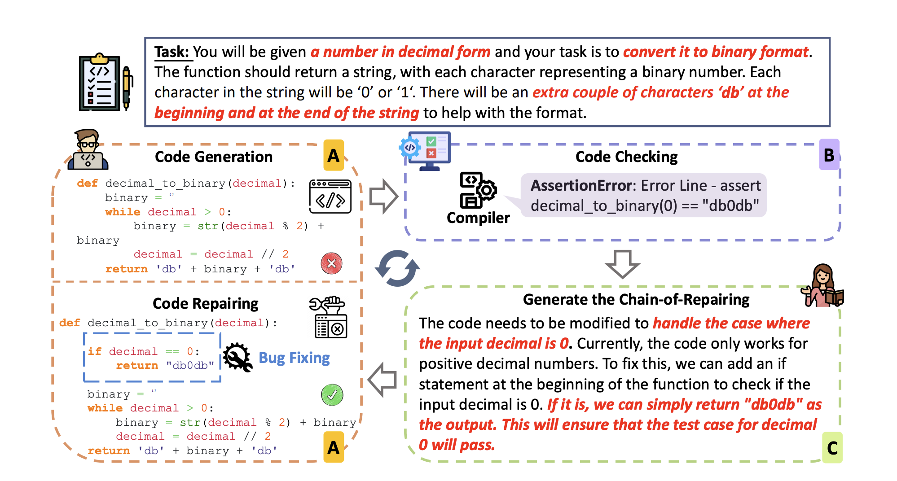
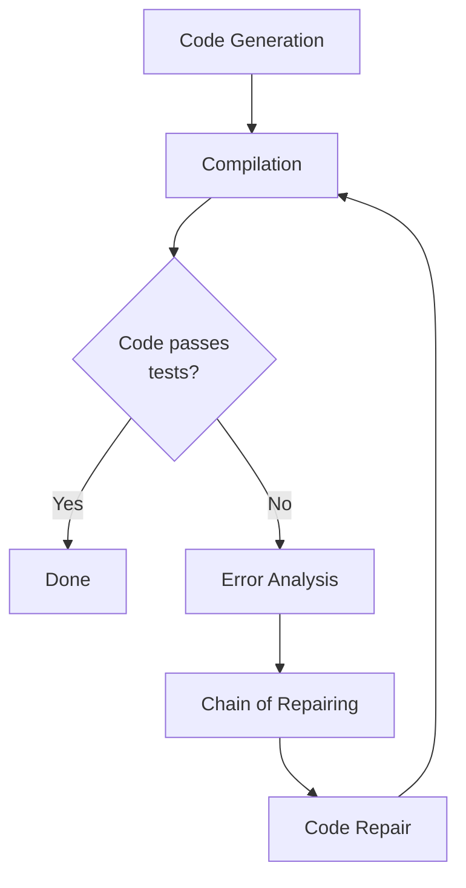

# Enhancing Large Language Models for Program Debugging with Interactive Chain of Repairing

As an avid user of large language models (LLMs) like ChatGPT for programming, I'm always looking for ways to enhance their code generation and debugging abilities. The new technique called INTERVENOR proposed in the paper "INTERVENOR: Prompt the Coding Ability of Large Language Models with the Interactive Chain of Repairing" offers an intriguing approach to improve LLMs' bug fixing skills.

In this article, I'll provide an in-depth explanation of the INTERVENOR method along with multiple examples to demonstrate how it allows LLMs to debug code more systematically.



Figure 2 from teh paper arXiv preprint arXiv:2311.09868.

## My Experience Using LLMs for Programming

As a software engineer, I utilize ChatGPT daily to speed up my workflow. Need a function stubbed out? ChatGPT can provide a complete implementation from a docstring. Stuck on a gnarly bug? ChatGPT can often identify flaws in my code. I've found it can replace my need for searching StackOverflow or documentation in many cases.

However, there are still clear limitations in ChatGPT's independent programming abilities. Frequently, it will generate plausible-looking code that completely fails on edge cases or contains subtle logical errors.

I've found the biggest struggle is ChatGPT's ability to effectively debug its own generated code. It suffers from the classic programmer's blindspot - overlooking flaws in our own code due to bias and cognitive inertia. Once ChatGPT produces code, it becomes anchored in that train of thought. It struggles to re-evaluate and identify potential bugs.

This phenomenon is referred to as the **Degeneration of Thought (DoT)** problem in the paper. ChatGPT and other standard LLMs tend to get stuck in a faulty mindset when tasked with fixing their own code. Their self-correction skills need work.

The INTERVENOR technique aims to address this limitation and improve LLMs' systematic debugging capabilities.

## Overview of the INTERVENOR Approach

At a high-level, here's how INTERVENOR works:

- An LLM generates initial code for a given programming task
- The code is run through an external compiler to identify bugs
- A "Code Teacher" agent analyzes error messages and generates a Chain of Repairing explanation
- A "Code Learner" agent follows the instructions to modify the code
- The process repeats until the code passes all test cases

By incorporating an external tool for debugging, INTERVENOR avoids over-reliance on the LLM's self-evaluation. The LLM agents collaborate to re-think code flaws and address bugs in a step-wise manner.

The key innovations are using compiler feedback to prompt the debugging process and the interactive Chain of Repairing to systematically modify the code.



Let's break this down in more detail.

## The INTERVENOR Architecture

The INTERVENOR framework comprises two main LLM agents with distinct roles:

- **Code Learner:** Generates initial code and repairs it when prompted
- **Code Teacher:** Analyzes errors and provides instructions for repairing

The system leverages an external compiler to catch bugs in the Code Learner's generated code. The error messages are used by the Code Teacher to understand bugs and create the Chain of Repairing - explanations for how to modify the code.

The agents interact cyclically:

1. **Code generation:** The Code Learner creates initial code for a given programming task
2. **Compilation:** The code is run through the compiler, revealing any bugs
3. **Error analysis**: The Code Teacher examines error messages to identify issues
4. **Chain of Repairing**: The Code Teacher generates concise instructions explaining how to fix the code
5. **Code repair**: The Code Learner modifies the code as directed
6. **Repeat**: The process continues until the code passes all test cases

This workflow allows systematically isolating, explaining, and addressing bugs in the generated code. The compiler acts as the external "intervener" to facilitate the collaborative debugging process.

### The Compiler as an Intervenor

A key aspect of INTERVENOR is the use of the compiler to catch bugs. This serves multiple purposes:

- Provides an objective external check to overcome the LLM's self-evaluation bias
- Error messages give specific insight into the type and location of bugs
- Focuses the debugging effort on valid issues verified by the compiler

Without this external feedback, the system would rely solely on the Code Learner's flawed self-assessment of its code correctness. The compiler intervenes to steer the debug process and ground it in real code issues.

### Chain of Repairing Explains and Instructs

The Chain of Repairing generated by the Code Teacher is the glue that ties the INTERVENOR workflow together.

For each bug identified by the compiler, the Code Teacher analyzes the error message and generates text explaining:

- What is causing the bug
- How to modify the code to address it

This description both **isolates the specific issue** and provides an **instruction plan** for the Code Learner to follow.

For example, for an off-by-one index error, the Chain of Repairing might state:

_"The loop index needs to start at 0 instead of 1, causing an out-of-bounds access. Update the for loop condition to fix this."_

The Code Learner can then follow this clear guidance to repair its code.

By explicitly re-thinking the bug causes and solutions, the Chain of Repairing allows systematic, directed code modification. The agents collaborate to incrementally improve the code quality.

## Walkthrough of Interactive Debugging

To better understand how this all fits together, let's walk through a debugging example in Python.

Say we want an LLM to implement a function that checks if any two elements in a list are within a threshold distance:

```python
"""
Check if any two numbers in the input list are closer
than the given threshold.

>>> has_close_elements([1.0, 2.0, 3.0], 0.5)
False

>>> has_close_elements([1.1, 1.9, 5.0], 0.2)
True
"""

def has_close_elements(numbers, threshold):

  # Code Learner generates initial implementation

  ...

```

The Code Learner might produce this logic:

```python
def has_close_elements(numbers, threshold):

  for index1, num1 in enumerate(numbers):

    for index2, num2 in enumerate(numbers):

      if index1 != index2:

        diff = abs(num1 - num2)

        if diff < threshold:
          return True

  return False
```

This nested loop compares each pair of numbers. At first glance, it looks reasonable.

When we run it through the compiler though, we get:

```
AssertionError: Example 2 failed

Expected: True
Got: False
```

One test case fails - indicating a bug.

Now the Code Teacher analyzes this and generates the following Chain of Repairing:

_"The logic does not correctly check pairs of numbers. It should compare index1 to index2, not the numbers themselves. Swap the check to if index1 != index2 to fix this."_

Following this clear guidance, the Code Learner modifies the logic:

```python
#...

for index1, num1 in enumerate(numbers):

  for index2, num2 in enumerate(numbers):

    # Check indices rather than numbers

    if index1 != index2:

      diff = abs(num1 - num2)

      if diff < threshold:
        return True

#...
```

When re-run, the code now passes all test cases! The Code Teacher's explicit instructions enabled directed repair of the bug.

We can imagine this process repeating - identifying issues through compiler errors, localizing bugs via Chain of Repairing instructions, and iteratively modifying the code until it is correct.

## Benefits of the INTERVENOR Approach

The INTERVENOR technique provides several advantages over standard LLM code generation:

- **More accurate bug identification**: By using an external compiler, it overcomes reliance on the LLM's flawed self-assessment

- **Focused debugging**: Error messages localize specific issues to address rather than needing to review all code

- **Systematic repair**: The Chain of Repairing provides actionable instructions for modifying code

- **Gradual improvement**: Bugs are incrementally fixed through repeated agent collaboration

- **Efficient learning**: Experiments found optimal performance was achieved in just 2-3 iterations

- **Generalizability**: The approach is broadly applicable across programming languages and code tasks

In tests, INTERVENOR improved over baseline models by 13% in code generation and 4.5% in translation tasks.

The method mimics how human developers constructively debug - leveraging tools to identify bugs and correct code in a step-wise fashion. This collaborative, compiler-guided repair approach addresses key weaknesses in large language models' independent programming skills.

## Code Repairing in Action

To better visualize the interactive debugging process, let's walk through some additional examples.

### Example 1: Handling Edge Cases

Suppose we prompt ChatGPT to implement a function that sums all numbers in a nested list structure:

```python
"""
Given a nested list of integers, return the total sum.

>>> list_sum([1, 2, [3, 4], [5, 6]])
21

>>> list_sum([[1, 2], 3, 4])
10

>>> list_sum([10])
10
"""

def list_sum(data):

  # Initial implementation

  ...

```

It might generate this logic:

```python
def list_sum(data):

  total = 0

  for x in data:

    total += x

  return total
```

This sums all numbers but fails if the input contains nested lists. The compiler shows it fails the first test case.

The Code Teacher identifies the issue:

_"The logic does not properly handle nested lists. It needs to check if each element is a list and recursively call to sum it."_

Following this guidance, the Code Learner updates the code:

```python
def list_sum(data):

  total = 0

  for x in data:

    if isinstance(x, list):
      total += list_sum(x)
    else:
      total += x

  return total
```

The recursive call now correctly handles nested structures.

### Example 2: Fixing Logical Errors

As another example, consider a function that classifies even and odd numbers:

```python
"""
Given a list of integers, return two lists of even and odd numbers.

>>> split_parity([1, 2, 3, 4])
[[2, 4], [1, 3]]
"""

def split_parity(numbers):

  # Code Learner's initial implementation

  ...
```

It generates:

```python
def split_parity(numbers):

  even = []
  odd = []

  for n in numbers:

    if n % 2 = 0:
      even.append(n)
    else:
      odd.append(n)

  return even, odd
```

But this code has a logical comparison error - it assigns rather than compares to 0. The compiler raises an exception.

The Code Teacher provides the insight:

_"The condition checking if a number is even has an assignment rather than equality check. Replace = with == to fix this."_

Correcting this typo addresses the bug:

```python

  if n % 2 == 0:

    even.append(n)

```

The Code Learner is able to integrate the feedback to repair its logic.

### Example 3: Handling Multiple Bugs

Finally, let's look at an example that requires iteratively fixing multiple issues.

Consider a function to sort a list of strings lexically:

```python
"""
Given a list of words, return the lexically sorted list.

>>> lex_sort(['cat', 'apple', 'bat'])
['apple', 'bat', 'cat']
"""

def lex_sort(words):

  # Code Learner's first attempt

  ...
```

It generates:

```python

def lex_sort(words):

  sorted_words = []

  for word in sorted(words):
    sorted_words.append(word)

  return sorted_words

```

This has two bugs:

1. It tries to sort the input list directly rather than creating a copy
2. It uses sorted() which performs actual sorting rather than comparing

Running through the compiler reveals the first issue. The Code Teacher explains:

_"The code modifies the input list directly rather than sorting a copy. Create a new list and append words to it."_

The Code Learner applies this fix:

```python

# Make a copy to sort

sorted_words = words[:]

for word in sorted(words):

  sorted_words.append(word)

return sorted_words

```

When re-run, the second bug appears. The Code Teacher catches this:

_"The sorted() function actually performs sorting. To compare lexicographically, use > rather than sorted()."_

The Code Learner makes this final modification:

```python

for i in range(len(words)):

  min_index = i

  for j in range(i+1, len(words)):

    if words[min_index] > words[j]:
      min_index = j

  words[i], words[min_index] = words[min_index], words[i]

```

With both issues addressed incrementally, the code now functions correctly!

This demonstrates how multiple Chain of Repairing instructions can systematically fix bugs one-by-one through agent collaboration.

## Conclusion

The INTERVENOR technique provides an intriguing method to enhance large language models' debugging skills. By incorporating compiler feedback and prompting focused repairs via interactive Chain of Repairing instructions, it addresses inherent weaknesses in LLM code generation.

The approach mimics effective human debugging: leveraging tools to catch bugs, localizing issues, and incrementally modifying code guided by insights.

For developers like myself who regularly utilize ChatGPT and other LLMs for programming assistance, INTERVENOR offers a promising avenue to improve their autonomous coding abilities. With further development, techniques like this could make AI agents even more proficient and reliable.

The paper provides a thorough investigation and evaluation of the method. If you're interested in more technical details, I highly recommend [reading the full article here.](https://arxiv.org/abs/2311.09868) I welcome your thoughts and feedback on this technique in the comments below!

# Citations

Wang, Hanbin, Zhenghao Liu, Shuo Wang, Ganqu Cui, Ning Ding, Zhiyuan Liu, and Ge Yu. 2023. "INTERVENOR: Prompt the Coding Ability of Large Language Models with the Interactive Chain of Repairing." arXiv preprint arXiv:2311.09868.
