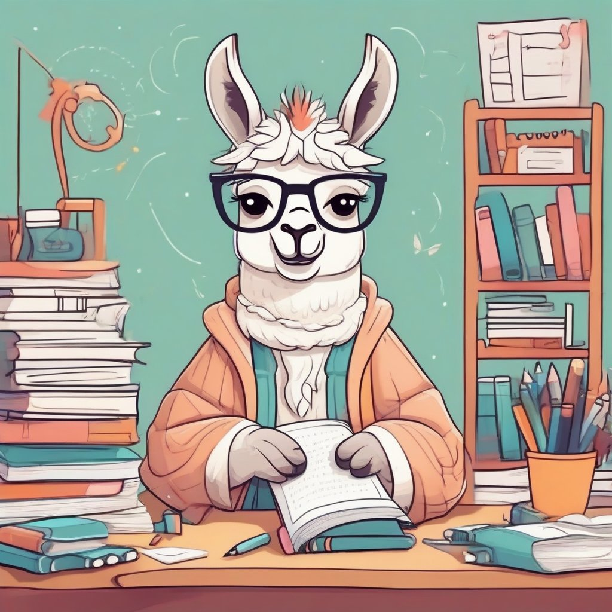
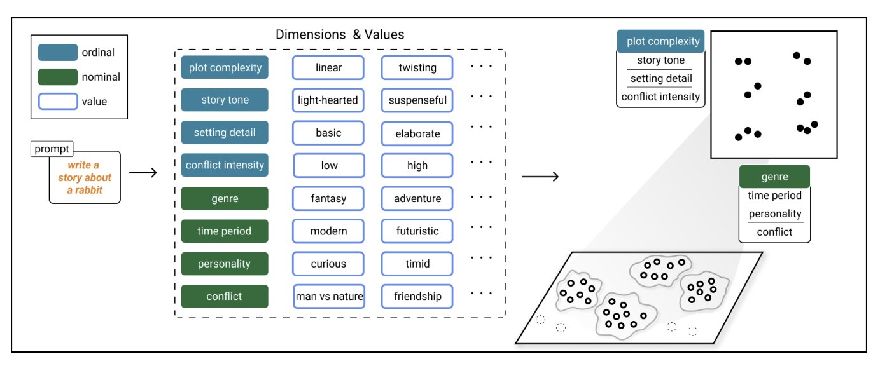

# Unlocking Human Creativity through Structured AI Co-Creation

Generative AI is rapidly transforming how we create. Systems like DALL-E for images and ChatGPT for text showcase the potential for AI to augment human creativity in groundbreaking ways. However, simply having access to generative models is not enough. To truly unlock human creativity, we need a deep understanding of how to effectively structure the AI co-creation process. 

A new research paper titled ["Structured Generation and Exploration of Design Space with Large Language Models for Human-AI Co-Creation"](https://arxiv.org/abs/2310.12953) provides compelling insights into how to achieve this. As an AI expert and strategist, I was eager to dive into this paper and distill the key ideas for a broader audience. In this article, I'll walk through the core concepts, results, and implications of this research.

## The Game-Changing Potential of Generative AI

Generative AI has incredible capacity to enhance human creativity. Systems like DALL-E 3 and Stable Diffusion can generate hundreds or even thousands of novel images from a simple text prompt. Meanwhile, models like GPT-4 and PaLM can produce diverse, high-quality text tailored to our requests. 

This opens up new possibilities for combining human and artificial creativity. We can explore "what if" scenarios by generating a multitude of variations on a theme. We can rapidly ideate by trying out different directions and remixing AI-generated content. And we can even co-create by interleaving our own contributions with AI-generated suggestions.

However, there is still untapped potential. If we want to truly augment human creativity rather than just automate parts of the creative process, we need a structured approach for human-AI co-creation. This research provides compelling principles for doing just that. 

## The Need for Systematic Exploration

When we engage generative models in an unstructured, ad hoc way, it leads to a scattered, haphazard creative process. We throw prompts at the AI and get back semi-random outputs without necessarily expanding our thinking or exploring the possibilities.

This tends to trap us in a cycle of convergent thinking - prematurely narrowing in on a suboptimal idea and iterating on it rather than opening up new directions. Even when we generate multiple outputs, the exploration is undirected. 

To avoid these pitfalls, we need to systematically map out the **design space** - the scope of possible ideas, solutions, and directions for a creative endeavor. This allows us to take full advantage of the AI's generative power to comprehensively explore possibilities instead of constraining our thinking.

That's why the authors of this paper developed an approach called **"Structured Generation and Exploration of Design Space with Large Language Models."** Their techniques empower users to diverge, conceive, and converge in a thoughtful, structured manner when co-creating with AI.

## Core Approach: Prompting for Design Space

The key innovation of this research is prompting AI models to construct a design space for exploration, rather than just responding with a single output. 

There are two main steps:

1. **Generate Dimensions**: Prompt the AI to identify key dimensions relevant to the user's topic or creative goal. For example, for a storytelling prompt, this may produce dimensions like genre, tone, setting, plot structure. 

2. **Generate Responses**: Use the dimensions to systematically generate a diverse set of responses that represent different points in the design space. For instance, combine different dimension values to create story prompts like "humorous mystery in medieval setting" or "somber drama in dystopian future."

By making the dimensions and corresponding responses explicit, this approach provides a structure for reflecting on the design space and navigating it through purposeful variation along the dimensions.

Let's walk through exactly how the researchers instantiated this idea in an interactive co-creation system called Luminate.

## Luminate System Walkthrough 

Luminate demonstrates how the "prompting for design space" approach can be translated into a co-creation workflow. It allows users to collaborate with AI in a flexible yet structured manner.

The interface consists of two main sections - a text editor panel and an exploration view:

*Image source: [Structured Generation and Exploration of Design Space with Large Language Models for Human-AI Co-Creation](https://arxiv.org/abs/2310.12953)*

Let's go through the key steps:

### 1. User Inputs Prompt

The user types a text prompt into the chat box, like "Write a poem about the ocean."

### 2. AI Generates Dimensions 

Behind the scenes, Luminate feeds this prompt into a large language model API to produce relevant dimensions, such as:

- Mood (Somber, Peaceful, Hopeful, etc.)
- Setting (Beach, Open Ocean, Underwater Cave, etc.)  
- Style (Haiku, Free Verse, Sonnet, etc.)

### 3. AI Generates Responses

Luminate automatically combines different values across the dimensions to generate requirements like:

- Mood: Somber, Setting: Open Ocean, Style: Haiku

It prompts the AI to generate diverse responses fitting these requirements.

### 4. User Explores Responses

The generated responses appear as dots in the exploration view. Users can click on dots to preview the text content. They can also visually organize the responses by dragging dimensions onto axes. This lets them cluster and filter responses based on the dimension values.

### 5. User Steers Response Generation

Users aren't limited to the initial set of responses. They can guide the generation of new responses by creating new dimensions or specifying certain dimension values.

### 6. User Integrates Responses

Finally, users can copy over any responses they like into the text editor and edit them into a coherent poem, story, or other creation. The integrated text is highlighted so they can keep track of integrated versus original content.

This walkthrough illustrates the back-and-forth co-creation between user and AI facilitated by prompting for design space. By explicitly enumerating and organizing the dimensions, Luminate enables users to systematically explore possibilities and converge on an integrated artifact they are satisfied with.

## Evaluation with Professional Writers

To assess the feasibility and usefulness of this approach, the researchers evaluated Luminate through a qualitative user study with 8 professional writers. The participants had 5+ years of experience on average and used AI tools extensively in their workflows.

The study involved three phases:

1. **Tutorial:** Participants learned how to use Luminate's features through demonstration and hands-on practice.

2. **Creative task:** Participants used Luminate to complete writing tasks like crafting a story, song lyrics, marketing content based on their domain expertise.

3. **Feedback:** Participants filled out surveys on dimensions like usability and creativity support. They also participated in semi-structured interviews comparing Luminate to tools like ChatGPT.

Here are some highlights from the results:

- Participants found Luminate highly usable, easy to learn, and creativity-enhancing. It scored 80.6 out of 100 on the Creativity Support Index for tools.

- 100% agreed that Luminate helped them discover new content and think outside the box during ideation.

- 87.5% agreed that the generated dimensions were useful for reflecting on their design space. 

- 87.5% said visualizing the exploration space helped them achieve a comprehensive understanding of the design space.

- In interviews, all 8 participants preferred Luminate over ChatGPT for creative writing. They emphasized how it aligns better with exploratory creative workflows.

This provides promising initial evidence that structuring AI co-creation around design space exploration could make generative models even more beneficial for human creativity.

## Broader Implications

While this research focused on a text generation context, the fundamental approach is domain-agnostic. Prompting AIs to surface relevant dimensions and mapping responses into those dimensions could enhance human-AI co-creation across diverse creative fields.

For example, this method could translate well to visual domains like logo design, architectural drafting, fashion sketching, and more. The AI could suggest dimensions around concepts like shape, color palette, texture, composition, and style. Users could then evolve a design through iterative generation along those dimensions.

More broadly, this work highlights the importance of developing interactions and workflows that fully leverage the complementary strengths of human and artificial intelligence:

- **Human strengths**: Providing high-level goals, contextual awareness, evaluating quality and fit, remixing ideas
- **AI strengths**: Fast generation of novel possibilities, ability to produce variations along well-defined dimensions

By recognizing these complementary roles, we can create AI systems that expand human creativity rather than simply attempt to automate it. This research provides both inspiration and practical techniques to achieve that vision.

Of course, there are still limitations to address. Some users felt overwhelmed by the number of responses generated. The quality and relevance of dimensions varied. And evaluating AI-generated content for accuracy remains an inherent challenge. 

Nonetheless, this work represents a significant advance in reshaping how we can co-create with generative AI in a thoughtful, structured manner. The introduction of design space prompting opens up new possibilities for human-AI collaboration.

## In Closing

Generating content with AI will continue accelerating across industries. But simply outsourcing creation to black-box systems misses the bigger opportunity - reinventing our creative processes and design workflows to strategically incorporate AI's strengths. 

This research provides compelling evidence and principles for how to achieve that through structured exploration of design spaces. I highly recommend [reading the full paper](https://arxiv.org/abs/2310.12953) to absorb the details and implications.

The future of creativity will be defined by this fusion of human and artificial ingenuity. And human-centered techniques like design space prompting put us on the path toward that future. It's an exciting frontier filled with immense opportunities to augment and elevate human imagination.