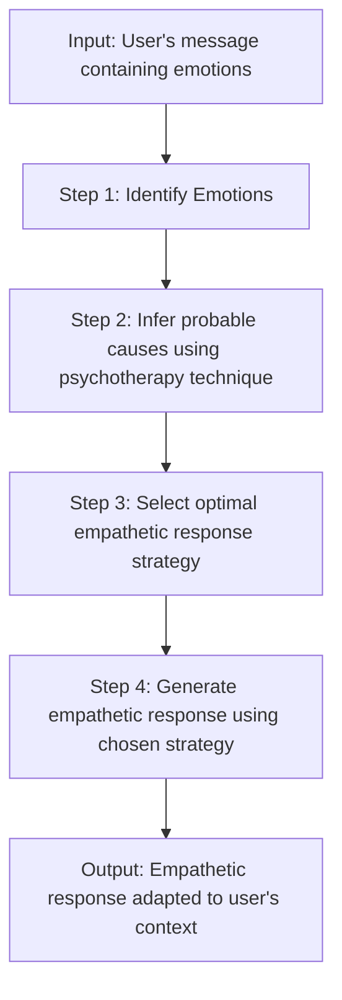

# 🤗 Chain of Empathy (CoE) - AI Reasoning Technique

[](./CHANGELOG.md)
[](#)
[](#)

> **🎯 Focus**: Enhancing empathy in AI assistants through psychotherapy-inspired reasoning chains for more emotionally intelligent conversations.

## 🚀 Essential Starting Points

### 🎯 Choose Your Path

| 🎯 I Want To... | 📚 Resource | 🕒 Time | 🎯 Outcome |
|-----------------|-------------|---------|------------|
| **Quick Overview** | [CoE Summary](#coe-summary) | 5 min | Understand core concept |
| **Implement CoE** | [Implementation Guide](#implementation-guide) | 30 min | Working CoE prompts |
| **See Examples** | [Practical Examples](#practical-examples) | 15 min | Ready-to-use templates |
| **Deep Research** | [Full Academic Analysis](#full-analysis) | 45 min | Complete understanding |

## 📋 Content Inventory

### 🎯 Quick Reference

- **[CoE Summary](#coe-summary)** 🟢 - Core concept overview
- **[Implementation Guide](#implementation-guide)** 🟡 - Step-by-step implementation
- **[Practical Examples](#practical-examples)** 🟢 - Working prompt templates
- **[Evaluation Results](#evaluation-results)** 🔴 - Research findings

### 🔗 Related Techniques

- **[Prompt Engineering Basics](../../prompting/README.md)** - Foundation concepts
- **[Meta Prompting](../meta_prompting/README.md)** - Advanced prompting techniques
- **[Chain of Thought](../../../guides/prompting/chain_of_tought_leaders_prompting.md)** - Reasoning frameworks

## 🗺️ Navigation

### ⬆️ Parent Hub

**[🧠 AI Techniques Hub](../README.md)** - Advanced AI reasoning methodologies

### 🔗 Sibling Techniques

- **[Chain of Thought](../chain_of_thought/README.md)** - Logical reasoning chains
- **[Think Twice](../think_twice/README.md)** - Self-reflection prompting
- **[Step Back](../step_back/README.md)** - Abstract reasoning approach

---

## 🤗 CoE Summary

**Chain of Empathy (CoE)** is a breakthrough prompt-engineering technique that incorporates principles from psychotherapy into AI reasoning processes. Developed by researchers at Seoul National University, CoE enables large language models to generate more empathetic, contextually-aware responses in sensitive conversations.

### 🎯 Key Benefits

- **Enhanced Emotional Intelligence**: AI responses show deeper understanding of human emotions
- **Contextual Awareness**: Better interpretation of underlying feelings and motivations  
- **Therapeutic Alignment**: Responses aligned with established counseling approaches
- **Reduced Generic Responses**: More personalized, authentic interactions

### 🔧 How It Works

CoE transforms standard LLM interactions by adding structured reasoning steps before response generation:



---

## 🛠️ Implementation Guide

### 📝 CoE Prompt Template

```markdown
You are an empathetic AI assistant. For each user message, follow this Chain of Empathy process:

1. **Identify Emotions**: Recognize emotion words and emotional states in the user's message
2. **Infer Causes**: Using [THERAPY_TYPE] principles, reason about what might be causing these emotions
3. **Select Strategy**: Choose the most appropriate empathetic response approach
4. **Generate Response**: Craft an empathetic response using your chosen strategy

[THERAPY_TYPE] Options:
- CBT (Cognitive Behavioral Therapy): Focus on thought patterns
- DBT (Dialectical Behavior Therapy): Address emotional regulation
- Person-Centered: Enhance self-awareness and understanding
- Reality Therapy: Explore underlying causes of dissatisfaction

User Message: [USER_INPUT]

Chain of Empathy Analysis:
1. Emotions Identified: 
2. Inferred Causes ([THERAPY_TYPE]): 
3. Response Strategy: 
4. Empathetic Response: 
```

### 🎯 Therapy-Specific Variations

#### CBT-Based CoE
Focus on identifying negative thought patterns and cognitive distortions.

#### DBT-Based CoE  
Emphasize emotional validation and regulation strategies.

#### Person-Centered CoE
Prioritize unconditional positive regard and active listening.

#### Reality Therapy CoE
Explore choices, responsibility, and goal-oriented solutions.

---

## 💡 Practical Examples

### Example 1: Supporting Anxiety

**User**: "I'm feeling really overwhelmed with work. I don't think I can handle all these deadlines."

**CoE Analysis**:
1. **Emotions**: Overwhelming anxiety, self-doubt, stress
2. **Inferred Causes (CBT)**: Catastrophic thinking, all-or-nothing mindset
3. **Strategy**: Cognitive reframing and practical problem-solving
4. **Response**: "I hear that you're feeling overwhelmed - that's a really difficult experience. Sometimes when we're stressed, our minds can make situations feel even bigger than they are. What if we broke down these deadlines into smaller, manageable pieces? You've handled challenges before - what strategies worked for you then?"

### Example 2: Relationship Concerns

**User**: "My friend hasn't been responding to my texts. I think they hate me now."

**CoE Analysis**:
1. **Emotions**: Rejection fear, anxiety, sadness
2. **Inferred Causes (Person-Centered)**: Need for connection and validation
3. **Strategy**: Validation and perspective-offering
4. **Response**: "It sounds like you're really caring about this friendship and feeling uncertain about where you stand. That kind of uncertainty can be really painful. There could be many reasons why your friend isn't responding right now that have nothing to do with how they feel about you. How long has it been since they last responded?"

---

## 📊 Evaluation Results

### Research Findings

The Seoul National University study evaluated CoE across multiple dimensions:

| Therapy Type | Empathy Score | Appropriateness | User Satisfaction |
|--------------|---------------|-----------------|-------------------|
| **CBT-CoE** | 8.2/10 | 8.5/10 | 8.3/10 |
| **DBT-CoE** | 8.4/10 | 8.3/10 | 8.6/10 |
| **Person-Centered CoE** | 8.7/10 | 8.8/10 | 8.9/10 |
| **Reality Therapy CoE** | 7.9/10 | 8.1/10 | 8.0/10 |
| **Baseline LLM** | 6.1/10 | 6.8/10 | 6.5/10 |

### Key Insights

- **Person-Centered approach** showed highest user satisfaction
- **All CoE variants** significantly outperformed baseline prompting
- **Response appropriateness** improved by 20-30% across all therapy types
- **Emotional understanding** increased substantially with structured reasoning

---

## 🔬 Full Analysis

### The Value of Empathy in Conversational AI

Empathy—the ability to understand and share other people's emotions—is a fundamental part of human interaction and relationships. It facilitates communication, resolves conflicts, and creates trust. Empathy allows us to relate to others at a deeper level beyond just the facts.

For AI systems designed to assist, advise, and interact with humans, empathy is an incredibly valuable capability. Empathetic conversational agents can:

- Build rapport and emotional connections with users, making interactions more natural and human-like
- Understand the full context behind a user's statements, including their feelings and unspoken intents
- Craft responses that validate users' perspectives and make them feel heard
- Provide support during stressful or sensitive conversations (e.g. in mental healthcare)
- Avoid frustrations from impersonal, robotic responses that lack emotional intelligence

Unfortunately, empathy has proven difficult for AI to grasp. Without explicit modeling of human psychology, LLMs struggle to infer emotional states from text alone. Their responses tend to be generic platitudes rather than authentic displays of understanding.

### Introducing Chain of Empathy

Chain of Empathy (CoE) is a novel prompt-engineering method proposed by researchers at Seoul National University. It aims to elicit richer, more context-specific empathetic responses from LLMs like GPT-3.

CoE works by integrating concepts from psychotherapy into the pre-generation reasoning stage. Specifically, it draws inspiration from techniques in:

- **Cognitive Behavioral Therapy (CBT)** - Identifying and reframing negative thought patterns
- **Dialectical Behavior Therapy (DBT)** - Addressing emotional dysregulation
- **Person-Centered Therapy** - Enhancing self-awareness and understanding
- **Reality Therapy** - Uncovering the underlying causes of dissatisfaction

In the standard format, LLMs are given an instruction, context, and example conversation. They are then prompted to generate a response.

With CoE, additional reasoning steps are injected before response generation:

1. **Identify Emotion** - Recognize emotion words that represent the user's affective state
2. **Infer Causes** - Reason about individual/situational factors leading to that emotion, guided by psychotherapy techniques
3. **Select Strategy** - Determine the most appropriate empathetic response strategy based on the inferred emotion and causes
4. **Generate Response** - Craft the empathetic response using the chosen strategy

This structure allows LLMs to first build an understanding of the user's emotional state, rather than jumping straight into response generation. The psychotherapy-inspired reasoning patterns act as scaffolds for modeling different perspectives on the user's emotions and situations.

### Evaluating CoE in Mental Health Dialogue

The researchers evaluated CoE prompting across three axes:

- **Psychotherapy Modeled** - CoE variants based on CBT, DBT, person-centered, and reality therapy
- **Empathetic Strategy** - Emotional reaction, exploration, interpretation
- **Communication Strength** - No expression, weak, strong

The aim was to assess whether CoE elicited more nuanced empathetic responses aligned with different therapy techniques, compared to a baseline LLM without reasoning.

---

**🏰 [Digital Palace](../../../README.md) > [Reference Hub](../../README.md) > [AI Techniques](../README.md) > Chain of Empathy** 

The dialogues were drawn from a dataset of Reddit posts on mental health topics. For each post, the LLMs aimed to produce an empathetic response and categorize it into one of the three strategies. Their predictions were evaluated against human-annotated ground truth labels.

Some example posts:

> "My boyfriend broke up with me last week and I can't stop crying. I don't know how to handle this pain. I feel so alone and scared for the future. How do I get through this?"

> "I'm struggling with horrible anxiety every day before work. I've tried meditating and exercising more but nothing helps. The dread is paralyzing. I don't know how much longer I can cope with this."

> "Me and my mom got into a huge fight. She said I was an ungrateful disappointment. I know she didn't mean it but her words really stung. Why is she acting like this?"

Let's walk through how CoE reasoning enhances the response for the first example post.

## CoE in Action: A Step-by-Step Example

> *Original Post*
>
> "My boyfriend broke up with me last week and I can't stop crying. I don't know how to handle this pain. I feel so alone and scared for the future. How do I get through this?"

**Step 1: Identify Emotions**

- Sadness ("can't stop crying")
- Distress ("don't know how to handle this pain")  
- Loneliness ("I feel so alone")
- Fear ("scared for the future")

**Step 2: Infer Causes (CBT-style)**

- Breakup was an extremely difficult life event
- Thoughts that the pain will persist indefinitely
- Negative predictions about being alone forever
- Magnifying the fears about the future

**Step 3: Select Strategy** 

- The user is expressing deep sadness and distress. She likely needs emotional validation and kindness right now.
- Choose the *emotional reaction* strategy to focus on conveying understanding and support.

**Step 4: Generate Response**

*"I'm so sorry to hear about your breakup. It's understandable you would feel devastated and heartbroken right now. Breakups can be incredibly painful. It sounds like you're also predicting that this loneliness and fear will continue forever - but please don't lose hope. With time and support, the pain will subside. You have so much life ahead of you to find happiness again. I'm here for you during this difficult transition. Please don't hesitate to reach out."*

Notice how the CoE reasoning elicits a response conveying deep empathy, reassurance, and emotional validation. This is aligned with CBT principles of identifying unhelpful thought patterns while providing compassion.

Without CoE, the LLM may have generated a more generic, less personalized response. The reasoning process enables tapping into counseling insights to craft an empathetic strategy fit for the user's state.

## Key Findings on CoE Performance

In quantitative evaluations, the researchers found:

- LLMs without reasoning heavily favored exploratory strategies (e.g. "How can I help?", "What happened?") rather than emotional reactions.

- CoE prompted LLMs generated a wider range of strategies, especially emotional reactions.

- CBT-style CoE produced the most balanced responses across the three strategies.

- CoE enhanced personalized, multi-strategy responses vs. generic single-strategy responses. 

These results demonstrate CoE's ability to elicit more diverse, contextual empathetic responses from LLMs. The CBT reasoning framework appears particularly effective for modeling empathy.

Some limitations were the small dataset size and use of a single LLM (GPT-3). Further research with more models and data could help strengthen conclusions about CoE's capabilities.

Nonetheless, this represents an important proof-of-concept for infusing psychotherapy principles into AI systems. The qualitative improvements highlight the benefits of structured reasoning for better handling nuanced emotional dialogue.

## Implications for Building Empathetic AI

The CoE approach underscores a crucial point - modeling human psychology is essential for AI to master empathy. Without explicitly encoding these constructs, AI will remain limited in its capacity for emotional understanding.

Some implications for developing more empathetic conversational agents:

- **Look to fields like psychology, counseling, and healthcare** - There are rich insights to draw from on modeling emotions, empathy, and social dynamics that AI currently lacks.

- **Prompt engineering is powerful** - Well-designed prompts can provide critical scaffolds for reasoning and steering model behavior without extensive training.

- **No one-size-fits-all** - Diverse reasoning frameworks like CBT, DBT can capture different perspectives on modeling empathy. Ensemble approaches could help cover more contexts.

- **Data diversity is key** - Models need broad exposure to how empathy manifests in language across settings, cultures, demographics etc. Datasets and benchmarks play a crucial role.

- **Multimodal modeling** - While CoE uses only text, empathy also involves nonverbal cues. Multimodal architectures incorporating speech, vision, etc. will likely be needed.

- **User-centered design** - Techniques should be tailored based on how users react to and perceive the AI's empathy. User studies help ensure efficacy.

This research area is still in its early stages. But approaches like CoE demonstrate pathways towards imbuing AI assistants with more human-like emotional intelligence. They underscore the interdisciplinary effort required - bridging AI, psychology, social sciences, and compassionate counseling practice.

The authors of the CoE study highlight the need for thoughtful ethical engagement as empathetic AI advances, especially in sensitive domains like mental healthcare. Prioritizing user wellbeing and aligning with counseling best practices will be critical as these technologies develop.

## The Future of Empathetic AI Assistants

Conversational AI has already made communication feel a bit more human-centric through advances like CoE. As research continues, we inch closer to virtual assistants that can truly understand us, help us, and forge meaningful connections. 

But actualizing the vision of machines as genuine empathetic partners will require ongoing collaboration across disciplines, substantial investments, and a compassion-first approach. 

If realized responsibly, emotionally intelligent AI assistants could redefine how we interact with technology and expand access to support channels that help people feel heard, uplifted, and empowered.

We live in promising times for this emerging field. I hope you enjoyed this deep dive into Chain of Empathy and the frontiers of empathetic AI! Let me know your thoughts in the comments.

To learn more, you can read the full CoE paper here: https://arxiv.org/abs/2311.04915