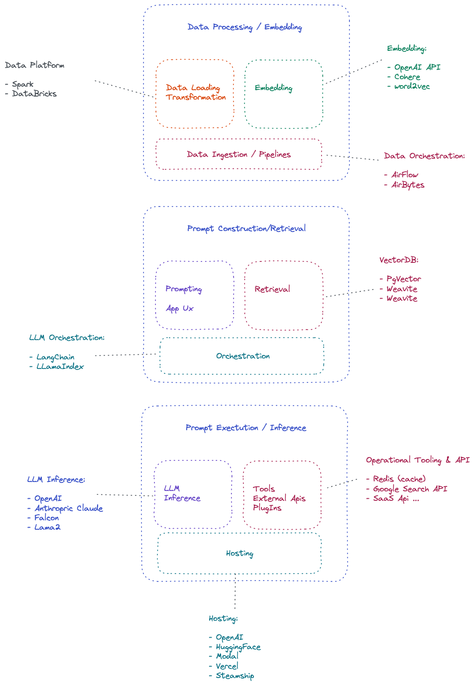
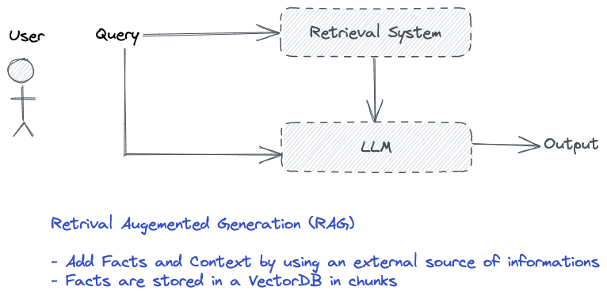
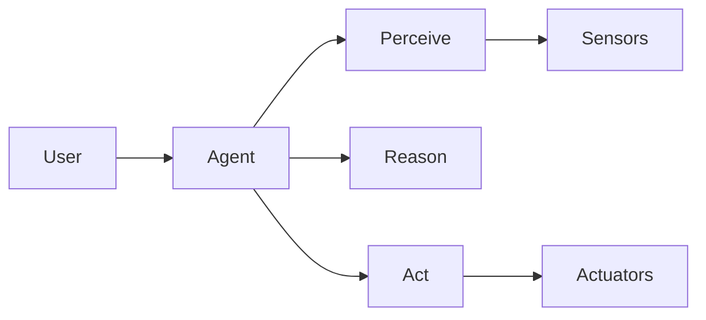
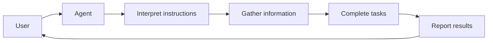
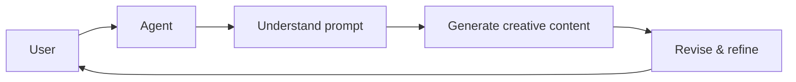
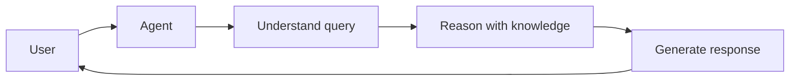
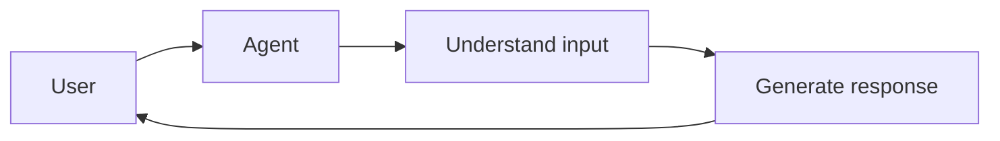

# Design and architecture patterns for LLM Applications

## Information

| Author         | Created    | Updated    | Version |
| -------------- | ---------- | ---------- | ------- |
| Raphaël MANSUY | 05/09/2023 | 05/09/2023 | 0.0.1   |

## Some common design patterns for LLM applications

### The needs for Design Patterns for LLM applications

The field of AI engineering has gained significant attention and popularity with the advent of large language models (LLMs) like OpenAI's GPT-3 and subsequent models. These models have demonstrated remarkable capabilities in natural language processing and generation, opening up new possibilities for AI applications. However, harnessing the power of LLMs in real-world applications requires careful consideration.

LLMs are powerful tools, but they are not magic. They require careful engineering to be used effectively. This is where design patterns come in.

Design patterns provide reusable solutions to common problems that arise in software development. By using design patterns, developers can leverage proven solutions and avoid reinventing the wheel. This saves time and effort in the development process.

Design patterns in LLM applications are essential to address challenges such as reusability, scalability, maintainability, and flexibility. They provide proven solutions and best practices for structuring and building robust LLM applications. As AI engineering emerges as a new discipline, the need for design patterns becomes crucial to ensure the successful development and deployment of LLM applications.

LLM applications is an emerging field, we don't have years of experiences. This document aims to provide a set of design patterns for LLM applications and help developers to build better LLM applications.

This page on LLM application Design Patterns is inspired by the work of Matt Bornstein and Rajko Radovanovic from Andreessen Horowitz. It explores the systems, tools, and design patterns used by AI startups and tech companies to leverage large language models (LLMs). By sharing insights into industry strategies and approaches, this page serves as a valuable resource for developers looking to build robust LLM applications.

[Emerging architectures with AI applications / a16z / Matt Bornstein and Rajko Radovanovic 20 June 2023](https://a16z.com/emerging-architectures-for-llm-applications/)

### Limitations of LLMs

### Context window size

LLMs, or large language models, are currently limited by their context windows. A context window refers to the amount of text that the model takes into consideration when generating a response or making predictions. This limitation arises from the computational constraints and memory limitations of the models. The context window determines the amount of information that the model can access and utilize to generate coherent and contextually relevant outputs. However, this poses a problem as it restricts the model's ability to understand and incorporate broader context, leading to potential inaccuracies or incomplete understanding of the input. This limitation hampers the model's ability to generate accurate and comprehensive responses, especially in cases where a broader context is crucial for accurate understanding and generation of text.

### LLM hallucinations

LLMs are prone to hallucinations, which refers to the phenomenon of generating text that is not grounded in reality. This is a common issue with LLMs, as they are trained on large amounts of text data without any supervision or guidance. This lack of supervision leads to the model generating text that is not grounded in reality, leading to potential inaccuracies or incomplete understanding of the input. This limitation hampers the model's ability to generate accurate and comprehensive responses, especially in cases where a broader context is crucial for accurate understanding and generation of text.

### LLMs cannot learn new fact or knowledge

LLMs, or large language models, are not capable of learning new facts or knowledge after their training phase. During the training phase, LLMs are exposed to vast amounts of text data and learn to generate responses based on patterns and relationships within that data. However, they do not have the ability to acquire new information or update their knowledge base once the training is complete.

This limitation arises from the nature of LLMs as pre-trained models. They are not designed to actively learn from new inputs or adapt to changing information. Instead, they rely on the knowledge and patterns they have learned during training to generate responses.

While LLMs can provide impressive outputs and demonstrate a deep understanding of various topics, it is important to note that their responses are based on the information available to them during training. They cannot independently verify or fact-check new information or incorporate it into their responses.

Therefore, if new facts or knowledge emerge after the training phase of an LLM, it would require manual intervention or updates to the model's training data to incorporate that new information.

### Off the shelf use Patterns

#### Introduction to Off the shelf use Patterns

Off The Shelf use of LLMs involves utilizing pre-existing language models available on the market, such as Anthropic, OpenAI, or open-source options like LAMMA2. This design pattern offers a distinct user experience through a tailored UX and carefully crafted prompts. For instance, Notion AI enhances the writing process by leveraging LLMs.

There are several advantages to this approach. It is relatively easy to develop and implement. However, it is important to note that Off The Shelf use does not address the issue of LLM hallucinations or guarantee factual accuracy. Additionally, there is no barrier to entry in the market for these readily available LLMs. This means that competitors can easily replicate the same functionality and user experience.

#### Schema

#### Pro and Cons of Off the shelf use Patterns

**Pros**:

- Easy to develop and implement

**Cons**:

- Does not address the issue of LLM hallucinations
- Does not guarantee factual accuracy
- No barrier to entry in the market for these readily available LLMs

#### Use cases

- Notion AI enhances the writing process by leveraging LLMs.

#### Applications that use this pattern

- Notion AI
- Github Copilot

#### Variations

- **Fine-tuned LLMs**

  Fine-tuned LLMs are trained on a specific dataset to perform a specific task. For example, a fine-tuned LLM can be trained on a dataset of movie reviews to perform sentiment analysis. This approach is more accurate than off-the-shelf LLMs but requires more time and effort to develop and implement.

  A LLMs can be finetuned to follow instruction and write code. This is the case of Github Copilot.

### In-Context Learning Patterns

#### Introduction to In-Context Learning Patterns

This design pattern utilizes LLMs off the shelf without fine-tuning and controls their behavior through clever prompting and conditioning on private contextual data.

It involves data preprocessing/embedding, prompt construction/retrieval, and prompt execution/inference.

The main stages of In-Context Learning Patterns, involve data preprocessing/embedding, prompt construction/retrieval, and prompt execution/inference. In the data preprocessing/embedding stage, the private contextual data is processed and transformed into a suitable format for the language models.

This may involve breaking the data into chunks and passing them through an embedding model to store them in a vector database.

In the prompt construction/retrieval stage, prompts are constructed based on user queries and contextual data. Frameworks like LangChain an LlamaIndxare are tools that abstract away the details of prompt chaining and retrieval

Finally, in the prompt execution/inference stage, the constructed prompts are submitted to pre-trained language models for inference. Various proprietary and open-source models like OpenAI API (GPT-4) and gpt-3.5-turbo are options in this stage.

#### Schema of the 3 stages of In-Context Learning Patterns

#### Detailed Schema of In-Context Learning Patterns

### Description of the 3 stages of In-Context Learning Patterns

The In-Context Learning pattern consists of three main stages: data preprocessing/embedding, prompt construction/retrieval, and prompt execution/inference.

In the data preprocessing/embedding stage, private contextual data is processed and transformed into a suitable format for language models.

This involves breaking the data into chunks, passing them through an embedding model, and storing them in a vector database or other.

The prompt construction/retrieval stage focuses on constructing prompts based on user queries and contextual data.

Frameworks like LangChain and LlamaIndex play a pivotal role in simplifying intricate tasks within the realms of natural language processing and data retrieval. These versatile platforms streamline the process of prompt chaining, empowering developers to craft intricate sequences of commands that seamlessly interact with extensive language models. Furthermore, they furnish a user-friendly interface for interfacing with external APIs, facilitating efficient data exchange with external services, platforms, and databases.

Moreover, LangChain and LlamaIndex excel in their proficiency to retrieve, manipulate, and analyze data from vector databases.

In the final stage of prompt execution and inference, the constructed prompts are submitted to pre-trained language models for processing. A myriad of proprietary and open-source models, such as the OpenAI API (GPT-4) and gpt-3.5-turbo, are at one's disposal for this crucial phase. These three stages collaboratively harmonize to enable the utilization of off-the-shelf language models in a controlled and context-aware manner.

#### What is embedding ?

Embeddings are a fundamental concept in natural language processing and machine learning. In the context of language models, embeddings refer to the process of representing words, phrases, or sentences as numerical vectors in a high-dimensional space. These vectors capture the semantic and syntactic relationships between different elements of language. Embeddings are generated by training models on large amounts of text data, where the model learns to map words or phrases to their corresponding vector representations. These vector representations enable language models to understand and process textual information more effectively. Embeddings play a crucial role in various NLP tasks, such as text classification, sentiment analysis, machine translation, and information retrieval. They provide a compact and meaningful representation of textual data, facilitating the extraction of useful features and improving the performance of downstream tasks.

#### What Retrieval Augmented Generation (RAG) ?

#### Influence of Context Size limitation and chunking strategy

In Retrieval Augmented Generation (RAG), the context size plays a crucial role in determining the amount of text or information used for retrieval. A larger context size can offer more relevant information, enhancing the accuracy of generated responses. However, it comes with the trade-off of increased computational complexity and inference time. On the other hand, a smaller context size may limit the availability of relevant information for retrieval.

Chunking strategy is another important aspect in RAG, particularly when dealing with long documents or conversations. By dividing the input text into smaller chunks, the model can process and retrieve information more efficiently. This strategy can be based on fixed-size chunks or dynamically determined based on the content of the text.

The choice of context size and chunking strategy in RAG depends on various factors, including the specific use case, available computational resources, and performance requirements. Striking the right balance is crucial, ensuring enough context for accurate retrieval and generation while considering the limitations of the model and system constraints. Experimentation and fine-tuning are often necessary to determine the optimal context size and chunking strategy for a given application

#### Pro and Cons of In-Context Learning Patterns

**Pros**:

- Mitigates the issue of LLM hallucinations
- More accurate than off-the-shelf LLMs thanks to the use of private contextual data

**Cons**:

- Requires more time and effort to develop and implement than off-the-shelf LLMs
- Requires a large amount of private contextual data
- Engineering challenges in the data preprocessing/embedding stage, the way we embed the data is crucial to the success of the application

**Use cases**:

- Question answering
- Content search
- Content creation

### Agent patterns

The agent pattern is an architectural pattern that models an autonomous entity or "agent" that can perceive its environment through sensors and act upon that environment through actuators. Agents in software applications are programs that act on behalf of users or other programs to meet delegated objectives. 

In the context of large language models (LLMs), the agent pattern enables creating AI agents that can leverage the natural language capabilities of LLMs to perceive textual inputs, make decisions based on internal reasoning, and take actions through text generation.

**The key components of an LLM agent pattern are**:

- **Sensors**: The mechanisms through which the agent perceives its environment. For an LLM agent, this usually means processing natural language inputs.

- **Reasoning**: The decision-making capability of the agent, enabled by the reasoning capacity of the LLM. This allows the agent to determine appropriate actions based on its perceptions.

- **Actuators**: The mechanisms through which the agent acts upon its environment. For an LLM agent, this usually means generating natural language responses or taking programmatic actions.

- **User**: The human user or external system that delegates objectives and interacts with the agent.

Some examples of how the agent pattern can be applied with LLMs:

#### Personal Assistant Agent

An LLM agent can act as a personal assistant that interacts conversationally with users. The agent perceives user requests through natural language, reasons about the appropriate response, and replies through generated text.

The personal assistant leverages the conversational ability of LLMs like GPT-3 to provide a natural interaction flow.

#### Moderation Agent 

An LLM agent can moderate content by analyzing text or media inputs for policy compliance. The agent perceives the content through natural language processing, makes moderation decisions through reasoning, and takes actions like filtering content or providing explanations.

The moderation agent utilizes the language understanding capabilities of LLMs to interpret content based on moderation policies.

#### Game-Playing Agent

An LLM agent can play games that involve natural language interactions. The agent perceives game states and opponent moves through text, decides on optimal moves through planning and strategy, and acts by generating move descriptions.

Game-playing agents combine the language skills of LLMs with algorithms like Monte Carlo tree search to explore complex game spaces.

#### Information Retrieval Agent

An LLM agent can perform focused information retrieval by taking a user query, formulating an effective search strategy, and retrieving relevant information passages.

Retrieval augmented generation techniques allow agents to retrieve external knowledge that can contextualize LLM responses.

#### Task-Oriented Dialogue Agent

An LLM agent can engage in task-oriented dialogues like customer support conversations. The agent perceives user requests, asks clarifying questions, gathers necessary information, and provides solutions.

Goal-oriented dialogue agents can leverage LLMs to handle complex conversations with users.

#### Recommendation Agent

An LLM agent can provide personalized recommendations by understanding user preferences, reasoning about options, and explaining recommendations.

LLMs allow recommendation agents to generate natural language explanations for their suggestions.

#### Automated Assistant Agent

An LLM agent can automate assistant-like tasks by interpreting instructions, gathering necessary information, completing tasks, and reporting results.

Automated assistant agents aim to perform tasks end-to-end based on natural language instructions and conversations.

#### Creative Writing Agent

An LLM agent can generate creative writing like stories, poems, or lyrics based on prompts and guidelines from users.

LLMs like GPT-3 demonstrate strong generative writing capabilities that creative agents can leverage.

#### Intelligent Tutoring Agent

An LLM agent can act as an intelligent tutor by assessing student knowledge, adapting explanations, and providing feedback.

Tutoring agents aim to provide personalized and pedagogically effective interactions.

#### Expert System Agent 

An LLM agent can serve as an expert system that answers domain-specific user queries by reasoning about specialized knowledge.

Expert system agents focus on accurately representing and reasoning about niche domains.

#### Chatbot Agent

An LLM agent can engage in open-ended conversations by understanding user inputs and generating relevant, coherent responses.

Chatbot agents aim to sustain engaging conversations without specific functional objectives.

These examples illustrate how the agent pattern enables creating AI agents with diverse capabilities by leveraging the core strengths of LLMs. The key is combining the language perception and generation skills of LLMs with reasoning, knowledge representation, and integrations tailored to the agent's objectives.

#### Architectural Considerations

Designing an effective LLM agent requires addressing some key architectural considerations:

- **Prompt engineering**: Carefully crafting prompts and examples to provide the desired context and steer the LLM towards the right reasoning process.

- **Knowledge representation**: Structuring and integrating the knowledge the agent needs for reasoning and responding accurately.

- **Conversation modeling**: Designing conversation flows, variables, and context tracking to sustain coherent multi-turn interactions. 

- **Learning capabilities**: Enabling agents to learn from experience through techniques like reinforcement learning.

- **Integration**: Architecting integrations with external systems for real-world data and actions.

- **Scalability**: Designing distributed architectures that scale through microservices, parallelization, and sharding.

- **Safety**: Building guardrails for safety, like filtering dangerous outputs, limiting capabilities, and modeling ethics.

Addressing these architectural considerations is key to transitioning proof-of-concept LLM agents into production. While today's agents are promising, thoughtful engineering is needed to unlock their full potential.

#### The Path Forward

LLM-based agents are an exciting frontier, demonstrating how AI assistants could become more intelligent, nuanced, and helpful. However, agents also introduce complex challenges around reasoning, knowledge, safety, and control.

Progress will require interdisciplinary collaboration spanning AI, engineering, human-computer interaction, ethics, and more. Responsible development demands considering not just technical capabilities but also the impact on people and society.

If thoughtfully pursued, LLM agents could enable AI systems that are more aligned with human needs and more beneficial for the world. But achieving this requires grounding agent development in human values and ensuring user agency through transparency and control.

The agent pattern provides a powerful paradigm for creating the next generation of AI assistants. With careful, creative engineering and ethics-focused development, LLM agents could open new possibilities for AI to enhance our lives.

