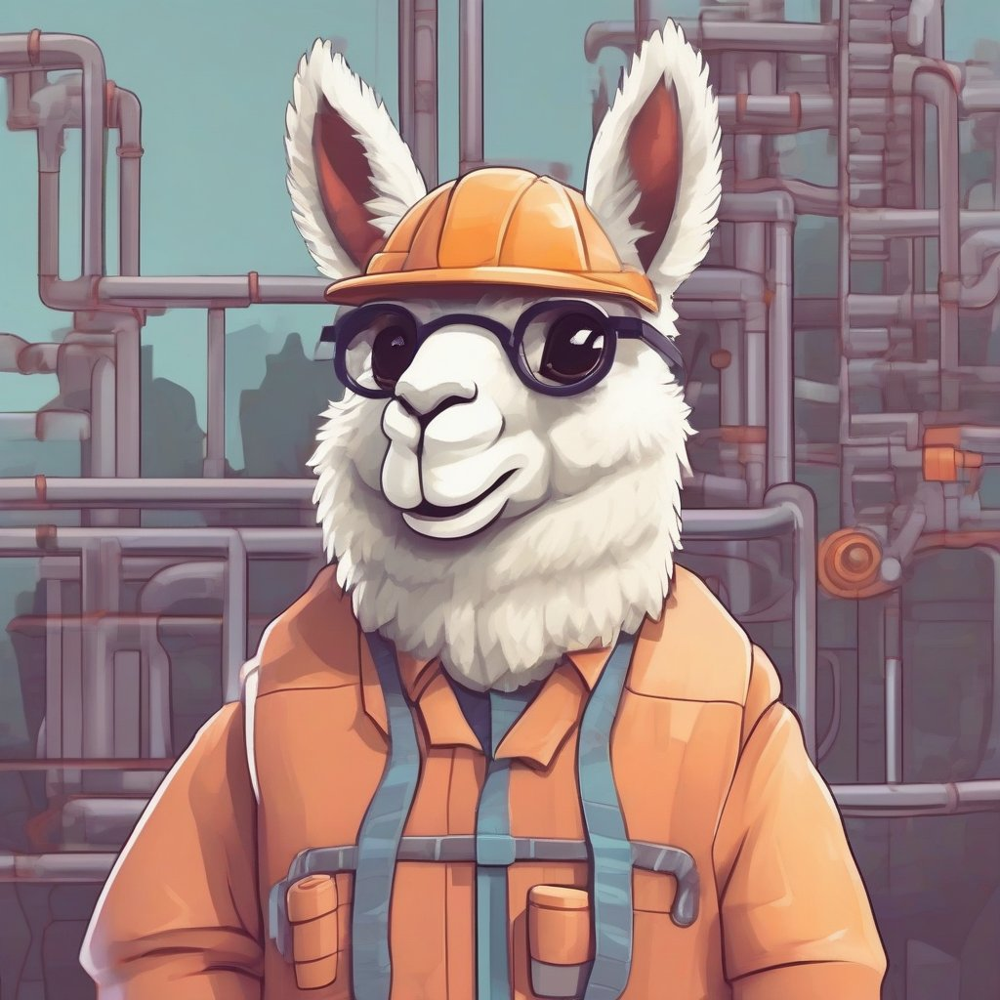

# Beyond Prompt Engineering: Modular and Optimized LM Programs with DSPy

As AI practitioners, we know how challenging it can be to build effective pipelines that orchestrate language models (LMs) and other foundation models. Typically, this involves extensive "prompt engineering" - manually crafting complex prompt strings through trial and error to try to coax the desired behavior from an LM. This process is brittle, opaque, and doesn't transfer well across tasks or models. 

In my work advising enterprises on scaling AI, a key priority is finding ways to make it easier to develop robust LM pipelines. So I was excited to come across a new research paper from Stanford, Berkeley, CMU, and other leading institutions introducing DSPy, a framework that fundamentally rethinks how we build these pipelines. 



## The Limits of Prompt Engineering

Let's first recap the status quo when building with large language models like GPT-3, Codex, or proprietary models. The standard approach is **prompt engineering**. You carefully hand-design a prompt template that includes:

- Instructions explaining the task to the LM
- Examples demonstrating the desired input/output behavior
- Various techniques like "chain of thought" to encourage step-by-step reasoning

This prompt string essentially encodes all the knowledge and constraints you want the LM to follow for a particular task. 

Prompt engineering unlocks surprisingly advanced capabilities from language models. However, as anyone who has tried it knows, it comes with major downsides:

- **Brittleness** - Small wording changes can completely break a prompt. Fragile and opaque.
- **Not modular** - Hard to reuse components of prompts across tasks. Lots of duplicated effort.
- **Labor intensive** - Requires extensive manual trial-and-error to get prompts right. 
- **Not adaptive** - Prompts must be hand-tuned separately for each model, task, and dataset.

In practice, this means we end up relying on a small set of proven prompts that become entrenched. Exploring new prompting strategies or task formulations requires prohibitive effort.

## Introducing DSPy

DSPy offers a completely different paradigm. You build pipelines by composing a series of high-level, declarative modules. Each module abstracts a particular text transformation goal like "Answer questions given context" or "Summarize a document". 

Instead of specifying prompt strings, you simply declare the desired input/output behavior of each module through natural language "signatures". 

Under the hood, DSPy handles automatically generating optimized prompts for each module that teach the LM how to achieve that signature's goals. The prompts are tailored based on your model, dataset, and pipeline structure. 

With modules and signatures, you can build pipelines with arbitrary Python control flow using DSPy's flexible define-by-run API. 

DSPy will analyze your program structure and data to create specialized few-shot prompts or finetunes that teach each module how to play its role. This prompt optimization uses "teleprompters" - modular optimizers that bootstrap demonstrations and select prompts to maximize a target metric.

So you get all the benefits of hand-engineering without the manual effort. Changing the pipeline just requires re-compiling, rather than re-prompting from scratch.

## DSPy By Example

Let's walk through a simple DSPy program to see how it works. 

Suppose we want to build a basic question answering (QA) system. The pipeline will:

1. Retrieve relevant context passages for a question using a retrieval model
2. Read the context passages
3. Generate an answer for the question based on the context

Here is how we can implement this in DSPy:

```python
import dspy

class QAPipeline(dspy.Module):

  def __init__(self):
    # Declare modules we'll use
    self.retriever = dspy.Retrieve() 
    self.reader = dspy.ChainOfThought()

  def forward(self, question):
    
    # Retrieve context passages
    passages = self.retriever(question, k=2)  

    # Read passages and answer question
    answer = self.reader(context=passages, question=question)

    return answer
```

This will look very familiar to anyone comfortable with Python and PyTorch-style APIs. We subclass `dspy.Module` and define two key methods:

- `__init__` declares the modules our pipeline will use
- `forward` defines the actual workflow from input to output

The modules we use like `Retrieve` and `ChainOfThought` are provided by DSPy. We simply declare instances of them, then call them in our forward method like regular Python functions.

Behind the scenes, DSPy is handling all the prompt engineering and optimization automatically.

The key is declaring what behavior we want from each module. For `ChainOfThought`, we do this via its **signature**:

```python 
self.reader = dspy.ChainOfThought("context, question -> answer")
```

This simple string tells DSPy that `ChainOfThought` will be given a context and question as input, and needs to produce an answer. 

DSPy will then automatically generate an optimized prompt teaching the LM this behavior, using our model, data, and pipeline structure. No manual prompting needed!

Signatures abstract away the details of how modules are implemented, so we can focus on system architecture. And DSPy handles adapting the prompts to work for our specific setup.

## Modular Optimization 

By using declarative modules and signatures, DSPy can automatically optimize prompts in two key ways:

**1. Modularity**

Prompt engineering typically involves monolithic blocks of text that encompass instructions, examples, and techniques for an entire multi-step process. This makes it hard to reuse components.

In DSPy, each module encapsulates just one focused sub-task. The modules can be mixed and matched in novel ways. DSPy handles generating targeted prompts for each module's signature.

So you get code reuse and abstraction. Adding a new module doesn't require changing existing ones.

**2. Adaptivity** 

Fixed prompt templates require manual tuning for each model, task, and dataset. With DSPy, you can compile your program to specialized prompts for any model or data.

DSPy uses "teleprompters" - modular optimizers that learn to generate high-quality prompts for each module's signature, using your model, dataset, and pipeline structure.

No more hand-tuning prompts separately for each scenario. Just recompile.

## Key Benefits

By moving beyond prompt engineering to modular and optimized LM programs, DSPy offers significant advantages:

- **Reliability** - More systematic. Less brittle and opaque than monolithic prompts.
- **Productivity** - Faster iteration. No need to manually re-engineer prompts.
- **Composability** - Mix and match modules. Easily add new components.
- **Adaptivity** - Retarget optimized prompts to new models, data, and tasks. 
- **Maintainability** - Modular code is easier to re-use, extend, and maintain.

For complex tasks, DSPy can routinely teach powerful models like GPT-3.5 and local models like T5-base or Llama2-13b to be much more reliable. And with a fraction of the usual effort thanks to automatic optimization.

## Trying DSPy

DSPy is open source Python library with an easy-to-use API. 

You can install it via PyPI:

```
pip install dspy
```

The [GitHub repo](https://github.com/stanfordnlp/dspy) includes tutorials and demos to help get started.

I highly recommend trying out some of the DSPy examples yourself. It provides a glimpse at how we could develop LM pipelines in a more modular, robust, and maintainable way.

Under the hood, DSPy is implementing techniques like automatic data augmentation, prompt optimization, and modular fine-tuning. But the developer experience feels like simply expressing your system design through clean, idiomatic Python code.

## The Future of LM Programs 

DSPy presents a compelling vision for how we can progress beyond brittle prompt engineering towards modular, optimized LM programs.

The concepts around composability, declarative signatures, and automatic prompting are a game-changer.

Rather than just tweaking prompts, we can build systems systematically from reusable, trainable components. And rely on optimization techniques to handle prompt generation for us.

I'm excited to see this research direction gain more uptake both in academia and industry. It paves the way to making AI development dramatically more reliable and scalable.

The capabilities of foundation models are evolving rapidly. But to leverage them fully, we need better abstractions for composing and instructing them.

DSPy represents a major step forward on that path. I highly recommend checking out the [paper](https://arxiv.org/abs/2310.03714) and [code](https://github.com/stanfordnlp/dspy) to learn more!
