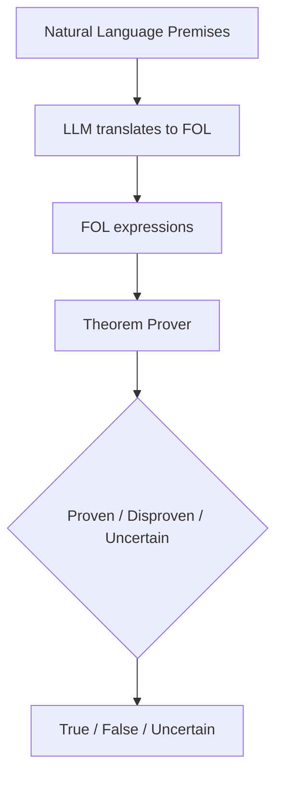

# LINC: A Neurosymbolic Approach for Logical Reasoning by Combining Language Models with First-Order Logic Provers

## Introduction

Logical reasoning, the ability to make valid deductions from a set of premises to reach a conclusion, is a hallmark of human intelligence. Recently, large language models (LLMs) like GPT-3 have shown impressive capabilities in natural language tasks, raising the question - can they perform logical reasoning?

Many prompting strategies have been proposed to elicit reasoning from LLMs, like chain-of-thought prompting where models are asked to verbalize their reasoning step-by-step. However, LLMs still fail in subtle ways, struggling with out-of-distribution generalization and long chains of reasoning. This suggests they may rely more on surface statistical patterns rather than systematic reasoning.

The LINC paper investigates an alternative neurosymbolic approach that combines the strengths of LLMs and symbolic logic solvers. In LINC, the LLM acts as a "semantic parser", translating natural language into symbolic logic expressions. These expressions are then fed to a theorem prover that algorithmically determines if the conclusion follows from the premises. By offloading the deductive reasoning to a solver, the LLM itself no longer needs to explicitly reason.


## First-Order Logic

Before diving into LINC, let's provide some background on first-order logic (FOL), the symbolic language that LINC uses.

FOL allows expressing logical statements using quantifiers, predicates, and variables. For example:

- "All swans are white" can be written as: `∀x (Swan(x) → White(x))`
- "Harry is a swan" as: `Swan(Harry)`
- "Is Harry white?" as: `White(Harry)`

In FOL:

- `∀` means "for all" and `∃` means "there exists"
- Predicates like `Swan(x)` represent relations between entities
- Variables like `x` and constants like `Harry` refer to objects
- Logical connectives like `→`, `∧`, `∨`, `¬` have their usual logic meanings

FOL allows making complex logical statements like:

```
∀x (Swan(x) → White(x))
Swan(Harry)
∴ White(Harry)
```

Which says that if all swans are white, and Harry is a swan, then Harry must be white. FOL is very expressive yet unambiguous, making it suitable for logical reasoning.

## The LINC Approach

LINC takes a neurosymbolic approach by combining the strengths of LLMs and FOL solvers:

1. The LLM acts as a "semantic parser", translating the natural language premises and conclusion into FOL expressions.

2. These FOL expressions are fed to an automated FOL theorem prover. The prover uses symbolic deduction algorithms to determine if the conclusion logically follows from the premises.

3. The prover returns True, False, or Uncertain based on whether the conclusion is proven, disproven, or undetermined given the premises.

This approach offloads the challenging deductive reasoning task from the LLM to the prover. The LLM only needs to translate natural language to FOL, while the prover guarantees logically sound deductions.

Here is a step-by-step example of how LINC works:



Examples:

**Premises:**

- All rectangles have four sides
- All four-sided shapes are polygons

**Conclusion:**

- Are all rectangles polygons?

**Step 1:** The LLM translates the natural language into FOL:

```
∀x (Rectangle(x) → FourSided(x))  
∀x (FourSided(x) → Polygon(x))
∀x (Rectangle(x) → Polygon(x)) ?
```

**Step 2:** The theorem prover determines that the conclusion follows from the premises, returning True.

**Step 3:** LINC outputs the final answer as True.

By combining an LLM and theorem prover in this modular way, LINC aims to achieve reliable logical reasoning. The LLM focuses on the natural language understanding, while the prover guarantees sound logical deductions.

## Experiments and Results

The LINC paper evaluates their approach on two logical reasoning datasets:

- **FOLIO**: Expert-written natural language reasoning problems with ground truth FOL.
- **ProofWriter**: Synthetic reasoning problems generated from FOL.

They compare LINC to three baselines using LLMs only:

- **Naive**: Directly predict True/False/Uncertain from premises
- **Scratchpad**: Generate FOL expressions then predict label
- **Chain-of-Thought (CoT)**: Verbalize reasoning step-by-step

Three LLMs were tested:

- **StarCoder+**: 15.5B parameters
- **GPT-3.5**: Likely much larger than StarCoder+
- **GPT-4**: Even larger than GPT-3.5

The key results are:

- On FOLIO, LINC substantially improves accuracy over all baselines for StarCoder+ (by 14.2%) and GPT-3.5 (by 7.7%).
- On ProofWriter, LINC achieves huge gains for all models, improving accuracy by 44-53% over the best baseline.
- For GPT-4 on FOLIO, LINC performs similarly to CoT prompting.

These results provide strong evidence that LINC can enable more accurate logical reasoning compared to prompting large LLMs alone. The gains are especially significant for smaller models like StarCoder+.

## Error Analysis

To better understand LINC, the paper also provides an in-depth error analysis comparing LINC and CoT prompting with GPT-4 on FOLIO.

They identify three main failure modes for each method:

**LINC failures:**

1. FOL translation loses implicit information not mentioned in the premises.

2. FOL translation loses explicit information due to choices made.

3. FOL translation contains syntax errors.

**CoT failures:**

1. CoT concludes something different than its reasoning suggests.

2. CoT makes incorrect logical deductions.

3. CoT fails to find complex reasoning paths.

This analysis reveals that LINC and CoT fail in very different ways. In particular, LINC has higher precision but lower recall on its True/False predictions compared to CoT. The results suggest that the two methods could be combined to create an even more robust logical reasoner.

## Conclusion

The LINC paper provides compelling evidence that combining large language models with formal logic solvers is a promising approach for improving logical reasoning. By leveraging the complementary strengths of neural networks and symbolic algorithms, LINC points towards more reliable neurosymbolic reasoning systems.

**Key takeaways**:

- LLMs struggle with systematic logical reasoning, but excel at language understanding
- FOL provides an unambiguous yet expressive language for logical reasoning
- LINC offloads deductive logic from LLMs to theorem provers
- Experiments show significant gains in accuracy from LINC over LLM-only methods
- LINC and LLM-prompting exhibit complementary failure modes

The LINC paper opens up many exciting avenues for future work at the intersection of neurosymbolic AI. I highly recommend reading the full paper [https://arxiv.org/abs/2310.15164](https://arxiv.org/abs/2310.15164) to learn more about this promising research direction.

## To go further

If you are interested in logical reasoning and neurosymbolic AI, I highly recommend review the LINC code on GitHub.

It provides a clear implementation of the techniques described in the paper, including the semantic parsing from natural language to first-order logic, integration with the [Prover9 theorem prover](https://formulae.brew.sh/formula/prover9), and majority voting.

 The readme gives a good overview and the code itself contains helpful documentation. 
 
 Try modifying the examples or adding new ones to get hands-on experience with this promising approach. Neurosymbolic methods like LINC point the way towards more robust and transparent reasoning with language models.

👉 The Github project: [https://github.com/benlipkin/linc](https://github.com/benlipkin/linc)

## Citation

Selsam, Daniel, Matthew Lamm, Benedikt Bunz, Percy Liang, Leonardo de Moura, and David L. Dill. "LINC: A Neurosymbolic Approach for Logical Reasoning by Combining Language Models with First-Order Logic Provers." arXiv preprint arXiv:2310.15164 (2023)
