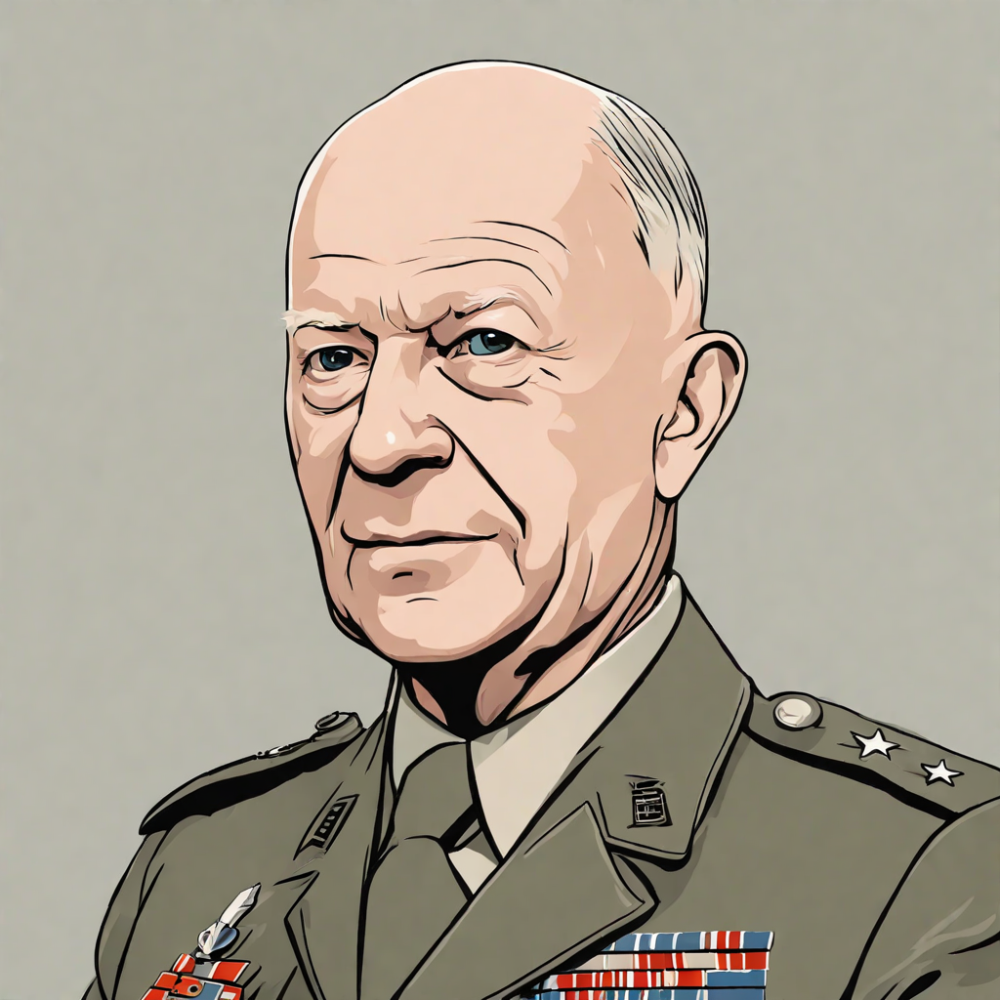
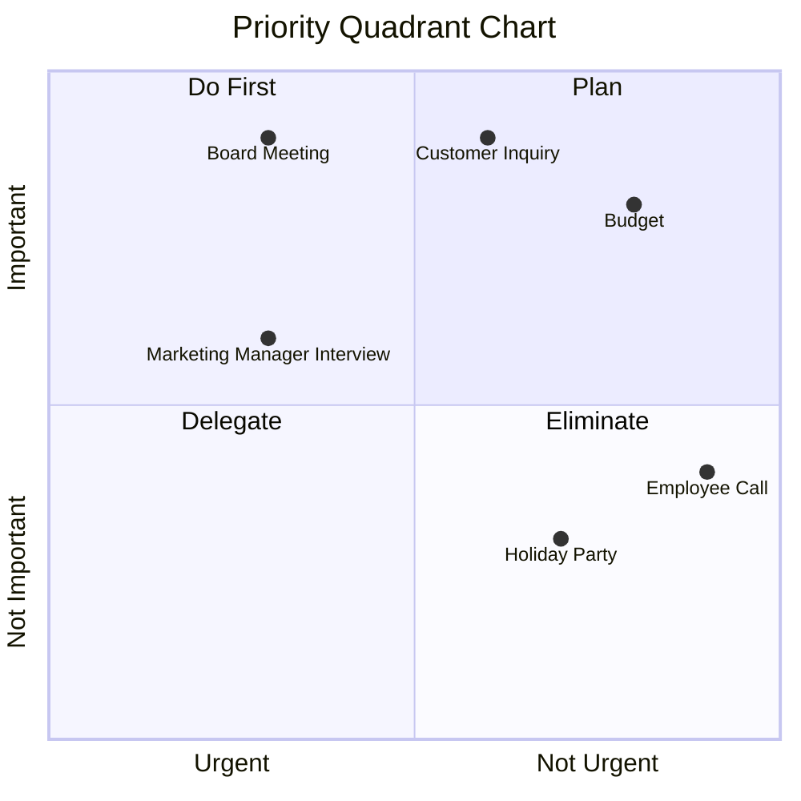
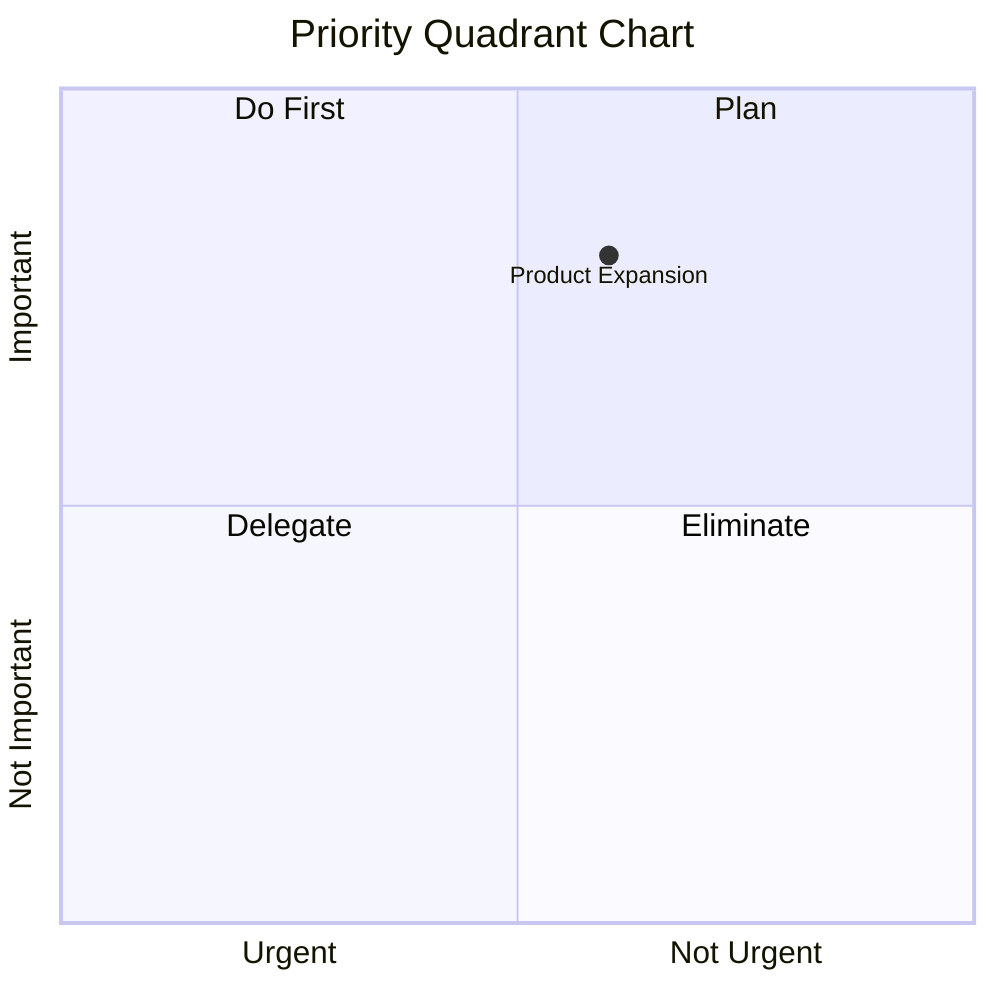

# Using AI to make better judgments

Making good judgments and decisions is one of the most fundamental skills in life.

As Naval Ravikant says in his Almanack, "The quality of our decisions determines the quality of our lives."

Our judgments and choices shape our careers, relationships, health, and overall well-being.

Yet making consistently good judgments is extraordinarily difficult. To improve our decision-making, we need tools and frameworks to counteract human biases and cognitive limitations.

That's where AI comes in.

Specifically, large language models like GPT-4 or Anthropic offer new ways to tap into timeless wisdom and make better judgments.

By encoding proven mental models into prompts, we can harness these systems' vast knowledge to guide our thinking and choices.

In this post, I'll demonstrate how to use one classic mental model—the Eisenhower Decision Matrix—to improve decisions with the help of AI.



## The Power of Mental Models

First popularized by investors Charlie Munger and Warren Buffett, mental models are simplified representations of how the world works.

They act as intellectual frameworks to help us make sense of complex realities.

As Munger puts it, "You need a different checklist and different mental models for different companies and different industries because they have different realities."

Some excellent sources of mental models are the world's major religions and philosophies, as well as modern thinkers like Charles Darwin and Adam Smith.

By studying these belief systems, we can benefit from humanity's accumulated wisdom. Mental models allow us to tap into generations of insight in a format we can apply to our specific circumstances.

AI makes this process far easier. With a well-crafted prompt, we can query a system like GPT-4 or Claude to see how various mental models would approach a given issue or decision.

This provides a fuller, wiser perspective than relying solely on our own thinking. As I'll demonstrate, combining AI and mental models leads to better judgments.

## The Eisenhower Decision Matrix

One mental model I frequently use for decision-making is the Eisenhower Decision Matrix. Developed by President Dwight D. Eisenhower, this framework prioritizes tasks or decisions based on two variables:

1. **Importance** - How vital is this issue or choice to achieving my goals?
2. **Urgency** - How time-sensitive is this issue or choice? Does it require immediate attention?

By rating decisions on these two dimensions, we can sort them into four quadrants:



> 📔 **Example of Decision Matrix for a business executive**
>
> I gave the quarterly budget a low importance score of 8 since it's a routine task. But it has a high urgency score of 8 since the deadline is approaching.
>
> The board meeting is very important 9 for governance and strategic decisions. It's also urgent 3 to prepare adequately.
>
> The employee call is somewhat urgent (4) to maintain good relations but less important (9) strategically.
>
> The holiday party has moderate importance (2) for employee morale but low urgency (3).
>
> The marketing manager interview is important (6) to fill a key role but moderately urgent (7) with some flexibility on timing.
>
> The customer inquiry is very urgent (9) to capitalize on an opportunity but of medium importance (4) depending on the potential deal size

**Do First (Important + Urgent)** - Crises, deadline-driven projects, meetings. These require immediate attention.

**Schedule (Important, Not Urgent)** - Relationship building, high-priority tasks, long-term planning. Schedule time for these on your calendar.

**Delegate (Not Important, Urgent)** - Interruptions, emails, low-value tasks. Delegate these if you can.

**Don't Do (Not Important, Not Urgent)** - Time wasters, distractions. Eliminate or avoid these.

Eisenhower developed this matrix to manage his immense workload during World War II. It remains a simple yet powerful tool to force you to evaluate tradeoffs and prioritize what matters most.

## **Using AI and the Eisenhower Matrix**

Let's walk through an example prompt combining GPT-3 and the Eisenhower framework to guide a business decision.

### Framing the problem using a detailled prompt

> 📔 *I'm the CEO of a fast-growing technology startup. We currently have 50 employees and $5M in annual recurring revenue. I'm facing a key decision on whether to expand into a new product line. Here are the key considerations:*
>
> - *My head of products believes the new offering could double our revenue in 2 years.*
> - *However, several of my senior engineers have reservations about our ability to deliver this additional product without compromising quality.*
> - *My CFO estimates we'll need to invest $1M upfront over the next 6 months to develop and launch the new product.*
>
> *If I decide to expand, it will require significant time and focus from me and my leadership team over the next year. I risk spreading myself and my team too thin. However, if successful, it could dramatically increase our growth.*
>
> *Using the framework of the Eisenhower Decision Matrix, how would you assess the importance and urgency of this potential expansion decision? What quadrant does it fit in and why? Provide a detailed analysis and recommendation on how I should think about this decision and potential tradeoffs through the lens of the Eisenhower Matrix.*
>
> You must reason step by step to give a score to each decision or task between 0.0 to 1.0   on to axis importance and urgency.

### Reply from Anthropic Claude

Here is an example response Claude from Anthropric could provide:

> 📔 **Based on the details provided, here is how I would assess this potential expansion decision through the lens of the Eisenhower Matrix:**
>
> #### Importance
>
> I would rate the importance of this decision as 0.8 out of 1.0.
>
> The rationale is:
>
> - Expanding into a new product line could potentially double revenue in 2 years, which would be a major growth opportunity for the company.
> - However, it's not necessarily existential to the survival and core business of the company, so not a 1.0.
>
> #### Urgency
>
> I would rate the urgency as 0.4 out of 1.0.
>
> The rationale is:
>
> - There is an estimate of needing to invest $1M over the next 6 months to develop and launch. This creates some timeframe urgency.
> - However, the opportunity is projected to take 2 years to materialize, so there is no immediate do-or-die urgency. There is time to thoughtfully evaluate the pros and cons.
>
> #### Quadrant
>
> Based on an importance rating of 0.8 and urgency rating of 0.4, this decision would fall into the **Important but Not Urgent** quadrant.
>
> #### Recommendation
>
> For issues in this quadrant, Eisenhower recommends tackling them without delay by scheduling time to focus on them.
>
> Given the high importance but lower urgency, I would recommend:
>
> - Schedule a dedicated strategic planning session with your leadership team to fully analyze the pros/cons.
> - Ensure you have the necessary data and market validation of the opportunity before committing.
> - Develop a detailed business plan and internal resource/execution plan before moving forward.
> - Given limited resources, carefully evaluate what other priorities may need to be deprioritized to make room for this initiative if pursued.
>
> The key is to avoid rushing into this because of a false sense of urgency, while also not delaying action because it's not an immediate crisis. A thoughtful, strategic approach can help maximize the opportunity while mitigating the risks and tradeoffs.

### Draw the Eisenhower Matrix

Now we can even Draw the Eisenhower Matrix thanks to the Mermaid syntax:

> 📔 **Can you now represent theses decisions using a Eisenhower decision matrix using the quadrantChart syntax available with the mermaid language.**
>
> Example of quadrant charts for the mermaid syntax:
>
> ```mermaid
> quadrantChart
>     title Priority Quadrant Chart
> 
>     x-axis Urgent --> Not Urgent
>     y-axis Not Important --> Important
> 
>     quadrant-1 Plan
>     quadrant-2 Do First
>     quadrant-3 Delegate
>     quadrant-4 Eliminate
> 
>     Budget: [0.8, 0.8]
>     Board Meeting: [0.3, 0.9]
>     Employee Call: [0.9, 0.4]
>     Holiday Party: [0.7, 0.3]
>     Marketing Manager Interview: [0.3, 0.6]
>     Customer Inquiry: [0.6, 0.9]
>     Campaign F: [0.35, 0.78]
> ```

### Claude answer

Here is an Eisenhower Matrix quadrant chart for the product expansion decision:



This plots the product expansion decision in the "Important, Not Urgent" quadrant based on the urgency rating of 6 and importance rating of 8.

The quadrant chart visually represents the analysis that this is an important strategic decision for potential company growth, but does not require knee-jerk urgent action. Thoughtful planning and evaluation is recommended to maximize the opportunity.

## Putting It Into Practice

I encourage you to try using the Eisenhower Decision Matrix and other mental models in your prompts to GPT-4 or Claude.

Seek different frameworks to approach decisions from multiple wise perspectives. With practice, your judgment and decision-making abilities will keep improving.

**Some other excellent mental models to try are:**

- **SWOT Analysis**
- **OODA Loop**
- **First Principles Thinking**

I look forward to hearing about mental models you find useful for improving judgments with AI.

Please share your experiences and prompts in the comments!

Together, we can become wiser decision-makers.

---

### SWOT Analysis

SWOT analysis is a strategic planning tool used to evaluate the strengths, weaknesses, opportunities, and threats of a business or project. It helps to identify internal factors (strengths and weaknesses) that can be leveraged or improved, as well as external factors (opportunities and threats) that may impact the success of the venture.

- **Strengths**: These are the positive aspects or advantages of the business or project. They can include things like a strong brand, skilled employees, or unique features.
- **Weaknesses**: These are the negative aspects or limitations of the business or project. They may include areas that need improvement, such as lack of resources or poor customer service.
- **Opportunities**: These are external factors that could be beneficial to the business or project. They may include emerging markets, new technologies, or changing consumer trends.
- **Threats**: These are external factors that could negatively affect the business or project. They may include competition, economic downturns, or regulatory changes.

By conducting a SWOT analysis, organizations can better understand their current situation and make informed decisions about strategies and actions to pursue. It provides a framework for assessing the internal and external factors that may impact success and helps identify areas for improvement and potential risks to be addressed.

### OODA Loop

The OODA Loop is a decision-making process that stands for Observe, Orient, Decide, and Act. It was developed by military strategist Colonel John Boyd and is widely used in various fields, including business and warfare.

Here's a simple explanation of each step in the OODA Loop:

1. **Observe**: Gather information and observe the current situation. This involves paying attention to your surroundings, collecting data, and understanding the facts and circumstances.
2. **Orient**: Analyze and interpret the information you have gathered. This step involves assessing the situation, understanding the context, and recognizing patterns. It also involves evaluating your own biases and mental models that may influence your decision-making.
3. **Decide**: Based on your observations and orientation, make a decision about what actions to take. This step involves evaluating different options, considering potential outcomes and risks, and choosing the best course of action.
4. **Act**: Implement the decision you have made. Take action based on your decision and execute your plan. This step requires decisiveness, agility, and the ability to adapt as new information becomes available.

The OODA Loop is a continuous process, with each step informing the next. It emphasizes the importance of being proactive, agile, and adaptable in decision-making. By constantly cycling through the loop, individuals and organizations can rapidly respond to changing circumstances and gain a competitive advantage.

The OODA Loop is a decision-making framework that involves observing the situation, orienting yourself to understand it, deciding on a course of action, and then acting on that decision. It helps individuals and organizations make more effective and efficient decisions in dynamic and uncertain environments.

### First Principles Thinking

First Principles Thinking is an approach to problem-solving and decision-making that involves breaking down complex problems into their fundamental truths or basic principles. Instead of relying on assumptions or existing knowledge, First Principles Thinking encourages you to question everything and build your understanding from the ground up.

In simple terms, First Principles Thinking is about going back to the basics and asking "Why?" It involves breaking down a problem or situation into its most fundamental elements and examining them from a fresh perspective. By doing so, you can challenge conventional wisdom, identify new possibilities, and come up with innovative solutions.

For example, let's say you want to start a business selling custom-made bicycles. Instead of accepting the assumption that bicycle manufacturing is expensive, you would break down the cost of each component, the labor involved, and other factors to understand the true cost. From there, you can explore alternative materials or production methods that could reduce costs and make your business more viable.

First Principles Thinking requires critical thinking, creativity, and a willingness to question established norms. It helps you avoid the limitations of conventional wisdom and opens up new opportunities for innovation. By understanding the fundamental principles underlying a problem, you can find unique solutions and make better-informed decisions.

First Principles Thinking is a problem-solving approach that involves breaking down complex problems into their fundamental truths and questioning assumptions to find innovative solutions. It empowers you to think independently and challenge the status quo, leading to better judgments and decision-making.
