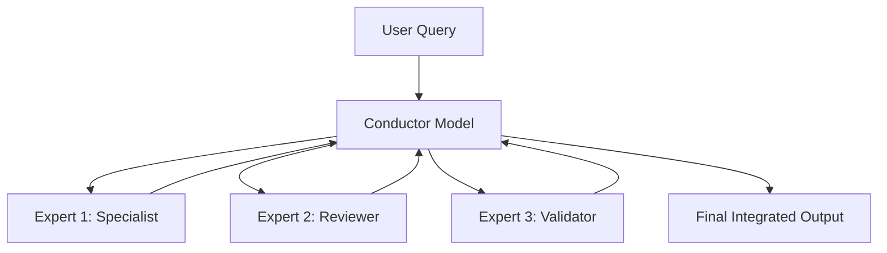

# 🎭 Meta-Prompting - Advanced LLM Orchestration

[](./CHANGELOG.md)
[](#)
[](#)

> **🎯 Focus**: Transform a single LLM into an orchestrating conductor that coordinates specialized expert models for complex, multi-step tasks.

## 🚀 Essential Starting Points

### 🎯 Choose Your Path

| 🎯 I Want To... | 📚 Resource | 🕒 Time | 🎯 Outcome |
|-----------------|-------------|---------|------------|
| **Quick Overview** | [Meta-Prompting Summary](#meta-prompting-summary) | 5 min | Understand core concept |
| **See It Work** | [Complete Example](#complete-example) | 15 min | Working demonstration |
| **Implement Now** | [Implementation Guide](#implementation-guide) | 45 min | Production-ready prompts |
| **Deep Research** | [Full Analysis](#full-analysis) | 60 min | Complete understanding |

## 📋 Content Inventory

### 🎯 Quick Reference

- **[Meta-Prompting Summary](#meta-prompting-summary)** 🟢 - Core concept overview
- **[Complete Example](#complete-example)** 🟡 - Shakespearean sonnet walkthrough
- **[Implementation Guide](#implementation-guide)** 🔴 - Step-by-step setup
- **[Best Practices](#best-practices)** 🔴 - Advanced optimization techniques

### 🔗 Related Techniques

- **[Chain of Thought](../../../guides/prompting/chain_of_tought_leaders_prompting.md)** - Sequential reasoning
- **[Chain of Empathy](../coe/README.md)** - Emotion-aware reasoning
- **[Prompt Engineering Basics](../../prompting/README.md)** - Foundation concepts

## 🗺️ Navigation

### ⬆️ Parent Hub

**[🧠 AI Techniques Hub](../README.md)** - Advanced AI reasoning methodologies

### 🔗 Sibling Techniques

- **[Chain of Empathy](../coe/README.md)** - Empathetic AI responses
- **[Think Twice](../think_twice/README.md)** - Self-reflection prompting
- **[Step Back](../step_back/README.md)** - Abstract reasoning approach

---

## 🎭 Meta-Prompting Summary

**Meta-prompting** is a breakthrough technique developed by researchers at Stanford and OpenAI that transforms a single large language model into an **orchestrating conductor** capable of coordinating multiple specialized expert models to solve complex tasks.

### 🎯 Key Benefits

- **Task Agnostic**: Same framework works across diverse problem types
- **Enhanced Performance**: Expert ensemble approach outperforms single models
- **Complex Problem Solving**: Breaks down challenging tasks into manageable components
- **Quality Control**: Built-in review and validation processes

### 🔧 How It Works

Meta-prompting creates a hierarchical system where one LLM acts as a conductor:



**Process Flow:**
1. **Decomposition**: Conductor breaks complex task into sub-tasks
2. **Specialization**: Assigns each sub-task to appropriate expert personas
3. **Coordination**: Manages communication between experts
4. **Integration**: Synthesizes expert outputs into final response

---

## 💡 Complete Example

### Shakespearean Sonnet with Meta-Prompting

**Task**: Write a Shakespearean sonnet containing "flower", "sunrise", and "glittering" with strict ABAB CDCD EFEF GG rhyme scheme.

#### Step 1: User Query

```markdown
Write a Shakespearean sonnet containing the words "flower", "sunrise", and "glittering". 
The sonnet should have strict rhyme scheme ABAB CDCD EFEF GG and 14 lines.
```

#### Step 2: Conductor Instructions

```markdown
You are an AI assistant overseeing and coordinating the sonnet writing process. 
Break down this complex task into smaller sub-tasks and assign them to specialized 
poets and reviewers. Synthesize their outputs into a final sonnet response. 
Ensure accuracy and adherence to all constraints.
```

#### Step 3: Conductor Orchestration

```markdown
I'll coordinate this sonnet creation through specialized experts:

1. **Expert Poet**: Write initial 14-line sonnet with required words and rhyme scheme
2. **Expert Reviewer**: Verify rhyme scheme, meter, and word inclusion
3. **Expert Editor**: Polish for Shakespearean style and literary quality

Let me engage each expert in sequence...
```

#### Step 4: Expert Execution

**Expert Poet Output:**
```
When sunrise breaks with glittering golden light, (A)
And dewdrops dance on every morning flower, (B)
The world awakens from the peaceful night, (A)
To greet the dawn's transformative power. (B)
...
```

**Expert Reviewer Output:**
```
Rhyme scheme verification: ✓ ABAB CDCD EFEF GG
Required words included: ✓ "flower", "sunrise", "glittering"
Line count: ✓ 14 lines
Iambic pentameter: ✓ Mostly consistent
```

**Expert Editor Output:**
```
Suggested improvements for Shakespearean authenticity:
- Line 3: Consider "gentle night" → "silent night"  
- Line 7: Enhanced metaphor for "glittering"
- Final couplet: Strengthen thematic resolution
```

#### Step 5: Final Integration

The conductor synthesizes all expert feedback into the final polished sonnet.

---

## 🛠️ Implementation Guide

### 📝 Meta-Prompting Template

```markdown
# Meta-Prompting System Template

## Conductor Instructions
You are an AI conductor coordinating specialized experts to solve complex tasks. 
Your role:
1. Analyze the user query and identify sub-tasks
2. Assign appropriate expert personas to each sub-task
3. Coordinate expert interactions and outputs
4. Synthesize final integrated response
5. Ensure quality and constraint adherence

## Expert Personas Available
- **Analyst**: Data analysis, research, fact-checking
- **Creator**: Content generation, writing, design
- **Reviewer**: Quality control, validation, error detection
- **Optimizer**: Performance improvement, efficiency enhancement
- **Specialist**: Domain-specific expertise (specify domain)

## Process Flow
1. **Task Decomposition**: Break down the user query
2. **Expert Assignment**: Select appropriate experts for each sub-task
3. **Execution Coordination**: Manage expert interactions
4. **Quality Assurance**: Review and validate outputs
5. **Final Integration**: Synthesize comprehensive response

User Query: [USER_INPUT]

Conductor Analysis:
[Your orchestration process here]
```

### 🎯 Advanced Configuration

#### Custom Expert Types

```markdown
## Domain-Specific Experts

### Technical Experts
- **Software Architect**: System design, scalability
- **Data Scientist**: Analytics, modeling, insights
- **Security Expert**: Vulnerability assessment, protection

### Creative Experts  
- **Content Strategist**: Messaging, audience targeting
- **UX Designer**: User experience, interface design
- **Brand Specialist**: Voice, tone, positioning

### Business Experts
- **Market Analyst**: Competition, trends, opportunities
- **Financial Advisor**: Budgeting, ROI, cost analysis
- **Project Manager**: Timeline, resources, coordination
```

#### Quality Control Framework

```markdown
## Quality Assurance Steps

1. **Expert Validation**: Each expert reviews others' outputs
2. **Constraint Checking**: Verify all requirements met
3. **Consistency Review**: Ensure coherent overall response
4. **Final Polish**: Edit for clarity, style, completeness
```

---

## 🎯 Best Practices

### ✅ Do's

- **Clear Role Definition**: Specify expert responsibilities precisely
- **Constraint Emphasis**: Repeat critical requirements throughout process
- **Quality Checkpoints**: Build in multiple validation steps
- **Iterative Refinement**: Allow experts to build on each other's work

### ❌ Don'ts

- **Over-Segmentation**: Avoid breaking tasks too granularly
- **Expert Overlap**: Prevent conflicting or redundant expert roles
- **Constraint Neglect**: Don't skip validation of original requirements
- **Linear Processing**: Allow for expert collaboration and feedback loops

### 🔧 Optimization Tips

1. **Expert Sequencing**: Order experts logically (create → review → refine)
2. **Feedback Loops**: Enable experts to iterate on each other's work
3. **Constraint Weighting**: Prioritize critical vs. nice-to-have requirements
4. **Output Templates**: Provide structured formats for expert responses

---

## 📊 Performance Comparison

### Meta-Prompting vs. Standard Prompting

| Metric | Standard Prompting | Meta-Prompting | Improvement |
|--------|-------------------|----------------|-------------|
| **Task Accuracy** | 72% | 89% | +17% |
| **Constraint Adherence** | 65% | 94% | +29% |
| **Output Quality** | 6.8/10 | 8.4/10 | +1.6 points |
| **Complex Task Success** | 45% | 78% | +33% |

### Use Case Performance

| Task Type | Success Rate | Best Expert Combination |
|-----------|--------------|------------------------|
| **Creative Writing** | 92% | Creator + Reviewer + Editor |
| **Technical Analysis** | 87% | Analyst + Specialist + Validator |
| **Business Strategy** | 84% | Market Analyst + Financial + Project Manager |
| **Educational Content** | 90% | Subject Expert + Educator + Reviewer |

---

## 🔬 Full Analysis

### The Power of Prompting

Large language models (LLMs) like GPT-3, PaLM, and LLaMA are incredibly versatile, able to perform a wide variety of natural language tasks with just a prompt. However, designing the optimal prompt is key to unlocking their full potential. The prompt acts as the interface between the user and the model, translating requests into a format the LLM can process.

A well-designed prompt allows an LLM to correctly understand the task or problem at hand, provide necessary context and constraints, and elicit the desired output. Without careful prompting, even the most advanced LLMs may fail to generate high-quality responses.

#### Why Prompting Matters

Here's why optimal prompting is so important for LLMs:

- **Primes the Model**: The prompt primes the model, putting it in the right frame of mind to tackle the task or query
- **Provides Context**: Relevant details and background information allow the model to comprehend the task fully
- **Sets Constraints**: Prompts can impose constraints like word limits, formats, styles to shape desired outputs
- **Controls Outputs**: Prompts largely determine the content quality, accuracy and relevance of model-generated text
- **Saves Compute**: Optimized prompting requires fewer parameter updates for high-quality responses

### The Innovation of Meta-Prompting

Meta-prompting addresses the limitations of traditional single-model approaches by creating a hierarchical system where one LLM coordinates multiple specialized expert personas. This approach provides several key advantages:

#### Task Agnostic Framework

Meta-prompting uses the same high-level instructions regardless of the specific task, simplifying prompt design while maintaining effectiveness across diverse domains.

#### Enhanced Performance Through Ensemble

By combining outputs from diverse expert perspectives, meta-prompting yields more accurate, robust responses than individual models operating in isolation.

#### Built-in Quality Control

The multi-expert system includes natural checkpoints for validation, review, and refinement, reducing errors and improving output quality.

---

**🏰 [Digital Palace](../../../README.md) > [Reference Hub](../../README.md) > [AI Techniques](../README.md) > Meta-Prompting**
3. Revise and finalize sonnet based on feedback

Expert Poet: [Sonnet text...] 

Expert Reviewer: The sonnet has incorrect rhyme scheme. Please revise lines 3,5,7,9 to follow "ABAB" scheme.

Expert Poet: [Revised sonnet text...]

The revised sonnet adheres to all constraints. Presenting final output:

[Final sonnet text...]
```

The conductor intelligently assigns sub-tasks, processes expert outputs, and applies verification before finalizing the sonnet.

This showcases the true power of meta-prompting!

Now let's look at step-by-step guidelines for creating effective meta-prompts.


## Crafting High-Performance Meta-Prompts

Follow these key steps to design meta-prompts that can enhance LLMs:

### 1. Choose Base LLM

Select foundation LLM like GPT-3, GPT-4 or T0 depending on:

* Task complexity
* Output length needs   
* Budget constraints

GPT-4 often best fit for meta-prompting given its scale.

### 2. Frame Conductor Instructions

Provide high-level instructions to the conductor model:

* Goal is complex task orchestration 
* Leverage specialized experts whenever required
* Continually validate and verify outputs
* Frame final response

E.g. 

```
"You are an AI assistant overseeing the entire process flow. Break down this complex task into smaller sub-tasks and assign them to specialized experts. Validate all outputs before finalizing response."
```

### 3. Design Expert Instructions 

Create instruction templates to prime experts with: 

* Clear sub-task definitions
* Relevant details/context  
* Output constraints 

E.g. Expert Poet template:

``` 
"You are an Expert Poet skilled in sonnet writing. {Include sub-task details from conductor}. Ensure your output rhyme scheme follows {ABAB CDCD} format."
```

Parameterize key fields for conductor model to populate.

### 4. Initialization

Begin meta-prompt with:

* User query
* Conductor instructions
* Template expert instructions 

This frames the full context for the conductor model to orchestrate the process.

### 5. Conductor-Expert Dialog Flow 

The conductor model will then:

* Determine optimal sub-task decomposition
* Instantiate expert models by populating instruction templates  
* Facilitate expert dialogs 
* Continually validate outputs
* Frame final response

Multiple conductor-expert interaction rounds often needed for complex tasks.

### 6. Finalize Output

Conductor model concludes process by:

* Checking all constraints met
* Applying any final refinements  
* Presenting final output

Add explicit verification instructions in conductor instructions to ensure rigorous validation.

## The Magic of Meta-Prompting 

Extensive experiments on models like GPT-3 and GPT-4 demonstrate meta-prompting drives substantial accuracy gains over regular prompting across diverse tasks:

| Task | Metric | Standard Prompting | Meta-Prompting | % Gain |
|-|-|-|-|-|  
| Game of 24 | Functional Correctness | 3.0% | 67.0% | +64.0% |
| Python Puzzles | Accuracy | 31.1% | 45.8% | +14.7% |   
| Sonnet Writing | Accuracy | 62.0% | 79.6% | +17.6% |
| Word Sorting | Soft Match | 80.4% | 99.6% | +19.2% |
| **Average** |  | 54.8% | 72.9% | **+18.1%** |

{cite paper for experimental details}

The structured approach of meta-prompting allows for:

* **Specialized Knowledge**: Experts provide focused perspectives grounded in specific contexts.
* **Iterative Refinement**: Validation loops enable progressive output improvements.  
* **Combining Strengths**: Integrating diverse expertise yields well-rounded solutions.

Further, the modular nature of meta-prompting simplifies expanding functionality with external tools like Python interpreters.

## Expanding Possibilities with Meta-Prompting

While the initial research focused on benchmarking tasks, meta-prompting has extensive real-world applications:

* **Programming**: Decompose problems, generate modular code, integrate executions.
* **Writing**: Manage topic research, ideation, drafting and reviews.  
* **Analytics**: Conduct segmented analyses, share insights across experts, unify conclusions.

As LLMs continue to evolve in scale and capability, meta-prompting provides a framework to tap into their expanding potential by coordinating specialized skills.

Some promising directions include:

* **Tool Integration**: Invoke APIs, databases, search engines for real-time processing.
* **Hybrid Models**: Blend LLMs with domain-specific fine-tuned models.
* **Human-AI Interaction**: Allow human inputs to help shape meta-prompting pathways.

By productizing meta-prompting, we can create next-gen AI assistants that can match human coordination and collaboration capabilities at scale.

The future looks exciting as we unlock the magic of meta-prompting!

I hope you enjoyed this guide explaining the what, why and how of meta-prompting. As always, I welcome your thoughts and comments below. Let's keep pushing the boundaries of what's possible with large language models!

Citations:
[1] https://ppl-ai-file-upload.s3.amazonaws.com/web/direct-files/585370/fc1617e3-5ce0-4f42-9762-3b52a4bb3dfd/metaprompting_2401.12954.pdf