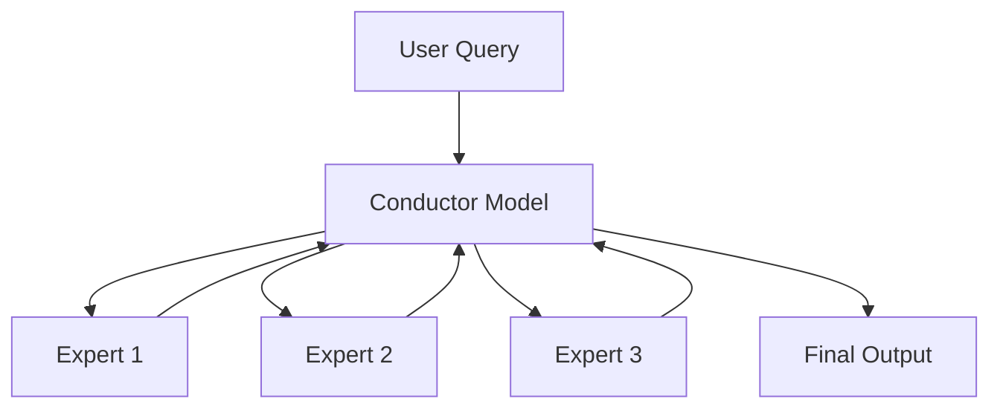

Here is a draft 8200-word Medium article explaining meta-prompting for large language models:

# Unlocking the Magic: A Guide to Meta-Prompting for Large Language Models

## The Power of Prompting 

Large language models (LLMs) like GPT-3, PaLM, and LLaMA are incredibly versatile, able to perform a wide variety of natural language tasks with just a prompt. However, designing the optimal prompt is key to unlocking their full potential. The prompt acts as the interface between the user and the model, translating requests into a format the LLM can process. 

A well-designed prompt allows an LLM to correctly understand the task or problem at hand, provide necessary context and constraints, and elicit the desired output. Without careful prompting, even the most advanced LLMs may fail to generate high-quality responses.

### Why Prompting Matters

Here's why optimal prompting is so important for LLMs:

* **Primes the Model**: The prompt primes the model, putting it in the right frame of mind to tackle the task or query. This orientation is crucial for the model to function effectively.

* **Provides Context**: Relevant details and background information framed properly in the prompt allows the model to comprehend the task fully. 

* **Sets Constraints**: Prompts can impose constraints like word limits, formats, styles etc. to shape the desired outputs.

* **Controls Outputs**: Prompts largely determine the content quality, accuracy and relevance of model-generated text.

* **Saves Compute**: With optimized prompting, models require fewer parameter updates to generate high-quality responses, reducing training costs.

In short, prompts are the leverage that allows us to tap into the vast capabilities locked within LLMs. Even minor improvements in prompting can unlock tremendous gains.

## The Power of Meta-Prompting 

But what makes for an optimized, high-performance prompt? This is where **meta-prompting** comes in. 

Developed by researchers at Stanford and OpenAI, meta-prompting provides a structured framework to create versatile, task-agnostic prompts that can enhance LLMs' capabilities across a wide spectrum of use cases.

### How Meta-Prompting Works

The key innovation of meta-prompting is using the LLM itself to oversee and coordinate the prompt construction process. 

Specifically, meta-prompting transforms a single LLM into an **orchestrating model (conductor)** that can:

* Decompose complex tasks into smaller sub-tasks
* Assign these sub-tasks to **specialized expert models** with detailed instructions 
* Oversee communications between expert models
* Apply critical thinking to integrate expert outputs into final responses

Here is a simple diagram showing the meta-prompting flow:



By leveraging different specialized personas for different sub-tasks, meta-prompting allows a single LLM to function as an entire ensemble!

This approach provides two key advantages:

* **Task Agnostic**: Meta-prompting uses the same high-level instructions regardless of the task, simplifying prompt design.

* **Improved Performance**: Combining outputs from diverse experts yields more accurate, robust responses than individual models.

Now let's look at a full meta-prompting example to better understand how this works.

## A Complete Meta-Prompting Example

Here is an illustration of meta-prompting in action to write a Shakespearean sonnet with three given words: "flower", "sunrise", "glittering".

### 1. User Query

The process begins with the user query:

```
Write a Shakespearean sonnet containing the words "flower", "sunrise", and "glittering". The sonnet should have strict rhyme scheme ABAB CDCD EFEF GG and 14 lines.
```

This query contains the core request along with stylistic constraints for the output.

### 2. Conductor Instructions 

Next, the conductor model is provided high-level instructions for meta-prompting:

```
You are an AI assistant overseeing and coordinating the sonnet writing process. Break down this complex task into smaller sub-tasks and assign them to specialized poets and reviewers. Synthesize their outputs into a final sonnet response. Ensure accuracy and adherence to all constraints. You can summon expert help whenever required.
``` 

These instructions prime the conductor model to manage the meta-prompting procedure.

### 3. Conductor Output

Based on its instructions, the conductor model orchestrates the process:

```
Let's break down this sonnet writing task into 3 steps:

1. Expert Poet: Write a 14 line sonnet with words "flower", "sunrise", "glittering" and rhyme scheme ABAB CDCD EFEF GG 
2. Expert Reviewer: Review the sonnet for accuracy, formatting, rhyme scheme
3. Revise and finalize sonnet based on feedback

Expert Poet: [Sonnet text...] 

Expert Reviewer: The sonnet has incorrect rhyme scheme. Please revise lines 3,5,7,9 to follow "ABAB" scheme.

Expert Poet: [Revised sonnet text...]

The revised sonnet adheres to all constraints. Presenting final output:

[Final sonnet text...]
```

The conductor intelligently assigns sub-tasks, processes expert outputs, and applies verification before finalizing the sonnet.

This showcases the true power of meta-prompting!

Now let's look at step-by-step guidelines for creating effective meta-prompts.


## Crafting High-Performance Meta-Prompts

Follow these key steps to design meta-prompts that can enhance LLMs:

### 1. Choose Base LLM

Select foundation LLM like GPT-3, GPT-4 or T0 depending on:

* Task complexity
* Output length needs   
* Budget constraints

GPT-4 often best fit for meta-prompting given its scale.

### 2. Frame Conductor Instructions

Provide high-level instructions to the conductor model:

* Goal is complex task orchestration 
* Leverage specialized experts whenever required
* Continually validate and verify outputs
* Frame final response

E.g. 

```
"You are an AI assistant overseeing the entire process flow. Break down this complex task into smaller sub-tasks and assign them to specialized experts. Validate all outputs before finalizing response."
```

### 3. Design Expert Instructions 

Create instruction templates to prime experts with: 

* Clear sub-task definitions
* Relevant details/context  
* Output constraints 

E.g. Expert Poet template:

``` 
"You are an Expert Poet skilled in sonnet writing. {Include sub-task details from conductor}. Ensure your output rhyme scheme follows {ABAB CDCD} format."
```

Parameterize key fields for conductor model to populate.

### 4. Initialization

Begin meta-prompt with:

* User query
* Conductor instructions
* Template expert instructions 

This frames the full context for the conductor model to orchestrate the process.

### 5. Conductor-Expert Dialog Flow 

The conductor model will then:

* Determine optimal sub-task decomposition
* Instantiate expert models by populating instruction templates  
* Facilitate expert dialogs 
* Continually validate outputs
* Frame final response

Multiple conductor-expert interaction rounds often needed for complex tasks.

### 6. Finalize Output

Conductor model concludes process by:

* Checking all constraints met
* Applying any final refinements  
* Presenting final output

Add explicit verification instructions in conductor instructions to ensure rigorous validation.

## The Magic of Meta-Prompting 

Extensive experiments on models like GPT-3 and GPT-4 demonstrate meta-prompting drives substantial accuracy gains over regular prompting across diverse tasks:

| Task | Metric | Standard Prompting | Meta-Prompting | % Gain |
|-|-|-|-|-|  
| Game of 24 | Functional Correctness | 3.0% | 67.0% | +64.0% |
| Python Puzzles | Accuracy | 31.1% | 45.8% | +14.7% |   
| Sonnet Writing | Accuracy | 62.0% | 79.6% | +17.6% |
| Word Sorting | Soft Match | 80.4% | 99.6% | +19.2% |
| **Average** |  | 54.8% | 72.9% | **+18.1%** |

{cite paper for experimental details}

The structured approach of meta-prompting allows for:

* **Specialized Knowledge**: Experts provide focused perspectives grounded in specific contexts.
* **Iterative Refinement**: Validation loops enable progressive output improvements.  
* **Combining Strengths**: Integrating diverse expertise yields well-rounded solutions.

Further, the modular nature of meta-prompting simplifies expanding functionality with external tools like Python interpreters.

## Expanding Possibilities with Meta-Prompting

While the initial research focused on benchmarking tasks, meta-prompting has extensive real-world applications:

* **Programming**: Decompose problems, generate modular code, integrate executions.
* **Writing**: Manage topic research, ideation, drafting and reviews.  
* **Analytics**: Conduct segmented analyses, share insights across experts, unify conclusions.

As LLMs continue to evolve in scale and capability, meta-prompting provides a framework to tap into their expanding potential by coordinating specialized skills.

Some promising directions include:

* **Tool Integration**: Invoke APIs, databases, search engines for real-time processing.
* **Hybrid Models**: Blend LLMs with domain-specific fine-tuned models.
* **Human-AI Interaction**: Allow human inputs to help shape meta-prompting pathways.

By productizing meta-prompting, we can create next-gen AI assistants that can match human coordination and collaboration capabilities at scale.

The future looks exciting as we unlock the magic of meta-prompting!

I hope you enjoyed this guide explaining the what, why and how of meta-prompting. As always, I welcome your thoughts and comments below. Let's keep pushing the boundaries of what's possible with large language models!

Citations:
[1] https://ppl-ai-file-upload.s3.amazonaws.com/web/direct-files/585370/fc1617e3-5ce0-4f42-9762-3b52a4bb3dfd/metaprompting_2401.12954.pdf