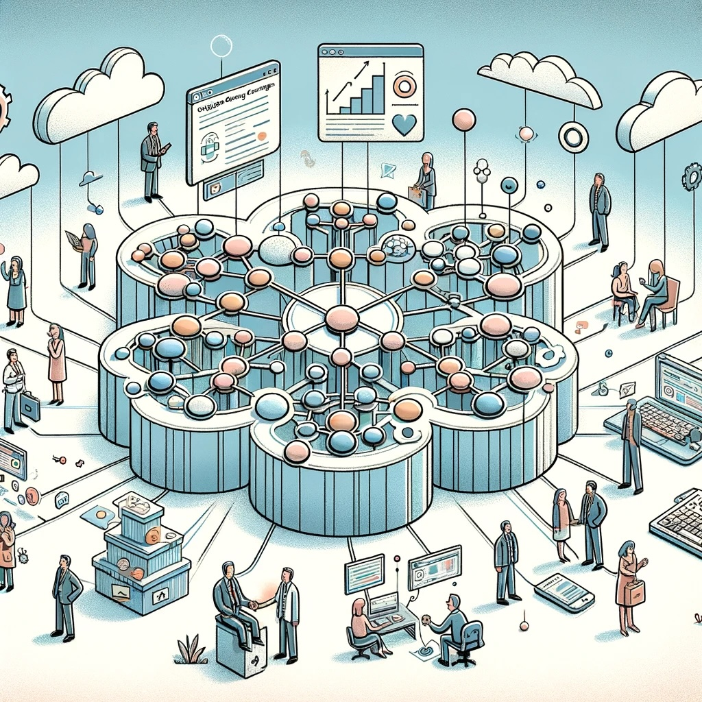

# The Critical Role of Knowledge Graphs for Improving Question Answering Accuracy over Enterprise Data

Question answering (QA) systems that allow users to query data in natural language have emerged as a transformational technology. However, applying QA to enterprise settings poses unique challenges that require novel solutions. A recent paper "A Benchmark to Understand the Role of Knowledge Graphs on Large Language Model's Accuracy for Question Answering on Enterprise SQL Databases" investigates how knowledge graphs can enhance QA accuracy for enterprise data. In this article, I summarize the key ideas from this paper and reflect on the implications for enterprises.

## The Promise and Pitfalls of QA for Enterprises

QA systems aim to understand natural language questions and return accurate answers by querying relevant data sources. With recent advances in natural language processing and the rise of large language models like GPT-3, QA systems are becoming incredibly powerful. They promise to make data access far more intuitive for business users compared to traditional query languages like SQL.

However, QA over enterprise data comes with a unique set of challenges:

- **Complex SQL schemas** - Enterprises have large databases with hundreds of tables spanning multiple subject areas. This complex schema lacks the context needed for QA.

- **Domain-specific questions** - Users ask sophisticated questions involving business KPIs, metrics, and reports. Without business knowledge, QA hallucinates answers.

- **Lack of semantics** - Underlying SQL databases lack explicit semantics to link business concepts. This results in inaccurate or meaningless answers.

These challenges lead to poor accuracy when applying out-of-the-box QA over enterprise data. So how can we improve accuracy?

## Knowledge Graphs Provide Missing Business Context

Knowledge graphs have emerged as a promising solution to address the lack of context and semantics in enterprise data sources. A knowledge graph represents entities as nodes, relationships as edges, and applies a semantic data model over top.

By linking knowledge graphs with underlying SQL databases, QA systems can leverage the rich business context. For example, a knowledge graph may model:

- Business entities like customers, products, transactions
- Attributes of each entity
- Relationships between entities
- Domain constraints and rules
- Synonyms and taxonomies

With this additional context, QA systems can better understand the meaning behind natural language questions and map them accurately to relevant data - significantly improving answer accuracy.

## What is a Knowledge Graph?

Knowledge graphs are powerful tools for representing and reasoning about complex domains of knowledge. At a high level, a knowledge graph consists of entities, their attributes, and the relationships between entities. By encoding knowledge in a graph structure, knowledge graphs provide a flexible and extensible way to capture the nuances of real-world semantics. 

In more detail, a knowledge graph contains nodes representing entities and edges representing relationships. Entities can be concrete objects like people, places, or events, or abstract concepts like disciplines, processes, or categories. Each entity has associated attributes or properties describing it - for example, a Person may have properties for name, birth date, occupation, etc. Edges link entities and represent how they relate to each other. Some common semantic relationships include:

- is-a - captures taxonomic hierarchies (e.g. Cat is-a Animal)
- part-of - models composition (e.g. Wheel part-of Car) 
- located-in - encodes spatial positions (e.g. Store located-in City)
- causes - represents causal dependencies (e.g. Rain causes Flooding)

By connecting entities and relationships into a graph structure, knowledge graphs create a flexible network that can capture the nuances of how real-world objects interact and relate to each other. This allows knowledge graphs to model complex domains with rich semantics in a machine-readable format.

Unlike rigid database schemas, knowledge graphs are flexible and extensible. New entity types, properties, and relationships can be added seamlessly to the graph to evolve its domain coverage. This makes knowledge graphs well-suited for representing knowledge-intensive domains.

Another key aspect of knowledge graphs is that they decouple the conceptual model from the storage layer. The knowledge graph defines a canonical semantic data model for the domain. But this logical model can then be stored and implemented through various storage backends - such as RDF triplestores, graph databases, document stores, or traditional relational databases. This enables flexibility in how the graph data is maintained and queried.

Knowledge graphs enhance how semantic information is processed by both humans and machines. For humans, the graph visualization provides an intuitive way to explore connections and drill into areas of interest. For machines, the encoded knowledge provides a substrate for automated reasoning and inference. This enables intelligent applications like semantic search, recommendations, data integration, and question answering.

For example, a knowledge graph may capture facts like:

- Leonardo da Vinci painted the Mona Lisa
- The Mona Lisa is a portrait painting from the early 16th century
- The Mona Lisa is displayed at the Louvre museum in Paris

An AI agent could then use this knowledge graph to infer the answers to related questions like "Who painted the portrait on display in the Louvre museum?" without needing these facts explicitly encoded.

Knowledge graphs are often used to enhance search experiences. Rather than just returning pages that match keywords, a knowledge graph allows search to provide direct answers to queries by following relationships in the graph. For example, a knowledge graph may let a search engine directly answer "Who painted the Mona Lisa?" rather than just giving pages about Leonardo da Vinci and the Mona Lisa for the user to extract the answer from.

In enterprises, knowledge graphs are increasingly used to enable intelligent applications over corporate data assets. Enterprise knowledge graphs encode business entities like customers, products, transactions, etc. and their relationships. This connects disparate silos of enterprise data sources into an integrated semantic model. Applications powered by AI and natural language processing can then tap into the business knowledge encoded in the graph.

Common enterprise use cases for knowledge graphs include:

- Semantic search - Find answers, not just documents
- Intelligent chatbots - Answer customer questions with contextual awareness 
- Recommendation engines - Suggest related products based on multiple relationships  
- Data integration - Align and map data across sources to a common model
- Master data management - Maintain "golden records" of key business entities  
- Fraud detection - Identify suspicious patterns and relationships across events
- Supply chain optimization - Gain integrated visibility across suppliers, inventories, shipments, etc.

These applications leverage the connected nature of knowledge graphs to uncover insights that would be difficult to discern from individual data sources in isolation.

Constructing enterprise knowledge graphs involves several key steps:

1. Define the domain - Determine the scope of entities, concepts, properties and relationships to model. Reuse existing ontologies where possible.

2. Model the ontology - Develop the conceptual schema as a semantic ontology, often using W3C standards like RDF and OWL.  

3. Extract entities - Identify key entities in source systems and disambiguate to canonical definitions in the ontology.

4. Map attributes - Map attributes from source data structures to canonical property definitions from the ontology.

5. Discover relationships - Use data mining and machine learning to learn relationships between entities based on attribute values and patterns.

6. Encode axioms - Add logical constraints, rules, and axioms to refine the semantics and allow logical inference.

7. Load data - Extract entities and relationships from source systems into the knowledge graph.

8. Enrich data - Link in external data sources, leverage NLP on text to connect unstructured data.

9. Maintain data - Keep the knowledge graph up-to-date as source data changes.

10. Expose access - Provide APIs, query languages, and tools to access the knowledge graph.

This process combines both automated and manual techniques. Subject matter experts are needed to define the ontology and model business logic. But techniques like schema mapping, entity matching and relationship mining can help accelerate developing the graph. Ongoing maintenance and governance is crucial to keep the encoded knowledge current.

Knowledge graphs are often visualized using node-link network diagrams. But there are specialized graph query languages and APIs to access them programmatically:

- RDF and SPARQL - W3C standards for graph data model and query language
- GraphQL - API standard for accessing graph data 

There are also various graph database platforms optimized for storing and querying knowledge graphs:

- Neo4j - A native graph database with Cypher query language 
- Amazon Neptune - Managed graph database service  
- Microsoft Cosmos DB - Multi-model database with graph support
- Ontotext GraphDB - RDF triplestore optimized for semantic graphs

## Evaluating QA Accuracy Over Enterprise Data

The authors devised an experimental benchmark to evaluate the impact of knowledge graphs on QA accuracy over enterprise data. They compared QA accuracy using GPT-3 in two scenarios:

1. QA directly over a SQL database schema
2. QA over a knowledge graph representation of the same SQL database

The benchmark included:

- A real-world SQL database schema from the insurance domain with 13 core tables.
- 43 natural language questions of varying complexity.
- A knowledge graph ontology and mappings to enrich the semantics.

QA accuracy was measured by the percentage of questions answered correctly against known answers.

## Results: Knowledge Graphs Boost Accuracy

The results clearly demonstrated the value of knowledge graphs:

- Directly querying the SQL database, accuracy was only 16.7%
- Using the knowledge graph representation, accuracy rose to 54.2%

For simple questions with low schema complexity, the knowledge graph improved accuracy from 25.5% to 71.1%. For complex questions, the knowledge graph enabled the QA system to answer accurately when SQL alone resulted in 0% accuracy.

## Key Takeaways for Enterprises

This benchmark reveals important insights for leveraging QA over enterprise data:

- Out-of-the-box QA over SQL databases has very low accuracy due to lack of business context.
- Knowledge graphs significantly improve accuracy by encoding semantics and domain knowledge.
- To enable trusted QA, investing in knowledge graphs and semantic data models is critical.

As QA systems grow more powerful, ensuring high accuracy and reliability over enterprise data will require combining language models with structured knowledge graphs. This opens up exciting opportunities to transform how business users access and analyze data!

The paper provides a robust framework for evaluating QA systems, while demonstrating the concrete value knowledge graphs bring. For organizations pursuing QA, focusing on curating high-quality knowledge graphs is a strategy I would strongly recommend based on these findings.

## Citations 

Wang, Shengjie, Keyulu Xu, Jing Huang, Lun Du, Ken-ichi Kawarabayashi, and Stefanie Jegelka. "A Benchmark to Understand the Role of Knowledge Graphs on Large Language Model's Accuracy for Question Answering on Enterprise SQL Databases." arXiv preprint arXiv:2311.07509 (2023). https://arxiv.org/abs/2311.07509.

