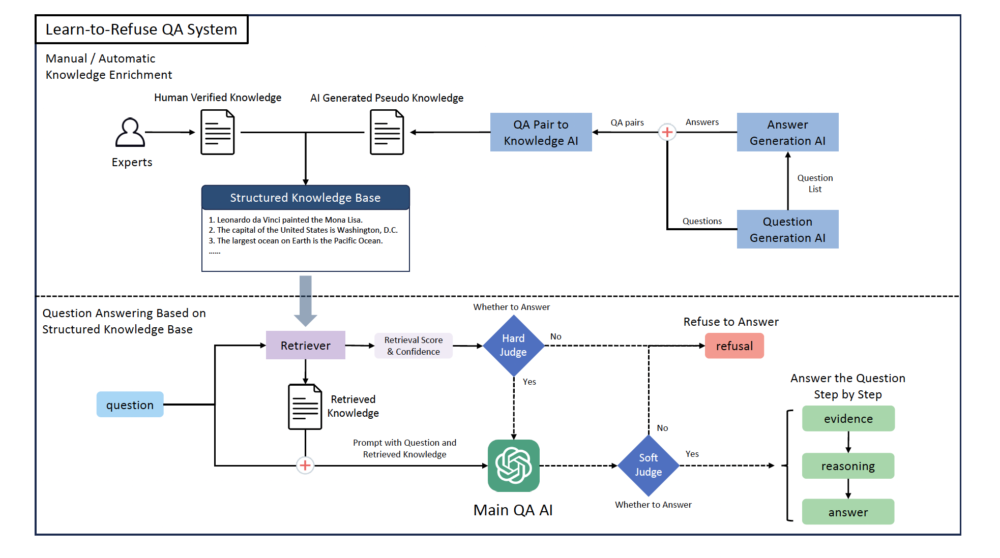
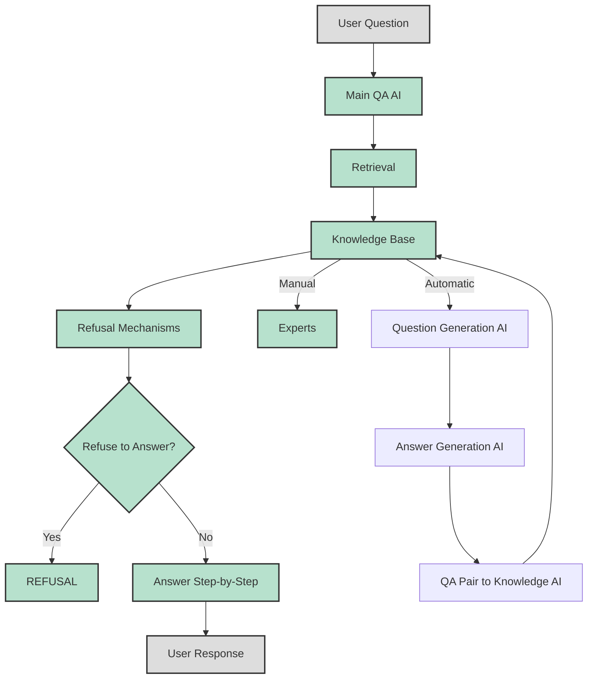

# Making AI Assistants More Reliable By Teaching Them To "Learn To Refuse" 

I closely follow developments in artificial intelligence research. One area that has seen huge leaps recently is natural language processing using large language models (LLMs) like ChatGPT. 

These models can generate remarkably human-like text and engage in conversations on a wide range of topics. 

However, as impressed as I am by their capabilities, I'm also keenly aware of their limitations. Their most glaring flaw is their propensity to "hallucinate" - make up plausible-sounding but completely incorrect information. This happens because LLMs are trained on vast amounts of text data but lack a grounded understanding of facts about the real world.

This tendency to "fake it till you make it" is currently holding back wider adoption of conversational AI assistants. If I can't trust an AI to give me factually correct information, I'm certainly not going to trust it for anything mission-critical in my business or personal life. 

So when I came across the paper ["Learn to Refuse"](https://arxiv.org/abs/2311.01041) by Cao, Lang a  researcher at the University of Illinois, it immediately grabbed my attention. In this article, the authors directly tackle the issue of hallucination in LLMs using a clever technique - teaching models when to "refuse" to answer questions they are likely to get wrong.

The core innovation of Learn to Refuse is to separate the language model itself from its knowledge base. By limiting the scope of the knowledge available to the model, it becomes possible to determine when a question falls outside this scope. The model can then "refuse" to answer, rather than blindly generating a response that is likely fictional.

In the rest of this article, I'll provide an overview of Learn to Refuse - what problem it aims to solve, how it works, what implications it could have, and how it relates to other techniques like retrieval augmentation. My goal is to break down this research paper into an accessible explanation for readers less familiar with the latest AI literature.

Illustration of the Learn to Refuse approach. The model is prompted to only use retrieved knowledge from a structured knowledge base when answering questions. If the knowledge is insufficient, the model refuses to answer. (Source: [Learn to Refuse](https://arxiv.org/abs/2311.01041))

## The Problem: Hallucination in Large Language Models

ChatGPT, Anthropic Claude V2 and similar large language models are trained on massive textual datasets scraped from the Internet and books. The sheer size of their training data - often hundreds of billions of words - is what gives these models their broad language mastery and ability to generate remarkably human-sounding text on virtually any topic.

However, this training approach comes with a major downside. While these models have extensive linguistic capabilities, they lack any grounded understanding of facts about the actual world. Their knowledge comes exclusively from statistics over texts, not learning about real objects, events, and relationships.

Consequently, when you ask an LLM a factual question it does not know the answer to, it has no choice but to "hallucinate" - make its best guess based on language patterns it has observed, without regard for truth or accuracy. 

As an example, let's say I asked ChatGPT a very simple question:

*"What is the capital city of Australia?"*

ChatGPT would likely respond with something like:

*"The capital city of Australia is Sydney."* 

This is a completely plausible-sounding (but incorrect) answer. The true capital of Australia is Canberra. However, Sydney is the largest and most well-known Australian city. So statistically, ChatGPT is making its best guess based on text associations - but it has no real world knowledge that the capital is specifically Canberra.

While mistakes like this may seem harmless, hallucination becomes extremely problematic when AI systems are used for tasks like medical diagnosis, financial analysis or other domains where factual accuracy is critical. 

According to the authors of Learn to Refuse, hallucinations fall into three major types:

- **Input conflicting:** The model's response contradicts itself or the original input query.

- **Context conflicting:** The model's response is inconsistent with its previous outputs in a conversation. 

- **Fact conflicting:** The model's response contradicts true facts about the real world.

The focus of Learn to Refuse is on addressing **fact-conflicting hallucinations** - when language models generate responses that defy factual reality. This addresses the core inadequacy that large models have no actual grounding in real world knowledge.

So in summary, the *problem* Learn to Refuse aims to solve is reducing the risk of hallucination where LLMs confidently provide false information to users. Next, let's look at their proposed solution.

## The Solution: Knowledge Scope Limitation and Refusal Mechanism

The key insight of Learn to Refuse is that we can reduce hallucinations by tightly limiting the knowledge scope made available to a language model. 

Rather than leveraging the millions of facts a model may have implicitly learned during pre-training, the authors propose representing all its knowledge through a separate, explicit **structured knowledge base**. 

This knowledge base consists of individual factual statements like:

- *Leonardo da Vinci painted the Mona Lisa.*

- *The capital of the United States is Washington D.C.*

To begin with, this knowledge base is empty. Factual knowledge can then be manually added by human experts or automatically using other techniques which I'll discuss later.

At runtime, when a question is asked, relevant facts are retrieved from the knowledge base and provided to the model. The model is prohibited through careful prompting from relying on any other internal knowledge it may have. 

This means the model is fully constrained - it can **only** generate responses supported by the limited factual knowledge it receives as input. There is no room for factual hallucination.

Additionally, Learn to Refuse employs a **refusal mechanism** where the model can decline to answer questions when its knowledge is insufficient. This avoids forcing the model to guess or make up information when no relevant facts are available. 

Refusal is triggered through two methods:

- **Soft refusal**: The model itself determines when it cannot answer a question reliably.

- **Hard refusal**: A rules-based system rejects questions without retrieved knowledge meeting certain criteria. 

By combining knowledge scope limitation and refusal, Learn to Refuse creates a factually-grounded conversation agent. The model gains competence over time as more verified factual knowledge gets added to its base. But crucially, it knows the boundaries of its knowledge and will not attempt to "fake" responses on unsupported topics.

Below is a diagram from the paper summarizing the architecture:

Next, I'll go into more details on how knowledge scope limitation and refusal work together in the Learn to Refuse approach.

## Knowledge Scope Limitation

The first core technique in Learn to Refuse is representing all of the model's world knowledge through a structured, limited knowledge base separate from the model itself. 

In a standard LLM like ChatGPT, the model's knowledge is bound up in the weights of its neural network, derived implicitly through pre-training. There is no separation between the "brain" (the model) and the "knowledge" it possesses.

Learn to Refuse splits these apart. The language model is just an engine for processing text inputs and generating text outputs. All of its factual knowledge comes from a structured database of short text statements.

Some key aspects of the structured knowledge base:

- **Independent:** The knowledge base is separate from the model weights. Facts can be modified, added or removed without retraining the model.

- **Limited:** The knowledge base only contains verified factual statements. It does not encompass everything the model may have learned.

- **Structured:** Individual facts are concise and unambiguous. This avoids conflating multiple facts within one piece of text.

- **Retrievable:** Facts can be efficiently indexed and retrieved given a query. Relevant knowledge for answering a specific question can be provided as context to the model.

Initially, this knowledge base starts empty with no facts. Factual knowledge can then be incrementally added, either manually by human experts or through automated methods.

This knowledge represents the total scope of what the model demonstrably "knows" at any time. By prompting the model to only reply based on retrieved knowledge, its responses will be constrained to factual reality rather than unbounded speculation.

When a question is asked, relevant facts are retrieved from the knowledge base through a standard search process. These facts become the sole context provided to the language model when formulating its reply.

Even if the model has learned additional information through pre-training, it is restricted to the limited scope of the retrieved facts. Without relevant knowledge available, it cannot fabricate a response.

This technique bears some similarities to prior augmentation methods like REALM and RAG which retrieve documents from corpora to provide more information to models. A key difference is that the knowledge base contains individual facts rather than full documents. This structured approach better delineates the knowledge scope for the model.

Overall, knowledge scope limitation gives Learn to Refuse total control over the facts available to the model. By prompting it to stay within clear boundaries, hallucination beyond its knowledge can be eliminated.

## Refusal Mechanism 

The second main technique in Learn to Refuse is enabling the model to "refuse" answering questions when its knowledge is insufficient. This avoids forcing the model to speculate and further reduces possible hallucinations.

There are two types of refusal checks:

**Soft refusal:** The model itself reviews the retrieved knowledge and determines if it can answer reliably. The authors prompt the model to make a binary yes/no judgment on answerability.

**Hard refusal:** A rules-based system examines the retrieved knowledge. If it does not meet certain criteria (e.g. relevance score), the question is automatically rejected.

For both refusal types, if the check fails, the model returns a REFUSAL indicator rather than attempting an answer.

The soft refusal relies on the model's expanding self-awareness of the knowledge it possesses, sometimes referred to as "self-knowledge". Recent studies suggest large models exhibit increasing competence at evaluating their own capabilities. 

By instructing the model to refuse answering when knowledge appears insufficient, this tendency is explicitly leveraged to avoid hallucination.

Hard refusals serve as a backup that prevents the model from overlooking gaps in its knowledge. Even if the model incorrectly decides it can answer, the hard refusal will veto the response if retrieved knowledge is inadequate.

Together, these complementary mechanisms allow Learn to Refuse to "know what it does not know" - a critical capability for safe and reliable question answering.

## Implications

Now that I've provided an overview of how Learn to Refuse works, I want to discuss what I see as some of the key implications and benefits of this technique:

**Improved Accuracy**

By restricting models to answer only supported by verified facts, Learn to Refuse significantly reduces incorrect responses. Refusals avoid forcing models to guess on insufficient knowledge.

In their experiments, the authors achieved around 90% accuracy using Learn to Refuse, compared to 50-60% for baselines - a dramatic improvement.

**Controllable Knowledge** 

The structured knowledge base gives total control over the facts available to the model. Knowledge can be precisely added or removed as needed.

This is preferable to the black-box knowledge implicitly gained by models through pre-training. LLMs often exhibit unintended biases or make unsupported claims.

**Traceable Reasoning**

By prompting the model to explain its reasoning and provide evidence, Learn to Refuse produces more interpretable responses. 

Users can understand exactly which facts supported an answer, rather than blindly trusting an opaque model.

**Safe Failure**

When lacking knowledge, Learn to Refuse fails by refusing to answer at all. This is safer than confidently providing false responses.

Refusals indicate to users that more knowledge needs to be added, rather than misleading them with hallucinations.

**Gradual Learning**

Starting with an empty knowledge base prevents models from relying on any pre-existing assumptions. Knowledge is then incorporated deliberately.

The structured approach allows knowledge to be expanded gradually in a controlled fashion.

**Usable Today**

Learn to Refuse works with existing models like GPT-3 without retraining, by solely prompting techniques.

This allows improving reliability without developing entirely new architectures. The knowledge base can easily be swapped in.

In summary, Learn to Refuse offers an elegant solution to rein in the wild speculation of large language models by restricting them to "learned" facts. 

The techniques provide a path to developing AI assistants that users can actually trust - assistants that admit when they don't know, rather than pretending expertise.

## Relationship to Other Techniques

Learn to Refuse relates closely to other promising methods that aim to improve the factual correctness of large language models:

**Retrieval Augmentation**

Approaches like REALM and RAG augment models with relevant texts retrieved from corpora as context when answering questions. The retrieved documents provide more information to the model.

Learn to Refuse similarly retrieves relevant facts from a knowledge base. The key differences are the structured representation and stricter prompting for models to only use retrieved knowledge.

**Verification Fine-Tuning**

Some research has proposed additional training of models to verify claims or identify unsupported assertions in their own text output. This acts as self-supervision to reduce hallucination.

Learn to Refuse incorporates similar verification capabilities through soft refusals. However, it relies solely on prompting of existing models rather than requiring costly further training.

**Chaining Prompts**

Chain of Thought is a prompting technique where models are asked to explain their reasoning step-by-step for transparency. 

Learn to Refuse employs similar prompting for models to provide an evidence chain from retrieved facts to conclusions.

**Judgement Modeling**

Work such as JudgeBERT aims to improve models' awareness of the strength of claims, allowing them to abstain from making unjustified assertions.

The soft refusals in Learn to Refuse accomplish similar goals through prompting models to assess answerability given limited context.

## Remaining Challenges

While Learn to Refuse takes an important step forward, the authors acknowledge it represents early progress rather than a complete solution. Some key challenges still remain:

- The knowledge base needs to be carefully constructed to provide useful retrieval results. Low-quality facts will hamper performance.

- Automatic knowledge enrichment from models risks introducing incorrect information without human verification.

- Refusal effectiveness relies on the language model's ability to accurately assess self-knowledge, which is still imperfect.

- More complex, multi-hop reasoning requires modeling a graph of relationships between facts, rather than isolated facts.

- Ensuring consistently high-precision refusals across domains while maintaining broad capabilities remains difficult.

Nonetheless, I see Learn to Refuse as an encouraging demonstration of how circumspect language models can start to become less prone to unsupported speculation. The techniques offer a promising direction for developing AI systems we can trust for factual information.

## Try Learn To Refuse Yourself

If you found this article interesting, I encourage you to [read the full Learn to Refuse paper](https://arxiv.org/abs/2311.01041) and try out the techniques yourself:

- Build a small structured knowledge base with verified facts in a JSON format.

- Use a tool like Anthropic's Claude V2 to implement knowledge retrieval and refusal based on the authors' approach. 

- Observe how the model's responses change when you provide limited context vs. allowing full access to Claude's internal knowledge.

- Experiment with different prompts and threshold values for soft vs. hard refusals.

I'm very curious to see creative ways researchers and engineers may build on these ideas. Teaching AI systems to recognize the limits of their knowledge could go a long way in making them more reliable.

What are your thoughts on Learn to Refuse? I'd love to discuss this paper and potential next steps. Please share your feedback in the comments!

## Citations

Cao, Lang. "Learn to Refuse: Making Large Language Models More Controllable and Reliable through Knowledge Scope Limitation and Refusal Mechanism." arXiv preprint arXiv:2311.01041 (2023)