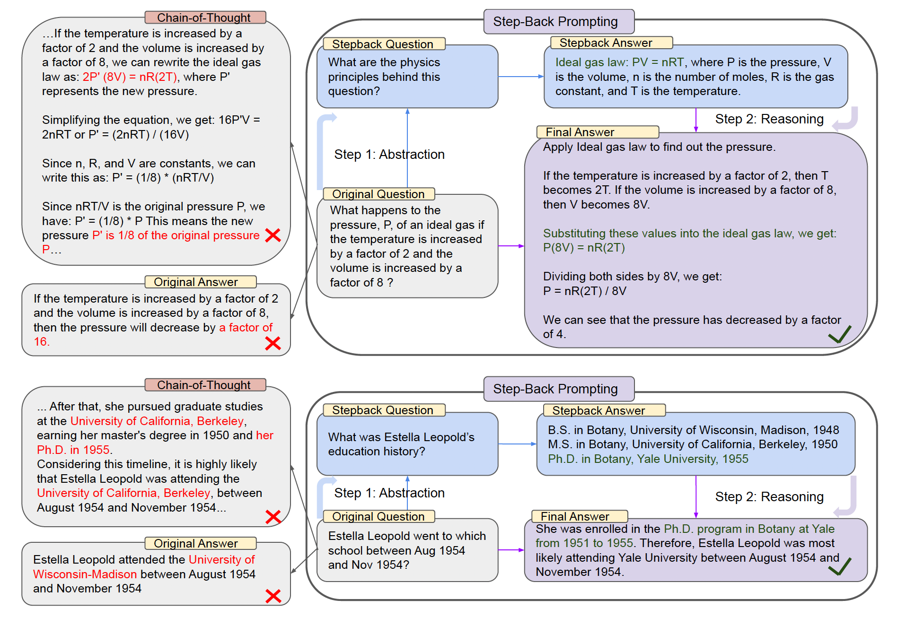
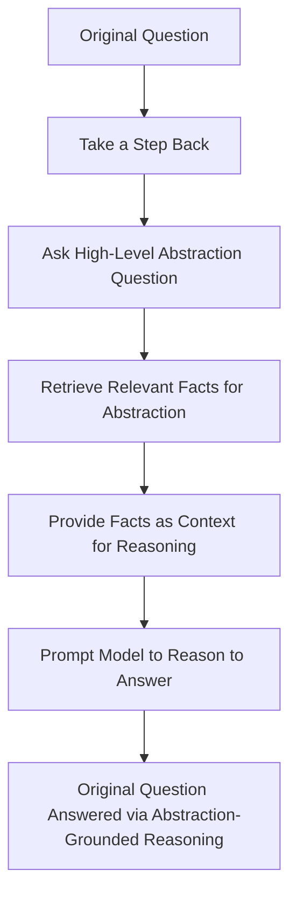
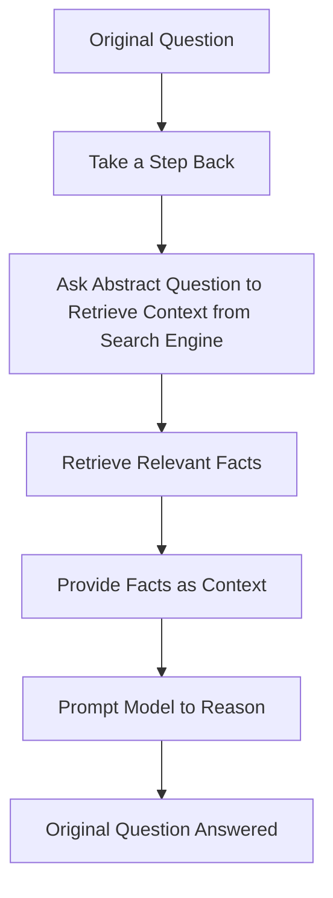

# 🔄 Step Back Prompting - Abstraction for Complex Reasoning

[](./CHANGELOG.md)
[](#difficulty-level)
[](#category)

> **🎯 Focus**: Improving LLM complex reasoning through abstraction - stepping back to high-level principles before detailed problem-solving.

## 🧭 Navigation

**Current Location**: `Digital Palace → Reference → Techniques → Step Back Prompting`

**Related Paths**:

- [← Techniques Hub](../)
- [Chain of Thought](../chain_of_thought/) - Sequential reasoning
- [Meta-Prompting](../meta_prompting/) - Self-directed prompting
- [Think Twice](../think_twice/) - Perspective-taking

## 🚀 Essential Starting Points

### 🎯 Choose Your Path

| 🎯 I Want To... | 📚 Resource | 🕒 Time | 🎯 Outcome |
|-----------------|-------------|---------|------------|
| **Understand Abstraction** | [Core Concept](#core-concept) | 10 min | Foundation knowledge |
| **See the Method** | [Two-Phase Process](#two-phase-process) | 15 min | Working technique |
| **Try Examples** | [Implementation Guide](#implementation-guide) | 30 min | Hands-on practice |
| **Deep Research** | [Performance Results](#performance-results) | 45 min | Complete analysis |

## 📋 Content Inventory

### 🎯 Quick Reference

- **[Core Concept](#core-concept)** 🟢 - Abstraction-based reasoning
- **[Two-Phase Process](#two-phase-process)** 🟡 - Step-by-step method
- **[Implementation Guide](#implementation-guide)** 🟡 - Practical examples
- **[RAG Integration](#rag-integration)** 🔴 - Advanced applications

### 🔗 Related Techniques

- **Chain of Thought** - Sequential step reasoning
- **Think Twice** - Perspective-taking approaches
- **Meta-Prompting** - Self-directed problem solving

---

## 🧠 Core Concept

The **Step Back** technique addresses a critical limitation in LLM reasoning: getting lost in problem details without establishing foundational principles.

### The Problem

Current LLMs struggle with complex, multi-step reasoning because they:

- Jump directly into specifics without establishing context
- Lose track of underlying principles during reasoning
- Make errors in intermediate steps without high-level guidance

### The Solution

**Step Back Prompting** introduces a two-phase approach:

1. **Abstraction Phase**: Identify key principles and concepts
2. **Reasoning Phase**: Apply abstract knowledge to specific details


*Figure: Step Back technique workflow from DeepMind research*

---

## 🔄 Two-Phase Process

### Phase 1: Abstraction

**Prompt the model to identify high-level principles**

```markdown
"Take a step back. What are the key principles/concepts needed to solve this problem?"
```

### Phase 2: Reasoning

**Apply the abstract knowledge to specific details**

```markdown
"Using these principles, solve the original problem step by step."
```

### Visual Workflow



**The process**:

1. Start with the original question
2. Prompt the model to "take a step back"
3. Ask a high-level, abstract version of the question
4. Use the abstraction to retrieve relevant facts
5. Provide the facts as context to ground the reasoning
6. Prompt the model to reason step-by-step to the answer
7. Arrive at the answer via abstraction-guided reasoning

### Physics Example

**Original Question**: *What happens to the pressure of an ideal gas if the temperature is increased by a factor of 2 and the volume is increased by a factor of 8?*

**Step Back Response**: *The physics principles behind this question are the ideal gas law, PV = nRT, where P is pressure, V is volume, n is the amount of gas, R is a constant, and T is temperature.*

**Final Reasoning**: *Using the ideal gas law PV = nRT, if T increases by a factor of 2 and V increases by a factor of 8, then P will decrease by a factor of 4.*

---

## 💡 Implementation Guide

### Basic Template

```python
def generate_step_back_prompt(problem):
    """Generates a prompt to take a step back from the original problem."""
    
    prompt = f"""
# Original Problem:
"{problem}"

# Step Back: 
What are the key steps and concepts needed to solve this problem? 

# Explain the key steps:

# Solve the original problem:
To solve the original problem, I will...
"""
    return prompt
```

### Complete Python Implementation

```python
from litellm import completion

def process_response(response):
    """Processes the response from the completion function."""
    for chunk in response:
        try:
            if "choices" in chunk and chunk["choices"]:
                choice = chunk["choices"][0]
                if choice["finish_reason"] == "stop":
                    print("\n")
                    break
                if "delta" in choice and "content" in choice["delta"]:
                    content = choice["delta"]["content"]
                    if content:
                        end = "\n" if content.endswith("\n") else ""
                        print(content, end=end)
            else:
                print("")
        except Exception as e:
            print(f"An error occurred: {e}")

def main():
    """Main function to demonstrate step back prompting."""
    
    problem = """A man spends one-eighth of his money on rent,
    and four times that amount on food and clothing. 
    He has $9,000.00 left. How much did he have at the beginning?"""

    prompt = generate_step_back_prompt(problem)
    message = {"role": "user", "content": prompt}
    
    try:
        response = completion(
            model="gpt-3.5-turbo",
            messages=[message], 
            stream=True, 
            temperature=0.5
        )
        process_response(response)
    except Exception as e:
        print(f"An error occurred: {e}")

if __name__ == "__main__":
    main()
```

### Expected Output

```text
# Original Problem:
"A man spends one-eighth of his money on rent,
and four times that amount on food and clothing. 
He has $9,000.00 left. How much did he have at the beginning?"

# Step Back: 
What are the key steps and concepts needed to solve this math word problem? 

# Explain the key steps:

# Solve the original problem:
To solve the original problem, I will...

1. Start by setting up an equation to represent the problem. Let's call the man's initial amount of money "x".

2. According to the problem, the man spends one-eighth of his money on rent, so he has (7/8)x left.

3. The man also spends four times the amount he spent on rent on food and clothing, so he spends 4 * (1/8)x = (1/2)x on food and clothing.

4. After spending money on rent and food and clothing, the man has $9,000 left, so we can set up the equation (7/8)x - (1/2)x = 9,000.

5. Simplify the equation by multiplying both sides by 8 to get rid of the fractions: 7x - 4x = 72,000.

6. Combine like terms to get 3x = 72,000.

7. Divide both sides of the equation by 3 to solve for x: x = 24,000.

8. Therefore, the man had $24,000 at the beginning.
```

> **🎯 Key Insight**: GPT-3.5 struggles with this problem normally but achieves 100% accuracy with Step Back prompting.

---

## 🎯 Performance Results

### Benchmark Improvements

The DeepMind research showed significant performance gains:

- **STEM Questions**: 25%+ accuracy improvement on physics, chemistry, biology
- **Knowledge-intensive QA**: Enhanced factual reasoning capabilities
- **Multi-hop Reasoning**: Over 25% boost in complex logic chains

### Key Benefits

1. **Reduced Reasoning Errors**: Abstract grounding prevents getting off-track
2. **Better Problem Decomposition**: High-level view guides step-by-step logic
3. **Improved Context Utilization**: Relevant principles inform each reasoning step

### Error Analysis

**Without Step Back**: Models jump to details, make intermediate calculation errors  
**With Step Back**: Models establish principles first, maintain logical consistency

---

## 🔗 RAG Integration

### Enhanced Retrieval Strategy

Combine Step Back with Retrieval-Augmented Generation for powerful context gathering:



### Two-Step Retrieval Process

1. **Abstract Retrieval**: Use high-level question to gather background context
2. **Specific Retrieval**: Use original question with enriched context

### LangChain Implementation

Reference implementation: [LangChain Step Back QA Cookbook](https://github.com/langchain-ai/langchain/blob/master/cookbook/stepback-qa.ipynb)

---

## 🎓 Best Practices

### When to Use Step Back

✅ **Ideal for**:

- Complex multi-step problems
- STEM reasoning tasks
- Knowledge-intensive questions
- Problems requiring principle application

❌ **Not needed for**:

- Simple factual queries
- Single-step calculations
- Creative writing tasks

### Prompt Design Tips

1. **Clear Abstraction Cues**: Use "take a step back" or "what principles apply"
2. **Structured Format**: Separate abstraction and reasoning phases
3. **Domain-Specific Language**: Adapt to field (physics principles, historical context, etc.)

### Common Pitfalls

- **Over-Abstraction**: Getting too high-level to be useful
- **Skipping Connection**: Not linking abstract principles to specific problem
- **Inconsistent Application**: Not following through on established principles

---

## 📚 Additional Resources

### Research Papers

- **Original Paper**: [Take a Step Back: Evoking Reasoning via Abstraction in Large Language Models](https://arxiv.org/abs/2310.06117)
- **Related Work**: Chain of Thought, Tree of Thoughts, Meta-Prompting

### Implementation Resources

- **LangChain Cookbook**: Step-by-step RAG integration
- **Python Examples**: Complete working implementations
- **Evaluation Metrics**: Benchmarking reasoning improvements

### Next Steps

1. **Automated Abstraction**: Training models to step back autonomously
2. **Dynamic Abstraction Levels**: Adjusting abstraction depth by problem complexity
3. **Multi-Modal Applications**: Extending to visual and mathematical reasoning

---

## 🏁 Key Takeaways

- **Abstraction Enables Reasoning**: High-level principles guide detailed problem-solving
- **Two-Phase Approach**: Separate abstraction from application for better results
- **Significant Performance Gains**: 25%+ improvement on complex reasoning tasks
- **Broad Applicability**: Works across STEM, knowledge QA, and multi-hop reasoning
- **RAG Synergy**: Enhanced retrieval through abstract context gathering

> **💡 Remember**: The power of Step Back lies in mimicking human problem-solving - we naturally abstract before diving into details. Teaching LLMs this approach unlocks more robust reasoning capabilities.

---

*Last Updated: June 2025 | [Report Issues](../../issues/) | [Contribute](../../contributing/)*
