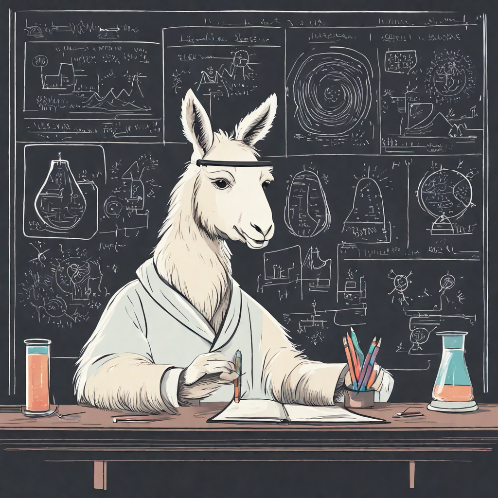
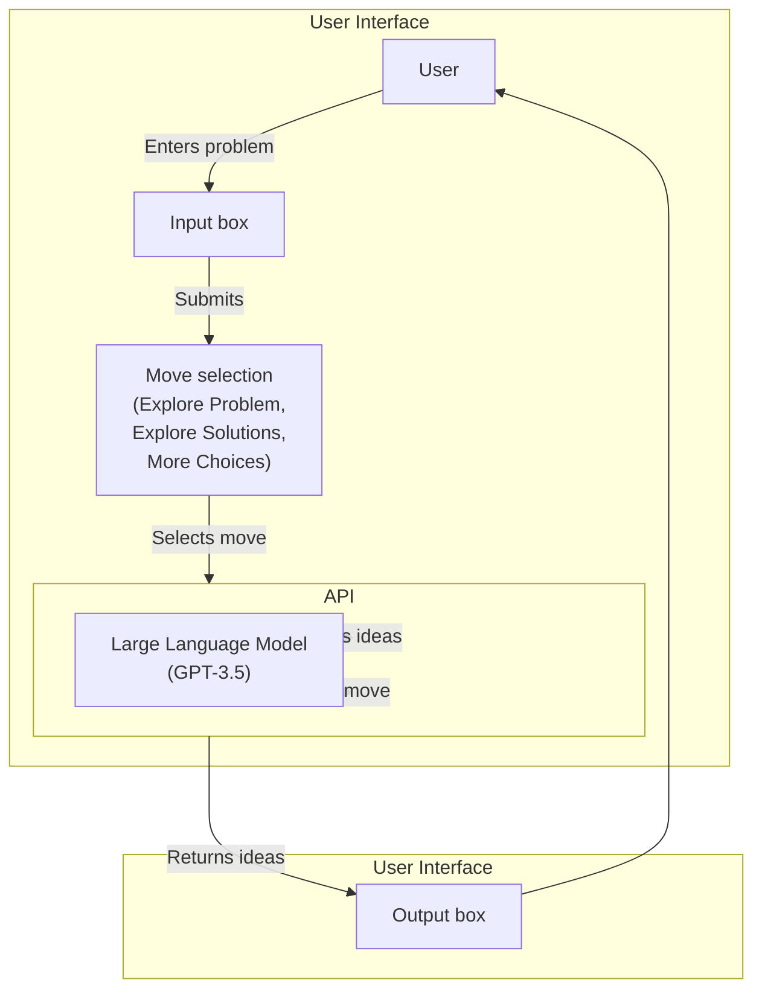

# How Generative AI Can Boost Your Creativity: An Introduction to Supermind Ideator

Creativity and innovation are critical to success in many kinds of human endeavors, from entrepreneurship and software development to architecture, engineering and even designing how groups of people work together. It's no surprise then that techniques to improve creative problem-solving have been proposed for years, including brainstorming, design thinking, mind mapping, and crowdsourcing. 

Now, the rise of large language models (LLMs)  herald a new era where AI can be a creative partner during ideation. LLMs excel at churning out waves of possibilities from small prompts, allowing people to rapidly explore the problem and solution space. By using specialized prompts and fine-tuning, these models can be guided to reflect back insights, trigger new associations, and synthesize combinations of ideas.

In this post, I’ll introduce **Supermind Ideator** - a new system from researchers at MIT that shows the potential for LLMs to augment human creativity. Ideator uses the GPT-3.5 model with custom prompts tailored to productive collaborative ideation between human and machine.



## LLMs: Quirky Creative Partners

Large language models like GPT-3 and Codex hint at the future possibilities for AI to be collaborators in creative endeavors. Their prowess comes from being trained on massive corpora of text from the Internet. This allows them to make educated guesses on how to continue or complete sequences of text or code. 

While concerns around accuracy and bias exist, LLMs can be incredibly useful for divergent, possibility-focused activities like ideation. You give them a starting prompt, and they rapidly produce waves of related text that can spur new directions for thinking.

LLMs tend to make logical leaps or factual mistakes. But as Stimulating influences rather than authoritative answers, these quirks are often features rather than bugs. The sparks of connection they provide allow you to think thoughts you may never have had otherwise.

The key is maintaining the human in the loop - using your judgement to cherrypick useful fragments and letting the machine provide a sounding board to reflect off. With the right framing and application, LLMs can be quirky yet potent partners in exploring possibilities.

## Introducing Supermind Ideator

The researchers behind Ideator wondered if LLMs could be specialized to support creative problem framing and solution finding. 

Their system focuses the broad capabilities of LLMs into an interface optimized for ideation. This includes carefully crafted prompts and fine-tuning to direct the model, as well as an interactive UI to incrementally build on ideas.

The goal is to let a human drive the process while leveraging the machine's ability to rapidly produce huge arrays of concepts. Used together, human and AI can explore the problem and solution space faster and more broadly than either could alone.

### Drawing on a Methodology for Systematic Creativity

Ideator is based on the **Supermind Design** methodology - itself a synthesis of creative techniques into a framework for designing groups of people and computers working together.

Supermind Design includes conceptual "moves" you can make to look at a problem in different ways. Chaining these moves helps break mental blocks and allows systematically surveying possibilities from new perspectives.

Some moves are general purpose - like looking at sub-parts of a problem or finding analogies. Others give creative prompts tailored to designing "superminds" - collectives of individuals acting with shared intelligence.

By encoding these moves as prompts for LLMs, Ideator provides an AI-powered engine for following the methodology. This allows efficiently surveying possibilities within a structured creative process.

### Specializing LLMs for Ideation Support 

To build Ideator, the researchers started with a base LLM - specifically GPT-3.5.

They focused its broad capabilities into prompts optimized for each move. This acts as the query sent to the LLM for a given conceptual move. For example, the "Reflect" move uses this prompt:

```
"I have the following problem statement: {problem}. What am I missing? What else should I think about when formulating my need? Use the answers to these questions to create better problem statements."
```

The `{problem}` section is filled with the user's actual problem description before querying the LLM.

On top of the base model, the researchers also fine-tuned a version of GPT-3.5 specifically for Supermind Ideator. This custom model was trained on a corpus of 1,600 real world examples of organizations creatively solving problems.

The fine-tuned version generates case study-like examples from a given problem and move prompt. These "fictional case studies" aim to provide stimuli to trigger real human creativity.

### An Interactive Interface Optimized for Ideation

To make it easy to apply prompts systematically, Ideator provides an interactive web interface. Users describe their problem upfront. They can then choose "move sets" like:

- **Explore Problem**: Reframe and analyze the problem using moves like zooming in on parts, finding analogies, and reflecting on what's missing.

- **Explore Solutions**: Generate solution possibilities using moves like exploring different group structures (hierarchies, markets, democracies) and cognitive processes (sensing, deciding, creating) that could help.

The system sequences the chosen moves, querying the LLM to generate ideas for each one. Users can interactively rate ideas and bookmark useful ones as they go.

This lets the human drive the exploration process, leveraging the machine's rapid ideation capacity at each step. The human provides direction, while the LLM acts as a stimulating influence to uncover possibilities.

## Seeing Ideator in Action

The best way to understand Ideator is to see it in action. Let's walk through an example using the system to explore ideas around a business problem:

>*How might we improve collaboration between the product development and engineering teams at our company? They often seem siloed which causes issues later when products go into production.*

We'll focus here on using the "Explore Problem" move set to reconsider how the problem is framed before looking at potential solutions.

### Initiating the Process

Upon entering this problem statement, I'm presented with some starting options:



I'll select "Explore Problem" to start reexamining the problem definition.

### Zooming Out

The first move prompts Ideator to zoom out and recontextualize the problem. It responds with ideas like:

*This seems like an issue of alignment and shared understanding between teams who depend on each other to be successful. Perhaps the real root causes lie in differences in team culture, incentives, and workflows rather than isolated silos.* 

*Stepping back, the problem of inter-team collaboration and alignment is common across many businesses and industries. There may be best practices or examples from other companies that could be adapted here.*

These perspectives help broaden my thinking about the many factors at play beyond just isolated teams.

### Reflecting

The Reflect move asks what's missing from my problem statement. Ideator responds:

*The problem statement focuses entirely on the teams as somehow naturally siloed. But what causes the siloed behavior in the first place? There may be underlying processes or incentives misaligned across the teams.* 

*There also seems to be an assumption that the teams *want* to collaborate more. But do they see benefit in doing so? Perhaps there are differing perspectives about the value of cross-team collaboration that should be explored.*

This prompts me to dig deeper into the root causes driving the apparent silos, as well as investigate differing viewpoints about collaboration across the teams.

### Finding Analogies

The Analogize move generates analogies to spark new perspectives. Ideator suggests:

*This seems analogous to friction between two tectonic plates with cultural differences - their interaction causes earthquakes and disruption until alignment is found.*

*It also seems similar to integrating two companies after a merger - there can be cultural collisions and lack of shared vision until the two are properly unified.*

While fanciful, relating my situation to tectonic cultural friction and merged companies does get me thinking about team culture differences and lack of shared vision as root issues. The parallels help paint my own problem in a new light.

### Iterating Further Possibilities

I could continue iterating with more moves like zooming into detailed parts of the problem or reformulating the problem statement. 

But already from just a few moves, I have new angles to explore root causes - team culture differences, misaligned incentives, and lack of shared vision and priorities across the teams. Ideator has helped bust me out of my initial narrow framing in just a few minutes.

## Key Benefits of the Ideator Approach

Stepping back, Ideator showcases a few key strengths of the LLM + specialized prompting approach to boosting creativity:

### Rapid Divergent Exploration

Ideator leverages the raw generative power of LLMs that makes them well-suited to divergent, possibility-focused activities like ideation. With a curated prompt, an LLM can produce hundreds of related ideas in seconds that a human could never generate alone.

### Jogging You Out of Old Perspectives   

When stuck on a difficult problem, it's easy to just spin your wheels. LLMs don't get stuck - they rapidly bombard you with a spray of new perspectives you'd never consider, helping shake you out of rigid thinking.

### Combatting Bias and Fixedness

Humans tend to fixate on initial or familiar ideas, a major bottleneck for creativity. An outside provocateur like an LLM can combat this bias by providing fresh stimuli.

### Structured Creativity

Pure freestyle ideation tends not to be very productive. Methods like Supermind Design provide conceptual scaffolds for productive creativity. Ideator shows how prompts can encode such structures for fluid human/AI co-creation.

### Customization for Domains and Tasks

While Supermind moves focus on collective intelligence design, the approach could extend to other creative domains. Prompts can be crafted to support creative processes like product design, writing, and more.

### Augmenting Humans  with Machines

Ideator aims to augment, not replace human creativity. LLMs supply stimuli while the human guides cross-pollination of ideas and assesses value. Together, human and machine explore possibilities exponentially faster.

## Applications: When Could You Use Ideator?

Ideator suggests some promising ways LLMs could enhance creative work. When could using such a system provide the most value?

### Getting Unstuck During Early Stage Ideation

Early in a project when framing a problem and exploring solutions, Ideator can provide fresh sparks to get unstuck. Divergent possibility exploration is most important in these fuzzy front end phases.  

### For Wicked Problems and Open-ended Thinking

For complex, multi-faceted problems with no clear solution, Ideator suggests paths to reframe and chip away at them from different angles. Open-ended cognition shines here.

### Democratizing Creativity Techniques

Methods like Design Thinking require practice and skill. By encoding techniques in prompts, Ideator makes their benefits more accessible to non-experts.

### Augmenting Diverse Teams

Combining Ideator's broad stimuli with a team's diverse perspectives and skills could supercharge group ideation sessions.

### Everyday Micro-Moments of Inspiration  

Even just a few minutes of Ideator prompts on a personal challenge could offer fresh insights to incorporate. Frequent micro-doses of inspiration can add up.

### Complementing Other Divergent Tools

Ideator could combine with other divergent tools like mind-mapping and nonlinear notes apps. This provides structure and stimuli to build on lashes of insight from freestyle activities. 

### Accelerating Product Discovery Workshops

In an intensive session like a product discovery workshop, Ideator could rapidly broaden possibilities to build upon, supplementing other exercises.

## Current Limitations and Ethical Considerations

While promising, directly integrating LLMs like Ideator into creative workflows raises some concerns that are important to discuss upfront.

### Accuracy and Hallucination Problems  

A common limitation of today's LLMs is they sometimes confidently produce false or nonsensical outputs. The researchers acknowledge this could mislead users of tools like Ideator.

However, they suggest that since the goal here is stimulating possibilities rather than definitive answers, some inaccurate or wacky outputs can still jog thinking. But it's crucial the human maintains agency to critically interpret outputs.

Tools like Ideator should transparently indicate the system provides speculative possibilities, not facts. Users must apply judgement rather than blindly follow whatever is output.

### Potential for Overreliance

Relying too heavily on external stimuli for creativity could atrophy innate human creative skills. Ideator aims to enhance, not replace your own ideation abilities. It's critical to balance its use with practices developing your solo creative thinking.

### Risks of Constraining Diversity

If not carefully deployed, AI systems could narrowly bias users through exposure effects where past decisions shape future direction. In creative domains, it will be important to keep exploring how the system affects the diversity of users' ideas.

### Impacts on Creative Occupations  

As AI becomes capable of more sophisticated creative activities, it will displace some functions currently done by humans like designers. But thoughtfully implemented, it should open up new complementary roles and capacities exceeding what either could do alone.

### Equity, Accessibility, and Inclusivity 

To democratize the power of advanced AI creativity support, tools like Ideator should be designed to ensure fair and accessible use across user groups. Representation in training data and testing will help avoid issues like output biases.

Getting the most from these technologies while mitigating the risks comes down to mindset - see them as power tools to thoughtfully wield rather than absolute authorities.

## Next Steps for Augmented Creativity  

The researchers suggest some promising directions for keep improving systems like Ideator:

### Expanding the Moves Library

More moves could be added for general creative thinking, like lateral thinking prompts. Domain-specific moves can also be built, like for architectural design or writing fiction.

### Interactive Idea Evaluation

Ideator currently focuses on generating possibilities. Structured idea evaluation tools could be added, like sharing ratings across a group and recommending ideas based on past preferences.

### Remixing and Recombining Ideas

Interfaces should better support branching, clustering, and recombining the fragments of ideas generated. This helps synthesis and adds nonlinear flexibility.

### Community-Driven Libraries

If systems like Ideator become open platforms, communities could contribute their own sets of moves and prompts to build collective intelligence about how to augment creativity.

### Studying Real World Usage

Next research should study how tools like Ideator affect factors like users' creative productivity, bias, and enjoyment in their normal workflow.

While future work remains, the rapid progress in generative AI points to exciting possibilities for augmenting our creativity as individuals and groups. With the right intent and design, these models could make our unique human capacity for imagination and ingenuity even stronger.

So next time you're stuck on a creative challenge, an ideation agent like Supermind may help you look at it in whole new lights.

**To learn more, be sure to read the full Supermind Ideator paper: https://arxiv.org/abs/2311.01937**

The tool: https://ideator.mit.edu/


Let me know what you think in the comments! I'm keen to hear perspectives on opportunities and concerns around using AI to enhance human creativity.

What creative domains could be transformed by the right application of these technologies? And what measures do we need to ensure they empower human imagination while mitigating risks like overreliance?

Looking forward to the discussion!

## Citations


 Steven R. Rick, Gianni Giacomelli, Haoran Wen, Robert J. Laubacher, Nancy Taubenslag, Jennifer L. Heyman, Max Sina Knicker, Younes Jeddi, Hendrik Maier, Stephen Dwyer, Pranav Ragupathy, and Thomas W. Malone, "Supermind Ideator: Exploring generative AI to support creative problem-solving," arXiv preprint arXiv:2311.01937 (2023).
