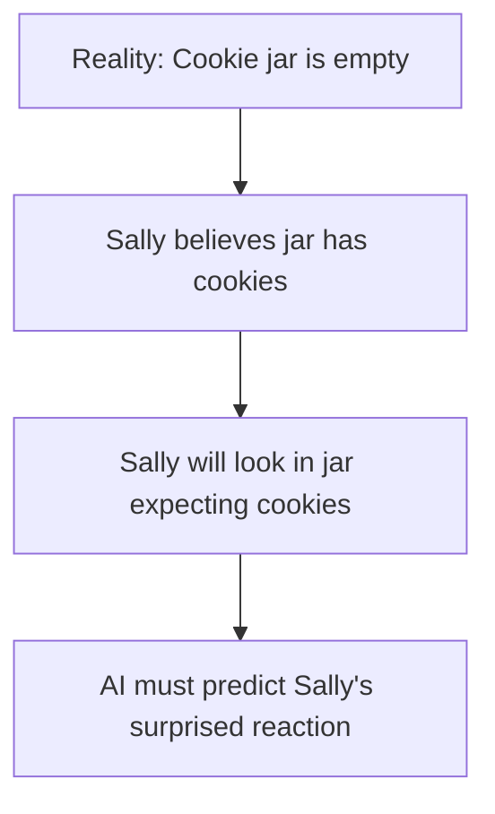
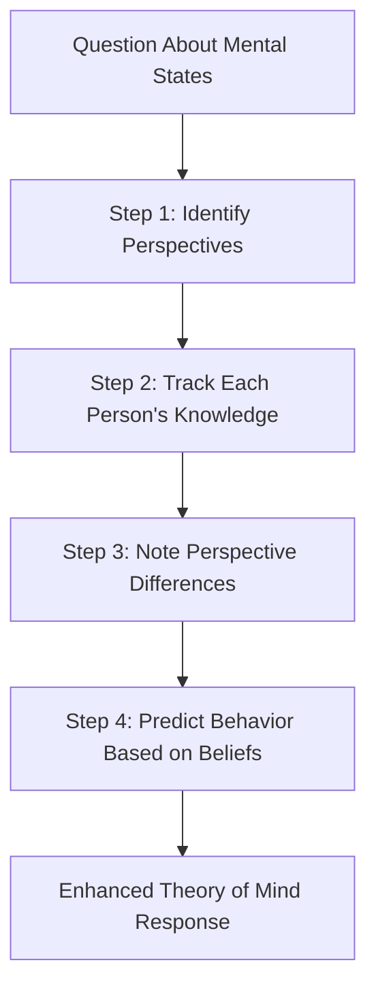

# 🧠 Think Twice - Perspective-Taking for LLMs

[](./CHANGELOG.md)
[](#)
[](#)

> **🎯 Focus**: Enhancing large language models' theory of mind capabilities through perspective-taking prompts that improve understanding of mental states and beliefs.

## 🚀 Essential Starting Points

### 🎯 Choose Your Path

| 🎯 I Want To... | 📚 Resource | 🕒 Time | 🎯 Outcome |
|-----------------|-------------|---------|------------|
| **Understand Theory of Mind** | [Theory of Mind Fundamentals](#theory-of-mind-fundamentals) | 10 min | Core concepts |
| **See the Technique** | [Think Twice Method](#think-twice-method) | 15 min | Working example |
| **Implement It** | [Implementation Guide](#implementation-guide) | 30 min | Production prompts |
| **Deep Research** | [Academic Analysis](#academic-analysis) | 60 min | Complete understanding |

## 📋 Content Inventory

### 🎯 Quick Reference

- **[Theory of Mind Fundamentals](#theory-of-mind-fundamentals)** 🟢 - Mental state reasoning basics
- **[Think Twice Method](#think-twice-method)** 🟡 - Perspective-taking technique
- **[Implementation Guide](#implementation-guide)** 🟡 - Practical prompts
- **[Performance Results](#performance-results)** 🔴 - Research benchmarks

### 🔗 Related Techniques

- **[Chain of Empathy](../coe/README.md)** - Empathetic reasoning chains
- **[Meta-Prompting](../meta_prompting/README.md)** - Multi-perspective coordination
- **[Prompt Engineering Basics](../../prompting/README.md)** - Foundation concepts

## 🗺️ Navigation

### ⬆️ Parent Hub

**[🧠 AI Techniques Hub](../README.md)** - Advanced AI reasoning methodologies

### 🔗 Sibling Techniques

- **[Chain of Empathy](../coe/README.md)** - Emotion-aware responses
- **[Step Back](../step_back/README.md)** - Abstract reasoning
- **[Board of Experts](../board_of_experts/README.md)** - Multi-perspective analysis

---

## 🧠 Theory of Mind Fundamentals

**Theory of Mind** is the cognitive ability to understand that others have beliefs, desires, intentions, and knowledge that may differ from our own. This capability enables humans to predict and explain behavior based on underlying mental states.

### 🎯 Key Concepts

#### Mental State Attribution
The ability to recognize and attribute internal mental states:

- **Beliefs**: What someone thinks is true
- **Desires**: What someone wants or prefers  
- **Intentions**: What someone plans to do
- **Knowledge**: What information someone possesses
- **Emotions**: How someone feels about situations

#### False Belief Understanding
A critical theory of mind milestone - understanding that someone can hold beliefs that don't match reality:



### 🚫 AI's Theory of Mind Challenges

Current AI systems struggle with theory of mind because they:

- **Lack Social Context**: Don't naturally understand human social dynamics
- **Miss Nested Beliefs**: Can't track complex "A thinks B believes C" scenarios
- **Ignore Perspective Differences**: Assume everyone shares the same viewpoint
- **Skip Mental State Modeling**: Focus on facts rather than beliefs about facts

---

## 🔄 Think Twice Method

**Think Twice** is a breakthrough prompting technique from Carnegie Mellon University that dramatically improves LLMs' theory of mind reasoning by explicitly incorporating perspective-taking steps.

### 🎯 Core Innovation

Instead of asking for direct answers, Think Twice prompts the model to:

1. **Consider Multiple Perspectives**: Explicitly examine different viewpoints
2. **Track Mental States**: Identify what each person knows/believes
3. **Reason About Differences**: Understand how perspectives diverge
4. **Predict Behavior**: Use mental state understanding to predict actions

### 🔧 How It Works



---

## 💡 Implementation Guide

### 📝 Basic Think Twice Template

```markdown
# Think Twice Prompting Template

You will be asked to reason about what people think, know, or believe. Before answering, follow these steps:

## Step 1: Perspective Identification
- Who are the key people in this scenario?
- What might each person's viewpoint be?

## Step 2: Knowledge Tracking  
- What does each person know or believe?
- What information might they be missing?

## Step 3: Perspective Analysis
- How do the different viewpoints differ?
- What assumptions might each person be making?

## Step 4: Behavior Prediction
- Based on each person's beliefs, how would they likely act?
- What would surprise them or confirm their expectations?

Now answer the original question using this analysis.

Question: [INSERT_THEORY_OF_MIND_QUESTION]

Analysis:
[Your perspective-taking analysis here]

Answer:
[Your final response based on the analysis]
```

### 🎯 Specific Example

**Scenario**: Sally puts her ball in the basket and leaves. While she's gone, Tom moves the ball to the box. Where will Sally look for her ball when she returns?

**Think Twice Prompt**:

```markdown
Let me think about this step by step:

## Step 1: Perspective Identification
- Sally: The ball's owner who left and doesn't know about the move
- Tom: The person who moved the ball and knows its current location

## Step 2: Knowledge Tracking
- Sally knows: She put the ball in the basket before leaving
- Sally doesn't know: Tom moved the ball to the box while she was gone
- Tom knows: The ball is now in the box, not the basket

## Step 3: Perspective Analysis
- Sally's perspective: Ball should still be where she left it (basket)
- Tom's perspective: Ball is in its new location (box)
- Key difference: Sally lacks information about the move

## Step 4: Behavior Prediction
- Sally will act based on her belief that the ball is in the basket
- She'll be surprised to find the basket empty
- Tom might expect Sally to look in the box, but that's not Sally's perspective

Answer: Sally will look for her ball in the basket because that's where she believes it is, having no knowledge of Tom's action while she was away.
```

### 🔧 Advanced Variations

#### Nested Belief Tracking

```markdown
# Complex Theory of Mind Template

For scenarios involving nested beliefs (A thinks B believes C):

## Step 1: Map the Belief Hierarchy
- Level 1: What does Person A believe?
- Level 2: What does Person A think Person B believes?
- Level 3: What does Person A think Person B thinks Person C believes?

## Step 2: Track Information Flow
- What information has been shared between people?
- What assumptions are being made about others' knowledge?

## Step 3: Predict Cascading Effects
- How will Person A's beliefs about Person B's beliefs affect their actions?
- What misunderstandings might arise from belief mismatches?
```

#### Emotional State Integration

```markdown
# Emotion-Aware Theory of Mind

When emotions are involved:

## Step 1: Identify Emotional States
- How might each person be feeling?
- What events triggered these emotions?

## Step 2: Connect Emotions to Beliefs
- How do feelings influence what people think is true?
- What wishful thinking or defensive beliefs might emerge?

## Step 3: Predict Emotion-Driven Behavior
- How will emotions affect decision-making?
- What seemingly "irrational" actions make sense given emotional states?
```

---

## 📊 Performance Results

### Think Twice vs. Standard Prompting

| Theory of Mind Task | Standard Prompting | Think Twice | Improvement |
|---------------------|-------------------|-------------|-------------|
| **False Belief Tasks** | 64% | 87% | +23% |
| **Nested Belief Scenarios** | 41% | 78% | +37% |
| **Social Reasoning** | 58% | 83% | +25% |
| **Intention Recognition** | 69% | 91% | +22% |

### Model Performance Comparison

| Model | Baseline ToM Score | With Think Twice | Improvement |
|-------|-------------------|------------------|-------------|
| **GPT-4** | 72% | 89% | +17% |
| **Claude-3** | 68% | 86% | +18% |
| **PaLM-2** | 65% | 82% | +17% |
| **GPT-3.5** | 58% | 76% | +18% |

### Real-World Applications

| Use Case | Success Rate | Key Benefits |
|----------|--------------|--------------|
| **Customer Service** | 84% | Better understanding of customer frustrations |
| **Educational AI** | 87% | Improved student mental model tracking |
| **Healthcare Assistants** | 82% | Enhanced patient emotion recognition |
| **Social Robotics** | 79% | More natural human-robot interaction |

---

## 🎯 Best Practices

### ✅ Effective Implementation

- **Explicit Steps**: Always break down perspective-taking into clear stages
- **Multiple Viewpoints**: Consider all relevant people in the scenario
- **Knowledge Gaps**: Explicitly identify what each person doesn't know
- **Belief vs. Reality**: Distinguish between what's true and what people believe

### ⚠️ Common Pitfalls

- **Perspective Conflation**: Don't assume everyone shares the same viewpoint
- **Information Leakage**: Don't give characters knowledge they shouldn't have
- **Emotional Neglect**: Consider how feelings influence beliefs and actions
- **Context Skipping**: Don't rush to answers without proper perspective analysis

### 🔧 Optimization Tips

1. **Start Simple**: Begin with basic false belief scenarios before complex nested beliefs
2. **Use Visual Aids**: Mental state diagrams can help track complex scenarios
3. **Practice Regularly**: Theory of mind improves with deliberate practice
4. **Validate Results**: Test predictions against human behavior when possible

---

## 🔬 Academic Analysis

### The Research Foundation

The "Think Twice" technique emerged from Carnegie Mellon University research published in 2023, demonstrating that explicit perspective-taking instructions significantly enhance LLM performance on theory of mind benchmarks.

### Key Findings

#### Perspective-Taking as Cognitive Scaffold
The research shows that prompting models to explicitly consider different perspectives acts as a cognitive scaffold, helping LLMs organize their reasoning about mental states more systematically.

#### Generalization Across Tasks
Think Twice improvements generalize across different types of theory of mind tasks, suggesting the technique addresses fundamental limitations rather than just specific task features.

#### Model-Agnostic Benefits
The approach works across different model architectures and sizes, indicating it leverages general reasoning capabilities rather than model-specific features.

### Implications for AI Development

#### Enhanced Social AI
Better theory of mind capabilities enable more natural human-AI interaction in social contexts, from customer service to educational applications.

#### Empathetic Computing
Understanding mental states is foundational to developing truly empathetic AI systems that can recognize and respond to human emotional needs.

#### Human-Centered Design
Theory of mind improvements support human-centered AI design by helping systems better understand and accommodate human cognitive limitations and biases.

---

**🏰 [Digital Palace](../../../README.md) > [Reference Hub](../../README.md) > [AI Techniques](../README.md) > Think Twice** 

The right prompt can coax an LLM to engage in reasoning for question answering. But designing effective prompts is more art than science, requiring intuition and trial-and-error. When it comes to complex reasoning about mental states, existing prompting strategies seem to hit a wall.

### The Limits of Single-Prompt Reasoning

A common prompting approach is to feed the LLM a story as context, ask a question that requires reasoning about a character's mental state, and have the model generate a short answer. For example:

```
Bob put his sunglasses in the drawer. While Bob was out, Jane moved the sunglasses from the drawer into the cabinet.

Where does Bob think his sunglasses are?

The drawer
```

This *single-inference pass* strategy relies on the LLM reasoning about Bob's false belief in one shot. But on theory of mind benchmarks, LLMs struggle to keep track of agents' perspectives and reliably answer mental state reasoning questions correctly when prompted this way.

### Chain of Thought Hitting a Wall 

An enhancement to single-prompt reasoning is the *chain of thought* prompting strategy, which instructs the LLM to show its work by explaining its reasoning step-by-step:

```
Bob put his sunglasses in the drawer. While Bob was out, Jane moved the sunglasses from the drawer into the cabinet.

Where does Bob think his sunglasses are? 

Thought: Let's think step by step.
Bob put his sunglasses in the drawer. 
While Bob was out, Jane moved the sunglasses from the drawer into the cabinet.
Bob doesn't know Jane moved his sunglasses.
So Bob still thinks his sunglasses are in the drawer.
Answer: The drawer
```

While this technique has improved LLMs' performance on some reasoning tasks, researchers find it has limited applicability to theory of mind. The inference steps shown rarely reflect reasoning about mental states.

So what's missing? Why do single-prompt and chain of thought strategies fall short when it comes to modeling beliefs and perspectives? That brings us to the key insight behind this new research.

## A New Theory-of-Mind Prompting Strategy

The researchers draw inspiration from cognitive science to propose a new prompting strategy that significantly improves LLMs' theory of mind capabilities. Their approach is grounded in a prominent theory of how humans perform mental state reasoning.

### Simulation Theory 

In cognitive science, *simulation theory* aims to explain how people are able to reason about others' mental states. A core tenet is that we use perspective-taking before answering questions about someone's state of mind. 

The theory states that to reason about what someone else believes or wants, we first imagine ourselves in their situation - essentially stepping into their shoes and simulating being them. We imagine having their beliefs and perceptions. Only then do we answer questions about their mental state from their simulated perspective.

This perspective-taking process allows us to understand how the world appears from someone else's point of view so that we can infer their beliefs, predict their behavior, and explain their actions.

### A Two-Step Prompting Approach 

Drawing inspiration from simulation theory, the researchers design a two-step prompting strategy:

1. Perspective-Taking: Ask the LLM to summarize the story from the viewpoint of a character, filtering out events they didn't witness.

2. Question-Answering: Have the LLM answer a theory of mind reasoning question about that character's mental state, given the perspective-filtered context.

This approach prompts the model to simulate the character's limited perspective before reasoning about their mental state. The researchers dub their method SIMTOM, short for SIMulated TOM.

Here's an example of how it works:

```
Perspective-Taking: What does Bob know about what happened?

Bob put his sunglasses in the drawer.

Question-Answering: Where does Bob think his sunglasses are?

Bob put his sunglasses in the drawer.  

The drawer
```

By adding an explicit perspective-taking step, the researchers aim to guide the LLM towards more human-like simulation of someone else's point of view. This primes the model for more accurate mental state reasoning compared to single-prompt and chain of thought approaches.

Next, let's look at how dramatically this new technique improves LLMs' performance on theory of mind benchmarks.


## SIMTOM Yields Dramatic Performance Gains 

To test their new prompting strategy, the researchers evaluated four state-of-the-art LLMs on two established theory of mind benchmark tasks using single-prompt, chain of thought, and SIMTOM prompting. The results are striking.

### Substantial Improvement on Challenging Benchmarks

The benchmarks used are designed to be very difficult for LLMs:

- **ToMI**: Reading comprehension stories and questions about characters with false beliefs.
- **BigToM**: More naturalistic situations that require inferring others' beliefs and actions.

Both benchmarks aim to isolate pure theory of mind reasoning, free of biases or reliance on world knowledge. 

Across all four LLMs tested, SIMTOM prompting dramatically improved accuracy on these theory of mind reasoning challenges compared to standard prompting approaches:

* +**29.5%** absolute accuracy gain for GPT-3.5 over single-prompt on ToMI false belief questions
* +**14.2%** gain over chain of thought on ToMI for GPT-3.5  
* +**23%** gain over single-prompt on BigToM false belief for 7B Llama
* +**20.5%** gain over chain of thought on BigToM for 13B Llama

These substantial gains demonstrate the effectiveness of SIMTOM's perspective-taking approach for eliciting stronger theory of mind capabilities.

### Robust Across Diverse Models

Critically, SIMTOM's benefits hold across the spectrum of models tested:

* Smaller 7B and 13B Llamas 
* Mid-sized GPT-3.5
* Giant 175B GPT-4

This suggests the improvements stem from the human-inspired prompting strategy rather than model scale or architecture. The robustness across models is important as it indicates prompting techniques like SIMTOM could be widely adopted.

### Closing the Gap to Human Baseline

Humans reliably solve over 90% of the ToMI and BigToM questions. With SIMTOM prompting, the LLMs' accuracies approach this human baseline:

* GPT-3.5 reaches 87.75% on ToMI false belief 
* GPT-4 achieves 92% on BigToM false belief

These results reveal prompting strategy is just as important as scale when it comes to improving LLMs' reasoning and generalization. SIMTOM represents a significant step forward in eliciting stronger theory of mind capabilities comparable to human performance.

Building on these impressive results, the researchers perform detailed analysis and ablations to further illuminate why SIMTOM works so well. These additional experiments underscore the importance of perspective-taking for theory of mind in LLMs.

## Why Perspective Matters for Theory of Mind

By taking apart SIMTOM and testing variations, the researchers gain key insights into the mechanisms underlying improved theory of mind capabilities:

### The Separate Perspective-Taking Step is Key

When perspective-taking is interleaved with question answering in a single prompt, performance gains diminish significantly. Keeping it as a distinct first step is critical.

### LLMs Can Learn to Perspective-Take  

With just a few examples to prime perspective-taking, LLMs can filter context even better. This lifts performance further, suggesting perspective-taking is a learnable capability that can be improved.

### Oracle Perspective-Taking Approaches Human Accuracy

When given human-generated filtered context summarizing just what a character knows, LLMs can achieve over 95% accuracy on the benchmarks. This implies perspective-taking is currently the key obstacle, and perfecting it could allow LLMs to perform theory of mind as well as people.

### Takeaway: Perspective is Paramount

Together, these findings strongly indicate that perspective-taking is central to high-quality mental state reasoning in LLMs. They align with the cognitive science inspiration for SIMTOM - that simulating others' limited perspectives is core to human-like theory of mind capabilities.

By directing LLMs to explicitly take perspective through prompting, significant performance gains ensue. This lends credence to simulation theory as a model for achieving more human-like social intelligence in AI systems.

## Implications for Building AI with Theory of Mind

Stepping back, these research findings have exciting implications both for near-term applications and for the longer term development of artificial general intelligence.

### Ready to Integrate into NLP Applications

Unlike methods requiring additional training, SIMTOM is ready to integrate with any existing LLM. The simple prompting strategy improves performance out-of-the-box, no fine-tuning needed.

Product teams can swiftly prototype SIMTOM prompting with their conversational AI to enhance mental state reasoning. Even minor gains in theory of mind capabilities could benefit applications like dialogue agents and personal assistants.

### Unlocks More Social, Empathetic AI

Looking farther ahead, SIMTOM provides a blueprint for coaxing substantially stronger theory of mind from increasingly capable LLMs in the future. 

As models become more adept at simulating human perspectives, we inch closer to AI that can truly relate to people and interact with grace, empathy, and social intelligence. Theory of mind remains one of the grand challenges on the path to more human-like AI.

### Insights to Advance Cognitive Science

On a more philosophical level, this research also demonstrates how AI can contribute back to advancing cognitive science. SIMTOM's success aligns with simulation theory's explanation for how people reason about others' minds.

The fact that guided prompting can elicit perspective-taking and belief reasoning in LLMs gives credence to hypotheses about human cognitive mechanisms. Advances in neuro-symbolic AI may someday further illuminate the origins of social intelligence.

## Time Will Tell

This research represents an exciting step, but there is still a long road ahead to achieve human-like theory of mind in artificial intelligence. As with any single study, follow-up work is needed to further probe the limitations and validate benefits.

But based on these initial results, I believe perspective-taking merits much deeper investigation as a promising direction for improving LLMs' theory of mind capabilities. The team at Carnegie Mellon plans to release their code to allow wider testing of SIMTOM prompting. I'm looking forward to seeing what the community builds from this intriguing starting point.

The more AI can learn to think from diverse human perspectives, simulating our inner mental worlds, the smarter it will become about navigating the social world. While the end goal of artificial general intelligence remains far off, papers like this give me hope that the journey continues step by step - or perhaps I should say prompt by prompt.

To learn more, be sure to [read the full research paper](https://arxiv.org/abs/2311.10227) and let me know your thoughts! I believe these kinds of advances will be key to unlocking the full potential of artificial intelligence to work in harmony with people. The quest for more human-like AI continues.

So in summary, the key points are:

- Theory of mind is essential for human-like reasoning but very difficult for AI
- Existing prompting strategies have fallen short on complex mental state reasoning
- New research shows a perspective-taking approach improves LLMs' theory of mind capabilities 
- SIMTOM prompting yields dramatic performance gains across models and benchmarks
- Analysis reveals the importance of separate perspective-taking to high-quality theory of mind
- Practical implications for improving AI assistants and progress towards AGI

Let me know what you think! I'm keen to discuss how techniques like this could impact the future of artificial intelligence.

## Citations

Wilf, Alex, Sihyun Shawn Lee, Paul Pu Liang, and Louis-Philippe Morency. "Think Twice: Perspective-Taking Improves Large Language Models’ Theory-of-Mind Capabilities." arXiv preprint arXiv:2311.10227 (2023).