# What is an MCP Server?

**An MCP Server is a specialized program that exposes specific capabilities to AI applications through the Model Context Protocol.** Think of it as a **smart adapter** that translates between your data/tools and AI systems.

## Core Purpose

MCP servers solve a fundamental problem: AI applications need to interact with external systems (databases, APIs, files, etc.), but each integration traditionally requires custom code. MCP servers provide a **standardized interface** that any MCP-compatible AI application can immediately understand and use.

## What MCP Servers Provide

Every MCP server exposes three types of capabilities:

### 🛠️ **Tools** - AI Actions

- **Executable functions** that AI can invoke to perform actions
- **User approval required** for each execution (security by design)
- Examples: `searchFlights()`, `sendEmail()`, `createCalendarEvent()`

### 📊 **Resources** - Context Data

- **Data sources** that provide contextual information to AI
- **URI-based access** with support for templates and parameters
- Examples: `file:///documents/report.pdf`, `weather://forecast/barcelona/2024-06-15`

### 📝 **Prompts** - Interaction Templates

- **Reusable templates** for common workflows and interactions
- **User-controlled** - explicitly invoked, not automatic
- Examples: "Plan a vacation", "Summarize meeting notes", "Debug code issue"

## How It Works

```mermaid
graph LR
    A["🤖 AI Application<br/>(AI Agent, VS Code)"] <--> B["📡 MCP Client<br/>(Protocol Handler)"]
    B <--> C["🔌 MCP Server<br/>(Your Integration)"]
    C <--> D["💾 External Systems"]
    
    subgraph Systems ["🏢 Your Data & Services"]
        D1["🗃️ Database"]
        D2["📁 Files"]
        D3["🌐 APIs"]
        D4["⚙️ Services"]
    end
    
    C --> D1
    C --> D2
    C --> D3
    C --> D4
    
    classDef aiApp fill:#E8F4FD,stroke:#2563EB,stroke-width:2px,color:#1E40AF
    classDef mcpClient fill:#F0F9FF,stroke:#0284C7,stroke-width:2px,color:#0C4A6E
    classDef mcpServer fill:#FEF3C7,stroke:#D97706,stroke-width:2px,color:#92400E
    classDef external fill:#F3E8FF,stroke:#7C3AED,stroke-width:2px,color:#5B21B6
    classDef systems fill:#ECFDF5,stroke:#059669,stroke-width:2px,color:#047857
    
    class A aiApp
    class B mcpClient
    class C mcpServer
    class D external
    class D1,D2,D3,D4 systems
```

1. **Dynamic Discovery**: AI applications query servers to discover available capabilities
2. **Automatic Adaptation**: When servers add new features, AI applications automatically adapt
3. **Secure Execution**: All actions require explicit user approval

## MCP Server Capabilities

```mermaid
graph TB
    Server["🔌 MCP Server"]
    
    subgraph Tools ["🛠️ Tools (AI Actions)"]
        T1["✈️ searchFlights()"]
        T2["📧 sendEmail()"]
        T3["📅 createEvent()"]
    end
    
    subgraph Resources ["📊 Resources"]
        R1["📄 file:///docs/report.pdf"]
        R2["🌤️ weather://forecast/{city}"]
        R3["📋 calendar://events/2024"]
    end
    
    subgraph Prompts ["📝 Prompts (Templates)"]
        P1["🏖️ Plan a vacation"]
        P2["📝 Summarize meetings"]
        P3["🐛 Debug code issue"]
    end
    
    Server --> Tools
    Server --> Resources
    Server --> Prompts
    
    classDef server fill:#FEF3C7,stroke:#D97706,stroke-width:3px,color:#92400E
    classDef tools fill:#DBEAFE,stroke:#2563EB,stroke-width:2px,color:#1E40AF
    classDef resources fill:#ECFDF5,stroke:#059669,stroke-width:2px,color:#047857
    classDef prompts fill:#F3E8FF,stroke:#7C3AED,stroke-width:2px,color:#5B21B6
    classDef items fill:#FEFEFE,stroke:#6B7280,stroke-width:1px,color:#374151
    
    class Server server
    class Tools tools
    class Resources resources
    class Prompts prompts
    class T1,T2,T3,R1,R2,R3,P1,P2,P3 items
```

## Real-World Examples

| Server Type | Tools | Resources | Use Case |
|-------------|-------|-----------|----------|
| **GitHub MCP** | `createPR()`, `searchIssues()` | `repo://files/*`, `issues://open` | Code collaboration |
| **Database MCP** | `executeQuery()`, `createTable()` | `schema://tables/*`, `data://users` | Data analysis |
| **File System MCP** | `writeFile()`, `deleteFile()` | `file:///*` | Document management |
| **Weather MCP** | `getAlerts()` | `weather://forecast/{city}` | Travel planning |

## Why MCP Servers Matter

### For Developers

- **Write once, use everywhere** - Build one MCP server, works with all compatible AI apps
- **No breaking changes** - Dynamic capability discovery eliminates version conflicts
- **Standardized debugging** - Consistent error handling and logging

### For AI Applications

- **Plug-and-play integration** - Add new capabilities without code changes
- **Rich context access** - Seamlessly access any data source
- **Secure by default** - Built-in permission and approval systems

### For Organizations

- **Vendor independence** - Switch AI applications without losing integrations
- **Scalable architecture** - Add new data sources effortlessly
- **Compliance ready** - Standardized security and audit trails

## Getting Started

1. **Use existing servers**: Browse [1000+ available servers](https://github.com/modelcontextprotocol/servers)
2. **Install in your AI app**: Configure Claude Desktop, VS Code, or other MCP-compatible applications
3. **Build custom servers**: Use [official SDKs](https://modelcontextprotocol.io/docs/sdk) in Python, TypeScript, etc.

## The Big Picture

**MCP servers transform AI applications from isolated tools into extensible platforms.** Instead of each AI app needing custom integrations, they can instantly connect to any MCP server, creating a **composable ecosystem** where capabilities can be mixed, matched, and shared across applications.

---

*Learn more: [Official MCP Documentation](https://modelcontextprotocol.io/) | [Server Examples](https://github.com/modelcontextprotocol/servers)*
